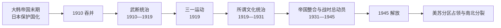

# 殖民时期

## 时间

1910—1945年。日本于1910年8月29日公布吞并，朝鲜总督府自10月1日起正式运行；1945年8月日本宣布投降，9月总督府分别向进入半岛的苏军和美军体系移交权力，殖民机构随之解体。

## 概括

这一时期并非一次条约签署后静止不变的统治，而是从宪兵警察式“武断统治”，经过三一运动后更隐蔽而制度化的所谓“文化统治”，再转入1930年代后半的皇民化与战争总动员。铁路、港口、学校、灌溉和工业能力确有扩展，但投资方向、产权安排、生产流向和劳动力配置服从日本帝国需要，政治权利与民族平等从未成为殖民制度的目标。

半岛社会并非只有“日本统治者—朝鲜抵抗者”两类人。独立运动存在民族主义、社会主义、宗教、学生、工农和海外武装等不同路线；殖民机构也通过教育、官僚职位、企业利益和地方名望吸纳朝鲜人。个人行为可能处于被迫服从、日常适应、机会主义合作和主动协力之间，必须结合权力不对等与具体情境判断。

## 建立背景与吞并过程

- 1876年《江华条约》以后，日本逐步扩大在朝鲜的经济与政治影响。
- 1894—1895年甲午战争和1904—1905年日俄战争先后排除清朝与俄国的主要影响，日本由地区竞争者变成半岛支配力量。
- 1905年《乙巳条约》把大韩帝国变为日本保护国，统监府控制外交；条约在军事压力和缺乏皇帝批准的条件下形成，其合法性长期遭否定。
- 1907年高宗退位、军队解散后，义兵战争扩大，日本强化警察和军事镇压。
- 1910年8月22日，日本驻韩统监寺内正毅迫使大韩帝国内阁签署合并条约，8月29日公布。大韩帝国主权终结，王室被编入日本贵族体系，统监府改为朝鲜总督府。
- 吞并没有获得朝鲜民众的自由同意。国内秘密结社、宗教团体、学校网络与海外流亡组织继续维持独立诉求。

## 殖民统治结构

日本天皇与帝国政府拥有主权，总督是半岛殖民行政的最高首脑。总督府通过政务总监、各局部、警察、法院、监狱和地方行政层层落实政策；中枢院等咨询机关吸纳部分朝鲜精英，但不构成民意代表机关。完整任职顺序见[朝鲜总督表](/%E4%BA%BA%E6%96%87%E7%A7%91%E5%AD%A6/%E5%8E%86%E5%8F%B2/%E4%B8%9C%E4%BA%9A/%E6%9C%9D%E9%B2%9C%E5%8D%8A%E5%B2%9B/%E6%9C%9D%E9%B2%9C%E6%80%BB%E7%9D%A3%E8%A1%A8.md)。

| 层级 | 核心机构 | 实际作用 |
| --- | --- | --- |
| 帝国中央 | 日本天皇、内阁、拓务等中央部门 | 决定殖民地法制、预算、军政和对外战争方向。 |
| 殖民中枢 | 朝鲜总督府 | 总督可发布制令，统辖行政、警察、教育、交通、产业和军政协调。 |
| 强制机关 | 宪兵、警察、法院、监狱 | 监视政治活动，镇压示威、地下组织、工农运动和武装抵抗。 |
| 地方机关 | 道、府、郡、岛、面 | 执行户籍、税收、土地、粮食、教育、治安和战时征集。 |
| 咨询与协力 | 中枢院、地方咨询会、官办团体 | 为部分地方精英提供身份和资源，协助政策传播与社会控制。 |

## 分阶段过程

### 武断统治与制度接管（1910—1919）

总督由现役或退役将领担任，宪兵兼理普通警察事务。朝鲜人受到比在日日本人更严密的集会、出版与言论限制，学校教育年限、课程和升学机会也存在差别。1910—1918年土地调查建立现代地籍、税收和产权登记，却把依赖习惯权利的农民置于不利地位，强化国家、公司和地主的可登记权利；其后租佃关系和农村贫困成为持续问题。公司令以许可制限制朝鲜人设立企业，同时方便日本资本进入。

### 三一运动与所谓文化统治（1919—1931）

第一次世界大战后的民族自决话语、高宗去世和国内宗教学生网络共同促成1919年三一运动。独立宣言与和平示威迅速扩散，总督府以军警镇压，伤亡和被捕人数的精确统计因资料口径不同而有差异。运动促成上海大韩民国临时政府成立，也迫使日本改变公开统治方式。

新体制取消部分军警外观，准许有限韩文报刊和社会活动，但普通警察、特高警察、审查和情报网络继续扩大。1920年代出现工会、农民组织、女权与学生运动，民族主义与社会主义力量既合作又竞争。产米增殖计划提高商品粮生产并扩大对日输出，灌溉和市场化同时伴随地租、债务与粮价压力。

### 帝国经济整合与大陆战争前夜（1931—1937）

日本侵占中国东北后，朝鲜成为连接日本本土、满洲与中国大陆的交通和军事后方。总督府鼓励水电、化工、矿业和重工业，工业尤其集中于资源与水电条件较好的北部，南部仍以农业和轻工业为主。资本、技术与基础设施增长并未消除民族工资差、职位壁垒和产权不平等。

### 皇民化与战争总动员（1937—1945）

中日战争和太平洋战争使殖民统治转为全面动员。学校压缩朝鲜语教学，要求神社参拜、背诵“皇国臣民誓词”，1939年以后推行创氏改名。总督府通过征用、募集、官斡旋和后来的征兵、征用，把大量朝鲜人送往日本本土、库页岛、满洲、矿山、工厂和军队。许多女性遭欺骗、胁迫或强制进入日军“慰安妇”体系；人数估计存在争论，但强制性、暴力和国家军政体系责任有大量档案与证言支持。

## 重要事件

| 时间 | 事件 | 过程与影响 |
| --- | --- | --- |
| 1910 | 日本吞并大韩帝国 | 主权被转交给日本天皇，总督府建立，王朝国家转为殖民地。 |
| 1910—1918 | 土地调查事业 | 建立地籍与税制，改变习惯权利和土地市场，强化地主—佃农关系及殖民财政。 |
| 1911 | 第一次《朝鲜教育令》 | 建立差别化殖民教育体系，强调日语、职业训练与对帝国的服从。 |
| 1919-03-01 | 三一运动 | 全国性独立示威遭镇压，推动海外临时政府、青年和社会运动发展。 |
| 1919-04 | 大韩民国临时政府成立 | 上海成为海外独立运动的重要政治中心，但各派整合长期困难。 |
| 1920 | 凤梧洞、青山里等战斗 | 满洲朝鲜独立武装与日军作战；日本随后扩大越境“讨伐”和报复。 |
| 1926 | 六一〇万岁运动 | 借纯宗葬礼发动学生和独立示威，显示三一运动后国内动员网络仍在。 |
| 1929—1930 | 光州学生运动 | 从学生冲突发展为跨地区反殖民示威，受到民族与社会团体声援。 |
| 1931以后 | 北部重化工业扩张 | 水电、化工、矿业和军需产业增长，半岛更深嵌入日本—满洲战争经济。 |
| 1937以后 | 皇民化加速 | 神社参拜、语言同化、思想控制和战争动员全面强化。 |
| 1939—1945 | 大规模劳务动员 | 募集、官斡旋和征用并用，大批朝鲜劳工被送往帝国各地。 |
| 1940 | 韩国光复军成立 | 重庆临时政府建立军事力量，与同盟国合作准备对日作战。 |
| 1944 | 征兵制在朝鲜实施 | 朝鲜青年被正式纳入日军兵役，战争末期动员达到顶点。 |
| 1945-08—09 | 日本投降与总督府解体 | 苏军进入北部、美军进入南部；殖民统治终结，却因分区占领未形成统一国家接管。 |

## 经济与社会政策

### 土地、农业与农村

土地调查不是简单把全部土地一次性“夺走”，而是以殖民国家认可的书面登记重构权利。能证明所有权的地主、公司和机构获得更稳定产权，依赖佃作、共有地、山林或习惯权利者更容易失去保障。商品农业、灌溉和运输改善提高部分产量，却使租佃、债务、对日粮食输出和农村消费不足相互叠加；不少农民迁往城市、满洲、日本或苏联远东。

### 工业、交通与城市

总督府建设铁路、港口、电力和通信，方便军队调动、资源外运和区域市场形成。1930年代的工业化创造工人群体和城市机会，也形成日本资本主导、朝鲜人集中于低工资岗位、南北产业结构不均的格局。殖民期留下的设施后来被南北两国分别利用，但这不等同于殖民统治以朝鲜人的自主发展为目的。

### 教育、语言与文化

初等学校数量和识字机会有所增加，朝鲜人入学率在后期上升，但学校供给长期不足，日朝学生在课程、经费和升学上不平等。韩文报刊、文学、宗教和大众文化在审查缝隙中发展；战时则以日语和帝国忠诚为中心压缩民族文化空间。

## 抵抗、适应与协力

- **国内非暴力运动**：宗教团体、学生、教师、记者和知识人组织请愿、教育、合作社、文化保存和街头示威。
- **工农与左翼运动**：罢工、佃农争议、青年与妇女组织把民族解放与阶级、性别问题相联系，并遭治安维持法打击。
- **海外政治与武装路线**：上海临时政府、满洲和俄国远东武装、中国关内组织及后来的光复军并存，内部路线、地域和意识形态分歧明显。
- **日常适应**：多数人必须在殖民学校、市场、户籍和配给制度中生活；使用制度资源不必然等同主动支持殖民主义。
- **主动协力**：部分官僚、警察、地主、企业家、媒体人与动员团体从殖民秩序获益或积极宣传战争。战后南北对协力者的清算路径不同，且都受到新政权斗争影响。

## 终结机制与历史遗产

日本的殖民统治不是被总督府自愿交还，也不是由单一独立组织直接接管。1943年《开罗宣言》提出朝鲜“在适当时期”独立；1945年8月苏联对日参战并进入半岛北部，美国仓促提出以三八线划分受降区。日本宣布投降后，各地人民委员会和建国准备委员会尝试维持秩序，但北部由苏军、南部由美军分别建立占领行政。

殖民统治遗留了土地与企业结构、警察官僚经验、语言文化创伤、海外人口与劳工索赔等问题。日本投降结束了殖民主权，却没有解决由谁代表全朝鲜的问题；分区占领把解放、去殖民化与冷战国家建构叠合在一起，直接通向[朝韩对峙](/%E4%BA%BA%E6%96%87%E7%A7%91%E5%AD%A6/%E5%8E%86%E5%8F%B2/%E4%B8%9C%E4%BA%9A/%E6%9C%9D%E9%B2%9C%E5%8D%8A%E5%B2%9B/%E6%9C%9D%E9%9F%A9%E5%AF%B9%E5%B3%99.md)。

## 演变关系

- 前一节点：[朝鲜王朝](/%E4%BA%BA%E6%96%87%E7%A7%91%E5%AD%A6/%E5%8E%86%E5%8F%B2/%E4%B8%9C%E4%BA%9A/%E6%9C%9D%E9%B2%9C%E5%8D%8A%E5%B2%9B/%E6%9C%9D%E9%B2%9C%E7%8E%8B%E6%9C%9D.md)。
- 后一节点：[朝韩对峙](/%E4%BA%BA%E6%96%87%E7%A7%91%E5%AD%A6/%E5%8E%86%E5%8F%B2/%E4%B8%9C%E4%BA%9A/%E6%9C%9D%E9%B2%9C%E5%8D%8A%E5%B2%9B/%E6%9C%9D%E9%9F%A9%E5%AF%B9%E5%B3%99.md)。
- 专题表：[朝鲜总督表](/%E4%BA%BA%E6%96%87%E7%A7%91%E5%AD%A6/%E5%8E%86%E5%8F%B2/%E4%B8%9C%E4%BA%9A/%E6%9C%9D%E9%B2%9C%E5%8D%8A%E5%B2%9B/%E6%9C%9D%E9%B2%9C%E6%80%BB%E7%9D%A3%E8%A1%A8.md)。
