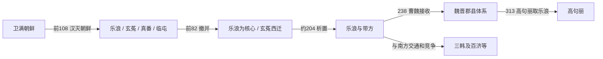

# 汉四郡时期

## 时间

前108—313年；“汉四郡”是沿用的总称。真番、临屯很快撤并，玄菟多次西迁，乐浪则先后受西汉、东汉、辽东公孙氏、曹魏和西晋政权控制。313年高句丽攻取乐浪，翌年前后带方也退出历史舞台。

## 概括

汉武帝灭卫满朝鲜后，在其故地及周边设置乐浪、玄菟、真番、临屯四郡，把郡—县行政、文字文书、户籍税役和汉帝国贸易网络引入辽东至半岛西北。四郡从未作为四个同等、稳定单位延续四百余年，也没有直接覆盖整个朝鲜半岛。乐浪治所位于平壤一带有大量墓葬、封泥、印章、漆器和户籍材料支持；其余郡的初置范围、治所和行政边界仍有争议。

## 建立背景

前109—前108年汉军围攻王险城，卫满朝鲜因战争消耗和统治集团分裂而灭亡。汉朝没有只扶立一个新的属王，而是设置郡县，以控制边境军事、人口和物产流通。原古朝鲜居民仍占多数，汉朝官吏、军人、商人和更早的中原移民则集中在治所及交通沿线。郡县行政必须通过本地首领和村落共同体间接运作，不能理解为把所有居民立刻改造成同一种制度下的移民社会。

## 四郡与后续行政单元

| 单元 | 初置与变化 | 大致位置 / 作用 | 证据与争议 |
| --- | --- | --- | --- |
| 乐浪郡 | 前108年置；313年为高句丽所取 | 核心在平壤大同江流域，连接辽东、半岛南部与海路 | 平壤一带汉式墓群、文书和封泥证据强；辖境随时代大幅收缩 |
| 玄菟郡 | 前107年左右置；前75年以前后多次西迁 | 初置范围一般联系半岛东北或鸭绿江中上游，后移向辽东 | 初置治所和边界争论较多；与高句丽早期兴起、反抗和迁移密切 |
| 真番郡 | 前108年置，前82年撤销 | 通常联系乐浪以南或卫满朝鲜南部附属地 | 具体治所和范围缺少一致结论，撤后部分并入乐浪 |
| 临屯郡 | 前108年置，前82年撤销 | 通常联系东部沿海濊人地区 | 辖境与治所仍有争议，撤后部分县并入玄菟或乐浪系统 |
| 带方郡 | 约204年由公孙康分割乐浪南部设置 | 控制黄海沿岸、半岛中南部外交与贸易 | 不是最初“四郡”之一；魏晋时期成为与韩、倭往来的重要节点 |

## 分阶段发展

### 西汉设置与快速收缩

前108年以后，汉朝以太守、都尉和县令长组成行政体系。地方抵抗、距离和成本使真番、临屯在前82年即被撤销；玄菟也因濊貊、高句丽等力量压力而西迁。所谓“四郡时期”很早便实际转为以乐浪为核心的郡县网络。

### 乐浪长期化

乐浪城郭、墓葬和文书显示平壤一带形成行政与贸易中心。出土户籍反映郡县登记人口和家庭，墓葬则显示汉式器物、本地传统及多种身份并存。郡府通过县、乡和本地首领征收、裁判、组织劳役，同时交换盐铁、漆器、铜镜、纺织品及东北地方物产。

### 公孙氏与带方郡

东汉末中央衰弱，辽东公孙氏控制乐浪。约204年公孙康从乐浪南部析置带方郡，以重整对韩、濊和海路的影响。郡县的政治归属从汉中央转为辽东地方军阀，说明“汉四郡”并不是不变的汉朝直辖体。

### 曹魏、西晋与终结

238年曹魏灭公孙氏，取得乐浪、带方；此后又通过郡县与高句丽、三韩、倭等进行战争和外交。西晋末内乱削弱辽东和半岛的补给，乐浪、带方势力收缩。313年高句丽攻取乐浪，314年前后带方也被半岛诸势力吸收，郡县统治终结。

## 统治结构

| 层级 | 主要官职 / 机构 | 职能 | 实际限制 |
| --- | --- | --- | --- |
| 帝国或辽东政权 | 皇帝、辽东地方统治者 | 任命太守、决定战争和行政区划 | 距离遥远、政权更替频繁 |
| 郡 | 太守、都尉 | 民政、司法、财政与军事 | 必须依赖县吏和本地首领 |
| 县 | 令、长及属吏 | 户籍、赋税、仓储、治安和文书 | 边远地区控制深度不一 |
| 本地共同体 | 邑落首领、乡里组织 | 动员人口、调解地方事务、输送物产 | 保有社会权威，也可能反抗、迁徙或转附高句丽等政权 |
| 贸易与移民群体 | 商人、工匠、军户及多代定居者 | 连接汉地、辽东、三韩和海上交通 | 身份会本地化，不能一概称作短期外来“殖民者” |

## 重要事件

| 时间 | 事件 | 结果与长期影响 |
| --- | --- | --- |
| 前108 | 汉灭卫满朝鲜并设置乐浪、真番、临屯等郡 | 王国故地进入郡县重组，原统治集团部分被吸纳 |
| 前107前后 | 设置玄菟郡 | 汉行政触及东北部族网络，但控制很快受到挑战 |
| 前82 | 真番、临屯撤销 | 四郡格局迅速收缩，部分县并入乐浪、玄菟 |
| 前75前后 | 玄菟郡西迁 | 高句丽等本地力量上升，郡县难以维持初置范围 |
| 前1世纪—1世纪 | 乐浪城郭、户籍与贸易网络成熟 | 汉字文书、器物技术和跨海交通影响三韩及日本列岛 |
| 约204 | 公孙康设置带方郡 | 辽东地方政权加强对半岛南部和海路的外交贸易 |
| 238 | 曹魏灭辽东公孙氏 | 乐浪、带方转由魏控制，随后卷入魏与高句丽、韩的战争 |
| 3世纪后期 | 西晋衰弱、郡县控制收缩 | 地方人口和首领更多转入高句丽、百济等新兴国家体系 |
| 313 | 高句丽攻取乐浪 | 延续四百余年的乐浪行政中心终结 |
| 314前后 | 带方消失 | 半岛北部郡县时代结束，三国政治格局进一步形成 |

## 经济、社会与文化机制

- **行政技术**：印章、封泥、简牍和户籍带来标准化文书与人口管理，后续半岛国家会选择性吸收。
- **城市与手工业**：郡治周围集聚官署、市场、工匠和大型墓地；漆器、铜镜、玻璃与金属加工反映长距离分工。
- **多族群社会**：原古朝鲜人口、汉地移民、辽东集团和周边濊貊、韩人持续互动，器物“汉式”不等同于墓主必为新到汉人。
- **中介贸易**：乐浪、带方把半岛南部铁、海产等物产接入中国大陆和日本列岛网络，也向南传播文字与奢侈品。
- **国家形成**：郡县既压制周边政治体，也提供技术、外交对象和竞争压力；高句丽、百济、三韩诸国在对抗与利用这一网络中成长。

## 衰落与终结原因

- **结构因素**：郡县人口和军事资源集中于少数城郭，对广大邑落常依赖间接控制。
- **外部压力**：高句丽、百济和韩系政治体不断扩张，逐步切断郡县的腹地与交通。
- **帝国危机**：东汉末、曹魏与西晋更替以及永嘉之乱削弱辽东补给和中央军事支援。
- **直接触发**：高句丽趁西晋崩解，于313年攻占乐浪；带方也很快失去独立行政能力。

## 争议与辨析

“汉四郡是否存在”与“每一郡具体设在哪里、控制多深”是不同问题。乐浪郡以平壤为中心有扎实考古与文书证据；玄菟、真番、临屯的初置位置和边界则需保留争议。把所有郡都说成纯粹虚构，会忽略材料；把整个半岛四百年都画成汉帝国稳定直辖，同样不符合行政变迁和本地政治发展的事实。“殖民地”是近代概念，若使用必须说明它与古代郡县、移民和间接统治并不完全等同。

## 演变关系

- 前一节点：[卫满朝鲜](/%E4%BA%BA%E6%96%87%E7%A7%91%E5%AD%A6/%E5%8E%86%E5%8F%B2/%E4%B8%9C%E4%BA%9A/%E6%9C%9D%E9%B2%9C%E5%8D%8A%E5%B2%9B/%E5%8D%AB%E6%BB%A1%E6%9C%9D%E9%B2%9C.md)。
- 主要后一节点：[高句丽王国](/%E4%BA%BA%E6%96%87%E7%A7%91%E5%AD%A6/%E5%8E%86%E5%8F%B2/%E4%B8%9C%E4%BA%9A/%E6%9C%9D%E9%B2%9C%E5%8D%8A%E5%B2%9B/%E9%AB%98%E5%8F%A5%E4%B8%BD%E7%8E%8B%E5%9B%BD.md)；半岛中南部则并行发展为[辰国](/%E4%BA%BA%E6%96%87%E7%A7%91%E5%AD%A6/%E5%8E%86%E5%8F%B2/%E4%B8%9C%E4%BA%9A/%E6%9C%9D%E9%B2%9C%E5%8D%8A%E5%B2%9B/%E8%BE%B0%E5%9B%BD.md)、[三韩](/%E4%BA%BA%E6%96%87%E7%A7%91%E5%AD%A6/%E5%8E%86%E5%8F%B2/%E4%B8%9C%E4%BA%9A/%E6%9C%9D%E9%B2%9C%E5%8D%8A%E5%B2%9B/%E4%B8%89%E9%9F%A9.md)及后续国家。
- 中国王朝背景见[汉](/%E4%BA%BA%E6%96%87%E7%A7%91%E5%AD%A6/%E5%8E%86%E5%8F%B2/%E4%B8%9C%E4%BA%9A/%E4%B8%AD%E5%9B%BD/%E6%B1%89/README.md)，族群线索见[东北濊貊与朝鲜](/%E4%BA%BA%E6%96%87%E7%A7%91%E5%AD%A6/%E5%8E%86%E5%8F%B2/%E4%B8%9C%E4%BA%9A/%E4%B8%AD%E5%9B%BD/_%E6%B0%91%E6%97%8F/%E4%B8%9C%E5%8C%97%E6%BF%8A%E8%B2%8A%E4%B8%8E%E6%9C%9D%E9%B2%9C/README.md)。
