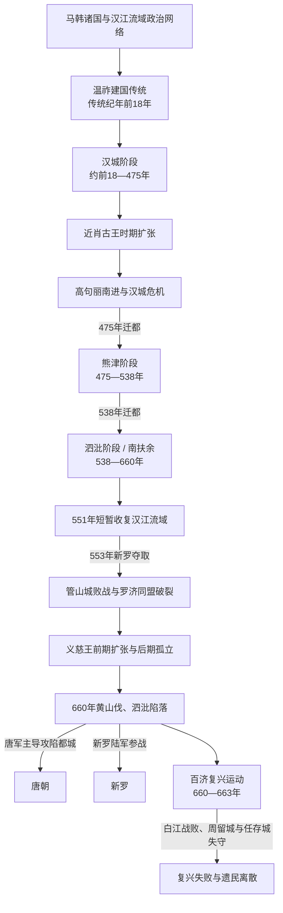

# 百济王国

## 时间

前18-660。

## 概括

百济是朝鲜半岛三国之一，由马韩区域内兴起的政权发展而来。它位于半岛西南部，长期与高句丽、新罗竞争，并通过海上交通与中国南朝和日本列岛保持密切交流，最终在660年被唐朝与新罗联合灭亡。

## 历史演进图

## 建立背景与年代辨析

- 《三国史记》把百济建国记为前18年，并以朱蒙之子温祚南下汉江流域立国解释扶余王姓的来源。此为传统王统叙事，早期王名、在位年与迁徙路线不能全部逐年考证。
- 考古材料显示，汉江流域的城郭、墓葬、手工业和对外交流在公元前后至3世纪持续发展。百济更可能由马韩区域内的伯济国逐步扩张、整合邻近政治体而成，而非在单一建国年即拥有后世疆域。
- “百济整合马韩”的时间、范围和方式存在争议；西南各地并非一次被征服，联盟、迁徙、地方首领纳入和军事行动共同构成国家形成。
- 汉江连通内陆、黄海和南部农业区，是百济早期崛起的地理基础，也使其长期卷入同高句丽、新罗及中国沿海政权的竞争。

## 分阶段发展

| 阶段 | 时间 | 具体过程 | 阶段结果 |
|---|---|---|---|
| 传统建国与国家形成 | 传统纪年前18年—3世纪 | 温祚传说建立王统起点；汉江下游的风纳土城、梦村土城等中心逐步形成，王室整合马韩北部诸集团。 | 3世纪以后官位、军事和贡赋组织更清晰，百济由区域政治体发展为王国。 |
| 汉城扩张与第一次鼎盛 | 4世纪 | 古尔王以来制度逐渐发展，近肖古王向南整合、向北与高句丽争夺，并通过黄海同东晋及日本列岛交往。 | 汉江农业、海运与王权结合，百济成为三国竞争的主导力量之一。 |
| 高句丽压力与汉城陷落 | 375—475年 | 广开土王、长寿王南进改变均势；百济与新罗、倭及中国南朝加强外交。475年高句丽攻陷汉城，盖卤王战死。 | 王都和汉江流域丧失，文周王迁都熊津，王权与贵族关系重新调整。 |
| 熊津恢复 | 475—538年 | 文周王、东城王时期经历政变和贵族竞争；武宁王加强地方控制、恢复南朝外交并稳定王室。 | 熊津山城提供安全屏障，国力恢复，为圣王迁都和制度重整创造条件。 |
| 泗沘改革与第二次扩张 | 538—641年 | 圣王迁都泗沘、改称南扶余，整顿中央二十二部、地方五方等体系；与新罗协力对高句丽并一度收复汉江。 | 都城、佛教和海上交通繁盛，但553年新罗独占汉江、554年圣王战死，罗济同盟破裂。 |
| 义慈王与灭亡 | 641—660年 | 义慈王初期攻取新罗多城，并与高句丽协调施压；持续战争、贵族关系恶化和外交孤立逐渐削弱防御。唐罗联盟从海陆两路发动突袭。 | 黄山伐败战后泗沘陷落，义慈王投降，百济王国灭亡。 |
| 复兴运动 | 660—663年 | 鬼室福信、道琛、黑齿常之等在周留城、任存城举兵，迎扶余丰为王，并获倭军援助；领导层随后内斗。 | 663年白江口海战失败，周留城和任存城相继失守，恢复王国的尝试终结。 |

## 统治结构

| 层面 | 主要结构 | 演变与作用 |
|---|---|---|
| 王权与王族 | 王室以扶余氏为核心，国王通过婚姻、任官、迁都和佛教仪礼协调沙氏、燕氏、解氏等大姓贵族。 | 王权强弱随都城和战争变化；汉城陷落后地方贵族影响上升，熊津、泗沘时期王室又尝试重建控制。 |
| 中央官制 | 传统记载有六佐平、十六官等和服色区分；泗沘时期中央官署进一步分化。 | 官等把贵族纳入国家序列，但高位仍集中于大姓，王室无法完全排除贵族会议和派系。 |
| 地方行政 | 汉城时期逐步吸纳马韩地方；武宁王时期有二十二檐鲁设置的记载，圣王时期以五部、五方等体系加强区域军政。 | 具体设置年代和覆盖程度仍有讨论；王族或贵族驻地方既加强控制，也可能形成独立基础。 |
| 军事 | 都城卫队、地方方城兵、贵族部众与征发民众共同作战，水军和黄海—锦江航线尤其重要。 | 海运支持对华、对倭交流和唐军登陆，也使泗沘在失去河口与外围防线后容易受海陆夹击。 |
| 宗教与外交 | 384年佛教正式传入记载后，王室以寺院、舍利和仪礼加强正统性；与南朝、隋唐及倭国保持使节和技术人员往来。 | 百济向日本列岛传播佛教经典、工匠和制度知识，同时主动吸收中国南朝文化，并非单向中转站。 |

## 重要事件

| 时间 | 事件 | 过程与意义 |
|---|---|---|
| 传统纪年前18年 | 温祚建国 | 传统上在汉江流域建立百济；绝对年代和早期连续王统存在争议。 |
| 346—375年 | 近肖古王扩张 | 整合西南、开拓海上外交，371年进攻平壤并使高句丽故国原王战死，形成百济第一次鼎盛。 |
| 384年 | 佛教正式传入 | 枕流王接纳东晋僧摩罗难陀的传统记载，佛教逐步成为王室和贵族文化的重要部分。 |
| 433年以后 | 罗济同盟 | 百济与新罗共同抵御高句丽南进，联盟持续一个多世纪但随汉江争夺而破裂。 |
| 475年 | 汉城陷落、迁都熊津 | 长寿王军攻破都城，盖卤王战死；文周王南迁，百济进入生存和重建阶段。 |
| 501—523年 | 武宁王中兴 | 加强地方统治并恢复梁朝外交；武宁王陵材料显示百济王室与东亚海域网络的密切联系。 |
| 538年 | 圣王迁都泗沘 | 新都更利于锦江航运和南部控制，改国号南扶余并推行中央、地方制度整顿。 |
| 551—554年 | 汉江收复、被新罗夺取与管山城败战 | 罗济联军迫退高句丽后，新罗独占汉江；圣王反击时战死，百济战略环境恶化。 |
| 642年 | 义慈王攻取大耶城等地 | 百济一度重创新罗、扩大领土，却促使新罗更迫切寻求唐朝军事同盟。 |
| 660年 | 黄山伐与泗沘陷落 | 阶伯率军阻击新罗失败，苏定方水军进入锦江，义慈王投降，王国灭亡。 |
| 663年 | 白江口海战 | 唐罗联军击败支援复兴军的倭国船队，复兴政权失去外援和主要据点。 |

## 鼎盛条件

- **汉江和西南农业基础**：汉江流域提供人口、粮食与中部交通，锦江和全罗平原则在迁都后支撑恢复。
- **海上网络**：面向黄海、东海和日本列岛的港航使百济可同时经营中国南朝、倭和伽倻关系，获取典籍、工艺与外交资源。
- **王权与地方整合**：近肖古王、武宁王和圣王分别通过扩张、地方任官与官制改革强化贡赋和兵源。
- **文化外交**：佛教、汉字文书、建筑和工匠交流提升王室威望，也使百济在东亚文化传播中拥有独特影响。
- **联盟选择**：面对高句丽压力时与新罗结盟，使百济得以从475年危机中恢复；但联盟破裂后同样成为衰落因素。

## 衰落因素、直接触发与灭亡过程

| 类型 | 因素 | 作用方式 |
|---|---|---|
| 结构因素 | 475年丧失汉江经济区后重建成本高；王室与大姓贵族反复冲突；泗沘时期对外战争、宫廷消费和地方征发增加。 | 中央在长期战争中更依赖贵族和地方军力，义慈王后期的惩罚与人事冲突削弱统治集团合作。 |
| 外部压力 | 高句丽从北方长期压迫，新罗夺取汉江后获得对唐直接交通；唐统一并选择与新罗结盟，百济—高句丽合作又未形成统一指挥。 | 百济面对北、东和海上多线威胁，原有倭国援助距离远且到达较晚。 |
| 直接触发 | 660年唐罗制定海陆夹攻，苏定方水军渡海进入锦江，金庾信所率新罗军越过黄山伐；百济未能在两军会合前各个阻断。 | 野战失败、河口失守和都城指挥混乱叠加，泗沘迅速陷落，义慈王及王族被俘。 |

百济灭亡后并非立即停止抵抗。福信、道琛、黑齿常之等迅速控制多座山城，并从倭国迎回扶余丰；但道琛被福信杀害，扶余丰又杀福信，内部清洗破坏协同。663年白江口海战后倭军撤退，周留城陷落，任存城也因孤立和降将反攻而失守。部分百济王族、贵族和技术人员迁往唐或倭，更多居民留在故地并被纳入唐罗争夺及后来的统一新罗秩序。

## 世系连续性与争议读法

- 下表保留传统31王的完整在位顺序，不合并短期或支系君主。前18年至约3世纪的年代与亲属关系主要来自后世编年，需以“传统纪年”理解。
- 王室总体以扶余氏延续，但在沙伴王之后、近肖古王即位、汉城陷落和熊津初期都出现支系转换或贵族拥立；“同姓王族”不等于每次都是父子相承。
- 475年盖卤王战死后，文周王率王室南迁；东城王由昆支支系入继，武宁王承接熊津王统，圣王再由武宁王之子继位。迁都前后应结合王室支系与贵族政治阅读。
- 义慈王是武王之子，为下表最后一位正式国王；扶余丰在660—663年由复兴军拥立，属于灭亡后的复兴政权，故在正文说明而不插入王国正式31王序列。

## 说明

- 百济传统上认为由温祚建立，建国时间为前18年。
- 百济早期在汉江流域发展，后逐渐整合马韩诸部。
- 4世纪近肖古王时期，百济达到强盛，积极向外扩张。
- 475年，高句丽攻陷百济都城汉城，百济被迫南迁熊津，后又迁都泗沘。
- 百济与中国南朝、日本列岛联系密切，在佛教、工艺、文字和制度传播中扮演重要角色。
- 7世纪，百济与新罗矛盾加深，并与高句丽联动对抗新罗和唐朝。
- 660年，唐朝和新罗联军灭百济。
- 百济灭亡后仍有复兴运动，但最终失败。

## 君主世系

本表按在位时间顺序整理百济历代君主。

| 顺序 | 君主 | 在位时间 | 说明 |
| ---: | --- | --- | --- |
| 1 | **温祚王** | 前18-28 | 传统建国君主。 |
| 2 | 多娄王 | 28-77 | 早期君主。 |
| 3 | 己娄王 | 77-128 | 早期君主。 |
| 4 | 盖娄王 | 128-166 | 早期君主。 |
| 5 | 肖古王 | 166-214 | 早期君主。 |
| 6 | 仇首王 | 214-234 | 3世纪初君主。 |
| 7 | 沙伴王 | 234 | 在位很短。 |
| 8 | 古尔王 | 234-286 | 又作古尔 / 古尔王，百济制度发展时期君主。 |
| 9 | 责稽王 | 286-298 | 3世纪后期君主。 |
| 10 | 汾西王 | 298-304 | 4世纪初君主。 |
| 11 | 比流王 | 304-344 | 4世纪君主。 |
| 12 | 契王 | 344-346 | 在位较短。 |
| 13 | **近肖古王** | 346-375 | 百济鼎盛期君主。 |
| 14 | 近仇首王 | 375-384 | 近肖古王之后继位。 |
| 15 | 枕流王 | 384-385 | 在位较短。 |
| 16 | 辰斯王 | 385-392 | 4世纪末君主。 |
| 17 | 阿莘王 | 392-405 | 与高句丽、新罗互动频繁。 |
| 18 | 腆支王 | 405-420 | 5世纪初君主。 |
| 19 | 久尔辛王 | 420-427 | 5世纪初君主。 |
| 20 | 毗有王 | 427-455 | 5世纪中期君主。 |
| 21 | 盖卤王 | 455-475 | 汉城陷落时在位。 |
| 22 | 文周王 | 475-477 | 南迁熊津后在位。 |
| 23 | 三斤王 | 477-479 | 在位较短。 |
| 24 | 东城王 | 479-501 | 熊津时期君主。 |
| 25 | 武宁王 | 501-523 | 熊津时期重要君主。 |
| 26 | **圣王** | 523-554 | 迁都泗沘，推动制度与佛教发展。 |
| 27 | 威德王 | 554-598 | 泗沘时期君主。 |
| 28 | 惠王 | 598-599 | 在位较短。 |
| 29 | 法王 | 599-600 | 在位较短。 |
| 30 | 武王 | 600-641 | 百济后期重要君主。 |
| 31 | **义慈王** | 641-660 | 百济末王，唐罗联军灭百济时在位。 |

## 演变关系

- 前一节点：[三韩](/%E4%BA%BA%E6%96%87%E7%A7%91%E5%AD%A6/%E5%8E%86%E5%8F%B2/%E4%B8%9C%E4%BA%9A/%E6%9C%9D%E9%B2%9C%E5%8D%8A%E5%B2%9B/%E4%B8%89%E9%9F%A9.md)中的马韩。
- 并列节点：[高句丽王国](/%E4%BA%BA%E6%96%87%E7%A7%91%E5%AD%A6/%E5%8E%86%E5%8F%B2/%E4%B8%9C%E4%BA%9A/%E6%9C%9D%E9%B2%9C%E5%8D%8A%E5%B2%9B/%E9%AB%98%E5%8F%A5%E4%B8%BD%E7%8E%8B%E5%9B%BD.md)、[新罗王国](/%E4%BA%BA%E6%96%87%E7%A7%91%E5%AD%A6/%E5%8E%86%E5%8F%B2/%E4%B8%9C%E4%BA%9A/%E6%9C%9D%E9%B2%9C%E5%8D%8A%E5%B2%9B/%E6%96%B0%E7%BD%97%E7%8E%8B%E5%9B%BD.md)。
- 后续关系：百济灭亡后进入[新罗王国](/%E4%BA%BA%E6%96%87%E7%A7%91%E5%AD%A6/%E5%8E%86%E5%8F%B2/%E4%B8%9C%E4%BA%9A/%E6%9C%9D%E9%B2%9C%E5%8D%8A%E5%B2%9B/%E6%96%B0%E7%BD%97%E7%8E%8B%E5%9B%BD.md)统一脉络。
