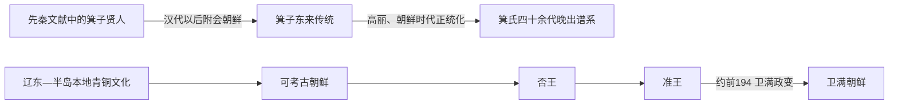

# 箕子朝鲜

## 时间

传统史书把它置于商周之际至前194年前后，常写作约前1120—前194年；现代研究不能把这九百余年视为已证实的连续王朝年代。

## 性质

“箕子朝鲜”是把商末贤人箕子与古朝鲜相连接的传统史学概念。先秦文献只记箕子因谏商纣王而受难、向周武王陈说《洪范》等事，没有记他东迁并统治朝鲜；箕子与朝鲜的明确连接主要见于汉代以后文献。考古材料也没有显示商亡之际有一支足以替换本地统治集团的中原青铜文化突然进入辽东和朝鲜半岛。因此，本页梳理的是传说的形成、后世接受及晚期古朝鲜的可考边界，而不是承认一个已有完整世系的“箕氏王朝”。

## 概括

箕子叙事在中国传统中强调殷商遗民与礼法传承，在高丽、朝鲜时代又被用于说明文明教化、平壤历史和儒家政治正统。传说把农桑、礼义和“八条之教”归于箕子，但汉代文献所见古朝鲜法禁并不能证明由箕子亲自颁布。前2世纪初卫满夺取准王政权是较可靠的政治转折；准王是否为箕子后裔，则是后世谱系化解释。

## 文献与考古边界

| 问题 | 证据 | 判断 |
| --- | --- | --- |
| 箕子是否为商末人物 | 《尚书》《论语》等先秦传统记其为商末贤人 | 人物传统较早，但这些文本没有“统治朝鲜”的记载 |
| 箕子是否东迁朝鲜 | 汉代以后《尚书大传》《史记》《汉书》等逐渐连接箕子与朝鲜 | 属较晚记述，缺少同时代材料印证 |
| 是否存在九百年箕氏王朝 | 朝鲜时代谱牒、地方志和《箕子志》等列四十余代 | 名单成书极晚，不能作为公认古代王统 |
| 商周文化是否整体取代本地文化 | 辽宁式铜剑、支石墓及地方陶器传统延续 | 没有出现足以证明大规模征服和王朝替代的清晰断层 |
| 准王是否确有其人 | 后世转述的早期中国史料记卫满逐准、准南走称韩王 | 可作为晚期古朝鲜人物讨论；其箕子血统无法证实 |

## 叙事形成过程

### 先秦：贤人箕子

早期文本中的箕子是殷商宗室或贤臣。他劝谏纣王、被囚或佯狂，周灭商后与武王讨论治国法则。这个层次说明箕子在中原政治思想中的地位，不包含朝鲜建国过程。

### 汉代以后：箕子与朝鲜相连

随着汉帝国进入辽东和古朝鲜故地，文献开始叙述周武王封箕子于朝鲜、箕子教民礼义田蚕。此说既把边疆历史纳入中原王朝的封建秩序，也为当地汉人家族和后世政权提供文明起源解释。记录年代较晚，使“东来”仍须视为有争议的传统，而非确证迁徙。

### 高丽至朝鲜：国家祭祀与正统化

高丽在平壤营建或祭祀箕子遗迹；朝鲜王朝尊崇儒家政治，更积极整理箕子井田、礼教和陵墓传说。16世纪以后谱牒把箕子至准王之间补成四十或四十一代，形成看似完整的王表。这些名单反映当时的历史观，不是商周至战国的同期档案。

### 现代研究：拆分传统与晚期古朝鲜

现代考古把辽东和半岛西北的青铜—早铁器文化看作本地长期发展并持续吸收周边技术的结果。学界仍讨论早期移民、箕氏小集团或传说形成机制，但一般不能据现有材料设定一个连续“箕子朝鲜时代”。

## 关键节点

| 时间 | 节点 | 历史意义 |
| --- | --- | --- |
| 商末周初传统 | 箕子作为殷商贤人进入先秦记忆 | 有早期人物传统，但尚未与朝鲜连接 |
| 汉代以后 | 文献首次明确叙述箕子受封或东来朝鲜 | “箕子朝鲜”叙事开始成形 |
| 前4—前3世纪 | 可考古朝鲜称王、与燕冲突并经历疆域变化 | 真实政治发展不能由箕子谱系直接解释 |
| 前2世纪初 | 卫满受准王任用后发动政变 | 晚期古朝鲜权力转移较可考；不是已证实的“箕氏末代”交替 |
| 12—13世纪以后 | 高丽祭祀和史书重新编排檀君、箕子传统 | 两套起源叙事被纳入历史正统 |
| 16世纪以后 | 地方志、谱牒补造四十余代箕氏世系 | 形成完整外观，但史料年代与所述时代相距极远 |
| 20世纪以来 | 文献批判与考古研究重新评估东来说 | 从“王朝事实”转为传说、记忆与迁徙假说之争 |

## 传统人物与可考边界

| 人物 | 传统身份 | 大致时代 | 证据与说明 |
| --- | --- | --- | --- |
| 箕子 | 箕子朝鲜建立者 | 商末周初传统 | 先秦文献中的殷商贤人；东迁、受封及统治朝鲜见于较晚文献，不能给出可信在位期 |
| 否王 | 晚期古朝鲜王 | 前3世纪末 | 《魏略》等后出文献保存其与秦、汉边境互动的叙述；不能证明为箕子后裔 |
| 准王 | 晚期古朝鲜末王、后称韩王 | 前2世纪初—约前194 | 任用卫满后被夺权并南走的核心叙述较稳定；其南迁地点、后续及血统仍有争议 |

不另列后世谱牒中的四十余名“箕氏君主”，因为它们不是同期或近同期材料所能支持的公认统治者。保留否王和准王，是为了呈现晚期古朝鲜可辨识的政治人物，而不是确认“箕氏血缘”。

## 转折原因

- **结构因素**：战国至秦汉时期，辽东战争、铁器传播、人口迁徙和边境贸易改变古朝鲜的权力结构。
- **政治机制**：晚期古朝鲜王权仍须吸纳拥有自身部众的地方首领和移民集团，中央控制并非绝对。
- **直接触发**：准王让卫满统率边境移民和守军；卫满积累力量后以防御汉军为名进入王都、夺取政权。
- **史学层面**：后世为解释这次政变的“前朝”，把准王纳入箕子世系，才形成从箕子到卫满的整齐王朝更替图。

## 演变关系

- 叙事上的前一节点是[檀君朝鲜](/%E4%BA%BA%E6%96%87%E7%A7%91%E5%AD%A6/%E5%8E%86%E5%8F%B2/%E4%B8%9C%E4%BA%9A/%E6%9C%9D%E9%B2%9C%E5%8D%8A%E5%B2%9B/%E6%AA%80%E5%90%9B%E6%9C%9D%E9%B2%9C.md)，但两者都是后世史书编排的起源框架，不构成已证实的直系王朝继承。
- 可考的后一节点是[卫满朝鲜](/%E4%BA%BA%E6%96%87%E7%A7%91%E5%AD%A6/%E5%8E%86%E5%8F%B2/%E4%B8%9C%E4%BA%9A/%E6%9C%9D%E9%B2%9C%E5%8D%8A%E5%B2%9B/%E5%8D%AB%E6%BB%A1%E6%9C%9D%E9%B2%9C.md)；更准确地说，卫满取代的是准王领导的晚期古朝鲜政权。
- 准王南迁与[辰国](/%E4%BA%BA%E6%96%87%E7%A7%91%E5%AD%A6/%E5%8E%86%E5%8F%B2/%E4%B8%9C%E4%BA%9A/%E6%9C%9D%E9%B2%9C%E5%8D%8A%E5%B2%9B/%E8%BE%B0%E5%9B%BD.md)、[三韩](/%E4%BA%BA%E6%96%87%E7%A7%91%E5%AD%A6/%E5%8E%86%E5%8F%B2/%E4%B8%9C%E4%BA%9A/%E6%9C%9D%E9%B2%9C%E5%8D%8A%E5%B2%9B/%E4%B8%89%E9%9F%A9.md)形成的关系有文献线索，却不能据此断定他建立并统治了整个马韩。
