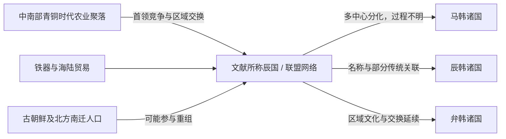

# 辰国

## 时间

约前4—前3世纪至前2—前1世纪；形成时间、范围和终结年代均不确定。

## 性质

辰国是早期中国文献对朝鲜半岛中南部某个政治共同体或联盟网络的称呼，不是已有完整疆域、都城和世系的统一王朝。考古所见是松菊里式农业聚落、韩国式铜剑、细形铜器、铁器和区域墓地逐步形成的多个社会中心；目前无法把其中某一遗址直接认定为“辰国王都”。后来的“辰王”、辰韩名称可能保存辰国政治记忆，却不证明从前4世纪到三韩存在一条连续中央王统。

## 概括

半岛中南部在青铜时代晚期形成以稻作和旱作为基础的聚落网络，首领通过青铜礼器、武器、墓葬和跨海交换积累威望。前2世纪文献说“辰国”希望直接与汉朝联系，却受到卫满朝鲜阻断，说明南部至少存在可由外界辨识的政治与贸易主体。古朝鲜亡国和乐浪等郡设置后，人口南迁、铁器与大陆贸易加快，中南部政治网络重新组合；到1—3世纪的文献中，主要名称已转为马韩、辰韩、弁韩。

## 证据边界

| 证据类型 | 内容 | 可确认程度 |
| --- | --- | --- |
| 《史记》朝鲜列传 | 辰国希望上书、朝见汉天子，右渠加以阻断 | 可证明前2世纪末汉人知道南方有称“辰”的政治主体；具体组织不明 |
| 《三国志》东夷传 | 追述辰国、辰王并详细记三韩 | 成书于3世纪，距早期辰国已有数百年，不能无条件倒推 |
| 青铜与铁器考古 | 韩国式铜剑、铜镜、铁器、木棺墓及聚落分层 | 说明中南部首领社会和区域交换发展，不能直接给遗址冠以“辰国”国名 |
| 准王南迁传统 | 准王被卫满驱逐后南走、自称韩王 | 可能反映北方人口和政治技术南传；地点、规模及其是否统治辰国有争议 |
| “辰韩”名称 | 文献称辰韩与“古之辰国”相关 | 表示名称或记忆关联，不等于辰国整体直接变成辰韩一支 |

## 形成背景与政治社会机制

### 农业聚落与首领权力

前1千纪中后期，半岛中南部谷地的稻作、旱作和储藏能力提高，聚落出现防御设施、大型房址和墓葬差异。首领掌握土地、水源、金属器和祭祀，以若干聚落为基础建立小政治体。辰国若确有联盟层级，也应建立在这些地方首领的协商和威望上，而非官僚制王朝。

### 金属与交换网络

辽宁和半岛西北的青铜、铁器技术沿陆路南下，南海岸又与日本列岛北九州交换原料、器物和人员。中南部首领既需要北方铁器和奢侈品，也拥有农产、海产及交通位置。文献所说辰国寻求通汉，符合这种贸易动机。

### 北方人口南迁

燕、秦、汉战争以及卫满夺权、古朝鲜灭亡造成多批人口迁徙。迁入者可能带来铁器、文字知识和更复杂的政治组织，但他们与本地社会融合，不应写成一次“北方人建立辰国”的简单事件。

## 重要过程与节点

| 时间 | 过程 / 节点 | 意义 |
| --- | --- | --- |
| 前4—前3世纪 | 中南部农业聚落扩大，韩国式铜剑文化形成 | 地方首领和区域中心具备发展联盟的条件 |
| 前3—前2世纪 | 铁器逐步输入并在南部传播 | 农业、武器和交换能力提升，首领竞争加剧 |
| 约前194 | 准王及部分古朝鲜人南走的文献传统 | 可能加快北方政治与技术因素进入，不能等同于辰国被其征服 |
| 前2世纪末 | 辰国试图直接通汉，被右渠阻断 | 辰国作为外交和贸易主体进入较早文献 |
| 前108以后 | 卫满朝鲜灭亡、乐浪等郡设置 | 原有中转垄断打破，南部与郡县贸易和冲突加深 |
| 前1世纪—1世纪 | 多个小国和邑落网络日益清楚 | “辰国”总称逐渐让位于马韩、辰韩、弁韩框架 |
| 2—3世纪 | 文献记辰王、目支国和三韩诸国 | 可能保留联盟传统，但已不是可证明的早期辰国原貌 |

## 政治结构与首领

| 层级 | 人物 / 群体 | 说明 |
| --- | --- | --- |
| 联盟性首领 | 文献所称“辰王” | 名号见后世对三韩的记述，具体个人、在位年和早期辰国连续性均不详 |
| 区域首领 | 中南部若干小国或邑落首领 | 掌握聚落、农地、墓地和交换路线，是政治运作的实际基础 |
| 祭祀首领 | 地方祭司或仪式主持者 | 祭祀帮助跨聚落整合；后来的三韩天君、苏涂制度可能保存相关传统 |
| 外来与本地集团 | 古朝鲜南迁者、本地农业社群及海上网络参与者 | 通过婚姻、贸易和军事合作重组，没有材料支持单一族群垄断 |

没有任何一位可以可靠列名、排序并给出在位年的“辰国君主”。与其用“诸部首领”假装完整世系，不如明确承认证据缺口。

## 转折与分化原因

- **结构因素**：中南部被山地、河谷和海岸分割，区域中心众多，难以长期接受单一首领直接统治。
- **经济动力**：铁器、稻作和海陆贸易使不同小国各自壮大，联盟内部差异扩大。
- **外部冲击**：卫满朝鲜灭亡和汉郡县设置重排北方通道；移民与新贸易伙伴进入南部。
- **政治结果**：原来可能使用“辰”名号的松散网络，逐步表现为马韩、辰韩、弁韩等多中心格局，而非某一天由一个王宣布“三分”。

## 争议辨析

“辰国是三韩前身”只能作为概括，不能画成一个统一国家均分成三块。尤其是辰韩被称为“古之辰国”时，可能只是名称、居民来源或地域记忆；马韩的辰王传统和弁韩的相近文化也说明继承关系更复杂。准王南迁同样是重要线索，却不足以证明箕氏王朝在南方重新统治全部辰国。

## 演变关系

- 史前与考古前置背景见[石器时代](/%E4%BA%BA%E6%96%87%E7%A7%91%E5%AD%A6/%E5%8E%86%E5%8F%B2/%E4%B8%9C%E4%BA%9A/%E6%9C%9D%E9%B2%9C%E5%8D%8A%E5%B2%9B/%E7%9F%B3%E5%99%A8%E6%97%B6%E4%BB%A3.md)；[檀君朝鲜](/%E4%BA%BA%E6%96%87%E7%A7%91%E5%AD%A6/%E5%8E%86%E5%8F%B2/%E4%B8%9C%E4%BA%9A/%E6%9C%9D%E9%B2%9C%E5%8D%8A%E5%B2%9B/%E6%AA%80%E5%90%9B%E6%9C%9D%E9%B2%9C.md)是北方古朝鲜的神话节点，不是可证明的辰国直接上级。
- 与[卫满朝鲜](/%E4%BA%BA%E6%96%87%E7%A7%91%E5%AD%A6/%E5%8E%86%E5%8F%B2/%E4%B8%9C%E4%BA%9A/%E6%9C%9D%E9%B2%9C%E5%8D%8A%E5%B2%9B/%E5%8D%AB%E6%BB%A1%E6%9C%9D%E9%B2%9C.md)并行：卫满政权控制北方通道，辰国位于中南部并试图越过其直接通汉。
- 后续节点：[三韩](/%E4%BA%BA%E6%96%87%E7%A7%91%E5%AD%A6/%E5%8E%86%E5%8F%B2/%E4%B8%9C%E4%BA%9A/%E6%9C%9D%E9%B2%9C%E5%8D%8A%E5%B2%9B/%E4%B8%89%E9%9F%A9.md)。
