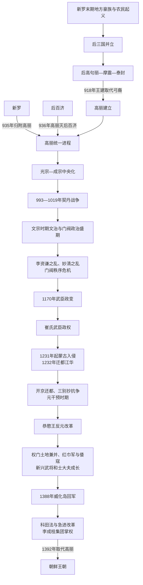

# 高丽王朝

## 时间

918-1392。

## 别称

王氏高丽。

## 概括

高丽王朝由王建建立，承接后三国分裂局面并完成统一。它以开京为中心，发展出佛教国家、科举制度、门阀贵族政治和对外朝贡关系，后期经历武臣政权、蒙古入侵和元朝干预，最终被李成桂建立的朝鲜王朝取代。

## 历史演进图

## 建立背景

- 9世纪后期，新罗王位争夺、赋税体系失灵和地方豪族坐大，使甄萱、弓裔等建立后百济、后高句丽。开城一带王氏家族依靠海上贸易、地方城堡和松岳地区人脉成为弓裔政权的重要力量。
- 918年，洪儒、裴玄庆、申崇谦、卜智谦等拥立王建，推翻日益严酷的弓裔并改国号“高丽”。国名主动调用高句丽记忆，但新国家的政治基础同时包括泰封旧部、开城豪族、新罗贵族、百济地区首领和北方移民。
- 王建避免单纯军事征服，通过婚姻、赐姓、官爵、地方自治承认和佛教护国观念吸收豪族；935年接受新罗归附、936年利用甄萱父子内讧灭后百济，才完成主要政治体统一。
- “三韩一统”是高丽王朝的政治表述，强调对高句丽、百济、新罗历史空间的统合；其北界和地方控制仍在后续同契丹、女真及地方势力互动中形成。

## 分阶段发展

| 阶段 | 时间 | 具体过程 | 阶段结果 |
|---|---|---|---|
| 建国与后三国统一 | 918—936年 | 王建承接泰封，经营松岳、罗州海路和中部豪族联盟；新罗和平归附，后百济因王室内乱被击败。 | 王氏高丽成为半岛主要统一王朝，并以优待旧王族、婚姻和事审官等方式整合地方。 |
| 王权强化与制度建设 | 936—1019年 | 光宗实行奴婢按检、科举和官服制度，削弱功臣私属；成宗采用儒臣建议建设中央官制和十二牧。契丹三次入侵期间，高丽以谈判、筑城和战争并用。 | 中央官僚、科举和地方派官制度成形；1019年龟州大捷后，高丽与辽形成较稳定关系。 |
| 门阀政治与文治盛期 | 1019—1170年 | 文宗时期田柴科、官僚和对宋贸易发展，佛教、青瓷与出版繁盛；大族通过科举和婚姻垄断高位。女真崛起后尹瓘拓九城又归还。 | 王朝达到制度和文化盛期，但外戚、门阀土地和文武待遇不平等积累矛盾。 |
| 门阀危机与武臣政权 | 1126—1231年 | 李资谦之乱、妙清西京之乱暴露都城和政策派系冲突；1170年郑仲夫等发动武臣政变，国王仍在位而军人首领掌实权。1196年崔忠献建立世袭崔氏政权。 | 文臣贵族秩序被打破，农民、奴婢和地方起义频发；王权与国家机构被武臣私府架空。 |
| 蒙古入侵与江华抗战 | 1231—1270年 | 蒙古多次入侵，崔氏把朝廷迁至江华岛，以海峡保护中央，却使大陆居民承担屠杀、掳掠和长期征发。1258年崔氏政权终结，王室议和。 | 1259年后确立对蒙古的臣属关系，1270年还都开京；三别抄反对解散和还都，转战珍岛、济州至1273年失败。 |
| 元干预与王室重组 | 1270—1351年 | 高丽王室与元皇室联姻，国王常在大都居留、受册立或被迫退复位；征东行省、达鲁花赤及贡赋、军役使元影响深入。高丽又参与两次征日准备。 | 王朝未被取消，保留国王和本国官制，但主权受限，权门世族借元关系扩张土地和奴婢。 |
| 恭愍王改革与末期危机 | 1351—1388年 | 恭愍王利用元衰落清除亲元势力、收复双城总管府、整顿土地奴婢；改革遭权门反对，辛旽被杀、恭愍王遇害。红巾军和倭寇入侵又促使崔莹、李成桂等武将崛起。 | 新兴士大夫围绕土地、佛教和对明政策分化，军政资源集中到少数将领。 |
| 威化岛回军与王朝更替 | 1388—1392年 | 明朝拟置铁岭卫引发辽东征伐争议，李成桂在威化岛回军，废禑王、杀崔莹并控制朝廷；昌王、恭让王先后被立。急进派推进科田法并排除郑梦周等反对者。 | 1392年恭让王被迫退位，李成桂即位，王氏高丽终结。 |

## 统治结构

| 层面 | 主要结构 | 演变与作用 |
|---|---|---|
| 国王与中央官僚 | 国王居开京，中央以中书门下省、尚书省和六部等处理政务；都兵马使、式目都监等合议机构使宰相和重臣参与军事、制度决策。 | 高丽制度吸收唐宋形式又有本地合议特色。武臣、元干预或权臣时期，正式官署继续存在但实权可转移到教定都监、征东行省关系网或军事集团。 |
| 科举与门荫 | 光宗958年实行科举，文官通过制述、明经等科入仕；功臣和门阀子弟又可凭荫叙进入官僚体系。 | 科举扩大地方士人机会，却未消除家族婚姻和祖荫优势，门阀政治由考试与世袭资源共同构成。 |
| 地方治理 | 王朝逐步形成五道、两界及州县体系，向重要郡县派官；事审官、其人制度连接中央与豪族，乡、部曲、所等特殊行政区承担特定赋役。 | 中央控制随地区而异，北方两界军事性较强；地方乡吏长期负责户籍、仓储和征收，是国家实际运行骨干。 |
| 土地与财政 | 田柴科按官职授予收租权，公田、私田、寺院田和贵族庄园并存；农户承担租税、贡物与徭役。 | 田柴科不是把土地永久分给所有官员，后期权门农庄和奴婢扩张侵蚀国家税源，土地改革成为王朝更替核心。 |
| 军事 | 中央二军六卫、地方州县兵和北方两界驻军构成正式体系，武臣另有私兵和都房；三别抄由夜别抄等发展而来。 | 文班压制武班引发1170年政变，随后私兵化使军队服务权臣；抗蒙和倭寇战争又让新兴武将掌握独立声望。 |
| 宗教与文化 | 佛教承担护国仪礼、寺院教育和社会救济，国师、王师影响宫廷；儒学、科举和国子监服务官僚政治，风水与本地信仰也参与都城选择。 | 高丽不是单纯“佛教国家”或“儒教国家”，多套知识制度共存；后期新兴士大夫以程朱学批判寺院和权门经济。 |
| 对外关系 | 对辽、金、宋、元、明分别采取称臣、册封、贸易、战争与边界谈判，北方政权更替时不断调整名号和联盟。 | 外交上的臣属礼仪与内部自治程度并不相同；元干预期对王位、婚姻和军役的直接影响远强于一般朝贡。 |

## 重要事件

| 时间 | 事件 | 过程与意义 |
|---|---|---|
| 918年 | 王建建立高丽 | 推翻弓裔，以开京为都，延续泰封军政同时调整严酷统治。 |
| 935—936年 | 新罗归附、后百济灭亡 | 敬顺王主动归附；甄萱投奔高丽后协助讨伐其子神剑，后三国统一完成。 |
| 956、958年 | 奴婢按检与科举 | 光宗清查被豪族强占为奴者并建立考试入仕，削弱功臣势力、扩大王权官僚基础。 |
| 993年 | 徐熙谈判 | 契丹第一次入侵时，以高丽继承高句丽和断绝宋关系等议题谈判，取得鸭绿江以东部分地区并筑江东六州。 |
| 1010—1019年 | 契丹再侵与龟州大捷 | 开京一度失守，高丽重建防线；姜邯赞在龟州击败契丹军，长期边界关系趋稳。 |
| 1107—1109年 | 尹瓘征女真与九城 | 别武班向东北推进并筑城，但因补给、当地抵抗和外交压力归还，显示边疆扩张的限度。 |
| 1126年 | 李资谦之乱 | 外戚试图控制仁宗并焚毁宫阙，门阀婚姻政治陷入危机。 |
| 1135—1136年 | 妙清西京起事 | 迁都西京、称帝和北进主张失败，金富轼平乱；不能仅化约为“进步对保守”，还涉及地域、王权和对金政策。 |
| 1170年 | 武臣政变 | 郑仲夫、李义方等杀戮文臣、废毅宗，开启百年武臣掌权。 |
| 1196年 | 崔忠献夺权 | 击败李义旼后设教定都监，崔氏四代以私兵和人事权控制国王与官府。 |
| 1231—1232年 | 蒙古首次入侵与迁都江华 | 朝廷避入海岛继续抵抗，陆地社会却长期承受战争；高丽大藏经再雕也在这一时期展开。 |
| 1258—1273年 | 崔氏终结、议和与三别抄抗争 | 金俊杀崔竩，王室同蒙古议和；还都后解散三别抄引发珍岛、济州抗争。 |
| 1274、1281年 | 元日战争动员 | 高丽提供船只、兵员和后勤，风暴及日本抵抗使两次远征失败，本国财政和沿海社会负担沉重。 |
| 1356年 | 恭愍王反元改革 | 废除元干预机构部分权力、收复双城总管府并恢复本国官制，王朝自主性增强。 |
| 1374年 | 恭愍王遇害 | 改革失去最高支持，权门和武将竞争加剧，禑王即位的血统与合法性后来受到政治攻击。 |
| 1388年 | 威化岛回军 | 李成桂拒绝继续辽东远征，回军开京并清除崔莹，实际掌握国家军政。 |
| 1391—1392年 | 科田法与朝鲜建国 | 土地收租权重分配为新政权建立经济基础；郑梦周被杀后，恭让王退位，李成桂即位。 |

## 鼎盛条件

- **统一方式较具包容性**：王建优待新罗王室、后百济人才和地方豪族，通过婚姻与官爵减少长期占领成本。
- **开京与海陆网络**：开京靠近礼成江和黄海，可连接半岛内陆、宋辽边界贸易和海商路线，北方西京又承担边防与历史象征。
- **科举—门荫并用**：科举吸纳地方士人，门荫稳定旧贵族合作，使中央在10—11世纪逐步建立有文书能力的官僚层。
- **务实外交与军事防御**：对契丹既作战又谈判，利用山城和江河补给；同宋保持贸易文化关系而避免永久两线战争。
- **农业、手工业与贸易**：土地税支撑官僚和寺院，高丽青瓷、纸、金属器、印刷及人参等进入国内外市场。
- **多元文化整合**：佛教国家仪礼、儒学行政和地方信仰并存，为王朝提供不止一种合法性资源。

## 衰落因素、直接触发与灭亡过程

| 类型 | 因素 | 作用方式 |
|---|---|---|
| 结构因素 | 门阀和寺院土地集中、奴婢增加、国家税源减少；文武待遇失衡导致武臣政变；武臣私兵和元干预期权门农庄进一步架空公共机构。 | 王室长期依赖能控制土地和军队的家族，改革触及既得利益便易被中断，地方农户承担的租税和军役加重。 |
| 外部压力 | 契丹、女真、蒙古先后改变北方力量格局；元衰后红巾军、倭寇频繁入侵，明朝又提出铁岭卫等边界要求。 | 连续战争催生强势武将并破坏人口、田地和财政，朝廷对外路线成为内部派系斗争工具。 |
| 直接触发 | 1388年辽东远征命令使崔莹与李成桂公开决裂；威化岛回军后李成桂控制军队，急进士大夫借科田法重分经济资源。 | 禑王、昌王和恭让王连续废立，旧王统失去军政与财政基础；郑梦周遇害后维护高丽的政治核心被清除。 |

1388年，禑王和崔莹决定进攻辽东，李成桂以季节、补给和同时树敌等理由反对，在威化岛回军。回军部队控制开京，崔莹被处死，禑王、昌王先后被废，王氏旁支恭让王被立。李成桂、郑道传等急进派通过田制改革、官僚改组和对明关系掌握国家，温和派郑梦周主张在高丽王统内改革。1392年郑梦周被李芳远一方杀害后，恭让王被迫退位，李成桂受禅即位；这是一场在军事控制、土地重分与合法性重造共同作用下完成的王朝更替。

## 世系连续性与争议读法

- 下表完整列出34位在位君主，忠宣王、忠肃王、忠惠王的复位分别保留在同一君主行内，不删去任何一次实际在位。
- 高丽诸王均属王氏王族，但继承并非单纯长子制：早期惠宗、定宗、光宗是太祖不同儿子，穆宗被政变废黜后由太祖之孙显宗支系继承；武臣政权时期多次由掌权者废立。
- 元干预期的退位、复位和父子冲突受到元朝册立、召见及高丽派系共同影响。表中的连续顺序应与“实际掌权者”分开阅读。
- 禑王、昌王在当时实际即位并统治，朝鲜建立后因政治合法性论争被降称“禑”“昌”而不授王号；本表仍按实际在位顺序列入。恭让王是被拥立的王氏旁支，也是最后一位国王。

## 说明

- 918年，王建推翻泰封弓裔，建立高丽。
- 935年，高丽合并新罗。
- 936年，高丽灭后百济，实现“三韩一统”。
- 高丽以佛教为重要国家信仰，同时吸收唐宋制度，发展科举、官僚和礼制。
- 高丽曾与契丹、女真、蒙古等北方势力发生战争。
- 12世纪后期武臣政变后，武臣政权长期掌握实权。
- 13世纪蒙古入侵后，高丽成为元朝影响下的藩属政权，王室与元朝关系密切。
- 元朝衰落后，高丽逐渐恢复自主，但内部权臣、土地兼并和改革矛盾加剧。
- 1392年，李成桂取代高丽，建立朝鲜王朝。

## 文化与制度

- 高丽青瓷是高丽文化的重要代表。
- 《高丽大藏经》体现佛教文化和雕版印刷技术的发展。
- 高丽国名通过外语传播，成为今日“Korea / Corea”等名称的重要来源。

## 君主世系

本表按在位时间顺序整理高丽王朝历代君主。

| 顺序 | 君主 | 在位时间 | 说明 |
| ---: | --- | --- | --- |
| 1 | **太祖王建** | 918-943 | 建立高丽，统一后三国。 |
| 2 | 惠宗 | 943-945 | 太祖之后继位。 |
| 3 | 定宗 | 945-949 | 高丽早期君主。 |
| 4 | **光宗** | 949-975 | 推行科举和王权强化政策。 |
| 5 | 景宗 | 975-981 | 高丽早期君主。 |
| 6 | **成宗** | 981-997 | 完善中央官僚制度。 |
| 7 | 穆宗 | 997-1009 | 被康兆政变废黜。 |
| 8 | **显宗** | 1009-1031 | 契丹战争时期重要君主。 |
| 9 | 德宗 | 1031-1034 | 在位较短。 |
| 10 | 靖宗 | 1034-1046 | 11世纪君主。 |
| 11 | 文宗 | 1046-1083 | 高丽文治和制度发展时期君主。 |
| 12 | 顺宗 | 1083 | 在位很短。 |
| 13 | 宣宗 | 1083-1094 | 11世纪后期君主。 |
| 14 | 献宗 | 1094-1095 | 在位较短。 |
| 15 | 肃宗 | 1095-1105 | 12世纪初君主。 |
| 16 | 睿宗 | 1105-1122 | 12世纪初君主。 |
| 17 | 仁宗 | 1122-1146 | 妙清之乱时期在位。 |
| 18 | 毅宗 | 1146-1170 | 武臣政变中被废。 |
| 19 | 明宗 | 1170-1197 | 武臣政权时期君主。 |
| 20 | 神宗 | 1197-1204 | 武臣政权时期君主。 |
| 21 | 熙宗 | 1204-1211 | 武臣政权时期君主。 |
| 22 | 康宗 | 1211-1213 | 在位较短。 |
| 23 | **高宗** | 1213-1259 | 蒙古入侵时期君主。 |
| 24 | 元宗 | 1259-1274 | 高丽与元关系转折时期君主。 |
| 25 | 忠烈王 | 1274-1308 | 元干预时期君主。 |
| 26 | 忠宣王 | 1298；1308-1313 | 两次在位。 |
| 27 | 忠肃王 | 1313-1330；1332-1339 | 两次在位。 |
| 28 | 忠惠王 | 1330-1332；1339-1344 | 两次在位。 |
| 29 | 忠穆王 | 1344-1348 | 元干预后期君主。 |
| 30 | 忠定王 | 1348-1351 | 元干预后期君主。 |
| 31 | **恭愍王** | 1351-1374 | 推动反元和改革政策。 |
| 32 | 禑王 | 1374-1388 | 高丽末期君主。 |
| 33 | 昌王 | 1388-1389 | 在位较短。 |
| 34 | **恭让王** | 1389-1392 | 高丽末王，被李成桂取代。 |

## 实际掌权者

| 类型 | 人物 / 群体 | 时间 | 说明 |
| --- | --- | --- | --- |
| 武臣政权首脑 | 郑仲夫、庆大升、李义旼等 | 1170—1196 | 政变后先后控制禁军、人事与国王废立，掌权并非同一家族连续世袭。 |
| 武臣政权实际首脑 | 崔氏政权 | 1196—1258 | 崔忠献至崔竩四代以教定都监、都房和私兵长期掌握实际军政权力。 |
| 武臣政权末期首脑 | 金俊、林衍、林惟茂 | 1258—1270 | 崔氏倒台后仍操纵王权；林惟茂被杀标志百年武臣政权终结。 |
| 外部最高干预者 | 元朝皇帝及征东行省关系网 | 1270年代—1350年代 | 高丽国王和本国官署保留，但王位册立、婚姻、军役及部分人事深受元朝影响。 |
| 王朝末期军政核心 | 李成桂及急进改革派 | 1388—1392 | 威化岛回军后控制军队和废立，借科田法重组经济基础，最终取代王氏。 |

## 演变关系

- 前一阶段：[新罗王国](/%E4%BA%BA%E6%96%87%E7%A7%91%E5%AD%A6/%E5%8E%86%E5%8F%B2/%E4%B8%9C%E4%BA%9A/%E6%9C%9D%E9%B2%9C%E5%8D%8A%E5%B2%9B/%E6%96%B0%E7%BD%97%E7%8E%8B%E5%9B%BD.md)、[后三国](/%E4%BA%BA%E6%96%87%E7%A7%91%E5%AD%A6/%E5%8E%86%E5%8F%B2/%E4%B8%9C%E4%BA%9A/%E6%9C%9D%E9%B2%9C%E5%8D%8A%E5%B2%9B/%E5%90%8E%E4%B8%89%E5%9B%BD.md)。
- 后一节点：[朝鲜王朝](/%E4%BA%BA%E6%96%87%E7%A7%91%E5%AD%A6/%E5%8E%86%E5%8F%B2/%E4%B8%9C%E4%BA%9A/%E6%9C%9D%E9%B2%9C%E5%8D%8A%E5%B2%9B/%E6%9C%9D%E9%B2%9C%E7%8E%8B%E6%9C%9D.md)。

## 相关中国朝代与民族史

- 高丽与辽、金、元长期互动，朝代侧见[辽宋金西夏](/%E4%BA%BA%E6%96%87%E7%A7%91%E5%AD%A6/%E5%8E%86%E5%8F%B2/%E4%B8%9C%E4%BA%9A/%E4%B8%AD%E5%9B%BD/%E8%BE%BD%E5%AE%8B%E9%87%91%E8%A5%BF%E5%A4%8F/README.md)、[元](/%E4%BA%BA%E6%96%87%E7%A7%91%E5%AD%A6/%E5%8E%86%E5%8F%B2/%E4%B8%9C%E4%BA%9A/%E4%B8%AD%E5%9B%BD/%E5%85%83/README.md)；族群侧见[契丹与东北旁蒙古](/%E4%BA%BA%E6%96%87%E7%A7%91%E5%AD%A6/%E5%8E%86%E5%8F%B2/%E4%B8%9C%E4%BA%9A/%E4%B8%AD%E5%9B%BD/_%E6%B0%91%E6%97%8F/%E8%92%99%E5%8F%A4%E8%AF%AD%E6%97%8F%E4%B8%8E%E4%B8%9C%E8%83%A1/%E5%A5%91%E4%B8%B9%E4%B8%8E%E4%B8%9C%E5%8C%97%E6%97%81%E8%92%99%E5%8F%A4/README.md)、[女真诸部](/%E4%BA%BA%E6%96%87%E7%A7%91%E5%AD%A6/%E5%8E%86%E5%8F%B2/%E4%B8%9C%E4%BA%9A/%E4%B8%AD%E5%9B%BD/_%E6%B0%91%E6%97%8F/%E9%80%9A%E5%8F%A4%E6%96%AF%E8%AF%AD%E6%97%8F%E4%B8%8E%E8%82%83%E6%85%8E/%E5%A5%B3%E7%9C%9F%E8%AF%B8%E9%83%A8/README.md)、[蒙古语族与东胡](/%E4%BA%BA%E6%96%87%E7%A7%91%E5%AD%A6/%E5%8E%86%E5%8F%B2/%E4%B8%9C%E4%BA%9A/%E4%B8%AD%E5%9B%BD/_%E6%B0%91%E6%97%8F/%E8%92%99%E5%8F%A4%E8%AF%AD%E6%97%8F%E4%B8%8E%E4%B8%9C%E8%83%A1/README.md)。
