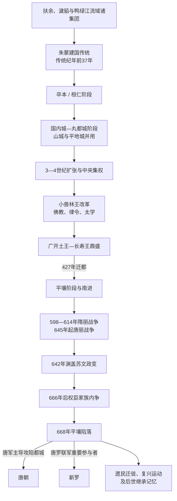

# 高句丽王国

## 时间

前37-668。

## 概括

高句丽是朝鲜半岛北部和中国东北地区的重要古代王国，由扶余系统的朱蒙传说建立。它最初兴起于鸭绿江流域，后来迁都国内城和平壤，成为三国时代最强大的国家之一，最终在唐朝与新罗联合进攻下灭亡。

## 历史演进图

## 建立背景与年代辨析

- 《三国史记》等后世文献把朱蒙建国置于前37年，并以扶余王族出走、卒本立国解释王统来源；这是高句丽自我认同和后世王统叙事的重要组成。
- 考古材料显示，鸭绿江中游在青铜器—早期铁器时代已有多种聚落与政治集团，高句丽国家并非在某一年突然形成，而是在约前1世纪至公元初逐步整合地方部族、山城和交通节点。
- 早期王名、在位年和亲属关系主要依赖成书较晚的文献，太祖王等超长在位尤其存在年代学争议。本篇保留传统纪年以便与世系表对应，不把它等同于逐年可证的现代年表。
- 早期高句丽与玄菟郡、乐浪郡、扶余及周边濊貊集团既战争又交换；“扶余系统”说明建国传说和政治文化联系，不意味着人口只有单一来源。

## 分阶段发展

| 阶段 | 时间 | 具体过程 | 阶段结果 |
|---|---|---|---|
| 形成与部族联盟 | 传统纪年前37年—约2世纪 | 以卒本、国内城和鸭绿江中游山城为核心，王室逐步协调“五部”等地方集团，通过战争、婚姻和贡赋扩大影响。 | 王权从联盟首领向常设君主发展，但早期制度和疆域不能按后世国家边界理解。 |
| 扩张与中央化 | 2世纪后期—4世纪中叶 | 向辽东、鸭绿江下游和半岛北部扩张；美川王时期于313年终结乐浪郡，控制平壤地区。曹魏、前燕和百济的反击又多次摧毁都城或造成重大损失。 | 危机促使王室加强军政组织，平壤农业区和交通网络成为后续南进基础。 |
| 制度整顿与复兴 | 371—391年 | 故国原王战死后，小兽林王接纳佛教、颁行律令并设太学，故国壤王继续重整王权。 | 共同信仰、成文规范和官僚教育加强中央对贵族和地方的整合。 |
| 扩张鼎盛 | 391—491年 | 广开土王在辽东、松花江流域和半岛北中部用兵，并援助新罗；长寿王以南北朝多边外交稳定北方，427年迁都平壤，475年攻陷百济汉城。 | 高句丽形成跨辽东、鸭绿江和大同江流域的强国，控制半岛中部部分战略区域。 |
| 贵族政治与三国均势 | 491—590年 | 王权与大贵族共同治理，平壤都城体系继续发展；百济、新罗结盟抵抗南进，新罗在6世纪夺取汉江流域。 | 领土仍广，但南部优势收缩，贵族竞争和多线防御负担上升。 |
| 隋唐战争与军事动员 | 590—642年 | 隋文帝、隋炀帝先后发动远征，612年萨水战役等使隋军受挫；唐初双方短暂调整后再度紧张。 | 山城防御、机动作战和漫长补给线帮助高句丽击退大军，但长期征发也消耗人口与财政。 |
| 渊盖苏文政权与灭亡 | 642—668年 | 渊盖苏文杀荣留王、拥立宝藏王并掌握军政；645年唐太宗攻辽东受阻。其死后诸子争权，渊男生投唐，唐军与新罗从北、南两线推进。 | 668年平壤陷落，王国灭亡；抵抗和复兴活动仍延续数年。 |

## 统治结构

| 层面 | 主要结构 | 演变与作用 |
|---|---|---|
| 王权与贵族 | 早期“五部”贵族拥有地方基础，王位逐步由高氏王族稳定继承；大对卢、莫离支等高官和贵族会议参与军政。 | 王权强时可通过迁都、律令和官位体系重组贵族，弱时权臣能够废立乃至架空国王。官名在不同时期有变化，不应视为七百年不变。 |
| 首都与地方 | 国内城—丸都城、平壤平地城—山城构成平战结合的都城体系；地方以城为行政、军事和仓储节点。 | 山城网络适应山地地形并能迟滞大军，但长期围城需要地方粮食和居民持续动员。 |
| 军事 | 王室、贵族部曲、地方城兵与全国征发共同组成军力，骑兵、步兵和守城体系并用。 | 高机动骑兵适合辽东与东北作战，坚城体系则是抵抗隋唐远征的关键；多线战争会放大征役负担。 |
| 法律与教化 | 小兽林王时期以佛教、律令和太学为制度整顿标志，汉字文书与纪年服务外交、赋役和贵族教育。 | 佛教既是王权保护的宗教，也通过寺院、造像和墓葬艺术形成共同政治文化；本地祭祀传统并未因此消失。 |
| 对外关系 | 对中原王朝使用朝贡、册封、战争和边境贸易多种方式；与百济、新罗、倭、突厥及北方集团结盟或对抗。 | 册封是外交秩序和名号资源，不等于中原王朝能持续直接统治高句丽内部。 |

## 重要事件

| 时间 | 事件 | 过程与意义 |
|---|---|---|
| 传统纪年前37年 | 朱蒙建国 | 传统王统以扶余出身的朱蒙在卒本立国为起点；确切年代和早期世系存在争议。 |
| 244—245年 | 曹魏攻破丸都一带 | 毌丘俭远征重创高句丽都城，王国并未因此消失，随后依靠山城与地方网络恢复。 |
| 313年 | 攻取乐浪郡 | 美川王时期高句丽控制平壤地区，汉郡县在该区域的长期建制结束。 |
| 342年 | 前燕攻陷丸都 | 王陵被掘、王母与民众被俘，显示辽东诸政权仍能严重威胁高句丽。 |
| 371—372年 | 故国原王战死与小兽林王改革 | 百济进攻平壤造成王亡；次年佛教正式传入记载、律令和太学建设开启制度重整。 |
| 391—413年 | 广开土王扩张 | 北击契丹、扶余等集团并向辽东和半岛推进，400年前后出兵援助新罗，奠定5世纪优势。 |
| 427年 | 长寿王迁都平壤 | 利用大同江流域农业和交通，牵制国内城旧贵族，并把战略重心转向半岛。 |
| 475年 | 攻陷百济汉城 | 百济盖卤王战死并迁都熊津，高句丽取得汉江流域一度的主导地位。 |
| 612年 | 隋军远征与萨水战役 | 隋炀帝大规模进攻失败，漫长补给和高句丽防御使隋朝付出重创，但双方战争并非隋亡的唯一原因。 |
| 642年 | 渊盖苏文政变 | 荣留王被杀、宝藏王被立，王权名义延续而实际军政转入权臣家族。 |
| 645年 | 唐太宗东征与安市城攻防 | 唐军攻取多座辽东城，却未克安市城并撤军，高句丽暂时维持防线。 |
| 668年 | 平壤陷落 | 渊氏内争削弱指挥，唐军围城并获内应，宝藏王等投降；新罗军从南线配合作战。 |

## 鼎盛条件

- **复合地理与资源**：辽东、鸭绿江和大同江流域连接农耕平原、山地防线、铁与森林资源，可同时支持农业、骑兵和山城防御。
- **都城与山城体系**：平地城处理日常行政，山城承担战时避险与仓储，降低一次野战失败导致国家立即崩溃的风险。
- **制度整合**：律令、官位、太学和佛教把不同地区贵族纳入共享的政治语言，迁都又削弱旧中心对王权的牵制。
- **多边外交**：广开土王和长寿王时期在北魏、南朝、柔然及半岛诸国之间灵活遣使，避免长期同时面对所有强敌。
- **对交通节点的控制**：辽东通道、鸭绿江渡口和平壤平原使高句丽能在东北亚陆路与半岛水陆网络之间调兵、征税和贸易。

## 衰落因素、直接触发与灭亡过程

| 类型 | 因素 | 作用方式 |
|---|---|---|
| 结构因素 | 王位继承与大贵族权力竞争；跨辽东和半岛北部的长防线；长期征兵、筑城和粮运负担。 | 国家需要依赖地方城主和贵族维持防务，中央失去协调时，坚城网络会转为彼此孤立的据点。 |
| 外部压力 | 6世纪新罗夺取汉江地区，百济—新罗联盟曾限制南进；隋、唐统一后可集中更大人口、船运与攻城资源，新罗又从南方提供兵力和补给。 | 高句丽从可利用中原分裂转为面对统一帝国与半岛敌国的夹击，战略缓冲逐渐消失。 |
| 直接触发 | 渊盖苏文死后，渊男生、渊男建和渊男产争权；渊男生向唐求援并提供内部情报，多座城堡相继降唐。 | 统帅集团裂解使军令、补给和地方忠诚同时崩坏，唐罗联军得以在667—668年持续合围。 |

668年，李勣等唐军越过辽东防线并围攻平壤，新罗军由南方配合。围城一个多月后，渊男产等投降，渊男建继续抵抗，僧信诚等与唐军接应，平壤最终失守；宝藏王和大批贵族、居民被迁往唐境。高句丽灭亡不能只归因于一次战役：隋唐战争的长期消耗、贵族政治失衡和渊氏家族分裂共同使外部进攻转化为政权崩溃。

此后高句丽故地由唐安东都护府、新罗北部边疆及多种地方势力争夺；剑牟岑、安胜等发起复兴运动但未恢复旧王国。698年大祚荣建立的渤海吸收部分高句丽遗民与靺鞨集团，高丽王朝后来又主动使用“高丽”国号和继承记忆，但这些后续不能简化为原王朝线性延续。

## 世系连续性与争议读法

- 下表完整保留《三国史记》传统的28王顺序，不把任何君主合并。前37年至约3世纪的绝对年代、超长在位和细部亲属关系争议较大，阅读时应把“传统纪年”与考古可证国家形成区分。
- 王统大体由高氏内部延续，但并非始终父死子继：闵中王、次大王、新大王等涉及兄弟或旁支承继，美川王由旁支返回王位，小兽林王无子后由弟故国壤王继位，文咨明王为长寿王之孙。
- 荣留王被渊盖苏文杀害后，宝藏王由王族旁支被拥立；642年以后“国王在位顺序”和“实际掌权者”必须分开阅读。
- 太祖王、次大王、新大王之间的年代与谱系是早期王表最突出的争议之一；本表沿用通行传统以便检索，不据此断言每一年均可独立证实。

## 说明

- 传统上认为高句丽由朱蒙于前37年建立，早期活动区域在西汉玄菟郡高句丽县附近。
- 建国后逐渐以鸭绿江中上游和今吉林集安一带为中心发展。
- 427年，高句丽迁都平壤，进一步加强对朝鲜半岛北部和中部的控制。
- 5世纪广开土王、长寿王时期，高句丽进入鼎盛，势力覆盖辽东、满洲部分地区和朝鲜半岛北中部。
- 高句丽长期与中原王朝、百济、新罗发生战争和外交互动。
- 隋朝、唐朝多次攻打高句丽，战争规模巨大。
- 668年，唐朝与新罗联合灭高句丽。
- 高句丽遗民和故地后来与渤海、高丽等历史记忆发生联系。

## 君主世系

本表按在位时间顺序整理高句丽历代君主。

| 顺序 | 君主 | 在位时间 | 说明 |
| ---: | --- | --- | --- |
| 1 | **东明圣王 / 朱蒙** | 前37-前19 | 传统建国君主。 |
| 2 | 琉璃明王 | 前19-18 | 东明圣王之子。 |
| 3 | 大武神王 | 18-44 | 高句丽早期扩张君主。 |
| 4 | 闵中王 | 44-48 | 早期君主。 |
| 5 | 慕本王 | 48-53 | 早期君主。 |
| 6 | 太祖王 | 53-146 | 在位时间很长，强化王权。 |
| 7 | 次大王 | 146-165 | 太祖王之后继位。 |
| 8 | 新大王 | 165-179 | 早期王权延续。 |
| 9 | 故国川王 | 179-197 | 2世纪末君主。 |
| 10 | 山上王 | 197-227 | 3世纪初君主。 |
| 11 | 东川王 | 227-248 | 与魏等势力发生战争。 |
| 12 | 中川王 | 248-270 | 3世纪中期君主。 |
| 13 | 西川王 | 270-292 | 3世纪后期君主。 |
| 14 | 烽上王 | 292-300 | 又作奉上王。 |
| 15 | 美川王 | 300-331 | 高句丽攻取乐浪郡前后的重要君主。 |
| 16 | 故国原王 | 331-371 | 371年在百济进攻中战死。 |
| 17 | 小兽林王 | 371-384 | 推动佛教、律令和太学制度。 |
| 18 | 故国壤王 | 384-391 | 广开土王之前的君主。 |
| 19 | **广开土王** | 391-413 | 高句丽鼎盛期扩张君主。 |
| 20 | **长寿王** | 413-491 | 迁都平壤，强化半岛控制。 |
| 21 | 文咨明王 | 491-519 | 5世纪末至6世纪初君主。 |
| 22 | 安臧王 | 519-531 | 6世纪初君主。 |
| 23 | 安原王 | 531-545 | 6世纪中期君主。 |
| 24 | 阳原王 | 545-559 | 6世纪中期君主。 |
| 25 | 平原王 | 559-590 | 隋唐战争前的君主。 |
| 26 | 婴阳王 | 590-618 | 隋朝多次攻高句丽时期在位。 |
| 27 | 荣留王 | 618-642 | 被渊盖苏文政变所杀。 |
| 28 | **宝藏王** | 642-668 | 高句丽末王，唐罗联军灭高句丽时在位。 |

## 实际掌权者

| 类型 | 人物 / 家族 | 时间 | 说明 |
| --- | --- | --- | --- |
| 实际权臣 | 渊盖苏文及其家族 | 642年以后 | 高句丽后期实际掌握军政权力。 |

## 演变关系

- 前一节点：[汉四郡时期](/%E4%BA%BA%E6%96%87%E7%A7%91%E5%AD%A6/%E5%8E%86%E5%8F%B2/%E4%B8%9C%E4%BA%9A/%E6%9C%9D%E9%B2%9C%E5%8D%8A%E5%B2%9B/%E6%B1%89%E5%9B%9B%E9%83%A1%E6%97%B6%E6%9C%9F.md)。
- 并列节点：[百济王国](/%E4%BA%BA%E6%96%87%E7%A7%91%E5%AD%A6/%E5%8E%86%E5%8F%B2/%E4%B8%9C%E4%BA%9A/%E6%9C%9D%E9%B2%9C%E5%8D%8A%E5%B2%9B/%E7%99%BE%E6%B5%8E%E7%8E%8B%E5%9B%BD.md)、[新罗王国](/%E4%BA%BA%E6%96%87%E7%A7%91%E5%AD%A6/%E5%8E%86%E5%8F%B2/%E4%B8%9C%E4%BA%9A/%E6%9C%9D%E9%B2%9C%E5%8D%8A%E5%B2%9B/%E6%96%B0%E7%BD%97%E7%8E%8B%E5%9B%BD.md)。
- 后续关系：[新罗王国](/%E4%BA%BA%E6%96%87%E7%A7%91%E5%AD%A6/%E5%8E%86%E5%8F%B2/%E4%B8%9C%E4%BA%9A/%E6%9C%9D%E9%B2%9C%E5%8D%8A%E5%B2%9B/%E6%96%B0%E7%BD%97%E7%8E%8B%E5%9B%BD.md)联合唐朝灭高句丽。

## 相关中国朝代与民族史

- 高句丽与濊貊、扶余线索相关，族群侧见[东北濊貊与朝鲜](/%E4%BA%BA%E6%96%87%E7%A7%91%E5%AD%A6/%E5%8E%86%E5%8F%B2/%E4%B8%9C%E4%BA%9A/%E4%B8%AD%E5%9B%BD/_%E6%B0%91%E6%97%8F/%E4%B8%9C%E5%8C%97%E6%BF%8A%E8%B2%8A%E4%B8%8E%E6%9C%9D%E9%B2%9C/README.md)、[濊貊扶余古国](/%E4%BA%BA%E6%96%87%E7%A7%91%E5%AD%A6/%E5%8E%86%E5%8F%B2/%E4%B8%9C%E4%BA%9A/%E4%B8%AD%E5%9B%BD/_%E6%B0%91%E6%97%8F/%E4%B8%9C%E5%8C%97%E6%BF%8A%E8%B2%8A%E4%B8%8E%E6%9C%9D%E9%B2%9C/%E6%BF%8A%E8%B2%8A%E6%89%B6%E4%BD%99%E5%8F%A4%E5%9B%BD/README.md)。
- 高句丽与魏晋南北朝、隋、唐长期互动，朝代侧见[晋](/%E4%BA%BA%E6%96%87%E7%A7%91%E5%AD%A6/%E5%8E%86%E5%8F%B2/%E4%B8%9C%E4%BA%9A/%E4%B8%AD%E5%9B%BD/%E6%99%8B/README.md)、[南北朝](/%E4%BA%BA%E6%96%87%E7%A7%91%E5%AD%A6/%E5%8E%86%E5%8F%B2/%E4%B8%9C%E4%BA%9A/%E4%B8%AD%E5%9B%BD/%E5%8D%97%E5%8C%97%E6%9C%9D/README.md)、[隋](/%E4%BA%BA%E6%96%87%E7%A7%91%E5%AD%A6/%E5%8E%86%E5%8F%B2/%E4%B8%9C%E4%BA%9A/%E4%B8%AD%E5%9B%BD/%E9%9A%8B/README.md)、[唐](/%E4%BA%BA%E6%96%87%E7%A7%91%E5%AD%A6/%E5%8E%86%E5%8F%B2/%E4%B8%9C%E4%BA%9A/%E4%B8%AD%E5%9B%BD/%E5%94%90/README.md)。
