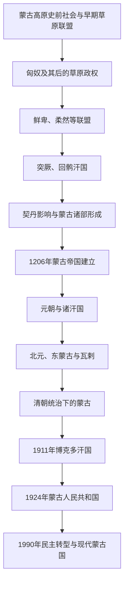

# 蒙古历史

## 范围

本目录以今日蒙古国所在的蒙古高原为核心，兼顾内外蒙古、贝加尔湖以南、戈壁及邻近草原的历史联系。古代蒙古高原曾由多种语言和政治集团活动，不能把所有草原政权直接视为现代蒙古民族国家的前身。

## 历史主线

## 阶段导航

| 顺序 | 阶段 | 时间 | 入口 | 概括 |
|---:|---|---|---|---|
| 1 | 古代蒙古高原与草原诸政权 | 史前—12世纪 | [古代蒙古高原与草原诸政权](/%E4%BA%BA%E6%96%87%E7%A7%91%E5%AD%A6/%E5%8E%86%E5%8F%B2/%E4%B8%9C%E4%BA%9A/%E8%92%99%E5%8F%A4/%E5%8F%A4%E4%BB%A3%E8%92%99%E5%8F%A4%E9%AB%98%E5%8E%9F%E4%B8%8E%E8%8D%89%E5%8E%9F%E8%AF%B8%E6%94%BF%E6%9D%83.md) | 匈奴、鲜卑、柔然、突厥、回鹘、契丹影响及蒙古诸部形成背景。 |
| 2 | 蒙古帝国与诸汗国 | 1206年—14世纪 | [蒙古帝国与诸汗国](/%E4%BA%BA%E6%96%87%E7%A7%91%E5%AD%A6/%E5%8E%86%E5%8F%B2/%E4%B8%9C%E4%BA%9A/%E8%92%99%E5%8F%A4/%E8%92%99%E5%8F%A4%E5%B8%9D%E5%9B%BD%E4%B8%8E%E8%AF%B8%E6%B1%97%E5%9B%BD.md) | 成吉思汗统一诸部、欧亚征服、帝国分封与元朝、诸汗国。 |
| 3 | 北元、蒙古诸部与清代蒙古 | 1368—1911年 | [北元、蒙古诸部与清代蒙古](/%E4%BA%BA%E6%96%87%E7%A7%91%E5%AD%A6/%E5%8E%86%E5%8F%B2/%E4%B8%9C%E4%BA%9A/%E8%92%99%E5%8F%A4/%E5%8C%97%E5%85%83%E3%80%81%E8%92%99%E5%8F%A4%E8%AF%B8%E9%83%A8%E4%B8%8E%E6%B8%85%E4%BB%A3%E8%92%99%E5%8F%A4.md) | 北元、东蒙古与瓦剌竞争、藏传佛教传播和清朝盟旗治理。 |
| 4 | 博克多汗国至现代蒙古 | 1911年至今 | [博克多汗国、蒙古人民共和国与现代蒙古](/%E4%BA%BA%E6%96%87%E7%A7%91%E5%AD%A6/%E5%8E%86%E5%8F%B2/%E4%B8%9C%E4%BA%9A/%E8%92%99%E5%8F%A4/%E5%8D%9A%E5%85%8B%E5%A4%9A%E6%B1%97%E5%9B%BD%E3%80%81%E8%92%99%E5%8F%A4%E4%BA%BA%E6%B0%91%E5%85%B1%E5%92%8C%E5%9B%BD%E4%B8%8E%E7%8E%B0%E4%BB%A3%E8%92%99%E5%8F%A4.md) | 独立运动、革命、社会主义国家、民主转型和现代共和国。 |

## 关键辨析

- “蒙古高原史”涵盖多个时代和群体，不等于从匈奴到现代蒙古国的单一民族连续史。
- 蒙古帝国是跨欧亚的多族群帝国；蒙古国国家史、元朝史和中亚诸汗国史需要互相链接。
- “内蒙古”“外蒙古”的政治含义在明清和近现代逐渐形成，不能直接套用于古代。
- 现代蒙古国的国家形成与清朝解体、俄国和苏联影响、中国政治变化及蒙古本地革命共同相关。

## 相关入口

- [东亚通史](/%E4%BA%BA%E6%96%87%E7%A7%91%E5%AD%A6/%E5%8E%86%E5%8F%B2/%E4%B8%9C%E4%BA%9A/_%E9%80%9A%E5%8F%B2/README.md)
- [中国元朝](/%E4%BA%BA%E6%96%87%E7%A7%91%E5%AD%A6/%E5%8E%86%E5%8F%B2/%E4%B8%9C%E4%BA%9A/%E4%B8%AD%E5%9B%BD/%E5%85%83/README.md)
- [中国民族史中的蒙古线索](/%E4%BA%BA%E6%96%87%E7%A7%91%E5%AD%A6/%E5%8E%86%E5%8F%B2/%E4%B8%9C%E4%BA%9A/%E4%B8%AD%E5%9B%BD/_%E6%B0%91%E6%97%8F/%E8%92%99%E5%8F%A4%E8%AF%AD%E6%97%8F%E4%B8%8E%E4%B8%9C%E8%83%A1/README.md)
- [中亚草原汗国](/%E4%BA%BA%E6%96%87%E7%A7%91%E5%AD%A6/%E5%8E%86%E5%8F%B2/%E4%B8%AD%E4%BA%9A/%E8%8D%89%E5%8E%9F%E6%B1%97%E5%9B%BD/README.md)
