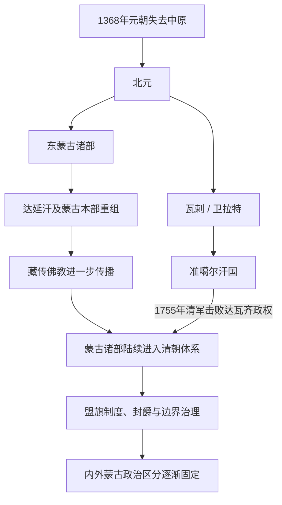

# 北元、蒙古诸部与清代蒙古

## 时间

1368—1911年。

## 概括

元朝失去中原后，蒙古统治集团退回草原，仍以大元皇统和成吉思汗后裔身份维持政治合法性，后世通常把1368—1388年的政权称为“北元”。1388年以后大汗权威显著衰落，东蒙古诸部、瓦剌 / 卫拉特及其他集团反复竞争；“北元”在广义叙述中有时延伸到17世纪，但这不表示期间存在一套连续而有效的中央政府。

15世纪瓦剌在脱欢、也先领导下一度控制大汗并形成草原霸权；达延汗与满都海夫人在15世纪末重组东蒙古。16世纪，察哈尔大汗与土默特、喀尔喀等支系并立，俺答汗、阿巴岱汗等推动藏传佛教传播。17世纪起，漠南蒙古、喀尔喀蒙古和卫拉特各部以不同过程进入清朝政治体系。清廷通过札萨克、盟旗、封爵、理藩院、会盟和边界管理实行差异化统治，而非把所有蒙古地区并为一个省。

## 演变关系

## 北元与东蒙古大汗重要序列

1388—15世纪中叶的汗号、名字、亲属关系和在位年在明朝记录、蒙古编年史与后世重建中存在冲突，部分人物并立或只是强臣拥立的名义大汗。下表列对政治演变有实质作用的主要汗，不把有争议的短期拥立者强行串成绝对连续的单线世系。

| 顺序 | 大汗 | 在位 | 王统 / 与前任关系 | 关键事件与备注 |
|---:|---|---|---|---|
| 1 | **妥懽帖睦尔（乌哈噶图汗、元惠宗）** | 1368—1370年在草原 | 忽必烈系，元朝末帝 | 1368年退出大都，仍以元朝皇帝与蒙古大汗自居；在应昌去世。 |
| 2 | 爱猷识理达腊（必里克图汗、元昭宗） | 1370—1378年 | 妥懽帖睦尔子 | 在漠北维持皇统，联合扩廓帖木儿等抗明；明军1372年北征失利，但北元未能恢复中原。 |
| 3 | 脱古思帖木儿（乌萨哈尔汗） | 1378—1388年 | 传统多视为爱猷识理达腊弟，近年研究认为身份与谱系仍有争议 | 1388年捕鱼儿海之战后势力崩溃，逃亡途中被也速迭儿杀死；狭义北元一般至此结束。 |
| 4 | 也速迭儿（卓里克图汗） | 1388—约1391年 | 多认为出自阿里不哥系 | 夺取汗位，显示忽必烈系垄断中断；实际统治依赖部众和强臣支持。 |
| 5 | 额勒伯克汗 | 约1394—1399年 | 谱系说法不一 | 汗廷与瓦剌首领关系恶化，遇害后权力更分散。 |
| 6 | 坤帖木儿汗 | 约1400—1402年 | 汗统有争议 | 在东蒙古与瓦剌竞争中被杀；此期权臣阿鲁台等逐渐主导汗位。 |
| 7 | 鬼力赤（兀雷帖木儿汗） | 约1402—1408年 | 是否成吉思汗后裔存在争议 | 获阿鲁台支持，与明朝及瓦剌周旋；其汗号合法性长期有争议。 |
| 8 | 本雅失里（完者帖木儿汗） | 1408—1412年 | 多视为忽必烈系宗王 | 由阿鲁台拥立，明成祖多次北征；后败亡于瓦剌势力。 |
| 9 | 阿岱汗 | 1425—1438年 | 常被归入窝阔台系或其他宗支，谱系不确定 | 受阿鲁台支持，与瓦剌所立大汗并争；瓦剌脱欢击败其集团。 |
| 10 | 脱脱不花（岱总汗） | 1433—1452年 | 忽必烈系 | 由脱欢扶立，后试图摆脱也先控制；败亡后也先直接称汗。 |
| 11 | 也先汗 | 1453—1454年 | 瓦剌绰罗斯氏，非成吉思汗后裔 | 1449年以太师身份在土木堡俘明英宗；称汗触犯黄金家族合法性与贵族利益，很快被杀。 |
| 12 | 满都鲁汗 | 1475—1478年 | 忽必烈系 | 在多年分裂后短暂在位；去世后满都海夫人扶立幼年巴图孟克。 |
| 13 | **达延汗（巴图孟克）** | 约1479—1517年；卒年另有1543年等说 | 忽必烈系，满都鲁汗族裔 | 与满都海夫人重整东蒙古六万户，压制异姓权臣；把诸部封给诸子也为后来察哈尔、土默特、喀尔喀等支系并立奠定结构。 |
| 14 | 博迪阿拉克汗 | 1519—1547年 | 达延汗孙 | 继承察哈尔大汗位，但实际权力受到叔祖辈各万户首领制约。 |
| 15 | 达赉逊库登汗 | 1547—1557年 | 博迪阿拉克汗长子 | 面对土默特俺答汗崛起，被迫承认其汗号；大汗不再能独占对外关系。 |
| 16 | 图们札萨克图汗 | 1558—1592年 | 达赉逊子 | 尝试以“札萨克”协调诸万户，并支持佛教传播，统一程度仍有限。 |
| 17 | 布延彻辰汗 | 1592—1603年 | 图们子 | 汗廷维持于察哈尔，诸部与明、后金分别建立关系。 |
| 18 | **林丹呼图克图汗** | 1604—1634年 | 布延孙，察哈尔大汗 | 试图重建大汗权威并控制贸易，促使部分漠南部众转向后金；西迁途中病亡。其子额哲1635年归降后金并交出传国象征，1636年漠南蒙古贵族会盟尊皇太极为博格达汗。 |

## 东蒙古与瓦剌代表领袖

| 人物 | 活跃时期 | 集团与作用 |
|---|---|---|
| 阿鲁台太师 | 15世纪初 | 东蒙古强臣，多次拥立大汗并与明朝、瓦剌交战；说明当时实际军权与汗号可以分离。 |
| **脱欢太师** | 约1418—1439年 | 统一主要瓦剌集团，扶立脱脱不花，为也先霸权奠定基础。 |
| **也先太师 / 汗** | 1439—1454年 | 1449年土木堡之变达到权势顶峰；直接称汗后遭反对，其政权迅速瓦解。 |
| **满都海夫人** | 15世纪后期—16世纪初 | 扶立并辅佐达延汗，联合东蒙古贵族恢复黄金家族权威；其事迹含后世编年史塑造，具体战役年代有差异。 |
| **俺答汗** | 约1542—1582年 | 土默特首领、达延汗孙；与明朝长期战争后于1571年封贡互市，1578年与索南嘉措会见并推动格鲁派传播。 |
| **阿巴岱汗** | 16世纪后期 | 喀尔喀右翼重要领袖，接受藏传佛教并建立额尔德尼召，使寺院网络进入蒙古高原核心区。 |
| **固始汗** | 17世纪前期 | 和硕特卫拉特领袖，进入青海和西藏并于1642年建立和硕特汗权；其政权与准噶尔并非同一世系。 |

## 准噶尔政权统治者完整表

准噶尔源自卫拉特绰罗斯部及其盟友。统治者多用“珲台吉”而非成吉思汗后裔专属汗号；噶尔丹因宗教授号称博硕克图汗。以下把前身首领列为“奠基”，再按公认实际统治顺序列全；阿睦尔撒纳是1755年后的争位者和反清领袖，不是获得各部共同承认的准噶尔汗。

| 顺序 | 统治者 | 称号与统治时间 | 继承关系 | 关键事件 / 备注 |
|---:|---|---|---|---|
| 奠基 | 哈喇忽剌 | 台吉，约1600—1634年 | 绰罗斯部首领 | 重新联合部分卫拉特，抵抗喀尔喀阿拉坦汗；准噶尔国家尚未完全成形。 |
| 1 | **巴图尔珲台吉（额尔德尼巴图尔）** | 珲台吉，1634—1653年 | 哈喇忽剌子 | 在伊犁、准噶尔盆地建立较稳定中心；1640年参加卫拉特—喀尔喀会盟并制定共同法典。 |
| 2 | 僧格 | 珲台吉，1653—1670年 | 巴图尔子 | 与兄弟争位后控制核心部众；遭同父异母兄长车臣台吉、卓特巴巴图尔杀害。 |
| 3 | **噶尔丹博硕克图汗** | 首领自1671年，汗号1678—1697年 | 巴图尔子、僧格弟 | 返俗夺权，兼并和硕特鄂齐尔图汗势力，征服南疆并进攻喀尔喀；1690乌兰布通、1696昭莫多战败，1697年死。 |
| 4 | 策妄阿拉布坦 | 珲台吉，约1694 / 1697—1727年 | 巴图尔家族旁支，噶尔丹侄辈 | 噶尔丹后期即据伊犁自立，1697年后掌握全政权；扩张至中亚，1717年入藏，1720年被清军逐出西藏。 |
| 5 | **噶尔丹策零** | 珲台吉，1727—1745年 | 策妄阿拉布坦长子 | 准噶尔军政与经济再度强盛；1729—1733年与清激战，1731年重创清军，1739年前后达成边界与贸易和解。 |
| 6 | 策妄多尔济那木札勒 | 珲台吉，1745 / 1746—1750年 | 噶尔丹策零次子、指定继承人 | 即位年幼，贵族斗争加剧；被兄长喇嘛达尔札废黜并弄瞎。 |
| 7 | 喇嘛达尔札 | 珲台吉，1750—1753年 | 噶尔丹策零长子 | 以政变夺位，合法性受质疑；达瓦齐与阿睦尔撒纳联合反对，1753年被杀。 |
| 8 | **达瓦齐** | 珲台吉，1753—1755年 | 绰罗斯贵族、巴图尔家族支系 | 与阿睦尔撒纳合作夺权后拒绝分权，迫使后者投清；1755年清军进攻伊犁，达瓦齐被捕，准噶尔中央政权终结。 |
| 争位 | 阿睦尔撒纳 | 辉特部台吉、反清领袖，1755—1757年 | 非绰罗斯统治支系 | 原希望统辖全卫拉特，清廷只拟分封四部后起兵；1757年败走俄境并病死，未形成获共同承认的新汗朝。 |

## 重要事件与清朝纳入过程

| 时间 | 事件 | 过程、结果与长期影响 |
|---|---|---|
| 1388年 | 捕鱼儿海之战 | 明军击溃北元主力，脱古思帖木儿随后被杀；大汗权力与诸部实际军权进一步分离。 |
| 1449年 | 土木堡之变 | 也先率瓦剌军俘获明英宗，但未能据此建立对明的持久控制；称汗后因合法性与分配冲突被杀。 |
| 1470年代末—16世纪初 | 达延汗重组 | 满都海与达延汗打击异姓权臣、重整六万户；重建东蒙古秩序的同时，把权力分给宗室支系。 |
| 1571—1578年 | 封贡互市与佛教联盟 | 俺答汗与明朝达成互市，随后与索南嘉措会见；贸易收益与藏传佛教合法性改变蒙古政治竞争方式。 |
| 1634—1636年 | 林丹汗败亡与漠南纳入后金 | 林丹西迁病亡，额哲归降；漠南多部尊皇太极为汗，后金 / 清把蒙古贵族编入旗与封爵体系。 |
| 1640年 | 卫拉特—喀尔喀法典 | 多部首领试图以共同法典限制内斗、应对外部压力；会议未消除后来准噶尔与喀尔喀的竞争。 |
| 1688—1691年 | 噶尔丹进攻喀尔喀与多伦会盟 | 喀尔喀诸部因内争和准噶尔进攻南迁，1691年在多伦诺尔会盟进入清朝臣属体系。 |
| 1690—1697年 | 清—噶尔丹战争 | 乌兰布通后双方继续角力，1696年昭莫多之战重创噶尔丹；1697年其死使准噶尔退出蒙古高原东部。 |
| 1717—1720年 | 准噶尔占领西藏 | 准噶尔军杀拉藏汗并控制拉萨；清军1720年进藏驱逐准噶尔，清在西藏的政治军事影响加强。 |
| 1729—1739年 | 清—准噶尔再战与议和 | 清远征受补给限制，1731年和通泊等战役损失严重；双方最终划定大致边界并恢复贸易，准噶尔在噶尔丹策零时达到后期鼎盛。 |
| 1755年 | 达瓦齐政权覆亡 | 准噶尔继承内战导致贵族投清；清军分路进入伊犁，达瓦齐被捕。 |
| 1755—1757年 | 阿睦尔撒纳反清与清军再征 | 清廷试图分封卫拉特诸部，阿睦尔撒纳要求统辖全体而反叛；清军反复进剿，1757年其败亡。战争、系统性杀戮、天花与饥荒共同造成准噶尔人口灾难，死亡比例与责任量化在研究中有争议。 |
| 18—19世纪 | 盟旗与边疆秩序定型 | 清朝限制旗间迁徙、划定牧地，并以理藩院、将军和驻防分别治理；内属蒙古与外藩蒙古制度不同，不能视为同一行政区。 |

## 清代统治结构

- **札萨克旗与盟**：世袭札萨克管理本旗户口、牧地和差役，若干旗会盟；盟主要承担监督、司法协调和会盟功能，并非近代意义上的省级政府。
- **中央与边疆机构**：理藩院处理蒙古封爵、朝觐、法令和对外边务；乌里雅苏台将军、科布多参赞大臣等负责不同区域，权力边界随时期调整。
- **差异化身份**：较早归附的漠南蒙古多编为内札萨克，喀尔喀等多属外札萨克；察哈尔等地又有直属旗制。所谓“内蒙古”“外蒙古”由这些制度逐渐凝固，并不等同现代边界。
- **宗教网络**：寺院、活佛系统和僧侣豁免形成跨旗联系，也积累土地与属民；清廷通过册封与驻京制度管理高层宗教领袖。
- **经济与社会**：边境贸易、汉商借贷和局部农垦增加，部分旗债务加重；清廷一方面限制越界，一方面因财政和人口压力逐步放宽部分地区开发。

## 崛起、衰落与转型机制

- 北元早期保有元朝皇统和一批军政资源，但失去中原税源后难以持续压服广阔草原；1388年的军事失败只是皇统权威衰落的直接触发因素。
- 瓦剌和东蒙古霸权都依靠强太师、可汗与属部之间的分配联盟。也先、达延汗和噶尔丹能在短期集中力量，却都面临继承资格或宗室分封造成的离心。
- 明朝的封贡、互市和军事压力使诸部能够绕过大汗单独取得收益；后金 / 清则把通婚、封爵、贸易和军事保护结合，逐部吸纳对手。
- 准噶尔鼎盛依靠伊犁牧业、南疆绿洲税收、跨中亚贸易和较稳定军政中心；长期多线战争、1745年后继承内乱与贵族倒戈削弱其抵抗。
- 1755年达瓦齐被俘是政权灭亡节点，1755—1757年阿睦尔撒纳战争则决定清朝能否重建当地秩序；其后人口灾难和移民重组深刻改变准噶尔盆地。
- 到19世纪末，清朝边疆财政、汉地移民、俄国扩张与蒙古贵族—寺院债务共同冲击旧盟旗秩序，为1911年外蒙古独立运动提供背景。

## 关键辨析

- 狭义“北元”多指1368—1388年；广义用法可覆盖其后蒙古大汗时期。使用时应说明口径。
- 北元、瓦剌、东蒙古和准噶尔之间既有政治继承，也有竞争与分裂，不能画成单线王朝更替。
- 清代蒙古不是一个统一行政省份，而由不同盟旗、将军辖区、直属旗、宗教领地和边疆体系组成。
- 准噶尔统治者主要出自卫拉特绰罗斯氏，不是北元大汗的直系王朝继承者。
- 这一时期的早期汗谱存在史源冲突；表中的约年与争议说明比制造虚假精确更可靠。

## 演变关系说明

本阶段承接[蒙古帝国与诸汗国](/%E4%BA%BA%E6%96%87%E7%A7%91%E5%AD%A6/%E5%8E%86%E5%8F%B2/%E4%B8%9C%E4%BA%9A/%E8%92%99%E5%8F%A4/%E8%92%99%E5%8F%A4%E5%B8%9D%E5%9B%BD%E4%B8%8E%E8%AF%B8%E6%B1%97%E5%9B%BD.md)。清末盟旗秩序、俄国影响与蒙古政治精英的选择，随后进入[博克多汗国、蒙古人民共和国与现代蒙古](/%E4%BA%BA%E6%96%87%E7%A7%91%E5%AD%A6/%E5%8E%86%E5%8F%B2/%E4%B8%9C%E4%BA%9A/%E8%92%99%E5%8F%A4/%E5%8D%9A%E5%85%8B%E5%A4%9A%E6%B1%97%E5%9B%BD%E3%80%81%E8%92%99%E5%8F%A4%E4%BA%BA%E6%B0%91%E5%85%B1%E5%92%8C%E5%9B%BD%E4%B8%8E%E7%8E%B0%E4%BB%A3%E8%92%99%E5%8F%A4.md)。

## 相关入口

- [北元](/%E4%BA%BA%E6%96%87%E7%A7%91%E5%AD%A6/%E5%8E%86%E5%8F%B2/%E4%B8%9C%E4%BA%9A/%E4%B8%AD%E5%9B%BD/%E5%85%83/%E5%8C%97%E5%85%83.md)
- [瓦剌](/%E4%BA%BA%E6%96%87%E7%A7%91%E5%AD%A6/%E5%8E%86%E5%8F%B2/%E4%B8%9C%E4%BA%9A/%E4%B8%AD%E5%9B%BD/%E5%85%83/%E7%93%A6%E5%89%8C.md)
- [清](/%E4%BA%BA%E6%96%87%E7%A7%91%E5%AD%A6/%E5%8E%86%E5%8F%B2/%E4%B8%9C%E4%BA%9A/%E4%B8%AD%E5%9B%BD/%E6%B8%85/README.md)
