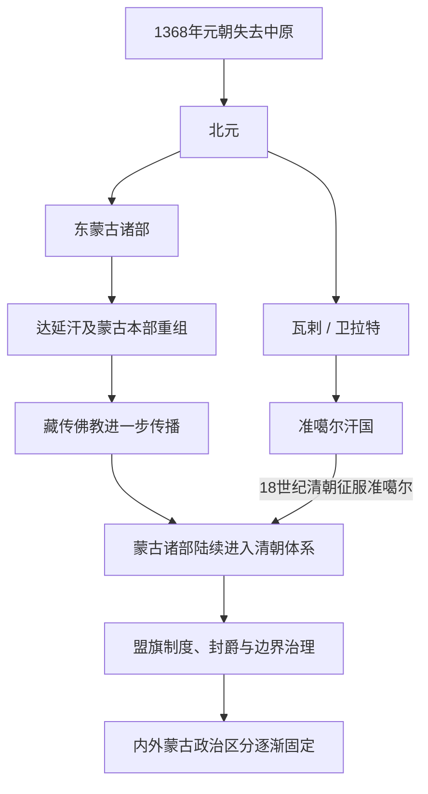

# 北元、蒙古诸部与清代蒙古

## 时间

1368—1911年。

## 概括

元朝失去中原后，蒙古统治集团退回草原，后世常称北元。此后蒙古高原长期存在东蒙古诸部、瓦剌及其他集团竞争；藏传佛教进一步传播。17世纪起，蒙古各部先后进入清朝政治体系，清廷通过盟旗、封爵、会盟和边界管理统治蒙古地区。

## 演变关系

## 说明

- 北元政权延续元朝皇统观念，但对草原各部的实际控制不断变化。
- 瓦剌与东蒙古多次争夺草原霸权；土木堡之变体现瓦剌一度对明朝形成重大军事压力。
- 达延汗及其后裔推动东蒙古诸部重组，蒙古政治进一步形成多个部系。
- 16世纪以后藏传佛教与蒙古政治精英结合，寺院、转世体系和宗教网络影响社会。
- 17世纪起漠南蒙古、喀尔喀蒙古等先后与清朝建立臣属关系，清朝以不同制度管理各部。
- 清朝在18世纪击败准噶尔，重组蒙古高原、西域和中亚东部的政治边界。

## 关键辨析

- 北元、瓦剌、东蒙古和准噶尔之间既有政治继承，也有竞争与分裂，不能画成单线王朝更替。
- 清代蒙古不是一个统一行政省份，而由不同盟旗、将军辖区、宗教领地和边疆体系组成。
- “内蒙古”“外蒙古”在清代逐渐制度化，其范围与现代行政区并不完全相同。
- 蒙古族群、政治集团与国家边界在这一时期持续重组。

## 相关入口

- [北元](/%E4%BA%BA%E6%96%87%E7%A7%91%E5%AD%A6/%E5%8E%86%E5%8F%B2/%E4%B8%9C%E4%BA%9A/%E4%B8%AD%E5%9B%BD/%E5%85%83/%E5%8C%97%E5%85%83.md)
- [瓦剌](/%E4%BA%BA%E6%96%87%E7%A7%91%E5%AD%A6/%E5%8E%86%E5%8F%B2/%E4%B8%9C%E4%BA%9A/%E4%B8%AD%E5%9B%BD/%E5%85%83/%E7%93%A6%E5%89%8C.md)
- [清](/%E4%BA%BA%E6%96%87%E7%A7%91%E5%AD%A6/%E5%8E%86%E5%8F%B2/%E4%B8%9C%E4%BA%9A/%E4%B8%AD%E5%9B%BD/%E6%B8%85/README.md)
