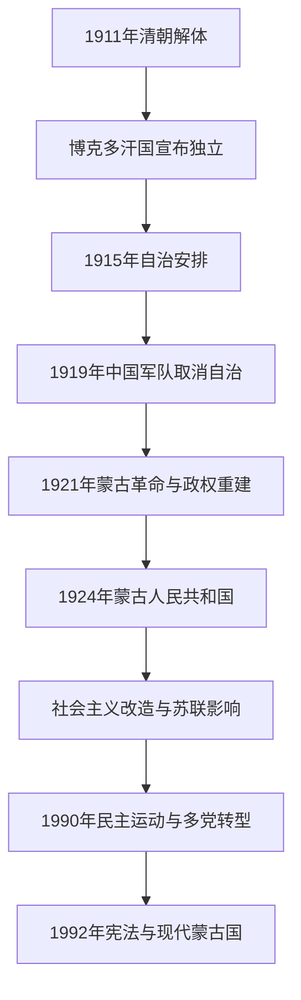

# 博克多汗国、蒙古人民共和国与现代蒙古

## 时间

1911年至今。

## 概括

清朝解体后，外蒙古贵族与宗教领袖宣布独立，建立以第八世哲布尊丹巴为博克多汗的政权。此后蒙古地位受到中国、俄国、苏联和本地政治力量共同影响。1921年革命后蒙古逐步建立社会主义国家，1924年成立蒙古人民共和国；1990年和平政治运动推动多党制和市场转型，1992年宪法确立现代蒙古国体制。

## 演变关系

## 重要阶段

| 阶段 | 时间 | 概括 |
|---|---|---|
| 博克多汗国 | 1911—1924年 | 独立、自治安排、外部干预和革命交错，国家地位尚未完全稳定。 |
| 革命与人民共和国建立 | 1921—1924年 | 蒙古革命力量在苏俄支持下重建政权，君主去世后成立人民共和国。 |
| 社会主义时期 | 1924—1990年 | 建立党国体制，推进世俗化、集体化、教育和工业建设，同时经历政治清洗与强烈苏联影响。 |
| 民主转型 | 1990—1992年 | 群众运动推动一党体制结束，多党选举和宪政改革展开。 |
| 现代蒙古国 | 1992年至今 | 在议会政治、市场经济、矿产开发和中俄两邻之间的外交平衡中发展。 |

## 说明

- 1911年的独立主要发生在外蒙古，内蒙古各地的政治选择和军事形势不同。
- 1915年后形成的自治安排并未解决蒙古主权争议，1919—1921年又经历军事占领和多方力量竞争。
- 社会主义时期推动识字、公共教育、医疗和城市发展，也造成宗教压制、政治清洗和社会断裂。
- 1945年前后蒙古人民共和国的国际地位进一步确定，1946年中华民国政府承认其独立；中华人民共和国成立后与蒙古人民共和国建交。
- 民主转型后，蒙古保持独立国家地位，并通过“第三邻国”外交拓展中俄之外的国际关系。

## 关键辨析

- 现代蒙古国并非蒙古帝国疆域的缩小版，而是在20世纪边界、革命和国际承认过程中形成的民族国家。
- 蒙古人民共和国与苏联关系密切，但本地政治、社会和民族国家建构仍具有自身历史。
- 蒙古国与中国内蒙古具有语言、文化和历史联系，但属于不同现代国家与行政体系。

## 相关入口

- [北元、蒙古诸部与清代蒙古](/%E4%BA%BA%E6%96%87%E7%A7%91%E5%AD%A6/%E5%8E%86%E5%8F%B2/%E4%B8%9C%E4%BA%9A/%E8%92%99%E5%8F%A4/%E5%8C%97%E5%85%83%E3%80%81%E8%92%99%E5%8F%A4%E8%AF%B8%E9%83%A8%E4%B8%8E%E6%B8%85%E4%BB%A3%E8%92%99%E5%8F%A4.md)
- [民国](/%E4%BA%BA%E6%96%87%E7%A7%91%E5%AD%A6/%E5%8E%86%E5%8F%B2/%E4%B8%9C%E4%BA%9A/%E4%B8%AD%E5%9B%BD/%E6%B0%91%E5%9B%BD/README.md)
- [冷战、非殖民化与全球化](/%E4%BA%BA%E6%96%87%E7%A7%91%E5%AD%A6/%E5%8E%86%E5%8F%B2/_%E9%80%9A%E5%8F%B2/%E5%86%B7%E6%88%98%E3%80%81%E9%9D%9E%E6%AE%96%E6%B0%91%E5%8C%96%E4%B8%8E%E5%85%A8%E7%90%83%E5%8C%96.md)
