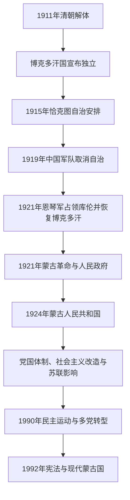

# 博克多汗国、蒙古人民共和国与现代蒙古

## 时间

1911年至今；现任人物核验截止2026年7月。

## 概括

清朝解体后，外蒙古贵族与宗教领袖于1911年宣布独立，拥立第八世哲布尊丹巴呼图克图为博克多汗。新政权试图把宗教权威、王公盟旗和近代政府结合，却受制于财政、军力与国际承认。1915年恰克图协定把外蒙古地位限定为中华民国宗主权下的自治；1919年中国军队取消自治，1921年又先后经历恩琴军控制和蒙古人民党—苏俄力量夺取政权。

博克多汗1924年去世后，蒙古人民共和国成立。社会主义时期建立党国体制，推进世俗教育、公共卫生、城市化、集体化和工业建设，同时经历强制政策、宗教摧毁、政治清洗及对苏联的高度依赖。1990年和平政治运动迫使一党体制让位于多党选举；1992年宪法确立现代蒙古国的议会—总统混合型共和制度。蒙古此后在矿产经济、社会不平等、民主治理以及中俄两邻之间的战略平衡中发展。

## 演变关系

## 博克多汗国的君主与实际权力结构

### 君主

| 顺序 | 君主 | 宗教身份 | 在位 | 政治地位与关键事件 |
|---:|---|---|---|---|
| 1 | **博克多汗** | 第八世哲布尊丹巴呼图克图（1869—1924年） | 1911年12月29日—1919年；1921年2月恢复—1924年5月20日 | 1911年被拥立为兼具宗教与世俗地位的“日光皇帝”；1919年自治被取消后失去实权，1921年先由恩琴军恢复，人民政府成立后保留为受限制君主。其去世直接促成共和制建立。 |

同一人物的两段在位应分别理解：1919—1921年间并没有另一位博克多汗继位，而是君主制被军事占领中断；1921年恢复后，人民政府掌握日常政务。

### 政府与实际控制

| 阶段 | 名义国家元首 | 政府 / 军事权力中心 | 实际结构 |
|---|---|---|---|
| 1911—1915年独立政权 | 博克多汗 | 王公、喇嘛贵族组成的五部衙门与大臣会议 | 博克多汗具有最高象征与任命权，地方仍依盟旗王公治理；财政依赖税赋、借款和俄国援助。 |
| 1915—1919年自治 | 博克多汗 | 外蒙古自治政府；俄、中、蒙三方协议约束外交 | 恰克图协定不承认完全独立，蒙古保留内部自治与军队，但对外主权受限。 |
| 1919—1921年中国军事占领 | 博克多汗被解除政治权力 | 徐树铮部及驻军、中华民国官署 | 1919年强制取消自治；1920年徐树铮势力撤弱后，地方秩序仍由驻军维持。 |
| 1921年2—7月恩琴控制 | 博克多汗恢复 | 罗曼·冯·恩琴—施滕贝格的亚洲骑兵师 | 恩琴驱逐库伦中国驻军并借君主名义统治，暴力和补给困境使政权缺乏稳定基础。 |
| 1921—1924年有限君主制 | 博克多汗 | 蒙古人民政府、蒙古人民党与苏俄 / 苏联顾问 | 人民军和苏俄军击败恩琴；博克多汗保留宗教君主名义，政府掌握军政。1924年君主去世后不再寻找转世继承人。 |

## 独立、革命与国家地位的重要事件

| 时间 | 事件 | 背景、过程与结果 |
|---|---|---|
| 1911年12月 | 宣布独立与拥立博克多汗 | 清朝革命使边疆权力真空扩大；外蒙古王公、宗教上层宣布脱离清朝。独立主要覆盖外蒙古，内蒙古各地选择和军事条件不同。 |
| 1912—1913年 | 扩张尝试与俄蒙协定 | 蒙古军进入科布多并试图联络内蒙古力量；俄国承认自治利益而非充分国际主权，新政府的财政和军备依赖加深。 |
| 1915年 | 恰克图协定 | 俄国、中华民国与蒙古代表妥协，确认中华民国宗主权下的外蒙古自治；三方对“自治”与主权含义仍有不同解释。 |
| 1919年 | 自治被取消 | 中国军队进入库伦，徐树铮迫使蒙古上层接受撤销自治；强制措施激化民族主义与革命组织。 |
| 1921年2—7月 | 恩琴占领与人民革命 | 恩琴军驱逐中国驻军并恢复博克多汗；蒙古人民党武装在苏俄支持下从北方推进，7月进入库伦并建立人民政府。 |
| 1924年11月 | 蒙古人民共和国成立 | 博克多汗5月去世后，制宪会议废除君主制，11月通过宪法并宣布人民共和国。 |
| 1932年 | 反强制政策起义与路线调整 | 过急的财产没收、集体化和反宗教政策引发西部大规模反抗；政府在苏联建议下暂时放缓“左倾”政策。 |
| 1937—1939年 | 大清洗 | 乔巴山政权在苏联安全机构影响下以“反革命”“日本间谍”等罪名逮捕、处决大批僧侣、官员、军人和知识分子，寺院体系遭系统破坏。 |
| 1939年 | 诺门罕 / 哈勒欣河战役 | 日军及满洲国军队与苏蒙军在边界冲突，苏蒙取得决定性胜利；蒙古的苏联军事依赖和东部边界安全格局进一步固定。 |
| 1945—1946年 | 公民投票与承认 | 雅尔塔安排后，蒙古于1945年10月举行独立公投；中华民国政府1946年1月承认外蒙古独立。此后承认问题仍受中国内战与冷战影响。 |
| 1961年 | 加入联合国 | 此前入会多次受大国政治阻碍；加入联合国巩固了蒙古人民共和国的国际法地位和多边外交空间。 |
| 1990年 | 和平民主革命 | 绝食、集会和青年民主组织要求结束一党垄断；党国领导层辞职并接受多党选举，未以大规模武力镇压。 |
| 1992年 | 新宪法生效 | 国名改为“蒙古国”，确立人权、多党政治、私有经济与权力分立框架；总统为国家元首，政府向国家大呼拉尔负责。 |
| 2023—2024年 | 议会与选举制度改革 | 宪法修正把国家大呼拉尔由76席增至126席，并采用多数选区与比例代表混合制度；2024年按新规则举行议会选举。 |

## 蒙古人民共和国正式国家元首

正式国家元首长期是大呼拉尔或其主席团主席，但实际最高权力通常掌握在蒙古人民革命党中央、政府首脑和安全体系。下表按正式任期列全，不能据此单独判断谁是当时最高决策者。

| 顺序 | 正式国家元首 | 职务与任期 | 备注 |
|---:|---|---|---|
| 1 | 纳旺道尔济·扎丹巴（Navaandorjiin Jadambaa） | 国家大呼拉尔主席，1924年11月28—29日 | 过渡性一日任期。 |
| 2 | 佩勒吉德·根登（Peljidiin Genden） | 国家小呼拉尔主席团主席，1924—1927年 | 后任总理；1936年失势，1937年在苏联被处决。 |
| 3 | 姜仓·丹巴道尔济（Jamtsangiin Damdinsüren） | 1927—1929年 | 1930年代清洗中被捕并死于狱中。 |
| 4 | **霍尔洛·乔巴山（Khorloogiin Choibalsan）** | 1929—1930年 | 此时任正式元首；其真正个人统治在1930年代后期形成。 |
| 5 | 洛索勒·拉甘（Losolyn Laagan） | 1930—1932年 | 后在清洗中被捕处决。 |
| 6 | 阿南德·阿玛尔（Anandyn Amar） | 1932—1936年 | 后任总理，1939年被撤职，1941年在苏联被处决。 |
| 7 | 丹斯兰比勒格·道格松（Dansranbilegiin Dogsom） | 1936—1939年 | 清洗期间失势；1939—1940年元首职位一度空缺。 |
| 8 | 冈奇金·布曼增迪（Gonchigiin Bumtsend） | 1940—1953年 | 经1951年机构改制继续任主席团主席，1953年在任去世。 |
| 代 | 苏赫巴托尔·彦吉玛（Sükhbaataryn Yanjmaa） | 代理，1953—1954年 | 苏赫巴托尔遗孀，作为主席团副主席代理国家元首。 |
| 9 | 扎木斯朗·桑布（Jamsrangiin Sambuu） | 1954—1972年 | 1960年后职称随宪制调整，继续担任正式元首。 |
| 代 | 查干拉木·杜格尔苏伦（Tsagaanlamyn Dügersüren） | 代理，1972年5—6月 | 桑布去世后的短期代理。 |
| 代 | 索诺木·鲁布桑（Sonomyn Luvsan） | 代理，1972—1974年 | 泽登巴尔转任正式元首前的代理。 |
| 10 | **尤睦佳·泽登巴尔（Yumjaagiin Tsedenbal）** | 人民大呼拉尔主席团主席，1974—1984年 | 同时为党国实际最高领导人；1984年在苏联压力和健康理由下被解除职务。 |
| 代 | 尼亚木·扎格瓦拉尔（Nyamyn Jagvaral） | 代理，1984年8—12月 | 泽登巴尔下台后的过渡代理。 |
| 11 | **姜巴·巴特蒙赫（Jambyn Batmönkh）** | 主席团主席，1984—1990年3月 | 同时任党总书记；1990年民主运动中同意政治转型。 |
| 12 | 彭萨勒玛·奥其尔巴特（Punsalmaagiin Ochirbat） | 主席团主席，1990年3—9月；蒙古人民共和国总统，1990年9月—1992年2月 | 过渡时期把党和国家职务分离；随后成为现代蒙古国首任总统。 |

## 党国实际最高权力结构

| 阶段 | 主要权力中心 | 说明 |
|---|---|---|
| 1921—1924年 | 蒙古人民党中央、人民政府与苏俄顾问；博克多汗为有限君主 | 革命领导层内部存在博多、丹赞、苏赫巴托尔等不同网络，早期清洗很快改变力量平衡，不宜虚构一位连续“最高领袖”。 |
| 1924—1928年 | 党政集体领导，丹巴道尔济、策伦道尔济等较有影响；共产国际加强介入 | 国家元首、总理和党内负责人分立，政策在民族国家利益、宗教社会和苏联要求之间摇摆。 |
| 1928—1932年 | 受共产国际支持的“左倾”集体领导 | 强制集体化、没收与反宗教政策导致经济混乱和1932年起义；没有一位像后来乔巴山那样垄断权力的人物。 |
| 1932—1936年 | **根登**任总理并处于核心，苏联领导层和顾问具有决定性外部影响 | 政策一度放缓；根登与斯大林在清洗和苏军驻扎等问题上冲突，后被撤职。 |
| 1936—1939年 | 阿玛尔政府名义执政，**乔巴山**控制内务与军事并在苏联支持下上升 | 大清洗摧毁旧干部、军官和寺院网络，实际权力快速集中。 |
| 1939—1952年 | **乔巴山** | 兼任政府和军事核心，建立个人崇拜；推动战时动员、城市建设和独立地位巩固，同时对政治清洗负主要国内领导责任。 |
| 1952—1984年 | **泽登巴尔** | 先任总理、长期控制党总书记职位，1974年转任国家元首；推进工业化、教育和经互会一体化，对苏联高度依赖并压制异议。 |
| 1984—1990年 | **巴特蒙赫** | 兼具党总书记和国家元首地位，受苏联改革影响推行有限更新；1990年拒绝大规模武力镇压并接受多党化。 |
| 1990年以后 | 宪法机构与竞争性政党 | 不再存在制度化“最高领导人”；总统、国家大呼拉尔、总理和法院分别承担权力，实际影响随选举、党派和联合政府变化。 |

## 现代蒙古国历任总统

| 顺序 | 总统 | 任期 | 党派背景 / 关键说明 |
|---:|---|---|---|
| 1 | **彭萨勒玛·奥其尔巴特（Punsalmaagiin Ochirbat）** | 1992年2月12日—1997年6月20日；此前自1990年任过渡总统 | 首位总统，1993年赢得首次全民总统选举；任内推进市场与法制转型。 |
| 2 | 那楚克·巴嘎班迪（Natsagiin Bagabandi） | 1997年6月20日—2005年6月24日 | 蒙古人民革命党，两届；在议会—总统共存与政党轮替中任职。 |
| 3 | 那木巴尔·恩赫巴亚尔（Nambaryn Enkhbayar） | 2005年6月24日—2009年6月18日 | 蒙古人民革命党；此前任总理和议长。 |
| 4 | 查希亚·额勒贝格道尔吉（Tsakhiagiin Elbegdorj） | 2009年6月18日—2017年7月10日 | 民主党，两届；强调司法、对外开放和废除死刑等议题。 |
| 5 | 哈勒特马·巴特图勒嘎（Khaltmaagiin Battulga） | 2017年7月10日—2021年6月25日 | 民主党；任期跨越修宪与疫情初期，未在新规则下连任。 |
| 6 | **乌赫那·呼日勒苏赫（Ukhnaagiin Khürelsükh）** | 2021年6月25日至今 | 蒙古人民党；此前任总理。按现行单一六年任期制度履职，截至2026年7月为现任总统。 |

## 现代统治结构

- **总统**是国家元首、国家团结象征和武装力量统帅，具有否决、提名及国家安全等宪法权限，但不是日常政府首脑。
- **国家大呼拉尔**是最高立法机关；2024年起有126席，并以混合选举制度产生。
- **总理与内阁**负责日常行政并向议会承担政治责任。分析现代政治时应把总统、总理、议长和党魁分开，不能把所有重要人物混入“统治者世系”。
- **宪法法院与普通法院**承担违宪审查和司法职能；制度运行仍受政党竞争、反腐争议和利益集团影响。
- 经济高度依赖铜、煤、黄金等矿产出口，繁荣期财政扩张与价格下跌时的债务风险交替出现；牧业仍受严寒雪灾和气候变化冲击。
- 外交以中俄关系为现实基础，并通过联合国、维和行动及“第三邻国”政策拓展与美、日、韩、欧、印等伙伴关系。

## 建立、维系与转型机制

### 博克多汗国为何未能稳定

- **结构因素**：盟旗与寺院权力分散，现代税收、常备军和外交机构薄弱；政府难以仅凭宗教合法性整合全部蒙古人地区。
- **外部压力**：俄国希望保有缓冲区和经济特权，却避免与中国全面冲突；中华民国坚持主权，俄国革命又打破原有保护关系。
- **直接触发**：1919年军事占领取消自治，恩琴军随后造成新的权力真空；1921年革命把国家权力转入人民党政府。

### 人民共和国为何维持并终结

- 苏联的安全保护、财政技术援助和党国组织帮助蒙古在强邻之间维持独立，并推动教育、医疗、工业与城市基础设施。
- 高度集中的政治体系可以快速动员，也造成清洗、宗教文化破坏、政策失误和对苏联经济的路径依赖。
- 1980年代苏联改革与援助前景变化削弱旧体制，城市青年、知识界和新组织要求公开化与选举。
- 1990年抗议是直接触发因素；巴特蒙赫领导层选择谈判和辞职，使转型没有演变为大规模流血冲突。

### 民主制度的延续条件与压力

- 竞争性选举、和平政党轮替、活跃媒体和对外开放构成制度韧性。
- 矿业收益分配、腐败、贫富差距、乌兰巴托过度集中和草原生态危机持续考验公共信任。
- 位于俄罗斯与中国之间要求务实平衡；“第三邻国”并非取代两邻，而是降低单一依赖的外交补充。

## 关键辨析

- 1911年的独立主要发生在外蒙古，内蒙古各地的政治选择和军事形势不同。
- 1915年自治、1919年占领、1921年革命和1945—1946年承认是不同层次的国家形成节点，不能只选一个日期概括全部独立过程。
- 蒙古人民共和国与苏联关系密切，但本地政治、社会和民族国家建构仍具有自身历史；称为“苏联加盟共和国”是不准确的。
- 正式国家元首不总是实际最高领导人，尤其1930—1980年代必须同时查看党总书记、总理、安全机构和苏联影响。
- 现代蒙古国并非蒙古帝国疆域的缩小版，而是在20世纪边界、革命和国际承认过程中形成的民族国家。
- 蒙古国与中国内蒙古具有语言、文化和历史联系，但属于不同现代国家与行政体系。

## 演变关系说明

本阶段承接[北元、蒙古诸部与清代蒙古](/%E4%BA%BA%E6%96%87%E7%A7%91%E5%AD%A6/%E5%8E%86%E5%8F%B2/%E4%B8%9C%E4%BA%9A/%E8%92%99%E5%8F%A4/%E5%8C%97%E5%85%83%E3%80%81%E8%92%99%E5%8F%A4%E8%AF%B8%E9%83%A8%E4%B8%8E%E6%B8%85%E4%BB%A3%E8%92%99%E5%8F%A4.md)的清末盟旗与边疆危机。1911—1992年的独立、革命、社会主义与民主转型不是四个互不相干的国家，而是同一地区国家建构和国际地位逐步变化的连续过程。

## 相关入口

- [北元、蒙古诸部与清代蒙古](/%E4%BA%BA%E6%96%87%E7%A7%91%E5%AD%A6/%E5%8E%86%E5%8F%B2/%E4%B8%9C%E4%BA%9A/%E8%92%99%E5%8F%A4/%E5%8C%97%E5%85%83%E3%80%81%E8%92%99%E5%8F%A4%E8%AF%B8%E9%83%A8%E4%B8%8E%E6%B8%85%E4%BB%A3%E8%92%99%E5%8F%A4.md)
- [民国](/%E4%BA%BA%E6%96%87%E7%A7%91%E5%AD%A6/%E5%8E%86%E5%8F%B2/%E4%B8%9C%E4%BA%9A/%E4%B8%AD%E5%9B%BD/%E6%B0%91%E5%9B%BD/README.md)
- [冷战、非殖民化与全球化](/%E4%BA%BA%E6%96%87%E7%A7%91%E5%AD%A6/%E5%8E%86%E5%8F%B2/_%E9%80%9A%E5%8F%B2/%E5%86%B7%E6%88%98%E3%80%81%E9%9D%9E%E6%AE%96%E6%B0%91%E5%8C%96%E4%B8%8E%E5%85%A8%E7%90%83%E5%8C%96.md)
