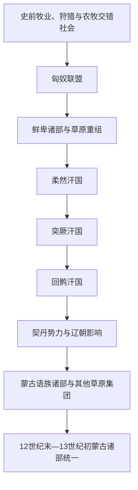

# 古代蒙古高原与草原诸政权

## 时间

史前时期—12世纪。

## 概括

蒙古高原是欧亚草原东部的重要政治与交通空间。这里先后出现或受匈奴、鲜卑、柔然、突厥、回鹘、契丹等集团影响，政治联盟不断分化、迁徙和重组。它们为后来的草原军事组织、远距离交通和复合统治传统提供背景，但彼此不是一条连续王朝世系，更不能直接等同于现代蒙古民族国家的历代政权。

高原政权通常依靠可机动的牧业人口、贵族—部落联盟、战利品和跨境贸易维系统治，同时需要控制森林草原、河谷、绿洲或农耕地区。气候与牧场压力会放大危机，却很少单独造成兴亡；联盟继承、外部战争、贸易通道和属部离心往往共同决定政权能否延续。

## 演变关系

图示表达的是政治空间和组织经验的先后重组，不表示匈奴、鲜卑、柔然、突厥、回鹘、契丹与蒙古之间存在单一血缘或王统继承。

## 主要政权与代表统治者

| 政权或集团 | 主要活动时间 | 代表统治者 / 首领 | 统治特点与转折 |
|---|---|---|---|
| 匈奴联盟 | 约公元前3世纪末—公元1世纪 | 头曼单于、**冒顿单于**、老上单于、呼韩邪单于、郅支单于 | 冒顿整合草原诸部并建立单于庭与左右部体系；与汉朝在战争、和亲、互市之间转换。公元前1世纪内争和汉朝压力促成分裂，公元48年南北匈奴分立。 |
| 鲜卑诸部 | 1—3世纪 | **檀石槐**、轲比能 | 匈奴势力衰退后，多支鲜卑进入高原与中国北方。檀石槐一度建立跨区域联盟，死后因继承和部落自主性迅速松散；若干集团后来南迁并建立北方政权。 |
| 柔然汗国 | 4世纪后期—552 / 555年 | **社崙可汗**、阿那瓌可汗 | 社崙约在402年称可汗并重组军政联盟；柔然以漠北为中心控制属部和商道。突厥首领阿史那土门起兵，552年击败柔然，残余势力数年后消散或迁徙。 |
| 第一、第二突厥汗国 | 552—630年、682—744年 | **土门可汗**、木杆可汗、沙钵略可汗、颉利可汗；骨咄禄可汗、默啜可汗、毗伽可汗 | 阿史那氏依靠冶铁、骑兵与跨草原联盟崛起，迅速扩张并分为东西两部。内争、隋唐外交和战争削弱第一汗国；第二汗国由骨咄禄复兴，后因继承冲突和回鹘、葛逻禄、拔悉密联合反叛而亡。 |
| 回鹘汗国 | 744—840年 | **骨力裴罗**、磨延啜、牟羽可汗 | 联合诸部推翻后突厥，以鄂尔浑河流域为中心，参与唐朝平定安史之乱并从马绢贸易获利。牟羽可汗时期摩尼教进入宫廷；840年前后内乱、灾害及黠戛斯进攻促使汗国崩溃，部分回鹘迁往河西和天山绿洲。 |
| 契丹与辽朝的草原体系 | 10世纪初—1125年 | **耶律阿保机**、辽太宗、辽圣宗 | 阿保机统一契丹诸部，辽朝以北、南面官等制度分别处理草原与农耕地区。辽控制蒙古高原东南部并影响克烈、蒙古等集团；1125年辽亡于金，耶律大石西迁建立西辽。 |
| 12世纪高原诸部 | 约11世纪末—1206年 | 合不勒汗、俺巴孩汗、忽图剌汗；克烈部脱斡邻勒、乃蛮太阳汗、札答兰札木合、蒙古部铁木真 | 蒙古、克烈、乃蛮、塔塔儿、蔑儿乞等集团通过婚姻、安答、臣属和战争不断改组。铁木真的胜出是长期联盟竞争的结果，并非早期政权自然演化的必然终点。 |

这里的表格只列各政治体系的代表人物，不构成一张连续君主表。尤其鲜卑、12世纪诸部和部分突厥时期存在多个并立中心，强行合并为“蒙古高原历代君主世系”会制造不存在的统一王权。

## 重要事件

| 时间 | 事件 | 过程、结果与影响 |
|---|---|---|
| 约公元前209年 | 冒顿夺取单于位 | 冒顿清除反对者、整编骑兵并征服或迫使邻近集团臣属，匈奴成为东部草原首个有清晰文献记录的大型联盟。 |
| 公元前200年 | 白登之围 | 匈奴围困汉高祖军队，随后汉匈转向和亲与边境博弈；它显示草原与农耕国家之间既竞争也相互依赖。 |
| 公元前60—50年代 | 匈奴内部分裂 | 多位单于争立，呼韩邪依汉、郅支西走；联盟继承危机与汉朝军事外交压力相互叠加。 |
| 约156—181年 | 檀石槐联盟 | 檀石槐整合鲜卑诸部并对汉边郡施压；其死后缺少稳定继承制度，联盟重新分散。 |
| 402年 | 社崙称可汗 | 柔然采用可汗称号并强化军政组织，“可汗—汗国”的政治称谓由此在内亚进一步传播。 |
| 552年 | 突厥反柔然 | 阿史那土门击败柔然并称可汗；木杆等继承者继续扩张，突厥势力横跨内亚。 |
| 630年与682年 | 东突厥覆亡与复兴 | 唐军击败颉利可汗后，部分突厥集团处于唐朝羁縻体系；骨咄禄后来重建第二突厥汗国。 |
| 744年 | 回鹘取代第二突厥 | 回鹘联合葛逻禄、拔悉密击败阿史那王统，建立新的鄂尔浑草原中心。 |
| 840年前后 | 回鹘汗国崩溃 | 宫廷内争、严寒和牧业危机削弱汗国，黠戛斯进攻成为直接触发因素；迁徙把回鹘政治与文化传统带入河西、吐鲁番等地。 |
| 907—1125年 | 辽朝建立与灭亡 | 契丹把草原联盟和多区域官僚统治结合；辽亡后，高原权力出现重新竞争，部分契丹势力西迁。 |
| 12世纪末 | 高原联盟重组 | 铁木真先后与札木合、克烈、塔塔儿、乃蛮等合作或交战，吸收败部人口，为1206年建立蒙古帝国准备组织基础。 |

## 崛起、维系与衰落机制

- **崛起机制**：能够把亲族、属部和降众重新编入军政单位的首领，往往比只依靠血缘威望者更有扩张能力；对马匹、铁器、牧场和商路的控制同样关键。
- **维系统治**：大型联盟需要持续分配战利品、贸易收益和封地，并以婚姻、质子、宗教或可汗合法性约束贵族。对农耕城市和绿洲征税，使草原政权获得仅靠畜牧业无法提供的财政资源。
- **结构性弱点**：汗位继承缺少固定长子制，宗族成员都可能主张权利；中心一旦不能分配资源，属部容易转向竞争者。
- **外部压力**：中原王朝的征讨、互市开闭、羁縻和离间会改变联盟力量，西部草原集团的迁徙与战争也会传导至蒙古高原。
- **直接触发因素**：首领猝死、继承战争、关键属部倒戈或连续军事失败，通常把长期积累的财政、生态与政治压力转化为政权崩解。
- **后续影响**：失败者并非全部消失，而常以迁徙、改名、重新结盟或进入新政权的方式延续，因此“一个民族灭亡、另一个民族取代”的直线叙述并不准确。

## 关键辨析

- 古代政权名称可能来自外部文献、自称或政治联盟，不能直接等同于固定现代民族。
- 语言、政治从属和血缘认同会随迁徙与联盟改变。
- “草原帝国”通常同时控制城市、绿洲和农耕人口，不是纯粹游牧社会。
- 古代年代和首领谱系常由后世史书、碑铭与考古材料拼合；存在分歧处应保留“约”“可能”或多种解释。

## 演变关系说明

前一阶段是[蒙古历史](/%E4%BA%BA%E6%96%87%E7%A7%91%E5%AD%A6/%E5%8E%86%E5%8F%B2/%E4%B8%9C%E4%BA%9A/%E8%92%99%E5%8F%A4/README.md)的早期背景；12世纪诸部竞争随后进入[蒙古帝国与诸汗国](/%E4%BA%BA%E6%96%87%E7%A7%91%E5%AD%A6/%E5%8E%86%E5%8F%B2/%E4%B8%9C%E4%BA%9A/%E8%92%99%E5%8F%A4/%E8%92%99%E5%8F%A4%E5%B8%9D%E5%9B%BD%E4%B8%8E%E8%AF%B8%E6%B1%97%E5%9B%BD.md)。这是一种政治整合的阶段转折，不表示铁木真继承了某个从匈奴延续下来的统一王位。

## 相关入口

- [农耕、草原与边疆互动](/%E4%BA%BA%E6%96%87%E7%A7%91%E5%AD%A6/%E5%8E%86%E5%8F%B2/%E4%B8%9C%E4%BA%9A/_%E9%80%9A%E5%8F%B2/%E5%86%9C%E8%80%95%E3%80%81%E8%8D%89%E5%8E%9F%E4%B8%8E%E8%BE%B9%E7%96%86%E4%BA%92%E5%8A%A8.md)
- [蒙古语族与东胡](/%E4%BA%BA%E6%96%87%E7%A7%91%E5%AD%A6/%E5%8E%86%E5%8F%B2/%E4%B8%9C%E4%BA%9A/%E4%B8%AD%E5%9B%BD/_%E6%B0%91%E6%97%8F/%E8%92%99%E5%8F%A4%E8%AF%AD%E6%97%8F%E4%B8%8E%E4%B8%9C%E8%83%A1/README.md)
- [中亚草原汗国](/%E4%BA%BA%E6%96%87%E7%A7%91%E5%AD%A6/%E5%8E%86%E5%8F%B2/%E4%B8%AD%E4%BA%9A/%E8%8D%89%E5%8E%9F%E6%B1%97%E5%9B%BD/README.md)
