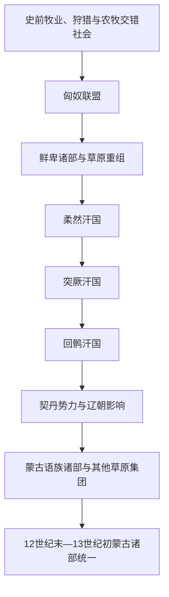

# 古代蒙古高原与草原诸政权

## 时间

史前时期—12世纪。

## 概括

蒙古高原是欧亚草原东部的重要政治与交通空间。这里先后出现或受匈奴、鲜卑、柔然、突厥、回鹘、契丹等集团影响，政治联盟不断分化、迁徙和重组。它们为后来的草原军事、交通和统治传统提供背景，但彼此并非简单的民族直系继承。

## 演变关系

## 说明

- 匈奴建立跨草原联盟，与汉朝之间既有战争，也有和亲、互市和人口流动。
- 鲜卑诸部在匈奴之后进入蒙古高原和中国北方政治，部分集团建立北方政权。
- 柔然、突厥和回鹘汗国依靠部落联盟、军事组织、商路和对农耕地区的交换关系维持统治。
- 契丹建立辽朝后，同时统治草原、东北和部分农耕地区，并影响后来的蒙古诸部格局。
- 12世纪的蒙古高原存在蒙古、克烈、乃蛮、塔塔儿、蔑儿乞等多个集团，统一并非预先注定。

## 关键辨析

- 古代政权名称可能来自外部文献、自称或政治联盟，不能直接等同于固定现代民族。
- 语言、政治从属和血缘认同会随迁徙与联盟改变。
- “草原帝国”通常同时控制城市、绿洲和农耕人口，不是纯粹游牧社会。

## 相关入口

- [农耕、草原与边疆互动](/%E4%BA%BA%E6%96%87%E7%A7%91%E5%AD%A6/%E5%8E%86%E5%8F%B2/%E4%B8%9C%E4%BA%9A/_%E9%80%9A%E5%8F%B2/%E5%86%9C%E8%80%95%E3%80%81%E8%8D%89%E5%8E%9F%E4%B8%8E%E8%BE%B9%E7%96%86%E4%BA%92%E5%8A%A8.md)
- [蒙古语族与东胡](/%E4%BA%BA%E6%96%87%E7%A7%91%E5%AD%A6/%E5%8E%86%E5%8F%B2/%E4%B8%9C%E4%BA%9A/%E4%B8%AD%E5%9B%BD/_%E6%B0%91%E6%97%8F/%E8%92%99%E5%8F%A4%E8%AF%AD%E6%97%8F%E4%B8%8E%E4%B8%9C%E8%83%A1/README.md)
- [中亚草原汗国](/%E4%BA%BA%E6%96%87%E7%A7%91%E5%AD%A6/%E5%8E%86%E5%8F%B2/%E4%B8%AD%E4%BA%9A/%E8%8D%89%E5%8E%9F%E6%B1%97%E5%9B%BD/README.md)
