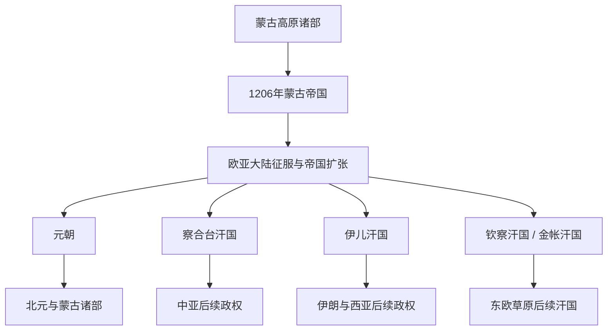

# 蒙古帝国与诸汗国

## 时间

1206年—14世纪；部分汗国延续更久。

## 概括

1206年铁木真被推举为成吉思汗后，蒙古诸部被整合为新的军事政治共同体。蒙古帝国通过征服、分封、驿站、税收和跨区域人员流动建立横跨欧亚的帝国体系，随后分化为元朝及多个汗国。

## 演变关系

## 统治结构

- 成吉思汗及其继承者通过千户制、怯薛、分封和宗王体系整合军政力量。
- 帝国设置驿站和道路保护，促进使节、商人、工匠、学者和宗教人士跨区移动。
- 征服伴随屠城、人口损失、强制迁徙和资源征发，也带来行政技术和知识的广域流动。
- 各汗国共享成吉思汗家族合法性，却因地域、继承和利益逐渐形成独立政治中心。
- 元朝以中国和蒙古高原为核心之一，同时维持帝国宗王、草原和汉地多套制度。

## 关键辨析

- 蒙古帝国不是统一管理始终不变的中央集权国家，其内部从早期即存在分封与宗王权力。
- “蒙古和平”概括部分时期跨区域交通改善，不能掩盖征服暴力、战争和地区差异。
- 元朝属于蒙古帝国遗产，也属于中国王朝史；两种视角需要并置。
- 四大汗国是便于理解的概括，实际边界、名称和相互关系不断变化。

## 相关入口

- [元](/%E4%BA%BA%E6%96%87%E7%A7%91%E5%AD%A6/%E5%8E%86%E5%8F%B2/%E4%B8%9C%E4%BA%9A/%E4%B8%AD%E5%9B%BD/%E5%85%83/README.md)
- [蒙古帝国](/%E4%BA%BA%E6%96%87%E7%A7%91%E5%AD%A6/%E5%8E%86%E5%8F%B2/%E4%B8%9C%E4%BA%9A/%E4%B8%AD%E5%9B%BD/%E5%85%83/%E8%92%99%E5%8F%A4%E5%B8%9D%E5%9B%BD.md)
- [四大汗国](/%E4%BA%BA%E6%96%87%E7%A7%91%E5%AD%A6/%E5%8E%86%E5%8F%B2/%E4%B8%9C%E4%BA%9A/%E4%B8%AD%E5%9B%BD/%E5%85%83/%E5%9B%9B%E5%A4%A7%E6%B1%97%E5%9B%BD.md)
- [中亚历史](/%E4%BA%BA%E6%96%87%E7%A7%91%E5%AD%A6/%E5%8E%86%E5%8F%B2/%E4%B8%AD%E4%BA%9A/README.md)
- [伊朗历史](/%E4%BA%BA%E6%96%87%E7%A7%91%E5%AD%A6/%E5%8E%86%E5%8F%B2/%E8%A5%BF%E4%BA%9A/%E4%BC%8A%E6%9C%97/README.md)
- [东斯拉夫历史](/%E4%BA%BA%E6%96%87%E7%A7%91%E5%AD%A6/%E5%8E%86%E5%8F%B2/%E6%AC%A7%E6%B4%B2/%E6%96%AF%E6%8B%89%E5%A4%AB/%E4%B8%9C%E6%96%AF%E6%8B%89%E5%A4%AB/README.md)
