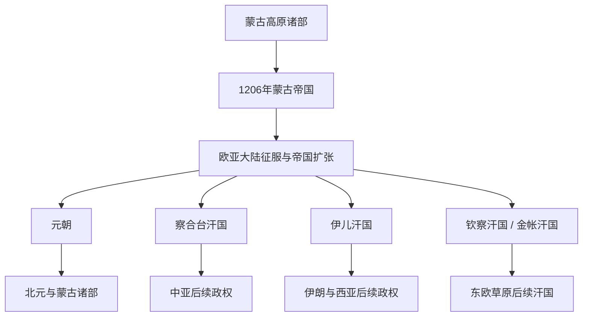

# 蒙古帝国与诸汗国

## 时间

1206年—14世纪；部分汗国及其后继政权延续更久。

## 概括

1206年铁木真被推举为成吉思汗后，蒙古诸部被整合为新的军事政治共同体。成吉思汗及前三代继承者通过征服、分封、驿站、税收和跨区域人员调动建立横跨欧亚的帝国体系。帝国并非从一开始就是单一官僚国家：成吉思汗诸子各有兀鲁思和军队，大汗权威必须在宗王大会、家族资格与军事控制之间反复确认。

1259年蒙哥汗去世后，忽必烈与阿里不哥争位；与此同时，术赤系、察合台系、旭烈兀系和窝阔台系宗王围绕领地与利益形成独立中心。1264年阿里不哥投降没有恢复统一，忽必烈的大汗权威在元朝控制区之外日益名义化。元朝、钦察汗国、察合台汗国和伊儿汗国是帝国分化后最重要的政治中心，但“四大汗国”是后世便于理解的概括，并非某次会议一次性划定的四个固定国家。

## 演变关系

## 建立背景与崛起机制

- **高原统一**：铁木真把归附者按十户、百户、千户重新编组，削弱部分旧部落首领对人口的专属控制，并以怯薛构成统帅集团和行政核心。
- **吸收而非单纯排斥**：战败集团的士兵、工匠、书吏和贵族可被重新分配；蒙古军因此不断吸收突厥、契丹、汉地、中亚和波斯的攻城、财政与文书人才。
- **宗王分封**：成吉思汗把不同地区和人口分给诸子、诸弟与功臣。分封有利于迅速动员，却也使帝国扩张成果从一开始就由多个家族权力中心共同占有。
- **交通与情报**：驿站、使臣保护、军需点和多语文书使远距离命令与贸易能够运行；征服暴力、人口迁移和资源征发则是这一体系的另一面。
- **合法性**：成吉思汗家族身份成为大汗和汗国君主的核心资格。非黄金家族的强人通常需要拥立成吉思汗后裔或借其名义执政。

## 大汗与监国完整表

| 顺序 | 统治者 / 监国 | 身份与在位 | 与前任关系 | 继承过程与关键事件 |
|---:|---|---|---|---|
| 1 | **成吉思汗（铁木真）** | 大汗，1206—1227年 | 建国者 | 1206年忽里勒台确认大汗地位；统一高原后征西夏、金与花剌子模。1227年征西夏期间去世。 |
| 监国 | 拖雷 | 监国，1227—1229年 | 成吉思汗幼子 | 按家族惯例暂摄国政，等待宗王集会；支持兄长窝阔台继位。 |
| 2 | **窝阔台汗** | 大汗，1229—1241年 | 成吉思汗第三子 | 经忽里勒台推举；完善中书行政、税制和驿站，完成灭金并发动西征。1241年去世后继承再陷停顿。 |
| 监国 | 脱列哥那皇后 | 监国，1241—1246年 | 窝阔台正妻 | 排除部分旧臣并为儿子贵由争取支持；拔都与贵由的敌对使忽里勒台久未召开。 |
| 3 | 贵由汗 | 大汗，1246—1248年 | 窝阔台长子 | 在部分宗王缺席或勉强参与的大会上当选；试图整顿监国时期任命，向西行军途中去世。 |
| 监国 | 海迷失皇后 | 监国，1248—1251年 | 贵由正妻 | 试图维持窝阔台系继承；拔都与拖雷系宗王另行组织大会，监国集团随后被清算。 |
| 4 | **蒙哥汗** | 大汗，1251—1259年 | 拖雷长子、贵由堂弟 | 在拔都支持下当选，窝阔台、察合台部分宗王质疑程序；其统治强化人口与税收清查，并令旭烈兀西征、忽必烈经营中国。 |
| 争位者 | **忽必烈** | 自称大汗，1260—1294年；1271年建国号元 | 蒙哥弟 | 1260年在开平召集忽里勒台即位；1264年击败阿里不哥。此后仍主张全帝国大汗权威，但主要直接统治元朝及其附属范围。 |
| 争位者 | 阿里不哥 | 大汗竞争者，1260—1264年 | 蒙哥幼弟、忽必烈弟 | 在和林获另一批宗王拥立，控制蒙古本土；因补给受阻、盟友转向而向忽必烈投降。其支持者不应从继承表中省略。 |

> 1260—1264年不是两个稳定王朝的简单并立，而是拖雷家族内战。阿里不哥投降后，海都等宗王仍长期反对忽必烈；因此“忽必烈统一继承蒙古帝国”只在元朝官方名义上成立，不能理解为恢复了成吉思汗时期的实际统一。

## 重要事件与扩张阶段

| 时间 | 事件 | 过程与影响 |
|---|---|---|
| 1206年 | 蒙古帝国建立 | 铁木真在忽里勒台获成吉思汗号，千户体系和怯薛把诸部重组为跨部落军政共同体。 |
| 1209—1227年 | 西夏战争 | 西夏一度臣服，后在蒙古西征期间关系破裂；1227年蒙古军灭西夏，成吉思汗亦在战役期间去世。 |
| 1211—1234年 | 征金 | 蒙古军突破边墙、攻取中都；窝阔台时期与南宋夹攻，1234年金亡。蒙古由草原联盟转为统治广大农耕人口的帝国。 |
| 1218—1221年 | 征西辽与花剌子模 | 哲别击败西辽统治者屈出律；商队事件和外交破裂后，蒙古军多路进攻花剌子模，造成中亚城市毁坏、人口损失与大规模迁徙。 |
| 1236—1242年 | 术赤系西征 | 拔都、速不台等征服伏尔加草原与罗斯诸公国，进军波兰和匈牙利；窝阔台去世后主力东返，术赤兀鲁思成为东欧草原长期权力中心。 |
| 1251年 | 蒙哥继位 | 汗位由窝阔台系转入拖雷系，反对宗王遭清洗；这次权力重组加深各家族之间的不信任。 |
| 1256—1258年 | 旭烈兀西征与巴格达陷落 | 旭烈兀建立西亚军事中心，1258年攻陷巴格达并终结阿拔斯王朝在当地的统治；其后形成伊儿汗国。 |
| 1259年 | 蒙哥死于攻宋战场 | 大汗去世使多线征服停顿，也切断了帝国最高权力的共同确认。 |
| 1260—1264年 | 忽必烈—阿里不哥战争 | 两个忽里勒台分别拥立大汗；术赤系与旭烈兀系也爆发战争，帝国政治从可协调的分封体系转为多个主权中心。 |
| 1271—1279年 | 元朝定名与灭南宋 | 忽必烈采用“大元”国号，1279年完成对南宋的征服；元的中国王朝建构与其他汗国独立化同步发生。 |

## 分封体系与主要后继政权

| 政治中心 | 形成过程 | 统治空间与继承关系 | 与大汗 / 元朝的关系 |
|---|---|---|---|
| 钦察汗国 / 金帐汗国 | 源自术赤兀鲁思，拔都西征后形成稳定中心 | 伏尔加河、钦察草原、罗斯诸公国宗主体系；拔都之后由术赤后裔诸支统治 | 早期参与大汗继承，别儿哥与旭烈兀开战后独立性增强；与元仍保持使节和宗族联系。 |
| 察合台汗国 | 源自察合台及其后裔的中亚封地 | 河中、七河和天山南北，后逐渐分裂为东西政治中心 | 曾受大汗任免与监护，后在海都势力、伊斯兰化和区域贵族作用下自主发展。 |
| 伊儿汗国 | 蒙哥命旭烈兀西征后约于1256年形成 | 伊朗、伊拉克与邻近西亚地区，由拖雷系旭烈兀后裔统治 | 与钦察汗国竞争，通常承认忽必烈一系名义优先；合赞汗时期伊斯兰化和财政改革深化地方国家形态。 |
| 元朝 | 忽必烈在争位中控制漠南、华北和汉地资源，1271年定国号 | 中国、蒙古高原、青藏高原及相关边疆；君主兼用皇帝与大汗名义 | 对其他汗国的实际命令能力有限；在与海都长期战争后，1304年前后出现短暂名义和解。 |
| 窝阔台系与海都集团 | 源自窝阔台封地，并吸收反忽必烈宗王 | 中亚东部若干地区，边界随战争变化 | 海都长期挑战忽必烈和察合台亲元统治者；其集团后来被察合台汗国等吸收，不宜简单列作稳定的“第五汗国”。 |

## 统治结构与跨区域联系

- **军政组织**：千户制兼具征兵、分配和政治控制功能；怯薛既是护卫，也是高级官僚和将领来源。
- **多层行政**：蒙古统治者沿用和改造汉地、畏兀儿、中亚与波斯的文书、财政和地方官制。达鲁花赤、地方官、宗王领地与城市税务常并存，权责并非处处一致。
- **驿站与贸易**：驿传系统、牌符和道路保护降低了官方人员与获准商旅的跨区成本，工匠、医师、天文学家、宗教人士和技术知识随人口调动而传播。
- **宗教政策**：萨满传统、佛教、伊斯兰教、基督教与道教等并存。统治者通常以豁免、辩论和赞助换取宗教集团服务，但地区政策随君主和政治冲突改变。
- **暴力与重建**：拒绝投降的城市可能遭屠杀和毁坏，人口被强制迁徙；部分地区随后恢复灌溉、贸易和税收。不能用“蒙古和平”抹去征服代价，也不能只以破坏概括整个统治期。

## 鼎盛条件与分裂原因

### 鼎盛条件

1. 高原统一提供骑兵、指挥体系和共同分配规则。
2. 对不同地区军事技术和行政人才的吸收，使军队能攻城并管理农耕、绿洲与城市人口。
3. 连续胜利带来贡赋、战利品和新兵，维持宗王合作。
4. 驿站和跨区调度使相距遥远的战场在一定时期内仍能协调。
5. 成吉思汗家族合法性为跨语言、跨宗教统治提供共同政治符号。

### 结构性分裂因素

- 各支宗王拥有世袭兀鲁思、军队与税源，对大汗的服从依赖协商而非纯粹官僚命令。
- 大汗继承没有固定长子制；忽里勒台需宗王亲临，遥远战场和利益冲突使每次继承都可能形成长期空位。
- 帝国范围扩大后，东亚、中亚、罗斯和西亚精英的财政与战略需求分化，宗王越来越依靠本地官僚、城市和宗教合法性。
- 1251年的家族清洗、1259年的突然权力真空和1260年双重拥立，使潜在矛盾转为内战。
- 术赤系与旭烈兀系战争、海都反元及察合台内部斗争，说明分裂不是单一“1264年事件”，而是数十年的主权重组。

## 关键辨析

- 蒙古帝国不是管理方式始终不变的中央集权国家，其内部从早期即存在分封与宗王权力。
- “蒙古和平”概括部分时期跨区域交通改善，不能掩盖征服暴力、战争和地区差异。
- 元朝属于蒙古帝国遗产，也属于中国王朝史；两种视角需要并置。
- 四大汗国是便于理解的概括，实际边界、名称和相互关系不断变化。
- 汗国君主虽多为成吉思汗后裔，却不等于始终承认同一位大汗的实际统治。

## 演变关系说明

本阶段承接[古代蒙古高原与草原诸政权](/%E4%BA%BA%E6%96%87%E7%A7%91%E5%AD%A6/%E5%8E%86%E5%8F%B2/%E4%B8%9C%E4%BA%9A/%E8%92%99%E5%8F%A4/%E5%8F%A4%E4%BB%A3%E8%92%99%E5%8F%A4%E9%AB%98%E5%8E%9F%E4%B8%8E%E8%8D%89%E5%8E%9F%E8%AF%B8%E6%94%BF%E6%9D%83.md)末期的诸部竞争。元朝失去中原后，蒙古高原进入[北元、蒙古诸部与清代蒙古](/%E4%BA%BA%E6%96%87%E7%A7%91%E5%AD%A6/%E5%8E%86%E5%8F%B2/%E4%B8%9C%E4%BA%9A/%E8%92%99%E5%8F%A4/%E5%8C%97%E5%85%83%E3%80%81%E8%92%99%E5%8F%A4%E8%AF%B8%E9%83%A8%E4%B8%8E%E6%B8%85%E4%BB%A3%E8%92%99%E5%8F%A4.md)的多中心格局；中亚、西亚与东欧的汗国则各自形成后继政权。

## 相关入口

- [元](/%E4%BA%BA%E6%96%87%E7%A7%91%E5%AD%A6/%E5%8E%86%E5%8F%B2/%E4%B8%9C%E4%BA%9A/%E4%B8%AD%E5%9B%BD/%E5%85%83/README.md)
- [蒙古帝国](/%E4%BA%BA%E6%96%87%E7%A7%91%E5%AD%A6/%E5%8E%86%E5%8F%B2/%E4%B8%9C%E4%BA%9A/%E4%B8%AD%E5%9B%BD/%E5%85%83/%E8%92%99%E5%8F%A4%E5%B8%9D%E5%9B%BD.md)
- [四大汗国](/%E4%BA%BA%E6%96%87%E7%A7%91%E5%AD%A6/%E5%8E%86%E5%8F%B2/%E4%B8%9C%E4%BA%9A/%E4%B8%AD%E5%9B%BD/%E5%85%83/%E5%9B%9B%E5%A4%A7%E6%B1%97%E5%9B%BD.md)
- [中亚历史](/%E4%BA%BA%E6%96%87%E7%A7%91%E5%AD%A6/%E5%8E%86%E5%8F%B2/%E4%B8%AD%E4%BA%9A/README.md)
- [伊朗历史](/%E4%BA%BA%E6%96%87%E7%A7%91%E5%AD%A6/%E5%8E%86%E5%8F%B2/%E8%A5%BF%E4%BA%9A/%E4%BC%8A%E6%9C%97/README.md)
- [东斯拉夫历史](/%E4%BA%BA%E6%96%87%E7%A7%91%E5%AD%A6/%E5%8E%86%E5%8F%B2/%E6%AC%A7%E6%B4%B2/%E6%96%AF%E6%8B%89%E5%A4%AB/%E4%B8%9C%E6%96%AF%E6%8B%89%E5%A4%AB/README.md)
