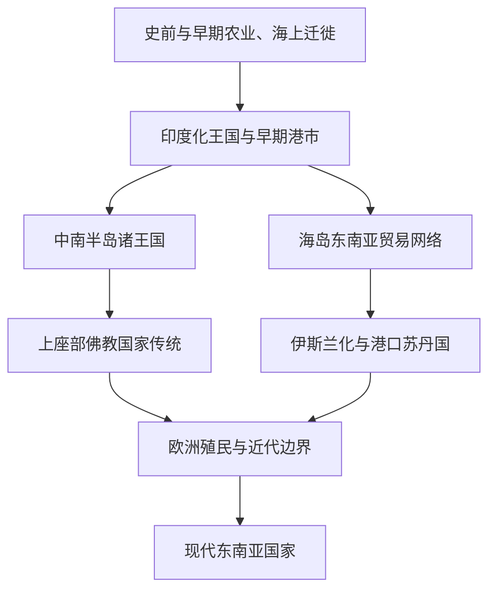

# 东南亚历史

## 概括

东南亚位于中国、印度、印度洋和太平洋之间，可分为中南半岛和海岛东南亚两大历史空间。它的主线包括印度化国家、海上贸易、佛教与印度教传播、伊斯兰化、华人移民、欧洲殖民、二战与现代民族国家形成。

## 演变图

## 区域入口

| 区域 / 国家 | 入口 | 主线提示 |
|---|---|---|
| 中南半岛 | [中南半岛](/%E4%BA%BA%E6%96%87%E7%A7%91%E5%AD%A6/%E5%8E%86%E5%8F%B2/%E4%B8%9C%E5%8D%97%E4%BA%9A/%E4%B8%AD%E5%8D%97%E5%8D%8A%E5%B2%9B/README.md) | 越南、柬埔寨、老挝、泰国、缅甸之间的陆地王朝与佛教传统。 |
| 海岛东南亚 | [海岛东南亚](/%E4%BA%BA%E6%96%87%E7%A7%91%E5%AD%A6/%E5%8E%86%E5%8F%B2/%E4%B8%9C%E5%8D%97%E4%BA%9A/%E6%B5%B7%E5%B2%9B%E4%B8%9C%E5%8D%97%E4%BA%9A/README.md) | 马来群岛、印尼、菲律宾和海上贸易、伊斯兰化、殖民网络。 |
| 越南 | [越南](/%E4%BA%BA%E6%96%87%E7%A7%91%E5%AD%A6/%E5%8E%86%E5%8F%B2/%E4%B8%9C%E5%8D%97%E4%BA%9A/%E8%B6%8A%E5%8D%97/README.md) | 北属、独立王朝、南进、法属印度支那和现代越南。 |
| 缅甸 | [缅甸](/%E4%BA%BA%E6%96%87%E7%A7%91%E5%AD%A6/%E5%8E%86%E5%8F%B2/%E4%B8%9C%E5%8D%97%E4%BA%9A/%E7%BC%85%E7%94%B8/README.md) | 蒲甘、东吁、贡榜、英属缅甸和现代缅甸。 |
| 泰国 | [泰国](/%E4%BA%BA%E6%96%87%E7%A7%91%E5%AD%A6/%E5%8E%86%E5%8F%B2/%E4%B8%9C%E5%8D%97%E4%BA%9A/%E6%B3%B0%E5%9B%BD/README.md) | 素可泰、阿瑜陀耶、吞武里、曼谷王朝和现代泰国。 |
| 柬埔寨 | [柬埔寨](/%E4%BA%BA%E6%96%87%E7%A7%91%E5%AD%A6/%E5%8E%86%E5%8F%B2/%E4%B8%9C%E5%8D%97%E4%BA%9A/%E6%9F%AC%E5%9F%94%E5%AF%A8/README.md) | 扶南、真腊、吴哥、高棉王国和近现代柬埔寨。 |
| 印尼 | [印尼](/%E4%BA%BA%E6%96%87%E7%A7%91%E5%AD%A6/%E5%8E%86%E5%8F%B2/%E4%B8%9C%E5%8D%97%E4%BA%9A/%E5%8D%B0%E5%B0%BC/README.md) | 室利佛逝、满者伯夷、伊斯兰苏丹国、荷属东印度和印尼共和国。 |
| 菲律宾 | [菲律宾](/%E4%BA%BA%E6%96%87%E7%A7%91%E5%AD%A6/%E5%8E%86%E5%8F%B2/%E4%B8%9C%E5%8D%97%E4%BA%9A/%E8%8F%B2%E5%BE%8B%E5%AE%BE/README.md) | 群岛社会、西班牙殖民、美国统治、独立与现代菲律宾。 |

## 相关区域

- 印度化和佛教传播背景参见[南亚](/%E4%BA%BA%E6%96%87%E7%A7%91%E5%AD%A6/%E5%8E%86%E5%8F%B2/%E5%8D%97%E4%BA%9A/README.md)。
- 海上贸易和殖民扩张可与[欧洲历史](/%E4%BA%BA%E6%96%87%E7%A7%91%E5%AD%A6/%E5%8E%86%E5%8F%B2/%E6%AC%A7%E6%B4%B2/README.md)、[大洋洲历史](/%E4%BA%BA%E6%96%87%E7%A7%91%E5%AD%A6/%E5%8E%86%E5%8F%B2/%E5%A4%A7%E6%B4%8B%E6%B4%B2/README.md)对读。
- 与中国长期互动的越南、南海和华人移民线索应和中国史互引。
