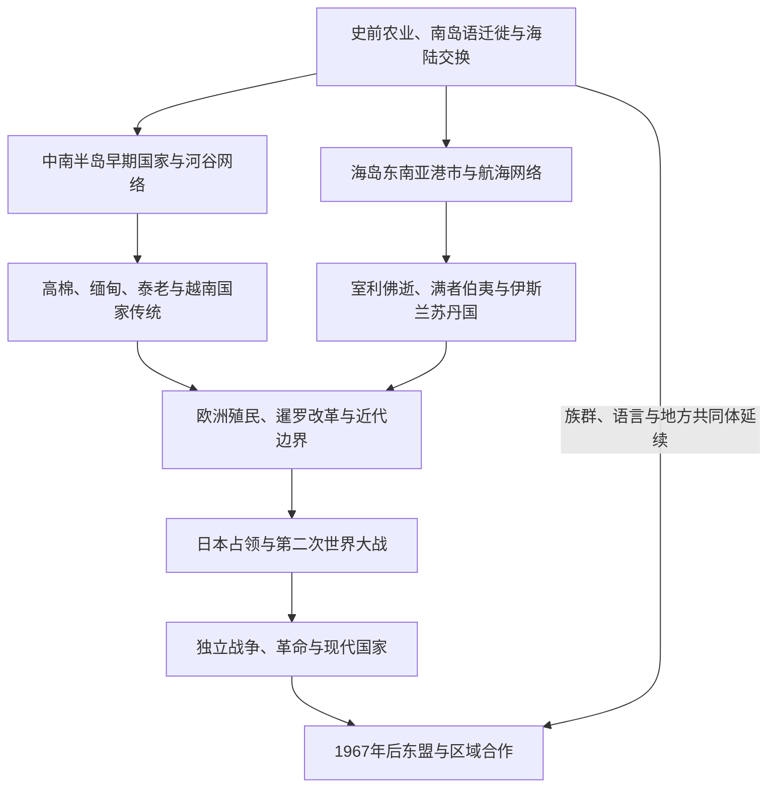

# 东南亚历史

## 范围与概括

东南亚位于中国、印度、印度洋和太平洋之间，可分为中南半岛与海岛东南亚。这里的国家形成不是“印度文化”或“中国文化”的被动复制：本地社会选择、改造佛教、印度教、儒学、伊斯兰教和基督教传统，并依靠河谷稻作、山地交换、海峡港市和远洋贸易建立多种政治网络。欧洲殖民、日本占领、冷战战争、民族国家与东盟合作构成近现代共同主线。

## 演进图

## 文明与历史空间入口

| 历史空间 | 类型 | 入口 | 主线提示 |
|---|---|---|---|
| 中南半岛 | 跨现代边界历史区域 | [中南半岛](/%E4%BA%BA%E6%96%87%E7%A7%91%E5%AD%A6/%E5%8E%86%E5%8F%B2/%E4%B8%9C%E5%8D%97%E4%BA%9A/%E4%B8%AD%E5%8D%97%E5%8D%8A%E5%B2%9B/README.md) | 河谷国家、山地网络、上座部佛教、越南传统与大陆战争。 |
| 海岛东南亚 | 海域文明与迁徙空间 | [海岛东南亚](/%E4%BA%BA%E6%96%87%E7%A7%91%E5%AD%A6/%E5%8E%86%E5%8F%B2/%E4%B8%9C%E5%8D%97%E4%BA%9A/%E6%B5%B7%E5%B2%9B%E4%B8%9C%E5%8D%97%E4%BA%9A/README.md) | 南岛语社会、海峡港市、印度教—佛教王国、伊斯兰化与殖民群岛。 |

## 现代国家与政治实体入口

现代国家页先概括本地前史，再重点维护殖民边界、独立建国、政体与社会变化；中南半岛和海岛共同文明不归任何单一国家独占。

| 国家 | 入口 | 国家形成主线 |
|---|---|---|
| 越南 | [越南历史](/%E4%BA%BA%E6%96%87%E7%A7%91%E5%AD%A6/%E5%8E%86%E5%8F%B2/%E4%B8%9C%E5%8D%97%E4%BA%9A/%E8%B6%8A%E5%8D%97/README.md) | 北属与自主王朝、南进、法属印度支那、战争与统一。 |
| 缅甸 | [缅甸历史](/%E4%BA%BA%E6%96%87%E7%A7%91%E5%AD%A6/%E5%8E%86%E5%8F%B2/%E4%B8%9C%E5%8D%97%E4%BA%9A/%E7%BC%85%E7%94%B8/README.md) | 骠、蒲甘、东吁、贡榜、英属统治、独立与军政冲突。 |
| 泰国 | [泰国历史](/%E4%BA%BA%E6%96%87%E7%A7%91%E5%AD%A6/%E5%8E%86%E5%8F%B2/%E4%B8%9C%E5%8D%97%E4%BA%9A/%E6%B3%B0%E5%9B%BD/README.md) | 素可泰、阿瑜陀耶、吞武里、曼谷王朝、改革与现代政治。 |
| 柬埔寨 | [柬埔寨历史](/%E4%BA%BA%E6%96%87%E7%A7%91%E5%AD%A6/%E5%8E%86%E5%8F%B2/%E4%B8%9C%E5%8D%97%E4%BA%9A/%E6%9F%AC%E5%9F%94%E5%AF%A8/README.md) | 扶南、真腊、吴哥、法属保护、红色高棉与重建。 |
| 老挝 | [老挝历史](/%E4%BA%BA%E6%96%87%E7%A7%91%E5%AD%A6/%E5%8E%86%E5%8F%B2/%E4%B8%9C%E5%8D%97%E4%BA%9A/%E8%80%81%E6%8C%9D/README.md) | 澜沧、分裂王国、法属印度支那、革命与现代国家。 |
| 印度尼西亚 | [印度尼西亚历史](/%E4%BA%BA%E6%96%87%E7%A7%91%E5%AD%A6/%E5%8E%86%E5%8F%B2/%E4%B8%9C%E5%8D%97%E4%BA%9A/%E5%8D%B0%E5%B0%BC/README.md) | 室利佛逝、满者伯夷、苏丹国、荷属东印度和共和国。 |
| 马来西亚 | [马来西亚历史](/%E4%BA%BA%E6%96%87%E7%A7%91%E5%AD%A6/%E5%8E%86%E5%8F%B2/%E4%B8%9C%E5%8D%97%E4%BA%9A/%E9%A9%AC%E6%9D%A5%E8%A5%BF%E4%BA%9A/README.md) | 马六甲、马来苏丹国、英属马来亚、联邦与多族群政治。 |
| 新加坡 | [新加坡历史](/%E4%BA%BA%E6%96%87%E7%A7%91%E5%AD%A6/%E5%8E%86%E5%8F%B2/%E4%B8%9C%E5%8D%97%E4%BA%9A/%E6%96%B0%E5%8A%A0%E5%9D%A1/README.md) | 海峡港口、英国殖民、日本占领、自治与城市国家。 |
| 文莱 | [文莱历史](/%E4%BA%BA%E6%96%87%E7%A7%91%E5%AD%A6/%E5%8E%86%E5%8F%B2/%E4%B8%9C%E5%8D%97%E4%BA%9A/%E6%96%87%E8%8E%B1/README.md) | 婆罗洲苏丹国、英国保护与现代石油国家。 |
| 菲律宾 | [菲律宾历史](/%E4%BA%BA%E6%96%87%E7%A7%91%E5%AD%A6/%E5%8E%86%E5%8F%B2/%E4%B8%9C%E5%8D%97%E4%BA%9A/%E8%8F%B2%E5%BE%8B%E5%AE%BE/README.md) | 群岛社会、西班牙殖民、美国统治、日本占领和共和国。 |
| 东帝汶 | [东帝汶历史](/%E4%BA%BA%E6%96%87%E7%A7%91%E5%AD%A6/%E5%8E%86%E5%8F%B2/%E4%B8%9C%E5%8D%97%E4%BA%9A/%E4%B8%9C%E5%B8%9D%E6%B1%B6/README.md) | 帝汶岛社会、葡萄牙殖民、印度尼西亚占领与独立。 |

## 区域共同史与跨境专题

[东南亚通史](/%E4%BA%BA%E6%96%87%E7%A7%91%E5%AD%A6/%E5%8E%86%E5%8F%B2/%E4%B8%9C%E5%8D%97%E4%BA%9A/_%E9%80%9A%E5%8F%B2/README.md)集中整理跨越现代国界的贸易、宗教、移民、殖民、战争、独立与区域合作专题。

## 跨区域专题

- [贸易、宗教与移民网络](/%E4%BA%BA%E6%96%87%E7%A7%91%E5%AD%A6/%E5%8E%86%E5%8F%B2/%E4%B8%9C%E5%8D%97%E4%BA%9A/_%E9%80%9A%E5%8F%B2/%E8%B4%B8%E6%98%93%E3%80%81%E5%AE%97%E6%95%99%E4%B8%8E%E7%A7%BB%E6%B0%91%E7%BD%91%E7%BB%9C.md)
- [殖民、战争、独立与东盟](/%E4%BA%BA%E6%96%87%E7%A7%91%E5%AD%A6/%E5%8E%86%E5%8F%B2/%E4%B8%9C%E5%8D%97%E4%BA%9A/_%E9%80%9A%E5%8F%B2/%E6%AE%96%E6%B0%91%E3%80%81%E6%88%98%E4%BA%89%E3%80%81%E7%8B%AC%E7%AB%8B%E4%B8%8E%E4%B8%9C%E7%9B%9F.md)

## 关键辨析

- “印度化”描述梵文、宗教、王权和艺术影响，不表示印度政权直接统治整个东南亚。
- 中南半岛与海岛东南亚是分析框架，边界地区、马来半岛和跨海族群常同时属于多种网络。
- 现代国界多受殖民划界和战争影响，不能倒推为古代王国的固定边界。
- 东南亚华人、印度人、阿拉伯人及其他侨民既参与贸易，也形成当地社会，不能只写成外来附属群体。

## 上级与相邻区域

- 上级：[历史总览](/%E4%BA%BA%E6%96%87%E7%A7%91%E5%AD%A6/%E5%8E%86%E5%8F%B2/README.md)。
- 南亚：[南亚历史](/%E4%BA%BA%E6%96%87%E7%A7%91%E5%AD%A6/%E5%8E%86%E5%8F%B2/%E5%8D%97%E4%BA%9A/README.md)。
- 中国与东亚：[东亚历史](/%E4%BA%BA%E6%96%87%E7%A7%91%E5%AD%A6/%E5%8E%86%E5%8F%B2/%E4%B8%9C%E4%BA%9A/README.md)。
- 大洋洲：[大洋洲历史](/%E4%BA%BA%E6%96%87%E7%A7%91%E5%AD%A6/%E5%8E%86%E5%8F%B2/%E5%A4%A7%E6%B4%8B%E6%B4%B2/README.md)。
- 欧洲殖民母国：[欧洲历史](/%E4%BA%BA%E6%96%87%E7%A7%91%E5%AD%A6/%E5%8E%86%E5%8F%B2/%E6%AC%A7%E6%B4%B2/README.md)。
