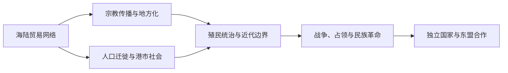

# 东南亚通史

## 概括

本目录整理跨越中南半岛、海岛东南亚和现代国家边界的共同历史专题。各国王朝、政权与国家形成仍在对应国家目录维护；这里关注海陆网络、宗教传播、人口迁徙、殖民体系、战争、独立和区域合作。

## 对象与职责

- 本目录只维护区域共同过程和跨境专题，不代替中南半岛、海岛东南亚及各国的完整通史。
- 跨国王国或海域网络在这里给出比较框架；具体地域与国家页保留本地过程并回链。
- 现代国界不能倒投为古代王国、族群和海上网络的固定边界。

## 主题关系图

## 主题导航

| 主题 | 时间 | 入口 | 说明 |
|---|---|---|---|
| 贸易、宗教与移民网络 | 长时段 | [进入专题](/%E4%BA%BA%E6%96%87%E7%A7%91%E5%AD%A6/%E5%8E%86%E5%8F%B2/%E4%B8%9C%E5%8D%97%E4%BA%9A/_%E9%80%9A%E5%8F%B2/%E8%B4%B8%E6%98%93%E3%80%81%E5%AE%97%E6%95%99%E4%B8%8E%E7%A7%BB%E6%B0%91%E7%BD%91%E7%BB%9C.md) | 印度洋、南海与群岛航线如何连接宗教传播、港市和跨区域社群 |
| 殖民、战争、独立与东盟 | 16世纪以来 | [进入专题](/%E4%BA%BA%E6%96%87%E7%A7%91%E5%AD%A6/%E5%8E%86%E5%8F%B2/%E4%B8%9C%E5%8D%97%E4%BA%9A/_%E9%80%9A%E5%8F%B2/%E6%AE%96%E6%B0%91%E3%80%81%E6%88%98%E4%BA%89%E3%80%81%E7%8B%AC%E7%AB%8B%E4%B8%8E%E4%B8%9C%E7%9B%9F.md) | 殖民秩序、日本占领、民族独立、冷战冲突与区域合作 |

## 上级

- [东南亚历史](/%E4%BA%BA%E6%96%87%E7%A7%91%E5%AD%A6/%E5%8E%86%E5%8F%B2/%E4%B8%9C%E5%8D%97%E4%BA%9A/README.md)
- [历史](/%E4%BA%BA%E6%96%87%E7%A7%91%E5%AD%A6/%E5%8E%86%E5%8F%B2/README.md)
