# 东南亚殖民、战争、独立与东盟

## 时间

16世纪—2026年7月，重点为19世纪殖民国家形成、1941—1945年日本占领、战后独立与1967年后的东盟。

## 概括

东南亚殖民化不是欧洲舰队抵达后立即完成的过程。葡萄牙、西班牙、荷兰、英国、法国、美国和葡萄牙帝国后期分别运用港口据点、特许公司、条约保护、直接行政、种植园和移民劳工；地方统治者、商人和武装集团则在合作、避让、改革与反抗之间选择。日本占领摧毁了欧洲不可战胜的形象，也以强制劳动、征粮、屠杀和饥荒造成巨大损失。1945年后，独立既来自民族运动，也取决于战争结果、殖民本国政治、冷战联盟和地方武装能力。

1967年成立的东盟最初以反冲突和政权安全为重，随后扩展到贸易、外交、人道救援和区域规则。东帝汶于2025年成为第11个成员国；截至2026年，其加入已经完成，后续是落实各项法律文书和缩小发展差距，而非仍停留在“申请加入”。

```mermaid
flowchart LR
    A["16世纪欧洲港口据点"] --> B["17—18世纪公司与海上垄断"]
    B --> C["19世纪领土殖民国家"]
    C --> D["民族主义、改革与反殖民组织"]
    D --> E["1941—1945 日本占领"]
    E --> F["1945后独立宣言与殖民复归"]
    F --> G["独立战争、谈判与国家分裂"]
    G --> H["冷战冲突与军政统治"]
    H --> I["1967 东盟成立"]
    I --> J["1984—1999 扩大至十国"]
    J --> K["2007 东盟宪章"]
    K --> L["2025 东帝汶成为第11国"]
```

## 殖民体系比较

| 殖民体系 | 主要地区 | 运作结构 | 社会经济影响 |
|---|---|---|---|
| 葡萄牙据点帝国 | 马六甲、摩鹿加一度受控，东帝汶长期保留 | 港口、传教、军事据点和地方盟约，资源和行政能力有限 | 天主教和葡语文化在东帝汶影响最深；其他地区多被竞争者取代。 |
| 西班牙殖民 | 菲律宾大部 | 总督、修会、贡赋、村镇重组和马尼拉—阿卡普尔科贸易 | 天主教普及，土地和地方精英结构改变；南部苏丹国长期抵抗。 |
| 荷兰体系 | 荷属东印度 | 东印度公司垄断转为王室殖民国家；间接统治与直接官僚并用 | 强制种植、种植园和资源出口扩大，群岛边界逐渐被统一行政。 |
| 英国体系 | 缅甸、马来亚、新加坡、北婆罗洲等 | 印度殖民体系、海峡殖民地、保护苏丹国和公司领地并存 | 稻米、锡、橡胶和港口经济发展，大量印度与华人劳工迁入。 |
| 法国体系 | 越南、柬埔寨、老挝 | 法属印度支那联邦；越南不同区域法律地位有别，柬老保留名义王权 | 土地、税收和种植园重组；教育范围有限，却产生新式知识精英。 |
| 美国体系 | 菲律宾 | 文官政府、英语教育、选举和地方精英合作，同时军事镇压独立抵抗 | 建立共和国制度框架，也造成对美国市场、军事和精英家族的长期依赖。 |
| 暹罗的非正式帝国压力 | 泰国 | 通过不平等条约、治外法权、财政和边界谈判承受压力 | 王室以中央集权、行政改革和割让边地维持形式独立。 |

## 殖民扩张的具体过程

### 从港口争夺到领土国家

1511年葡萄牙夺取马六甲，目标首先是控制海峡和香料贸易，而非征服整个东南亚。西班牙1565年在宿务建立永久据点，1571年占领马尼拉；荷兰东印度公司1602年成立后，以舰队、条约和强制交售逐步压缩葡萄牙势力。亚洲商人和地方港国仍长期存在，欧洲垄断从未覆盖所有商品和航线。

19世纪工业资本、蒸汽航运、军备差距和欧洲竞争推动殖民者深入内陆。英国三次英缅战争后于1885年吞并上缅甸；法国1858年进攻越南，1880年代形成法属印度支那；荷兰通过亚齐战争等长期征服强化群岛控制；美国在1898年美西战争后接管菲律宾，并在菲美战争中镇压共和国。现代殖民边界由战争和条约逐步制度化，不应倒投为古代王国的自然边界。

### 经济改造与社会分层

殖民政府修建铁路、港口和电报，主要目的在于军事控制与出口。缅甸和湄公河三角洲成为稻米产区；马来亚锡矿和橡胶、爪哇糖和咖啡、苏门答腊烟草与石油、菲律宾糖和椰子进入世界市场。现金税、土地登记和债务改变村社关系，收益在殖民国家、公司、地方精英和劳工之间极不均等。

跨境招募造成多族城市和矿区，也被殖民者用“种族—职业”分类管理。经济危机、土地集中和政治排斥推动农民起义、工会、宗教改革、学生运动和民族主义组织成长。

### 暹罗维持独立的条件与代价

蒙固、朱拉隆功等王推动官僚、税收、教育和军队改革，逐步削弱地方藩属和贵族自治。英国需要法英殖民地之间的缓冲，法国也不愿因暹罗问题与英国全面冲突，提供了外交空间。暹罗同时割让老挝、柬埔寨西部和马来半岛部分地区，接受不平等条约；其“未被殖民”并不意味着完全免受帝国经济和主权压力。

## 日本占领：动员、合作与暴力

1941年末至1942年，日本迅速击败英、美、荷殖民军并进入法属印度支那全境。日本以“大东亚共荣圈”和“亚洲解放”宣传争取民族主义者，训练缅甸独立军、印尼乡土防卫义勇军等组织，也允许部分本地行政和语言象征扩大。许多独立领袖出于反殖民目标、现实求生或组织建设与日方合作，另一些人坚持地下抵抗；同一人物和组织的选择还会随战争局势变化。

占领经济服务于战争。征粮、通货膨胀、航运中断和盟军封锁导致1944—1945年越南北部饥荒；数十万“劳务者”被迫修筑铁路、机场和工事；新加坡“肃清”、马尼拉战役及各地报复造成平民死亡。日本占领既打开殖民权威裂口，又不是单纯的“解放”。

## 独立路径

| 地区 | 独立过程 | 关键矛盾 |
|---|---|---|
| 菲律宾 | 1935年自治邦已规划独立；日本占领后恢复美国统治，1946年共和国独立 | 战争破坏、土地与精英政治、美军基地和经济依赖。 |
| 印度尼西亚 | 苏加诺、哈达1945年8月17日宣布独立；与荷兰发生1945—1949年革命和外交斗争 | 共和国武装、地方革命、英军介入、荷兰“警察行动”和国际压力共同决定结果。 |
| 越南 | 越盟1945年建立民主共和国；法国复归引发1946—1954年第一次印度支那战争 | 反殖民革命与共产主义、非共产主义民族方案及冷战重叠，日内瓦协议后南北分裂。 |
| 柬埔寨、老挝 | 王室谈判与民族组织并行，1953—1954年前后取得独立 | 王权、左翼武装、越南战争外溢和国内社会分裂。 |
| 缅甸 | 昂山与反法西斯人民自由同盟迫使英国谈判，1948年独立 | 昂山遇刺、少数民族协议未充分落实、共产党与族群武装冲突。 |
| 马来亚、马来西亚、新加坡 | 紧急状态、宪制谈判与族群政党联盟并行；1957年马来亚独立，1963年马来西亚成立，1965年新加坡分离 | 反共战争、公民权、苏丹地位、族群权力分享、印尼对抗和联邦矛盾。 |
| 文莱 | 1959年自治宪制，1962年起义后未加入马来西亚，1984年独立 | 苏丹权力、石油收入和英国安全关系。 |
| 东帝汶 | 葡萄牙1974年革命后去殖民；1975年短暂宣布独立，随即被印度尼西亚占领；1999年公投、联合国过渡，2002年恢复独立 | 内部党争、印尼入侵与占领暴力、国际环境和战后国家能力。 |

## 冷战、内战与军政国家

东南亚独立并未自动结束战争。越南战争把越南、老挝和柬埔寨卷入美苏中竞争；柬埔寨红色高棉1975—1979年统治造成大规模死亡，越南出兵推翻其政权后又引发长期地区和国际冲突。缅甸自1948年持续面对族群与政治武装，1962年军变确立长期军人统治。印度尼西亚1965—1966年反共清洗造成大规模杀戮，随后苏哈托“新秩序”以军政权力和经济发展建立统治。菲律宾马科斯1972年宣布戒严，泰国则多次在军政、议会与王室影响之间摆动。

这些冲突不能只用“资本主义对共产主义”解释。殖民边界、土地不平等、族群自治承诺、军队组织、地方精英竞争和大国干预共同作用。

## 东盟的形成与扩展

### 成立动机

印度尼西亚与马来西亚“对抗”结束后，印尼、马来西亚、菲律宾、新加坡和泰国于1967年8月8日签署《曼谷宣言》。创始成员希望减少彼此冲突、限制大国代理战争、稳定国内政权并促进发展。协商一致、非正式外交和不干涉逐渐形成所谓“东盟方式”。

### 从五国到十一国

| 时间 | 成员变化 | 意义 |
|---|---|---|
| 1967年 | 印度尼西亚、马来西亚、菲律宾、新加坡、泰国创立 | 先以非共产主义五国的安全和外交协调为核心。 |
| 1984年 | 文莱加入 | 独立后立即进入区域组织。 |
| 1995年 | 越南加入 | 冷战敌对开始转化为区域合作。 |
| 1997年 | 老挝、缅甸加入 | 扩大大陆东南亚覆盖，也使人权和政体差异更突出。 |
| 1999年 | 柬埔寨加入 | 东盟覆盖传统所称“东南亚十国”。 |
| 2025年 | 东帝汶正式成为第11个成员国 | 完成政治加入；法律文书、机构能力与经济整合仍需持续落实。 |

### 制度发展与局限

1976年《东南亚友好合作条约》强化和平解决争端；1992年东盟自由贸易区推动降税；1997年亚洲金融危机暴露金融合作不足；2007年《东盟宪章》赋予组织法律人格；2015年东盟共同体正式启动。东盟还通过“东盟加三”、东亚峰会和东盟地区论坛把中、美、日、韩、澳、印等纳入对话。

协商一致有助于主权敏感国家保持参与，却使组织难以在成员严重分歧时迅速行动。南海争端、罗兴亚危机、2021年缅甸军变后的“五点共识”执行困难，都显示“不干涉”与区域责任之间的张力。东盟不是超国家政府，其成效取决于成员是否愿意执行共同决定。

## 重要事件与转折

| 时间 | 事件 | 结果与长期影响 |
|---|---|---|
| 1511年 | 葡萄牙夺取马六甲 | 欧洲军事据点进入海峡，亚洲商人转向其他港口。 |
| 1565、1571年 | 西班牙建立宿务、马尼拉中心 | 菲律宾殖民体系与跨太平洋贸易形成。 |
| 1602年 | 荷兰东印度公司成立 | 特许公司以战争、垄断和条约重组香料贸易。 |
| 1824年 | 英荷条约 | 划分马来半岛与荷属群岛势力范围，影响后来的国际边界。 |
| 1824—1885年 | 三次英缅战争 | 缅甸王国被逐步吞并并纳入英属印度。 |
| 1858—1887年 | 法国征服并组建印度支那 | 越南、柬埔寨和老挝被置于差异化殖民体系。 |
| 1873—1904年 | 亚齐战争主要阶段 | 荷兰以长期高成本战争强化苏门答腊控制，地方抵抗延续。 |
| 1898—1902年以后 | 美西战争与菲美战争 | 菲律宾从西班牙转入美国统治，第一共和国被军事击败。 |
| 1930年代 | 大萧条与民族组织扩张 | 出口危机加剧社会矛盾，群众政党和工会成长。 |
| 1941—1942年 | 日本征服东南亚 | 欧洲殖民军迅速失败，旧权威崩塌。 |
| 1943—1945年 | 强制劳动、征粮与战争暴力 | 造成广泛死亡，也使本地军政组织积累经验。 |
| 1945年 | 越南、印度尼西亚宣布独立 | 殖民复归引发两场不同规模和国际背景的战争。 |
| 1946年 | 菲律宾独立 | 殖民自治计划完成，但美国安全和经济影响延续。 |
| 1948年 | 缅甸独立、马来亚紧急状态开始 | 谈判建国与反共战争展示不同去殖民路径。 |
| 1949年 | 荷兰承认印度尼西亚主权 | 军事、外交和国际压力共同结束主要独立战争。 |
| 1954年 | 奠边府与日内瓦会议 | 法属印度支那终结，越南暂时分区并进入更深冷战。 |
| 1957年 | 马来亚独立 | 宪制谈判、族群联盟和反共安全体制结合。 |
| 1963—1966年 | 马来西亚成立、印尼对抗、 新加坡分离 | 殖民领地组合、地区竞争和联邦内部矛盾重塑国家格局。 |
| 1965—1966年 | 印度尼西亚大清洗 | 军方和苏哈托崛起，反共暴力造成长期社会创伤。 |
| 1967年 | 东盟成立 | 成员以协商和不干涉降低国家间冲突。 |
| 1975年 | 越南战争结束、老挝革命、红色高棉掌权、东帝汶危机 | 多条殖民—冷战主线在同年剧烈转折。 |
| 1978—1979年 | 越南进入柬埔寨、中越战争 | 地区社会主义国家分裂，东盟加强外交协调。 |
| 1984—1999年 | 东盟扩大为十国 | 冷战后逐步纳入整个区域。 |
| 1997年 | 亚洲金融危机 | 暴露资本流动和金融监管脆弱性，推动更深区域合作。 |
| 1999—2002年 | 东帝汶公投、联合国过渡与独立 | 结束印度尼西亚占领，建立新国家。 |
| 2007年 | 《东盟宪章》签署 | 东盟获得法律人格和较正式的机构框架。 |
| 2015年 | 东盟共同体启动 | 经济、政治安全和社会文化三大支柱制度化。 |
| 2021年 | 缅甸军变与“五点共识” | 显示东盟在成员内战和主权原则之间的执行困境。 |
| 2025年 | 东帝汶加入东盟 | 成员增至11国，区域整合进入能力建设阶段。 |

## 因果与比较

### 欧洲殖民扩张成功的条件

- 工业化军备、蒸汽航运、金融和长期财政提高远征能力。
- 欧洲列强相互竞争并以条约划分势力，减少部分直接冲突成本。
- 地方王位战争和港口竞争让殖民者能扶植盟友，但本地选择并非殖民胜利的唯一原因。
- 出口商品、港口税收和土地制度使征服能够自我融资。

### 殖民统治衰落的结构因素

- 教育、城市和战争动员产生能跨地区组织的民族主义精英与群众网络。
- 大萧条和种族化经济秩序削弱殖民合法性。
- 日本占领打破欧洲军事威望，训练本地武装，却也留下饥荒和暴力。
- 二战后欧洲财政衰弱，美苏竞争和联合国反殖民规范提高复归成本。
- 直接触发因素各异：印度尼西亚和越南以独立宣言与战争推进，缅甸、马来亚和菲律宾更多依靠既有谈判框架及安全安排。

### 独立后冲突的结构因素

- 殖民边界常包纳多族群和不均等地区，自治承诺与中央集权发生冲突。
- 军队在战争中成为最有组织的国家机构，容易转化为政治仲裁者。
- 土地、阶级与族群矛盾被冷战援助和代理战争放大。
- 国家能力不足、难民流动和跨境根据地使内战难以限定在一国之内。

## 地区入口

- [越南历史](/%E4%BA%BA%E6%96%87%E7%A7%91%E5%AD%A6/%E5%8E%86%E5%8F%B2/%E4%B8%9C%E5%8D%97%E4%BA%9A/%E8%B6%8A%E5%8D%97/README.md)
- [柬埔寨历史](/%E4%BA%BA%E6%96%87%E7%A7%91%E5%AD%A6/%E5%8E%86%E5%8F%B2/%E4%B8%9C%E5%8D%97%E4%BA%9A/%E6%9F%AC%E5%9F%94%E5%AF%A8/README.md)
- [老挝历史](/%E4%BA%BA%E6%96%87%E7%A7%91%E5%AD%A6/%E5%8E%86%E5%8F%B2/%E4%B8%9C%E5%8D%97%E4%BA%9A/%E8%80%81%E6%8C%9D/README.md)
- [缅甸历史](/%E4%BA%BA%E6%96%87%E7%A7%91%E5%AD%A6/%E5%8E%86%E5%8F%B2/%E4%B8%9C%E5%8D%97%E4%BA%9A/%E7%BC%85%E7%94%B8/README.md)
- [泰国历史](/%E4%BA%BA%E6%96%87%E7%A7%91%E5%AD%A6/%E5%8E%86%E5%8F%B2/%E4%B8%9C%E5%8D%97%E4%BA%9A/%E6%B3%B0%E5%9B%BD/README.md)
- [印度尼西亚历史](/%E4%BA%BA%E6%96%87%E7%A7%91%E5%AD%A6/%E5%8E%86%E5%8F%B2/%E4%B8%9C%E5%8D%97%E4%BA%9A/%E5%8D%B0%E5%B0%BC/README.md)
- [菲律宾历史](/%E4%BA%BA%E6%96%87%E7%A7%91%E5%AD%A6/%E5%8E%86%E5%8F%B2/%E4%B8%9C%E5%8D%97%E4%BA%9A/%E8%8F%B2%E5%BE%8B%E5%AE%BE/README.md)
- [马来西亚历史](/%E4%BA%BA%E6%96%87%E7%A7%91%E5%AD%A6/%E5%8E%86%E5%8F%B2/%E4%B8%9C%E5%8D%97%E4%BA%9A/%E9%A9%AC%E6%9D%A5%E8%A5%BF%E4%BA%9A/README.md)
- [新加坡历史](/%E4%BA%BA%E6%96%87%E7%A7%91%E5%AD%A6/%E5%8E%86%E5%8F%B2/%E4%B8%9C%E5%8D%97%E4%BA%9A/%E6%96%B0%E5%8A%A0%E5%9D%A1/README.md)
- [文莱历史](/%E4%BA%BA%E6%96%87%E7%A7%91%E5%AD%A6/%E5%8E%86%E5%8F%B2/%E4%B8%9C%E5%8D%97%E4%BA%9A/%E6%96%87%E8%8E%B1/README.md)
- [东帝汶历史](/%E4%BA%BA%E6%96%87%E7%A7%91%E5%AD%A6/%E5%8E%86%E5%8F%B2/%E4%B8%9C%E5%8D%97%E4%BA%9A/%E4%B8%9C%E5%B8%9D%E6%B1%B6/README.md)

## 相关专题

- [贸易、宗教与移民网络](/%E4%BA%BA%E6%96%87%E7%A7%91%E5%AD%A6/%E5%8E%86%E5%8F%B2/%E4%B8%9C%E5%8D%97%E4%BA%9A/_%E9%80%9A%E5%8F%B2/%E8%B4%B8%E6%98%93%E3%80%81%E5%AE%97%E6%95%99%E4%B8%8E%E7%A7%BB%E6%B0%91%E7%BD%91%E7%BB%9C.md)
- [东南亚通史](/%E4%BA%BA%E6%96%87%E7%A7%91%E5%AD%A6/%E5%8E%86%E5%8F%B2/%E4%B8%9C%E5%8D%97%E4%BA%9A/_%E9%80%9A%E5%8F%B2/README.md)
