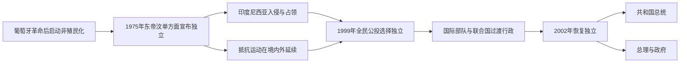

# 东帝汶1975年以来国家领导与过渡行政表

## 范围与读法

1975—2002年间存在三套互相冲突的权力主张：东帝汶民主共和国及抵抗运动主张独立，印度尼西亚把该地设为第27省，联合国则始终把葡萄牙视为行政国并不承认吞并。1999年印尼撤军后，联合国过渡行政机构直接承担主权行政，至2002年恢复独立。各表必须分开阅读，不能把抵抗领导、印尼省长和联合国行政长官排成一条相互合法继承的普通总统世系。

截至2026年7月，东帝汶民主共和国总统为若泽·拉莫斯·奥尔塔，总理为沙纳纳·古斯芒。

## 政权与领导结构演变图

1975—1999年间，印度尼西亚占领行政与东帝汶抵抗运动的政治—军事领导并行存在；1999—2002年则由国际部队和联合国过渡行政逐步移交主权。独立后的总统与总理按半总统制分别列出。

## 1975年独立政府的国家领导

| 职位 | 人物 | 任期 / 活动期 | 权力与争议 |
| --- | --- | --- | --- |
| 总统 | **弗朗西斯科·沙维尔·多阿马拉尔（Francisco Xavier do Amaral）** | 1975-11-28—1977-09 | 独立革命阵线宣布独立后的首任总统；印尼入侵后转入山地，后被党内解除职务。 |
| 总理 | **尼古劳·多斯雷斯·洛巴托（Nicolau dos Reis Lobato）** | 1975-11-28—1977-09 | 首任总理、武装抵抗领导；政府在入侵后无法维持常规行政。 |
| 代理总统、抵抗最高领导 | **尼古劳·洛巴托** | 1977-09—1978-12-31 | 接替阿马拉尔；在印尼军队包围战中阵亡。 |

该政府仅在入侵前短暂控制城市，之后成为抵抗政府主张；葡萄牙、印度尼西亚及多数国家未在当时承认其独立，但联合国也没有承认印度尼西亚吞并。

## 抵抗运动主要军事—政治领导

| 组织 / 职位 | 人物 | 时间 | 说明 |
| --- | --- | --- | --- |
| FALINTIL最高指挥、独立革命阵线领导 | 尼古劳·洛巴托 | 1975—1978 | 早期山地武装抵抗核心。 |
| 武装力量总司令、后为全国抵抗委员会领导 | **沙纳纳·古斯芒（Xanana Gusmão）** | 1981—1992；被囚后继续具政治影响 | 把抵抗从单一党派重组为更广泛民族阵线；1992年被捕。 |
| FALINTIL指挥 | 马乌努·布莱克（Ma'huno Bulerek Karathayano） | 1992—1993 | 古斯芒被捕后的短期指挥，后亦被捕。 |
| FALINTIL指挥 | **尼诺·科尼斯·桑塔纳（Nino Konis Santana）** | 1993—1998 | 重建地下、游击与海外外交协作；1998年病逝。 |
| FALINTIL指挥 | **陶尔·马坦·鲁阿克（Taur Matan Ruak）** | 1998—2001 | 公投与联合国过渡阶段的武装领导，后任国防军司令和共和国总统。 |
| 全国东帝汶抵抗委员会主席 | **沙纳纳·古斯芒** | 1998—2002 | 统合党派、教会、地下网络和海外外交，独立后任总统。 |

## 印度尼西亚占领行政（1976—1999）

印度尼西亚总统、国军和中央政府掌最终权力，省长负责名义地方行政；军事辖区、情报和特种部队并不受省政府完整控制。

| 顺序 | “东帝汶省”省长 | 任期 | 说明 |
| ---: | --- | --- | --- |
| 1 | 阿纳尔多·多斯雷斯·阿劳若（Arnaldo dos Reis Araújo） | 1976—1978 | 亲整合临时政府领导转任首任省长。 |
| 2 | 吉列尔梅·马里亚·贡萨尔维斯（Guilherme Maria Gonçalves） | 1978—1982 | 占领战争与强制迁移高峰期。 |
| 3 | **马里奥·维加斯·卡拉斯卡朗（Mário Viegas Carrascalão）** | 1982—1992 | 任内逐步开放部分地区，天主教与青年地下运动扩大。 |
| 4 | 若泽·阿比利奥·奥索里奥·苏亚雷斯（José Abílio Osório Soares） | 1992—1999 | 末任省长；1999年公投和占领终结。 |

## 联合国与东帝汶过渡行政（1999—2002）

| 职位 / 机构 | 人物 | 任期 | 实际权力 |
| --- | --- | --- | --- |
| 国际部队司令 | 彼得·科斯格罗夫（Peter Cosgrove） | 1999-09—2000-02 | 领导获安理会授权的东帝汶国际部队，恢复基本安全并监督印尼撤军。 |
| 联合国过渡行政长官 | **塞尔吉奥·维埃拉·德梅洛（Sérgio Vieira de Mello）** | 1999-11—2002-05-20 | 安理会第1272号决议下的最高行政、立法和过渡治理权威。 |
| 第一过渡内阁首席部长 | 未设单独总理；德梅洛主持 | 2000-07—2001-09 | 联合国官员与东帝汶成员共同管理各部门。 |
| 第二过渡政府首席部长 | **马里·阿尔卡蒂里（Mari Alkatiri）** | 2001-09—2002-05-20 | 制宪议会选举后领导东帝汶成员占主导的过渡政府。 |

## 独立共和国总统与代总统（2002年至今）

| 顺序 | 总统 / 代总统 | 任期 | 关键事件与交接 |
| ---: | --- | --- | --- |
| 1 | **沙纳纳·古斯芒** | 2002-05-20—2007-05-20 | 恢复独立后的首任总统，侧重国家整合与军政调解。 |
| 2 | **若泽·拉莫斯·奥尔塔（José Ramos-Horta）** | 2007-05-20—2012-05-20 | 2008年遇袭重伤，康复期间由两名议长依序代行。 |
| 代行 | 维森特·古特雷斯（Vicente Guterres） | 2008-02-11—2008-02-13 | 国会副议长在议长不在国内时短暂代行。 |
| 代行 | 费尔南多·“拉萨马”·德阿劳若（Fernando de Araújo） | 2008-02-13—2008-04-17 | 国会议长代行至拉莫斯·奥尔塔复职。 |
| 3 | **陶尔·马坦·鲁阿克** | 2012-05-20—2017-05-20 | 前国防军司令；任满后转入政党和政府领导。 |
| 4 | **弗朗西斯科·“卢奥洛”·古特雷斯（Francisco Guterres）** | 2017-05-20—2022-05-20 | 同议会多数的组阁冲突导致2018年提前选举。 |
| 5 | **若泽·拉莫斯·奥尔塔** | 2022-05-20—至今 | 第二次任总统；截至2026年7月在任。 |

## 独立共和国总理（2002年至今）

| 顺序 | 总理 | 任期 | 政治基础与交接 |
| ---: | --- | --- | --- |
| 1 | **马里·阿尔卡蒂里** | 2002-05-20—2006-06-26 | 独立革命阵线多数政府；2006年军队和治安危机中辞职。 |
| 2 | **若泽·拉莫斯·奥尔塔** | 2006-06-26—2007-05-19 | 危机后过渡政治协调；当选总统后离任。 |
| 3 | 埃斯塔尼斯劳·达席尔瓦（Estanislau da Silva） | 2007-05-19—2007-08-08 | 看守政府首脑。 |
| 4 | **沙纳纳·古斯芒** | 2007-08-08—2015-02-16 | 全国重建大会党及联盟政府；石油基金、基础设施和危机后稳定阶段。 |
| 5 | 鲁伊·马里亚·德阿劳若（Rui Maria de Araújo） | 2015-02-16—2017-09-15 | 跨党派合作与政府代际过渡。 |
| 6 | **马里·阿尔卡蒂里** | 2017-09-15—2018-06-22 | 少数政府预算受阻，提前选举后离任。 |
| 7 | **陶尔·马坦·鲁阿克** | 2018-06-22—2023-07-01 | 人民解放党领导联盟；经历政治重组与新冠疫情。 |
| 8 | **沙纳纳·古斯芒** | 2023-07-01—至今 | 第九届宪政政府；截至2026年7月在任。 |

## 半总统制的实际权力结构

| 机构 | 权力与制衡 |
| --- | --- |
| 总统 | 全民直选，是国家元首和国防军最高统帅；可任命总理、否决或提交法案复议、解散议会，但日常行政不由总统直接领导。 |
| 总理与部长会议 | 领导政府、预算、公共行政、经济和外交执行，需获得议会多数或可运作的联盟支持。 |
| 国民议会 | 一院制立法机关，决定政府支持、预算和法律；多党联盟使组阁与总统—议会关系重要。 |
| 抵抗世代领袖 | 古斯芒、拉莫斯·奥尔塔、阿尔卡蒂里、鲁阿克等人的历史声望长期塑造政党和联盟，但不等于拥有宪法外世袭地位。 |
| 石油基金与发展伙伴 | 油气收入支撑财政，国际机构和援助承担培训与基础设施角色；资源依赖限制政策空间。 |

## 相关笔记

- [印度尼西亚占领与抵抗](/%E4%BA%BA%E6%96%87%E7%A7%91%E5%AD%A6/%E5%8E%86%E5%8F%B2/%E4%B8%9C%E5%8D%97%E4%BA%9A/%E4%B8%9C%E5%B8%9D%E6%B1%B6/%E5%8D%B0%E5%BA%A6%E5%B0%BC%E8%A5%BF%E4%BA%9A%E5%8D%A0%E9%A2%86%E4%B8%8E%E6%8A%B5%E6%8A%97.md)
- [公投、独立与国家重建](/%E4%BA%BA%E6%96%87%E7%A7%91%E5%AD%A6/%E5%8E%86%E5%8F%B2/%E4%B8%9C%E5%8D%97%E4%BA%9A/%E4%B8%9C%E5%B8%9D%E6%B1%B6/%E5%85%AC%E6%8A%95%E3%80%81%E7%8B%AC%E7%AB%8B%E4%B8%8E%E5%9B%BD%E5%AE%B6%E9%87%8D%E5%BB%BA.md)
- [东帝汶历史总览](/%E4%BA%BA%E6%96%87%E7%A7%91%E5%AD%A6/%E5%8E%86%E5%8F%B2/%E4%B8%9C%E5%8D%97%E4%BA%9A/%E4%B8%9C%E5%B8%9D%E6%B1%B6/README.md)
