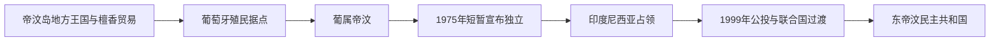

# 东帝汶历史

东帝汶位于帝汶岛东部，其历史由南岛语族与巴布亚语族社会、檀香贸易和地方王国共同塑造。葡萄牙殖民统治长期资源有限，1974年去殖民化骤然加速；1975年印度尼西亚入侵并吞并东帝汶，经过长期抵抗和1999年公投，东帝汶于2002年恢复独立。

## 阶段导航

| 顺序 | 阶段 | 时间 | 核心变化 |
|---|---|---|---|
| 1 | [帝汶岛社会与葡萄牙殖民](/%E4%BA%BA%E6%96%87%E7%A7%91%E5%AD%A6/%E5%8E%86%E5%8F%B2/%E4%B8%9C%E5%8D%97%E4%BA%9A/%E4%B8%9C%E5%B8%9D%E6%B1%B6/%E5%B8%9D%E6%B1%B6%E5%B2%9B%E7%A4%BE%E4%BC%9A%E4%B8%8E%E8%91%A1%E8%90%84%E7%89%99%E6%AE%96%E6%B0%91.md) | 史前时期—1975年 | 地方政权、檀香贸易、葡萄牙殖民与去殖民化 |
| 2 | [印度尼西亚占领与抵抗](/%E4%BA%BA%E6%96%87%E7%A7%91%E5%AD%A6/%E5%8E%86%E5%8F%B2/%E4%B8%9C%E5%8D%97%E4%BA%9A/%E4%B8%9C%E5%B8%9D%E6%B1%B6/%E5%8D%B0%E5%BA%A6%E5%B0%BC%E8%A5%BF%E4%BA%9A%E5%8D%A0%E9%A2%86%E4%B8%8E%E6%8A%B5%E6%8A%97.md) | 1974—1999年 | 去殖民化、入侵、吞并和抵抗 |
| 3 | [公投、独立与国家重建](/%E4%BA%BA%E6%96%87%E7%A7%91%E5%AD%A6/%E5%8E%86%E5%8F%B2/%E4%B8%9C%E5%8D%97%E4%BA%9A/%E4%B8%9C%E5%B8%9D%E6%B1%B6/%E5%85%AC%E6%8A%95%E3%80%81%E7%8B%AC%E7%AB%8B%E4%B8%8E%E5%9B%BD%E5%AE%B6%E9%87%8D%E5%BB%BA.md) | 1999年至今 | 联合国过渡、独立与脆弱国家建设 |

## 政治与行政专表

| 专表 | 覆盖范围 | 说明 |
| --- | --- | --- |
| [1975年以来国家领导与过渡行政表](/%E4%BA%BA%E6%96%87%E7%A7%91%E5%AD%A6/%E5%8E%86%E5%8F%B2/%E4%B8%9C%E5%8D%97%E4%BA%9A/%E4%B8%9C%E5%B8%9D%E6%B1%B6/1975%E5%B9%B4%E4%BB%A5%E6%9D%A5%E5%9B%BD%E5%AE%B6%E9%A2%86%E5%AF%BC%E4%B8%8E%E8%BF%87%E6%B8%A1%E8%A1%8C%E6%94%BF%E8%A1%A8.md) | 1975年至今 | 独立政府、抵抗领导、印尼省长、联合国行政长官、总统与总理；核验至2026年7月。 |

## 重要转折

| 时间 | 事件 | 意义 |
|---|---|---|
| 16世纪 | 葡萄牙商人和传教士到来 | 檀香贸易与天主教影响扩大 |
| 1859年 | 葡荷条约划界 | 帝汶岛东西殖民边界逐步确定 |
| 1975年 | 葡萄牙撤离、内战与印尼入侵 | 殖民统治终结但占领开始 |
| 1991年 | 圣克鲁斯墓地惨案 | 国际社会更广泛关注占领问题 |
| 1999年 | 自决公投 | 多数选民选择脱离印度尼西亚 |
| 2002年 | 恢复独立 | 东帝汶民主共和国建立 |
| 2025年 | 加入东盟 | 成为东盟第11个成员国，区域融入进入新阶段 |

## 区域联系

- 上级：[海岛东南亚历史](/%E4%BA%BA%E6%96%87%E7%A7%91%E5%AD%A6/%E5%8E%86%E5%8F%B2/%E4%B8%9C%E5%8D%97%E4%BA%9A/%E6%B5%B7%E5%B2%9B%E4%B8%9C%E5%8D%97%E4%BA%9A/README.md)
- 邻近主线：[印度尼西亚历史](/%E4%BA%BA%E6%96%87%E7%A7%91%E5%AD%A6/%E5%8E%86%E5%8F%B2/%E4%B8%9C%E5%8D%97%E4%BA%9A/%E5%8D%B0%E5%B0%BC/README.md)

## 直接上级

- [东南亚历史](/%E4%BA%BA%E6%96%87%E7%A7%91%E5%AD%A6/%E5%8E%86%E5%8F%B2/%E4%B8%9C%E5%8D%97%E4%BA%9A/README.md)
