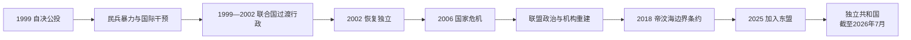

# 公投、独立与国家重建

## 时间

1999年至今；本文核验至2026年7月。

## 概括

1999年自决公投否决印度尼西亚特别自治，随后民兵暴力与大规模破坏迫使国际部队介入。联合国过渡行政在没有完整国家机构的条件下承担立法、行政、安全和公共服务，并逐步把权力交给东帝汶人。2002年恢复独立后，国家建立半总统制、国防军、警察和石油基金，却经历2006年军政危机、联盟僵局与高度油气依赖。2025年东帝汶成为东盟第11个成员国；截至2026年7月，拉莫斯·奥尔塔任总统，沙纳纳·古斯芒任总理。

## 分阶段发展

### 公投暴力与国际部队（1999）

联合国东帝汶特派团登记选民、开展宣传并于8月30日投票，78.5%的有效票拒绝印尼所提自治。结果公布后，亲印尼民兵在部分军警支持下杀戮、纵火、摧毁供水和电力，并把大批居民强迫迁往西帝汶。安理会授权以澳大利亚为主的东帝汶国际部队恢复安全；印尼军队撤离，FALINTIL为避免冲突集中驻营。

### 联合国直接治理与建制（1999—2002）

安理会第1272号决议成立联合国东帝汶过渡行政机构，行政长官塞尔吉奥·维埃拉·德梅洛拥有广泛立法和行政权。初期司法、警察、学校、税收和档案几乎都需重建。2000年成立东帝汶—联合国联合过渡内阁，2001年制宪议会选举后由马里·阿尔卡蒂里领导第二过渡政府。制宪会议采用葡萄牙语和德顿语为官方语言，建立民选总统、总理、议会并存的半总统制。2002年4月古斯芒当选总统，5月20日联合国交还主权。

联合国提供安全和技术资源，却也受到决策自上而下、外籍人员薪酬与本地社会差距、葡语恢复速度等批评。过渡成效应同时看国家机构建成和本地能力培育不足。

### 独立初期与2006年危机（2002—2007）

独立革命阵线在议会占多数，阿尔卡蒂里任总理；古斯芒总统拥有抵抗领袖的超党派声望。政府建立石油基金，把帝汶海收入与年度预算分开管理。2006年约六百名主要来自西部的士兵因晋升和待遇争议离营，被集体解职；军队、警察、政党和地区身份冲突演变为帝力暴力与流离失所。国际部队再度部署，阿尔卡蒂里辞职，拉莫斯·奥尔塔出任总理。

### 联盟政治、安全危机与石油国家（2007—2017）

2007年拉莫斯·奥尔塔当选总统，古斯芒领导联盟政府。2008年叛军袭击总统和总理住所，拉莫斯·奥尔塔重伤，叛军首领阿尔弗雷多·雷纳多死亡；两名国会议长先后代行总统。危机平息后，政府扩大基础设施、退伍军人补助和地方支出。2012年联合国综合特派团撤离，长期维和阶段结束。国家预算越来越依赖石油基金提款，公共部门和建筑业成长，农业生产率、青年就业和私营部门发展相对落后。

### 总统—议会僵局与边界解决（2017—2022）

2017年独立革命阵线少数政府未能通过预算，总统解散议会；2018年提前选举后陶尔·马坦·鲁阿克任总理。2018年东帝汶与澳大利亚通过强制调解签署帝汶海海上边界条约，确定大部分永久边界和大日出气田收益原则，但气田开发地点与成本仍有争议。2020年联盟重组避免再次提前选举；新冠疫情期间边境管制和公共支出保护生命，也冲击流动与非正式经济。

### 拉莫斯·奥尔塔、古斯芒再执政与加入东盟（2022年至今）

拉莫斯·奥尔塔2022年再次当选总统。2023年古斯芒领导的全国重建大会党赢得议会优势并组成第九届宪政政府。2025年10月26日，东帝汶在第47届东盟峰会正式成为第11个成员国，随后加入东盟法律文书；区域成员资格带来市场、规则和行政能力的新要求。截至2026年7月，总统与总理仍分别为拉莫斯·奥尔塔和古斯芒。2026年独立运动领袖、前总统弗朗西斯科·“卢奥洛”·古特雷斯去世，成为抵抗世代逐渐退出政治舞台的象征性节点。

## 统治结构

| 机构 | 产生方式 | 权力与实际运作 |
| --- | --- | --- |
| 总统 | 全民直选，任期五年 | 国家元首、国防军最高统帅；任命总理，可否决、送交复议或在宪法条件下解散议会。 |
| 总理与部长会议 | 总统根据议会多数 / 联盟任命总理 | 领导日常行政、预算、经济、外交执行和公务员体系。 |
| 国民议会 | 比例代表制选举 | 制定法律、批准预算并决定政府能否持续获得支持。 |
| 司法 | 上诉法院及普通法院 | 宪法预设最高法院，但司法人力、语言和地方可及性长期受限。 |
| 国防军与警察 | 文官政府下的独立机构 | 分别承担国防和治安；2006年说明职责、地区身份和指挥关系若不清可引发国家危机。 |
| 石油基金 | 法律设立的主权基金 | 保存油气收入并向预算转移，是财政核心；可持续收入规则与发展需求持续拉扯。 |

总统、代总统、总理、印尼省长、抵抗与联合国行政长官的连续表见[1975年以来国家领导与过渡行政表](/%E4%BA%BA%E6%96%87%E7%A7%91%E5%AD%A6/%E5%8E%86%E5%8F%B2/%E4%B8%9C%E5%8D%97%E4%BA%9A/%E4%B8%9C%E5%B8%9D%E6%B1%B6/1975%E5%B9%B4%E4%BB%A5%E6%9D%A5%E5%9B%BD%E5%AE%B6%E9%A2%86%E5%AF%BC%E4%B8%8E%E8%BF%87%E6%B8%A1%E8%A1%8C%E6%94%BF%E8%A1%A8.md)。

## 重要事件

| 时间 | 事件 | 过程与影响 |
| --- | --- | --- |
| 1999-08-30 | 自决公投 | 78.5%有效票拒绝特别自治，选择走向独立。 |
| 1999-09 | 民兵暴力与国际部队 | 大规模破坏后，获联合国授权部队进驻。 |
| 1999-10 | 联合国过渡行政成立 | 联合国直接承担立法、行政和建制。 |
| 2001 | 制宪议会选举 | 东帝汶代表主导过渡政府和宪法制定。 |
| 2002-05-20 | 恢复独立 | 沙纳纳·古斯芒任总统，阿尔卡蒂里任总理。 |
| 2005 | 石油基金建立 | 以规则管理油气收入，成为财政支柱。 |
| 2006 | 军政与治安危机 | 士兵申诉演变为机构冲突，国际力量重返。 |
| 2008-02-11 | 总统、总理遇袭 | 拉莫斯·奥尔塔重伤，两名议长依次代行总统。 |
| 2012 | 联合国综合特派团结束 | 国际维和撤出，国家承担完整安全责任。 |
| 2017—2018 | 预算僵局与提前选举 | 半总统制中总统、议会和政府关系受检验。 |
| 2018 | 帝汶海边界条约 | 与澳大利亚确定海上边界和资源分配框架。 |
| 2020—2021 | 新冠疫情 | 边境、卫生和社会支出压力上升。 |
| 2022 | 拉莫斯·奥尔塔再次当选 | 总统职位回到资深抵抗领袖手中。 |
| 2023 | 古斯芒再次任总理 | 第九届宪政政府成立。 |
| 2025-10-26 | 成为东盟第11个成员国 | 长期区域融入目标实现，进入规则实施阶段。 |

## 国家重建的条件、危机与持续挑战

### 重建条件

- 公投赋予独立明确民意合法性，抵抗运动和天主教会提供组织网络。
- 联合国、葡萄牙语国家、澳大利亚及其他伙伴提供安全、财政和专业人员。
- 石油基金在资源收入高峰期积累储备，使政府能建设道路、电力、学校和社会转移。

### 结构性困难

- 占领末期破坏造成档案、学校、司法和行政人员缺口；葡萄牙语、德顿语、印尼语和地方语言并存增加教育与法律成本。
- 抵抗世代的个人声望有助于危机调解，也可能使政党制度和代际交接依赖少数领袖。
- 油气收入占财政核心，现有油田衰减；大日出项目、农业、旅游和私营经济能否接替仍未确定。
- 年轻人口、营养、农村道路、城市就业和性别暴力等问题不能仅靠大型基础设施解决。

### 危机的直接机制

2006年危机不是单一“东西地区仇恨”，而是军队申诉、解职程序、警军竞争、政治派系和青年帮派共同升级；国际部队止暴后仍需机构改革。2017—2018年僵局则来自总统与少数政府对议会支持的不同判断，最后通过宪法规定的解散和选举解决。两例显示国家虽脆弱，冲突最终仍回到选举和制度程序。

### 当前阶段

东帝汶并未“完成”国家建设。加入东盟提高国际地位，也要求海关、法律、语言、统计和市场规则持续升级。现任信息截至2026年7月，不对进行中的古斯芒政府作终局评价。

## 演变关系

- 前一节点：[印度尼西亚占领与抵抗](/%E4%BA%BA%E6%96%87%E7%A7%91%E5%AD%A6/%E5%8E%86%E5%8F%B2/%E4%B8%9C%E5%8D%97%E4%BA%9A/%E4%B8%9C%E5%B8%9D%E6%B1%B6/%E5%8D%B0%E5%BA%A6%E5%B0%BC%E8%A5%BF%E4%BA%9A%E5%8D%A0%E9%A2%86%E4%B8%8E%E6%8A%B5%E6%8A%97.md)。
