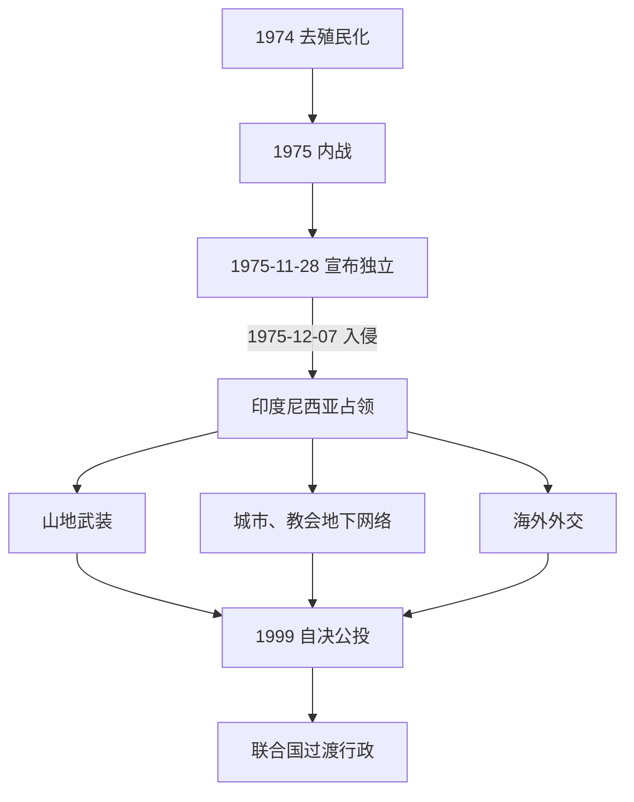

# 印度尼西亚占领与抵抗

## 时间

1974—1999年。1974—1975年为去殖民化和内战，1975年12月7日印度尼西亚全面入侵，1976年宣布吞并；1999年8月公投后占领体系在国际干预和印尼撤军中终结。

## 概括

东帝汶占领史包含三条并行线：印度尼西亚军队和省政府的统治，山地武装—城市地下—海外外交组成的独立抵抗，以及联合国持续不承认吞并的国际法地位。军事“围剿”、强制迁移、饥荒、疾病和政治暴力造成巨大人口损失；估计数字因统计残缺和定义不同而存在范围，不能简化成单一精确数。抵抗运动从独立革命阵线党军逐步转为跨党派民族阵线，教会、青年和影像传播使1990年代国际压力上升。

## 建立背景

1974年葡萄牙去殖民化后，东帝汶民主联盟与独立革命阵线短暂结盟，随后围绕速度、权力和共产主义指控分裂。1975年8月民主联盟政变，独立革命阵线反击获胜；葡萄牙总督撤离。苏哈托政府担心出现左翼小国，并在冷战盟友默许下支持亲整合力量、发动秘密“科莫多行动”和跨境攻击。11月28日独立革命阵线宣布独立，亲整合人物随即签署被印尼用作干预依据的“巴厘博宣言”；12月7日印尼军队海空登陆帝力。

## 分阶段发展

### 入侵、吞并与包围歼灭（1975—1979）

印尼军队迅速占领帝力、包考等城市，处决和失踪事件广泛发生。1976年亲整合临时机构请求并入，印度尼西亚国会宣布设“东帝汶省”，联合国大会和安理会未予承认。独立革命阵线及FALINTIL控制山地人口和“解放区”；1977—1979年印尼实施包围、轰炸和强迫居民下山，农业生产崩溃、疾病和饥荒扩散。尼古劳·洛巴托1978年底阵亡，大规模根据地瓦解，但残余游击没有消失。

### 抵抗重组与“正常化”（1980—1989）

沙纳纳·古斯芒重建FALINTIL，把武装从独立革命阵线党军转为更广泛民族抵抗力量；村镇秘密网络负责情报、粮食和联络，海外阵线由若泽·拉莫斯·奥尔塔等推动外交。印度尼西亚建设道路、学校和行政设施，同时以军区、情报、村落监控和迁移控制社会；发展投入与占领暴力并存，不能用前者抵消后者。1983年短暂停火破裂后军事行动恢复。天主教会采用德顿语礼仪并记录人权问题，逐渐成为社会保护和国际沟通机构。1989年教宗若望保禄二世访问后，领地对外开放增加了青年抗议机会。

### 地下运动与国际化（1989—1998）

1991年11月12日，悼念青年塞巴斯蒂昂·戈梅斯的队伍前往圣克鲁斯墓地，印尼军人向人群开枪。外国记者拍摄并带出影像，惨案使占领问题重新进入全球舆论。1992年古斯芒在帝力被捕、后转押雅加达；抵抗并未停止，马乌努、科尼斯·桑塔纳、陶尔·马坦·鲁阿克依次承担军事领导，学生与城市网络扩大。1996年贝洛主教和拉莫斯·奥尔塔获诺贝尔和平奖。国际社会内部仍有分歧，澳大利亚等国家曾事实上承认印尼控制并同其谈判帝汶海油气。

### 印尼改革、公投与占领终结（1998—1999）

亚洲金融危机和大规模抗议促使苏哈托1998年下台。哈比比起初提出扩大自治，后同意如果选民拒绝自治，印度尼西亚将允许分离。联合国、葡萄牙与印尼达成5月协议，由联合国东帝汶特派团组织投票，安全名义上仍由印尼负责。

1999年8月30日投票率极高，78.5%的有效票拒绝特别自治。亲印尼民兵在部分军警支持、组织或纵容下实施杀戮、纵火、强迫居民进入西帝汶，基础设施遭系统破坏。国际压力迫使雅加达接受获安理会授权的东帝汶国际部队；9月起国际部队部署，10月印尼国会撤销吞并决定，军队和行政人员撤离。随后联合国过渡行政接管。

## 占领与抵抗的权力结构

| 体系 | 最高 / 地方角色 | 实际作用 |
| --- | --- | --- |
| 印度尼西亚中央 | 总统、国军司令部、内政部 | 决定吞并、安全和预算；军方在关键地区拥有超出文官省政府的权力。 |
| 地方行政 | “东帝汶省”省长、县与村官 | 执行教育、建设、人口和行政政策；部分官员来自亲整合精英。 |
| 军事安全 | 军区、特种部队、情报与民兵 | 反游击、监控、拘捕和强制迁移；1999年民兵暴力是终结危机核心。 |
| 武装抵抗 | FALINTIL | 山地游击；从党军转为跨党派民族武装。 |
| 地下阵线 | 学生、青年、教会网络、村民联络员 | 城市抗议、情报、补给和人权记录。 |
| 外交阵线 | 拉莫斯·奥尔塔、流亡团体、葡萄牙等支持者 | 在联合国、教会和国际社会维持自决议题。 |

各体系领导、四任印尼省长、抵抗指挥与过渡行政见[1975年以来国家领导与过渡行政表](/%E4%BA%BA%E6%96%87%E7%A7%91%E5%AD%A6/%E5%8E%86%E5%8F%B2/%E4%B8%9C%E5%8D%97%E4%BA%9A/%E4%B8%9C%E5%B8%9D%E6%B1%B6/1975%E5%B9%B4%E4%BB%A5%E6%9D%A5%E5%9B%BD%E5%AE%B6%E9%A2%86%E5%AF%BC%E4%B8%8E%E8%BF%87%E6%B8%A1%E8%A1%8C%E6%94%BF%E8%A1%A8.md)。

## 重要事件

| 时间 | 事件 | 过程与影响 |
| --- | --- | --- |
| 1974 | 东帝汶政党形成 | 去殖民化路线出现独立、渐进与整合分歧。 |
| 1975-08 | 民主联盟政变与内战 | 独立革命阵线获胜，葡萄牙行政撤离帝力。 |
| 1975-10 | 巴厘博事件与跨境行动 | 五名外国记者在印尼部队行动中死亡，秘密干预升级。 |
| 1975-11-28 | 宣布独立 | 东帝汶民主共和国成立，但未形成稳定国际承认。 |
| 1975-12-07 | 印度尼西亚全面入侵 | 城市迅速陷落，占领战争开始。 |
| 1976 | 宣布“第27省” | 印尼完成国内法吞并，联合国不承认。 |
| 1977—1979 | 包围战、强迫迁移与饥荒 | 山地根据地瓦解，平民死亡和失所达到高峰。 |
| 1978 | 尼古劳·洛巴托阵亡 | 早期抵抗领导层遭重创。 |
| 1981 | 古斯芒重组抵抗 | 武装与民族政治联盟重新建立。 |
| 1983 | 短暂停火破裂 | 谈判窗口关闭，军事行动恢复。 |
| 1989 | 教宗访问、领地有限开放 | 青年公开抗议与国际观察增加。 |
| 1991-11-12 | 圣克鲁斯惨案 | 影像传播使占领暴力受到全球关注。 |
| 1992 | 古斯芒被捕 | 抵抗领袖入狱，地下和外交网络接续。 |
| 1996 | 诺贝尔和平奖 | 贝洛与拉莫斯·奥尔塔提高自决议题国际能见度。 |
| 1998 | 苏哈托下台 | 印尼政治转型打开自治和公投空间。 |
| 1999-08-30 | 联合国主持公投 | 78.5%有效票拒绝印尼特别自治。 |
| 1999-09 | 民兵暴力与国际部队 | 大规模破坏后，国际部队恢复基本安全。 |
| 1999-10 | 印尼撤销吞并 | 联合国过渡行政取代占领体系。 |

## 占领延续与终结原因

### 延续条件

- 印尼拥有压倒性军力和中央财政，把东帝汶问题定义为国内统一与反共安全事务。
- 冷战时期部分西方国家重视同印尼的战略关系，国际谴责没有转化为强制撤军。
- 地形、人口迁移和情报体系削弱游击根据地；抵抗内部也经历路线冲突和领导损失。

### 抵抗没有消失的原因

- 强制吞并缺乏被占领社会广泛同意，亲属、村落、教会和语言网络能在军事失败后保存身份与联络。
- 武装、地下和外交三线分工降低任何一条线被摧毁后的整体风险。
- 印度尼西亚自身教育和城市化政策培养的青年，也可能转化为地下政治参与者。

### 结构压力与直接终点

- 亚洲金融危机和苏哈托政权崩溃降低维持占领的政治意愿；国际人权网络、葡萄牙外交和联合国地位持续施压。
- 哈比比希望快速解决高成本国际问题，决定把自治方案交付投票。
- 公投明确否决自治，公投后暴力又使印尼安全承诺失去可信度；国际部队部署和印尼国会撤销吞并构成直接终结机制。
- 占领结束后并非立即成为完全独立国家，而是进入[公投、独立与国家重建](/%E4%BA%BA%E6%96%87%E7%A7%91%E5%AD%A6/%E5%8E%86%E5%8F%B2/%E4%B8%9C%E5%8D%97%E4%BA%9A/%E4%B8%9C%E5%B8%9D%E6%B1%B6/%E5%85%AC%E6%8A%95%E3%80%81%E7%8B%AC%E7%AB%8B%E4%B8%8E%E5%9B%BD%E5%AE%B6%E9%87%8D%E5%BB%BA.md)的联合国过渡阶段。

## 演变关系

- 前一节点：[帝汶岛社会与葡萄牙殖民](/%E4%BA%BA%E6%96%87%E7%A7%91%E5%AD%A6/%E5%8E%86%E5%8F%B2/%E4%B8%9C%E5%8D%97%E4%BA%9A/%E4%B8%9C%E5%B8%9D%E6%B1%B6/%E5%B8%9D%E6%B1%B6%E5%B2%9B%E7%A4%BE%E4%BC%9A%E4%B8%8E%E8%91%A1%E8%90%84%E7%89%99%E6%AE%96%E6%B0%91.md)。
- 后一节点：[公投、独立与国家重建](/%E4%BA%BA%E6%96%87%E7%A7%91%E5%AD%A6/%E5%8E%86%E5%8F%B2/%E4%B8%9C%E5%8D%97%E4%BA%9A/%E4%B8%9C%E5%B8%9D%E6%B1%B6/%E5%85%AC%E6%8A%95%E3%80%81%E7%8B%AC%E7%AB%8B%E4%B8%8E%E5%9B%BD%E5%AE%B6%E9%87%8D%E5%BB%BA.md)。
- 区域背景：[印度尼西亚历史](/%E4%BA%BA%E6%96%87%E7%A7%91%E5%AD%A6/%E5%8E%86%E5%8F%B2/%E4%B8%9C%E5%8D%97%E4%BA%9A/%E5%8D%B0%E5%B0%BC/README.md)。
