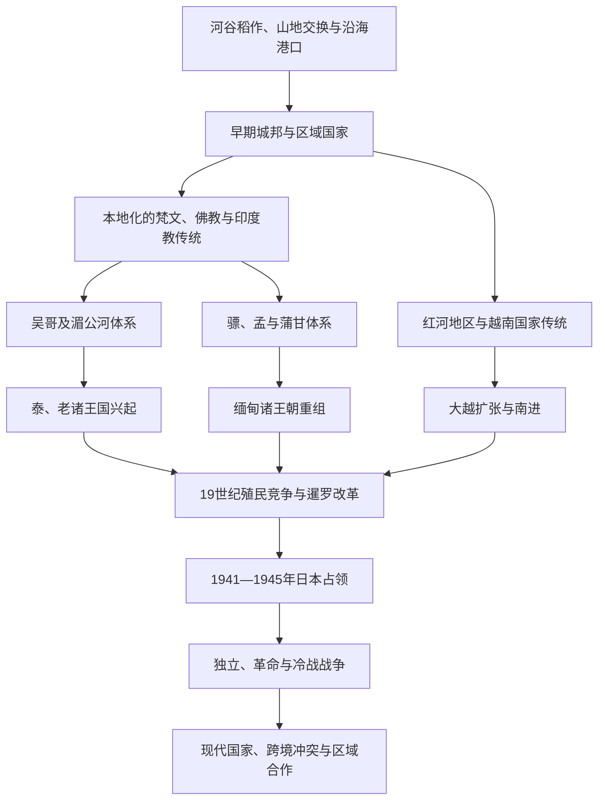

# 中南半岛历史

## 范围

中南半岛历史以伊洛瓦底江、萨尔温江、湄南河、湄公河与红河流域为主，也包括连接河谷国家的山地、海岸和马来半岛北部。它不是封闭的“大陆世界”：孟加拉湾、南海与马六甲海峡贸易持续输入宗教、文字、商品和人口，山地社会也通过马匹、盐、金属、森林物产与低地政权相连。

## 历史主线

中南半岛早期国家由稻作平原、港口和内陆交通共同孕育，地方统治者选择性吸收南亚宗教、文字与王权观念。9世纪以后，吴哥、蒲甘、大越及后来的暹罗、缅甸、老挝诸王国形成相互竞争的区域体系；上座部佛教在大陆西部与中部构成跨国僧团网络，越南则更多结合汉字文化、儒学官僚与大乘佛教传统。19世纪帝国扩张将缅甸纳入英国殖民体系、把越南—柬埔寨—老挝组成法属印度支那，暹罗则以改革、外交和领土让步维持主权。日本占领、去殖民化和冷战战争最终塑造现代边界与国家制度。

## 演进图

## 阶段导航

| 顺序 | 阶段 | 时间 | 入口 | 主线 |
|---|---|---|---|---|
| 1 | 早期国家与印度化 | 约公元前后—9世纪 | [进入笔记](/%E4%BA%BA%E6%96%87%E7%A7%91%E5%AD%A6/%E5%8E%86%E5%8F%B2/%E4%B8%9C%E5%8D%97%E4%BA%9A/%E4%B8%AD%E5%8D%97%E5%8D%8A%E5%B2%9B/%E6%97%A9%E6%9C%9F%E5%9B%BD%E5%AE%B6%E4%B8%8E%E5%8D%B0%E5%BA%A6%E5%8C%96.md) | 港市、河谷城邦与地方统治者重构南亚宗教、文字和王权观念。 |
| 2 | 大陆王国与上座部佛教 | 9—19世纪 | [进入笔记](/%E4%BA%BA%E6%96%87%E7%A7%91%E5%AD%A6/%E5%8E%86%E5%8F%B2/%E4%B8%9C%E5%8D%97%E4%BA%9A/%E4%B8%AD%E5%8D%97%E5%8D%8A%E5%B2%9B/%E5%A4%A7%E9%99%86%E7%8E%8B%E5%9B%BD%E4%B8%8E%E4%B8%8A%E5%BA%A7%E9%83%A8%E4%BD%9B%E6%95%99.md) | 吴哥、蒲甘、大越、暹罗、缅甸与老挝诸王国竞争，僧团和贸易跨越政权边界。 |
| 3 | 殖民统治与现代中南半岛 | 19世纪—至今 | [进入笔记](/%E4%BA%BA%E6%96%87%E7%A7%91%E5%AD%A6/%E5%8E%86%E5%8F%B2/%E4%B8%9C%E5%8D%97%E4%BA%9A/%E4%B8%AD%E5%8D%97%E5%8D%8A%E5%B2%9B/%E6%AE%96%E6%B0%91%E7%BB%9F%E6%B2%BB%E4%B8%8E%E7%8E%B0%E4%BB%A3%E4%B8%AD%E5%8D%97%E5%8D%8A%E5%B2%9B.md) | 英法殖民、暹罗改革、日本占领、去殖民化、冷战与区域合作。 |

## 跨地区比较

| 历史空间 | 生态与交通核心 | 常见政治组织 | 宗教与知识传统 | 近代转折 |
|---|---|---|---|---|
| 伊洛瓦底江—萨尔温江流域 | 河谷稻作、内陆商路与孟加拉湾港口 | 城邦联盟、缅甸王朝与边疆首领网络 | 上座部佛教、孟—缅文字传统及地方信仰 | 三次英缅战争后并入英属印度，1948年独立；中央与边疆关系长期紧张。 |
| 湄南河流域 | 中部平原、海湾港口与半岛通道 | 素可泰、阿瑜陀耶、吞武里与曼谷王朝 | 上座部佛教、王室—僧团制度与多族群港市文化 | 暹罗以中央集权改革和边界让步维持主权，1932年转为君主立宪。 |
| 湄公河流域 | 湖泊—河网稻作、陆路节点与高原物产 | 高棉帝国、澜沧及泰老高棉诸中心 | 印度教—佛教王权、上座部佛教与地方精灵信仰 | 法国保护国和印度支那战争把跨河网络切分为现代国界。 |
| 红河—中部海岸 | 红河三角洲、南海港口与南北交通轴 | 郡县体系、自主王朝与向南扩展的国家 | 儒学官僚、汉字—喃字传统、大乘佛教与村社制度 | 法国殖民、革命和两次印度支那战争后于1976年完成国家统一。 |
| 山地边疆 | 高原、山口、森林物产与跨境亲属网络 | 土司、酋邦、贡赐关系与弹性联盟 | 多种地方宗教及与佛教、基督教的复合实践 | 殖民划界和现代国家治理把流动边疆改造成跨境少数族群地区。 |

## 国家入口

| 国家 | 入口 | 在区域史中的主线 |
|---|---|---|
| 越南 | [越南历史](/%E4%BA%BA%E6%96%87%E7%A7%91%E5%AD%A6/%E5%8E%86%E5%8F%B2/%E4%B8%9C%E5%8D%97%E4%BA%9A/%E8%B6%8A%E5%8D%97/README.md) | 红河国家传统、南进、法属统治、革命战争与统一。 |
| 缅甸 | [缅甸历史](/%E4%BA%BA%E6%96%87%E7%A7%91%E5%AD%A6/%E5%8E%86%E5%8F%B2/%E4%B8%9C%E5%8D%97%E4%BA%9A/%E7%BC%85%E7%94%B8/README.md) | 骠—孟—缅互动、蒲甘以来王朝、英国征服与军政冲突。 |
| 泰国 | [泰国历史](/%E4%BA%BA%E6%96%87%E7%A7%91%E5%AD%A6/%E5%8E%86%E5%8F%B2/%E4%B8%9C%E5%8D%97%E4%BA%9A/%E6%B3%B0%E5%9B%BD/README.md) | 暹罗诸王朝、19世纪改革、君主立宪与军政循环。 |
| 柬埔寨 | [柬埔寨历史](/%E4%BA%BA%E6%96%87%E7%A7%91%E5%AD%A6/%E5%8E%86%E5%8F%B2/%E4%B8%9C%E5%8D%97%E4%BA%9A/%E6%9F%AC%E5%9F%94%E5%AF%A8/README.md) | 扶南—真腊—吴哥传统、法属保护、战争与国家重建。 |
| 老挝 | [老挝历史](/%E4%BA%BA%E6%96%87%E7%A7%91%E5%AD%A6/%E5%8E%86%E5%8F%B2/%E4%B8%9C%E5%8D%97%E4%BA%9A/%E8%80%81%E6%8C%9D/README.md) | 澜沧及分裂王国、法属统治、革命与社会主义国家。 |

## 关键辨析

- “印度化”是地方社会主动选择、翻译和重组外来资源的过程，不意味着南亚政权直接殖民整个半岛。
- “曼荼罗式政体”可用于解释中心权威随距离递减、属邦关系重叠等现象，但不能取代对税收、土地、法律和军事组织的具体研究。
- 古代王国重视人口、稻田、寺院和交通节点，势力范围常有重叠；现代边界不能倒投为固定疆域。
- “上座部佛教国家”内部仍存在僧团派系、地方信仰、穆斯林与基督徒社群，越南的制度与宗教轨迹也明显不同。
- 山地社会不是低地国家的静止边缘，而是贸易、战争、迁徙和国家形成的参与者。

## 相关专题与上级

- 区域共同过程：[东南亚贸易、宗教与移民网络](/%E4%BA%BA%E6%96%87%E7%A7%91%E5%AD%A6/%E5%8E%86%E5%8F%B2/%E4%B8%9C%E5%8D%97%E4%BA%9A/_%E9%80%9A%E5%8F%B2/%E8%B4%B8%E6%98%93%E3%80%81%E5%AE%97%E6%95%99%E4%B8%8E%E7%A7%BB%E6%B0%91%E7%BD%91%E7%BB%9C.md)。
- 区域近现代专题：[殖民、战争、独立与东盟](/%E4%BA%BA%E6%96%87%E7%A7%91%E5%AD%A6/%E5%8E%86%E5%8F%B2/%E4%B8%9C%E5%8D%97%E4%BA%9A/_%E9%80%9A%E5%8F%B2/%E6%AE%96%E6%B0%91%E3%80%81%E6%88%98%E4%BA%89%E3%80%81%E7%8B%AC%E7%AB%8B%E4%B8%8E%E4%B8%9C%E7%9B%9F.md)。
- 直接上级：[东南亚历史](/%E4%BA%BA%E6%96%87%E7%A7%91%E5%AD%A6/%E5%8E%86%E5%8F%B2/%E4%B8%9C%E5%8D%97%E4%BA%9A/README.md)。
