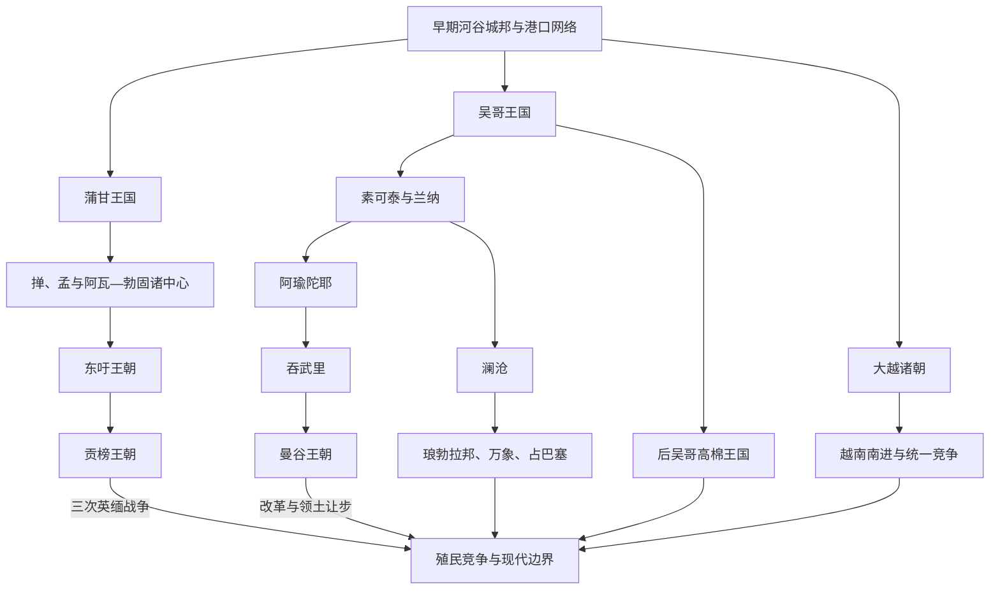

# 中南半岛大陆王国与上座部佛教

## 时间

9世纪至19世纪中叶；各王国的起止时间彼此重叠。

## 概括

9世纪以后，吴哥、蒲甘和大越等政治中心扩大对稻作平原、人口、寺院土地与交通节点的动员。13世纪前后，蒙古扩张、区域人口迁徙和贸易变化促成旧秩序重组，素可泰、兰纳、阿瑜陀耶、澜沧及后来的东吁、贡榜等王国相继兴起。上座部佛教通过斯里兰卡与大陆僧团间的授戒、经典和寺院网络逐渐占据缅甸、泰国、老挝与柬埔寨的主导位置；越南则主要以儒学官僚、大乘佛教与地方村社制度组织国家。整个时期不存在单一“大陆帝国”，而是多个中心围绕人口、贡赋和商路反复结盟与战争。

## 国家形成与统治机制

| 机制 | 作用与限度 |
|---|---|
| 河谷稻作与水利 | 王室修建或维护水库、渠道、堤坝和道路，但大型工程往往由地方社群、寺院与多级官员共同运作，不能简单归为中央统一规划。 |
| 人口动员 | 战争目标常包括俘获农民、工匠、僧侣和贵族；人口比边界线更能决定税收、军役与生产能力。 |
| 王都—属邦体系 | 核心区由宫廷和官僚直接控制，外围通过册封、婚姻、贡赐与人质维持；同一地方可能同时向数个强权纳贡。 |
| 寺院与僧团 | 王室捐赠土地、重整僧团和兴建佛塔以积累功德与正统性；寺院又承担教育、文书、信贷和地方调解。 |
| 法律与文书 | 巴利—孟—缅及泰老法律传统、王令和习惯法并存；越南更多采用汉文官僚制度并发展喃字书写。 |
| 港口与跨境贸易 | 鹿皮、稻米、锡、木材、象、陶瓷和纺织品连接内陆王都、南海与印度洋，港市税收支持军队和宫廷。 |

## 主要政治体系

| 政治体系 | 核心阶段 | 区域作用 |
|---|---|---|
| 吴哥王国 | 802年传统建国纪年至15世纪 | 以洞里萨湖和吴哥平原为核心，综合印度教与佛教王权，控制交通和人口的能力随时期伸缩。 |
| 蒲甘王国 | 11世纪中叶—13世纪末 | 整合伊洛瓦底河谷，形成密集佛塔、寺院土地和上座部佛教网络；末期因财政、地方势力与战争共同分裂。 |
| 大越诸朝 | 10—19世纪 | 以红河三角洲为核心，发展儒学官僚、科举与村社体系，并长期向中部和南部扩展。 |
| 素可泰—兰纳 | 13—16世纪 | 泰语政治中心兴起，吸收高棉、孟人与斯里兰卡佛教传统；后分别受到阿瑜陀耶、缅甸等强权影响。 |
| 阿瑜陀耶—曼谷 | 1351—19世纪中叶 | 以湄南河平原和海湾贸易为基础，形成多族群宫廷、等级劳役和广泛外交网络；1767年毁都后由吞武里、曼谷国家重建。 |
| 澜沧及其后继王国 | 1353—18世纪初统一期，后分裂延续 | 连接湄公河谷与高原，以上座部佛教和王族分封维系统治；继承争议促成琅勃拉邦、万象、占巴塞并立。 |
| 东吁—贡榜 | 16—19世纪 | 东吁在勃固和上缅甸资源支持下建立短暂广域帝国；贡榜重新统一缅甸并向曼尼普尔、暹罗等地扩张，最终卷入英缅战争。 |
| 占婆诸中心 | 至1832年被阮朝完成吞并 | 越南中南部沿海的多中心占语政治体，在海贸、越南南进和高棉互动之间不断收缩与重组。 |

各王朝完整君主世系由相应国家目录维护，本页只比较跨境机制，不复制国家世系。

## 上座部佛教的扩展与地方化

### 僧团网络

11世纪以后，缅甸、孟人地区与斯里兰卡之间的授戒、经典和人员往来更密切；13—15世纪，这些网络又进入泰北、素可泰、老挝和柬埔寨。所谓“斯里兰卡系”并非一次传播，而是多轮授戒改革和正统性竞争。僧侣跨境旅行，王室也会邀请外地高僧整顿本国僧团。

### 王权与法律

佛教理想把君主描述为护持正法、积累功德的统治者，转轮王和菩萨王等观念为扩张与施舍提供语言。然而僧团并非王室行政部门：寺院拥有土地、劳力和声望，王室重整僧团既是宗教行动，也是重新确认财政与政治秩序。戒律、佛教法论、王令和地方习惯共同构成法律实践。

### 地区差异

- 缅甸、泰国、老挝与柬埔寨逐渐形成上座部佛教占主导的王国传统，但婆罗门仪式、祖先崇拜、精灵信仰和伊斯兰港市始终存在。
- 吴哥在阇耶跋摩七世时期大力支持大乘佛教，13世纪以后上座部佛教扩展；这一变化是宫廷、僧团和乡村社会共同重组，不是一次王令造成。
- 越南王朝以儒学官僚和国家礼制为主，同时容纳大乘佛教、道教及村社神灵；不能套用西部大陆的僧王关系。
- 山地族群与低地佛教国家保持贡赐、贸易和战争关系，也保留独立的政治与宗教传统。

## 重要事件与转折

| 时间 | 事件 | 过程与影响 |
|---|---|---|
| 802年（传统纪年） | 阇耶跋摩二世的政治整合 | 后世铭文将其与吴哥王权起点相连；此后数代王室逐步把洞里萨湖周边寺庙、土地和地方首领纳入共同秩序。 |
| 938年 | 白藤江之战 | 吴权击败南汉军队，红河地区进入持续的自主国家建设阶段。 |
| 968年 | 丁部领建立大瞿越 | 结束十二使君割据，重建王都、官职和对外名号。 |
| 11世纪中叶 | 阿奴律陀扩大蒲甘 | 蒲甘控制上缅甸农业核心并向下缅甸扩展；“1057年征服直通并取得全部佛典”的细节主要来自后世编年史，学界有争议。 |
| 1075—1077年 | 宋越战争 | 李朝先攻宋境、随后在如月江防御，最终议和；显示大越已具独立军事与外交能力。 |
| 1113—约1150年 | 吴哥窟与苏利耶跋摩二世时代 | 大型寺庙工程、战争和跨区域外交体现吴哥动员能力，也加重对土地与劳役的需求。 |
| 1181—约1218年 | 阇耶跋摩七世重建吴哥 | 在占婆攻陷吴哥后复国，修建道路、寺庙和医疗设施，并以大乘佛教重塑王权。 |
| 13世纪 | 斯里兰卡授戒传统在大陆扩展 | 缅甸、孟人、泰北和素可泰等地先后重整僧团，上座部佛教逐渐形成跨国共同体。 |
| 1283—1287年 | 蒙古军进入上缅甸、蒲甘秩序瓦解 | 外部战争加速王室财政、寺院土地与地方权力的危机；蒲甘并非在单一战役中立即灭亡。 |
| 13世纪后期 | 素可泰和兰纳兴起 | 泰语政治中心吸收孟、高棉及本地传统，改变湄南河上游和泰北的权力格局。 |
| 1351年 | 阿瑜陀耶建立 | 新都利用湄南河稻作、海湾贸易和属邦网络，逐渐取代素可泰成为暹罗主要中心。 |
| 1353年 | 澜沧建立 | 法昂在湄公河中游整合王族、地方首领与佛教资源，奠定老挝王国传统。 |
| 1431年前后 | 阿瑜陀耶军攻入吴哥 | 高棉王都重心随后逐渐南移；贸易变化、王室内争、生态压力和暹罗战争共同推动吴哥政治中心转移。 |
| 1530年代—1581年 | 东吁扩张与勃应囊帝国 | 东吁王朝整合缅甸、孟人港口和掸邦力量，一度迫使暹罗、兰纳、澜沧等中心臣服；广域体系在勃应囊死后迅速松动。 |
| 1592—1593年 | 暹罗恢复自主 | 纳黎萱时代阿瑜陀耶摆脱东吁控制并反攻，显示贡属关系随军事强弱快速改变。 |
| 1707年以后 | 澜沧分裂 | 王位争夺和区域权力介入使琅勃拉邦、万象、占巴塞等中心并立，更易受暹罗与越南影响。 |
| 1752年 | 贡榜王朝建立 | 雍笈牙借下缅甸战争重建缅甸王权，随后扩大人口迁徙、军役和边疆征服。 |
| 1767年 | 缅甸军攻毁阿瑜陀耶 | 旧都和王室体系崩溃，但暹罗政治很快在吞武里重建，1782年再转入曼谷王朝。 |
| 1824—1826年 | 第一次英缅战争 | 贡榜帝国与英属印度边疆扩张发生正面冲突，战败割地、赔款并削弱财政，开启殖民转折。 |

## 兴盛、转型与衰落的共同因素

### 兴盛条件

- 掌握高产稻作平原、河港和跨海贸易，可同时获得粮食、现金商品和外来武器。
- 建立稳定的王族继承、地方首领联盟和人口登记制度，才能把战时征服转化为持续税役。
- 寺院、文字和法律网络提供行政人才与正统性，跨国宗教关系还能增强统治者声望。
- 吸收俘虏、移民和商人常比单纯占领土地更能扩大国家能力。

### 结构性脆弱

- 王位继承缺少单一规则，共治、分封和王族竞争常引发属邦脱离。
- 宫廷核心与外围之间控制差异巨大，广域帝国依赖统治者个人威望及持续军事成功。
- 大量寺院免税土地、战争动员和宫廷工程可能压缩王室财政，但各地程度不一。
- 港口和贸易路线转移会削弱旧都，火器、雇佣军和欧洲公司又改变战争成本。

### 外部压力与直接触发

蒙古军、越—占战争、缅暹战争和海上欧洲势力均会放大内部危机，但很少单独解释王朝崩溃。蒲甘、吴哥、东吁帝国、阿瑜陀耶和贡榜的转折都需要区分长期财政—继承—地方权力问题、区域竞争，以及具体战役或统治者死亡等直接触发因素。

## 演变关系

- 前一节点：[早期国家与印度化](/%E4%BA%BA%E6%96%87%E7%A7%91%E5%AD%A6/%E5%8E%86%E5%8F%B2/%E4%B8%9C%E5%8D%97%E4%BA%9A/%E4%B8%AD%E5%8D%97%E5%8D%8A%E5%B2%9B/%E6%97%A9%E6%9C%9F%E5%9B%BD%E5%AE%B6%E4%B8%8E%E5%8D%B0%E5%BA%A6%E5%8C%96.md)。
- 后一节点：[殖民统治与现代中南半岛](/%E4%BA%BA%E6%96%87%E7%A7%91%E5%AD%A6/%E5%8E%86%E5%8F%B2/%E4%B8%9C%E5%8D%97%E4%BA%9A/%E4%B8%AD%E5%8D%97%E5%8D%8A%E5%B2%9B/%E6%AE%96%E6%B0%91%E7%BB%9F%E6%B2%BB%E4%B8%8E%E7%8E%B0%E4%BB%A3%E4%B8%AD%E5%8D%97%E5%8D%8A%E5%B2%9B.md)。
- 所属总览：[中南半岛历史](/%E4%BA%BA%E6%96%87%E7%A7%91%E5%AD%A6/%E5%8E%86%E5%8F%B2/%E4%B8%9C%E5%8D%97%E4%BA%9A/%E4%B8%AD%E5%8D%97%E5%8D%8A%E5%B2%9B/README.md)。
