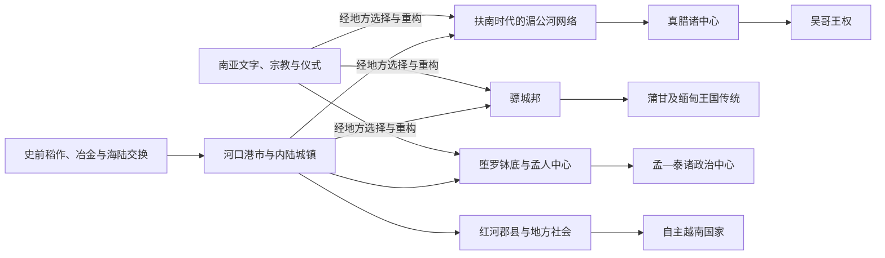

# 中南半岛早期国家与印度化

## 时间

约公元前后至9世纪；部分早期政治文化网络延续至11世纪，各地进入国家化和文字史的时间并不一致。

## 概括

中南半岛早期国家并非由一种外来文明突然“移植”而成。稻作、青铜与铁器生产、河海交通和地方首领网络提供了社会基础；印度洋贸易扩张后，统治者、商人和宗教人员又选择性采用梵文、巴利文、源自南亚的文字、佛教与印度教仪式，以连接跨区域声望体系。扶南、真腊、骠城邦、堕罗钵底、孟人中心、林邑—早期占婆和红河地区因此形成多条并行而相互作用的路径。

## 形成条件与运行机制

| 机制 | 具体作用 |
|---|---|
| 河谷与港口互补 | 稻米和人口来自平原与河谷，金属、香料、树脂、象牙等物产来自山地，河口港市负责转运和征税。 |
| 季风航行 | 商船依季风往返印度洋与南海，港口既是补给点，也是翻译、婚姻和宗教传播空间。 |
| 文字与仪式 | 梵文常用于王室称号、捐赠和神圣谱系，本地语言及不同文字则逐渐用于行政、纪功和宗教实践。 |
| 多中心统治 | 统治者通过贡品、婚姻、军事威慑和宗教捐赠联结地方首领，控制强度随距离而变化。 |
| 跨国宗教网络 | 佛教僧侣、婆罗门和工匠携带经典、仪式与艺术样式；地方社会并未因此放弃祖先及自然神灵信仰。 |

## 主要政治与文化网络

| 政治体 / 区域 | 大致时期 | 结构与演变 |
|---|---|---|
| 扶南 | 约1—6世纪 | 湄公河下游港口和农业腹地组成的网络。“扶南”主要见于中国文献，王都、疆域和统一程度仍有争议；不能直接等同现代柬埔寨。 |
| 真腊 | 约6—8世纪 | 多个高棉语政治中心逐步取代扶南时代的网络。所谓“陆真腊”“水真腊”来自外部记载，不必然代表两个边界清晰的统一国家。 |
| 骠城邦 | 约公元前2世纪—9世纪 | 以室利差呾罗、毗湿奴城、罕林等为中心，连接伊洛瓦底河谷、印度洋商路与云南方向；佛教、城市规划和多种文字并存。 |
| 堕罗钵底及孟人中心 | 约6—11世纪 | 泰国中部佛教城镇网络，以钱币、铭文和艺术遗存重建；学界对其是否为单一王国、中心何在均有讨论。 |
| 林邑—早期占婆 | 约2—9世纪 | 越南中部沿海的多个占语政治中心，依靠港口、河谷和海贸发展；“林邑”与后世占婆的关系具有阶段性，不能视为始终统一的国家。 |
| 红河地区 | 前2世纪末—10世纪初 | 在中国王朝郡县制度、地方豪强、村社和南海贸易的互动中演变；多次地方起义与自治尝试为后来的大越国家提供政治经验。 |
| 早期高棉内陆中心 | 7—9世纪 | 湄公河中上游和洞里萨湖周边政治中心竞争，逐渐形成吴哥时代的土地、寺庙、劳役与王权基础。 |

## 过程与关键转折

| 时间 | 事件 / 转折 | 意义 |
|---|---|---|
| 约公元前2世纪以后 | 骠城市在缅甸中部发展 | 表明内陆城市化、灌溉与跨区域贸易早于后来的蒲甘统一。 |
| 公元1—6世纪 | 湄公河下游港口—农业网络繁荣 | 扶南时代的港口将南海航线、湄公河腹地和印度洋商品连接起来。 |
| 192年前后（传统纪年） | 汉文史籍记载林邑兴起 | 反映越南中部地方势力摆脱汉朝郡县控制；具体建国过程和连续性仍需谨慎理解。 |
| 4—5世纪 | 梵文与本地语言铭文增多 | 王号、寺庙捐赠和宗教仪式进入文字记录，地方语言也逐步形成书写传统。 |
| 5—6世纪 | 扶南网络弱化、真腊诸中心上升 | 政治重心由海岸—三角洲网络向内陆高棉中心重组，并非一次简单的“灭国”。 |
| 6—8世纪 | 堕罗钵底佛教城市网络兴盛 | 泰国中部城镇通过孟语文化、佛教艺术和贸易形成共享传统。 |
| 7—8世纪 | 骠城邦与唐朝、南亚保持交往 | 伊洛瓦底河谷被纳入更广阔的外交和佛教网络。 |
| 722年 | 梅叔鸾起兵 | 红河地区地方力量反抗唐朝统治，显示郡县秩序与本地社会长期拉锯。 |
| 9世纪上半叶 | 南诏势力向缅甸和半岛北部扩展 | 贸易、战争与人口迁徙改变骠城邦及山地—低地关系。 |
| 802年（传统纪年） | 阇耶跋摩二世的政治整合仪式 | 常被视为吴哥王权起点，但“统一全国”及仪式细节主要依后世铭文重建。 |
| 9世纪 | 吴哥地区大型都城与寺庙网络形成 | 早期多中心格局转入更强的王室工程、土地捐赠和区域动员阶段。 |

## 地区差异

### 西部河谷

骠与孟人中心更直接连接孟加拉湾和南亚佛教网络。城市之间保持竞争，语言、佛教派别和地方神灵并不统一。9世纪骠中心衰落与南诏军事压力、贸易路线变化及内部重组有关，不能归因于单一“外族入侵”。

### 湄南河与湄公河

堕罗钵底、扶南和真腊均是现代学术为解释分散材料而使用的名称。河口贸易重要，但内陆稻作、寺庙土地和人口控制同样决定政治力量。高棉政治中心向洞里萨湖—吴哥地区集中，是水利、农业、交通和王室联盟共同作用的结果。

### 红河与中部海岸

红河地区长期处于中国王朝直接或间接统治之下，制度、文字和政治词汇与东亚联系更深；中部沿海的占语政治体则更依赖南海贸易，并发展印度教、佛教和本地祖先崇拜的复合传统。两者之间既有战争，也有贸易和人口交流。

## 争议与辨析

- “印度化”不是一套完整制度从印度单向输出；考古材料显示，本地社会在接触南亚之前已有复杂技术、交换和社会分层。
- 中国史籍中的国名常是对使节、港口或统治集团的外部称呼，不能自动对应稳定疆域。
- 宗教建筑集中不等于全民信仰一致；宫廷、僧团、村社和山地群体采用外来传统的方式不同。
- 苏伐那普米等“黄金之地”称谓范围不明，不能据后世宗教传说确定阿育王时代某一现代国家已经接受上座部佛教。
- 早期年代多由铭文、考古层位和外部文献互证，遇到冲突应保留“约”“可能”或“存在争议”。

## 演变关系

- 后续：[大陆王国与上座部佛教](/%E4%BA%BA%E6%96%87%E7%A7%91%E5%AD%A6/%E5%8E%86%E5%8F%B2/%E4%B8%9C%E5%8D%97%E4%BA%9A/%E4%B8%AD%E5%8D%97%E5%8D%8A%E5%B2%9B/%E5%A4%A7%E9%99%86%E7%8E%8B%E5%9B%BD%E4%B8%8E%E4%B8%8A%E5%BA%A7%E9%83%A8%E4%BD%9B%E6%95%99.md)。
- 所属总览：[中南半岛历史](/%E4%BA%BA%E6%96%87%E7%A7%91%E5%AD%A6/%E5%8E%86%E5%8F%B2/%E4%B8%9C%E5%8D%97%E4%BA%9A/%E4%B8%AD%E5%8D%97%E5%8D%8A%E5%B2%9B/README.md)。
- 跨区域背景：[东南亚贸易、宗教与移民网络](/%E4%BA%BA%E6%96%87%E7%A7%91%E5%AD%A6/%E5%8E%86%E5%8F%B2/%E4%B8%9C%E5%8D%97%E4%BA%9A/_%E9%80%9A%E5%8F%B2/%E8%B4%B8%E6%98%93%E3%80%81%E5%AE%97%E6%95%99%E4%B8%8E%E7%A7%BB%E6%B0%91%E7%BD%91%E7%BB%9C.md)。
