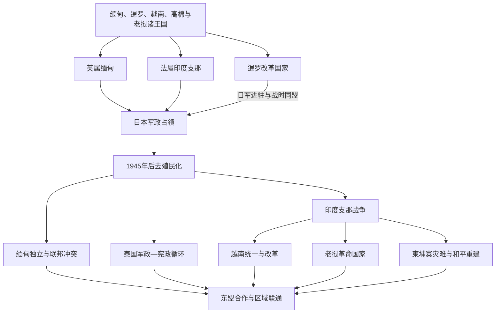

# 殖民统治与现代中南半岛

## 时间

19世纪初至今；现代部分核验截至2026年7月。

## 概括

中南半岛的近现代转型不是整齐一致的“殖民—独立”过程。英国经三次英缅战争吞并缅甸，并先将其作为英属印度一省治理；法国把越南的不同地区与柬埔寨、老挝组合为法属印度支那；暹罗未被正式殖民，却在英法压力下签订不平等条约、割让属地并实行中央集权改革。1941—1945年日本占领打断欧洲秩序，既给民族主义组织提供军政空间，也造成强制劳动、征粮、饥荒与屠杀。战后独立、共产主义革命、美国介入及跨境内战彼此交织，直到20世纪90年代才形成较稳定的国家间秩序；缅甸内战、湄公河资源治理与政治威权仍使区域整合面临限制。

## 殖民扩张与边界形成

| 体系 | 行政结构 | 经济与社会机制 | 长期影响 |
|---|---|---|---|
| 英属缅甸 | 1886年后并入英属印度，1937年成为单独殖民地；平原“本部”与边区采用不同治理方式 | 稻米出口、土地信贷、港口和铁路扩张，大量印度劳工与商人迁入；传统王室和僧团资助结构被打断 | 平原—边疆差别治理、族群军事招募和殖民人口分类影响独立后的联邦冲突。 |
| 法属印度支那 | 1887年起由东京、安南、交趾支那、柬埔寨组成，1893年纳入老挝；殖民地与保护国法律地位不同 | 土地税、人头税、种植园、矿业、酒盐鸦片专卖、铁路与港口；教育机会有限且高度分层 | 现代行政边界、土地不平等和跨境革命网络同时形成，越南人在联邦行政中的流动也引发地方矛盾。 |
| 暹罗改革国家 | 王室通过中央部制、常备军、税收、司法和教育改革取代松散属邦关系 | 以治外法权和关税限制换取外交承认，并让出湄公河东岸、马来属邦等地 | 维持国际法上的主权，却将地方首领和多族群边区纳入更强的泰族中心国家。 |
| 山地边疆 | 英法以条约、测绘和间接统治划定山区边界 | 殖民军招募、传教学校、鸦片与森林经济改变低地—高地关系 | 同一族群被分隔在多个国家，自治承诺、武装组织和边境贸易延续至今。 |

## 分阶段过程

### 帝国推进与条约体系（1824—1893年）

英国从阿萨姆、孟加拉湾和马来半岛方向压迫贡榜缅甸，三次战争依次夺取若开、丹那沙林、下缅甸和上缅甸。法国从南越海岸推进，以军事占领、条约和保护国形式控制越南、柬埔寨，继而在1893年迫使暹罗放弃湄公河东岸。边界并非单由地图划定，而是在远征、地方首领选择、测绘和英法谈判中逐步落实。

### 殖民国家与暹罗中央集权（1893—1941年）

殖民政府修建铁路、港口和灌溉设施，把稻米、橡胶、锡、煤等纳入世界市场，同时借税收、专卖、土地登记与强制劳役转移资源。暹罗拉玛五世以来的改革废除或改造徭役与奴役关系、设置省级行政，将北部、东北和南部属地更直接地纳入曼谷。学校、报刊、城市工人和留学生群体又孕育新的民族主义、社会主义及宗教改革运动。

### 日本占领与殖民秩序崩解（1941—1945年）

泰国在短暂抵抗后与日本结盟，但自由泰运动在国内外活动；缅甸独立军最初协助日军，后来转而反日；越南、老挝、柬埔寨的殖民行政先受日本监督，1945年3月被彻底推翻。军粮征收、交通破坏和自然灾害共同促成1944—1945年越南北部严重饥荒。日军败退使欧洲列强难以恢复战前权威，却没有自动带来和平。

### 去殖民化与印度支那战争（1945—1975年）

越南民主共和国于1945年宣布独立，法国复归导致第一次印度支那战争；1954年日内瓦协议暂时分割越南，并确认老挝、柬埔寨的独立框架。美国支持南越并扩大军事介入，北越、南方民族解放阵线、老挝和柬埔寨各派战争逐渐连为一体。缅甸1948年独立后即面对共产主义者和多个族群武装；泰国则成为美国的反共盟友，并以军人政权、经济开发和王室象征维持秩序。

### 革命国家、难民与战后重建（1975—1999年）

1975年越南统一进程、老挝人民民主共和国建立和红色高棉夺权改变半岛政治。红色高棉的大规模强迫迁徙、处决、饥饿与疾病造成灾难；1978年底越南出兵柬埔寨，冲突进一步卷入中国、泰国、苏联和美国。越南革新开放、老挝新经济机制及1991年柬埔寨和平协定标志冷战秩序逐渐结束。越南于1995年、老挝与缅甸于1997年、柬埔寨于1999年加入东盟。

### 区域合作与未决冲突（2000年至今）

跨境公路、产业链和旅游把大陆国家更紧密地联结起来，湄公河水电、航运和生态问题也需要跨国协商。泰国军人干政与街头政治、柬埔寨和老挝的长期一党或主导党统治、越南的一党改革路径各不相同。缅甸2021年军事政变破坏有限政治开放，和平抗议、镇压、民族地方武装和新抵抗力量演变为全国性冲突；东盟以“五点共识”等方式斡旋，但成员分歧和不干涉规范限制效果。截至2026年，东南亚十一国均已成为东盟成员，不过区域组织并不能替代国内和平与权利保障。

## 重要事件与时间节点

| 时间 | 事件 | 结果与长期影响 |
|---|---|---|
| 1824—1826年 | 第一次英缅战争 | 缅甸割让若开、丹那沙林等地并承担赔款，财政与边疆秩序受重创。 |
| 1852年 | 第二次英缅战争 | 英国占领下缅甸和勃固，控制伊洛瓦底江口及稻米出口区。 |
| 1855年 | 《宝灵条约》 | 暹罗降低关税并给予英国治外法权，进入不平等条约体系，也借开放贸易争取外交缓冲。 |
| 1858—1862年 | 法国入侵并取得交趾支那东部 | 法国以西贡为基地开始领土殖民，逐步压迫阮朝。 |
| 1863年 | 柬埔寨接受法国保护 | 柬王借法国制衡暹罗、越南压力，主权则被保护国制度逐步架空。 |
| 1885—1886年 | 第三次英缅战争与贡榜灭亡 | 英国放逐末代国王锡袍，吞并上缅甸；地方抵抗持续多年。 |
| 1887年 | 法属印度支那联邦建立 | 越南三部分与柬埔寨纳入共同总督体系，老挝于1893年加入。 |
| 1893年 | 法暹危机 | 暹罗放弃湄公河东岸，老挝殖民边界成形；其后英法协议继续界定缓冲区。 |
| 1932年 | 暹罗立宪革命 | 绝对君主制结束，军人、文官、王室和民选力量开始长期竞争。 |
| 1937年 | 缅甸与英属印度分治 | 单独殖民政府建立，但边区制度和族群政治问题未获解决。 |
| 1941—1945年 | 日本占领中南半岛 | 欧洲殖民军政权威崩解，民族主义组织获得经验，同时发生大规模征粮、劳役和战争暴力。 |
| 1944—1945年 | 越南北部饥荒 | 战时征购、运输中断、殖民和日军政策及灾害共同造成大量死亡，激化反殖民动员。 |
| 1945年 | 越南八月革命及印度支那政权真空 | 越南民主共和国宣布独立；老挝、柬埔寨也出现短暂自主政府，随后面对殖民复归与内部分裂。 |
| 1948年 | 缅甸独立 | 联邦建立后不久即陷入共产党起义与族群武装冲突。 |
| 1954年 | 奠边府战役与日内瓦会议 | 法国结束主要殖民战争，越南暂以北纬17度线分区，老挝和柬埔寨获得国际承认。 |
| 1962年 | 奈温在缅甸政变 | 军队建立长期统治并推行“缅甸式社会主义”，经济和政治封闭加深。 |
| 1964—1973年 | 美国扩大印度支那战争 | 轰炸、地面战争和秘密行动跨越越南、老挝、柬埔寨，造成大规模伤亡与流离失所。 |
| 1975年 | 西贡陷落、老挝革命、红色高棉夺权 | 半岛三个印度支那国家先后由共产党掌权，但政治与社会后果差异极大。 |
| 1978—1979年 | 越南出兵柬埔寨、中越战争 | 红色高棉政权被推翻，柬埔寨冲突国际化，越南长期驻军并承受制裁压力。 |
| 1986年 | 越南启动革新开放 | 市场机制与对外开放逐步恢复增长，老挝随后推行类似改革。 |
| 1991年 | 《巴黎和平协定》 | 柬埔寨进入联合国主持的停火、遣返与选举进程，武装冲突并未立刻完全结束。 |
| 1997—1999年 | 老挝、缅甸、柬埔寨加入东盟 | 东盟首次覆盖全部中南半岛国家，政治制度差异被纳入同一协商框架。 |
| 2021年 | 缅甸军事政变 | 民选政府被推翻，抗议与镇压升级为更广泛内战和人道危机。 |

## 现代国家形成路径比较

| 国家 | 殖民 / 主权路径 | 建国与政体转折 | 需要避免的简化 |
|---|---|---|---|
| 越南 | 法国殖民、日本占领、抗法与越南战争 | 1945年宣告独立，1954年南北分治，1976年国家统一；1986年后改革开放 | 不能把民族独立、南北内战与大国代理战争压缩成单一叙事。 |
| 缅甸 | 英国吞并、英属印度一省、单独殖民地 | 1948年独立，1962年军政体制固化，2011年后有限开放，2021年政变 | 不能把多族群联邦冲突只解释为宗教或“古老仇恨”。 |
| 泰国 | 未正式殖民，以改革和让地维持主权 | 1932年君主立宪，此后民选政府、军人政变与王室政治反复 | “从未被殖民”不等于未受帝国经济、法权和边界压力。 |
| 柬埔寨 | 法国保护国、日本占领 | 1953年独立，1970年政变，1975年红色高棉，1979年后重建，1991年和平进程 | 吴哥传统、殖民边界、内战和冷战外部介入应分层说明。 |
| 老挝 | 法国保护国、日本占领 | 1953—1954年独立获确认，内战后1975年建立人民民主共和国 | 不能忽略山地社会、泰越关系和“秘密战争”的跨境性质。 |

## 因果分析

### 结构因素

- 殖民者用不同制度管理低地与山地、核心与保护国，给独立国家留下不对称行政和武装体系。
- 世界市场扩张创造铁路、港口和出口部门，也加剧土地集中、债务、劳工迁徙及区域差距。
- 现代民族身份在学校、军队、人口普查分类和反殖民组织中被制度化，既支持独立，也可能排斥少数群体。
- 山地边疆跨越国界，中央集权与自治诉求之间的矛盾难以靠一次独立或宪法解决。

### 外部压力

英法竞争、日本战争、冷战阵营和中美苏介入不断改变地方力量的资源。外部援助可扩大战争规模，却不能解释各国为何形成不同政治联盟；本地阶级、族群、宗教和领导人选择同样关键。

### 直接触发

殖民军进攻、1945年权力真空、政变、暗杀、选举争议或特定战役会触发制度崩解。分析时应把这些事件与长期土地问题、军队政治化、继承制度和国际环境区分，避免把红色高棉兴起、缅甸内战或泰国政变归为单一原因。

## 演变关系

- 前一节点：[大陆王国与上座部佛教](/%E4%BA%BA%E6%96%87%E7%A7%91%E5%AD%A6/%E5%8E%86%E5%8F%B2/%E4%B8%9C%E5%8D%97%E4%BA%9A/%E4%B8%AD%E5%8D%97%E5%8D%8A%E5%B2%9B/%E5%A4%A7%E9%99%86%E7%8E%8B%E5%9B%BD%E4%B8%8E%E4%B8%8A%E5%BA%A7%E9%83%A8%E4%BD%9B%E6%95%99.md)。
- 所属总览：[中南半岛历史](/%E4%BA%BA%E6%96%87%E7%A7%91%E5%AD%A6/%E5%8E%86%E5%8F%B2/%E4%B8%9C%E5%8D%97%E4%BA%9A/%E4%B8%AD%E5%8D%97%E5%8D%8A%E5%B2%9B/README.md)。
- 区域共同专题：[殖民、战争、独立与东盟](/%E4%BA%BA%E6%96%87%E7%A7%91%E5%AD%A6/%E5%8E%86%E5%8F%B2/%E4%B8%9C%E5%8D%97%E4%BA%9A/_%E9%80%9A%E5%8F%B2/%E6%AE%96%E6%B0%91%E3%80%81%E6%88%98%E4%BA%89%E3%80%81%E7%8B%AC%E7%AB%8B%E4%B8%8E%E4%B8%9C%E7%9B%9F.md)。
