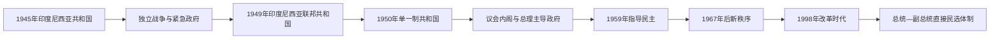

# 印度尼西亚总统、副总统与总理表

## 范围与制度

本表区分国家元首、政府首脑和特殊战争／联邦过渡职务。1945年宪法设置总统制；1945—1959年间因革命和临时宪法安排，内阁一度由总理领导。1959年恢复1945年宪法后，总统再次同时领导政府。1999—2002年宪法修正后，总统与副总统由人民直选、任期五年且最多连任一次，内阁部长对总统负责。

截至2026年7月，总统为普拉博沃·苏比延多，副总统为吉布兰·拉卡布明·拉卡；两人于2024年10月20日就职。本表把苏哈托的代总统阶段、苏门答腊紧急政府和印度尼西亚联邦共和国时期分开说明，避免误造平行的连续“总统任次”。

## 国家制度与职位演变图

1945—1959年间，总统、副总统、总理、紧急政府负责人和联邦职务曾同时或先后承担最高权力。1959年以后总理职位取消，总统成为行政核心；改革时代再经修宪形成现行直接选举制度。

## 总统与代总统（1945年至今）

| 顺序 | 总统 | 任期 | 产生、继承与关键事件 |
| ---: | --- | --- | --- |
| 1 | **苏加诺**（Sukarno） | 1945-08-18—1967-03-12 | 制宪机构选任的开国总统；领导独立革命，1949—1950年任印度尼西亚联邦共和国总统；1959年开启“指导民主”。1966年后实权逐步转给苏哈托，1967年被临时人民协商会议解除职权。 |
| 代总统 | **苏哈托**（Suharto） | 1967-03-12—1968-03-27 | 1966年“3月11日命令”后掌握政府与军队；1967年获代总统职权。 |
| 2 | **苏哈托** | 1968-03-27—1998-05-21 | 人民协商会议选任并多次连任；建立军方与专业集团主导的“新秩序”。亚洲金融危机、精英分裂和群众抗议中辞职。 |
| 3 | 优素福·哈比比（B. J. Habibie） | 1998-05-21—1999-10-20 | 以前任副总统身份依宪接任；放宽政治管制、启动选举改革和东帝汶公投。问责报告未获人民协商会议接受，未继续竞选。 |
| 4 | 阿卜杜拉赫曼·瓦希德（Abdurrahman Wahid） | 1999-10-20—2001-07-23 | 由人民协商会议选出；推动文人政治和多元文化政策，因议会冲突与治理危机被罢免。 |
| 5 | **梅加瓦蒂·苏加诺普特丽**（Megawati Sukarnoputri） | 2001-07-23—2004-10-20 | 以前任副总统身份接任，为首位女性总统；任内完成总统直选等制度准备。 |
| 6 | **苏西洛·班邦·尤多约诺**（Susilo Bambang Yudhoyono） | 2004-10-20—2014-10-20 | 首位经全民直选产生的总统；连任两届，任内达成亚齐和平协议并巩固选举民主。 |
| 7 | **佐科·维多多**（Joko Widodo） | 2014-10-20—2024-10-20 | 两届直选总统；推动基础设施、社会保障和迁都规划，后期执政联盟高度集中。 |
| 8 | **普拉博沃·苏比延多**（Prabowo Subianto） | 2024-10-20—至今 | 2024年直选获胜；截至2026年7月在任，政府以大型社会项目、粮食与能源安全、国防和产业政策为重点。 |

## 副总统（1945年至今）

| 顺序 | 副总统 | 任期 | 与总统及关键说明 |
| ---: | --- | --- | --- |
| 1 | **穆罕默德·哈达**（Mohammad Hatta） | 1945-08-18—1956-12-01 | 苏加诺搭档、独立宣言共同签署人；因对指导化趋势和政治路线分歧辞职。 |
| 空缺 | — | 1956-12-01—1973-03-24 | 指导民主和新秩序初期未设在任副总统。 |
| 2 | 哈孟库布沃诺九世（Hamengkubuwono IX） | 1973-03-24—1978-03-23 | 苏哈托首位副总统，日惹苏丹。 |
| 3 | 亚当·马利克（Adam Malik） | 1978-03-23—1983-03-11 | 外交家、前外长。 |
| 4 | 乌马尔·维拉哈迪库苏马（Umar Wirahadikusumah） | 1983-03-11—1988-03-11 | 退役将领。 |
| 5 | 苏达尔莫诺（Sudharmono） | 1988-03-11—1993-03-11 | 专业集团政治家。 |
| 6 | 特里·苏特里斯诺（Try Sutrisno） | 1993-03-11—1998-03-11 | 前武装部队司令。 |
| 7 | 优素福·哈比比 | 1998-03-11—1998-05-21 | 苏哈托最后一任副总统；总统辞职后继任。 |
| 空缺 | — | 1998-05-21—1999-10-21 | 改革过渡期。 |
| 8 | **梅加瓦蒂·苏加诺普特丽** | 1999-10-21—2001-07-23 | 瓦希德副总统；瓦希德被罢免后接任总统。 |
| 9 | 哈姆扎·哈兹（Hamzah Haz） | 2001-07-26—2004-10-20 | 梅加瓦蒂副总统。 |
| 10 | **优素福·卡拉**（Jusuf Kalla） | 2004-10-20—2009-10-20 | 尤多约诺第一届搭档，参与亚齐和平进程。 |
| 11 | 布迪约诺（Boediono） | 2009-10-20—2014-10-20 | 尤多约诺第二届搭档，经济学家。 |
| 12 | **优素福·卡拉** | 2014-10-20—2019-10-20 | 第二次任副总统，搭档佐科。 |
| 13 | 马鲁夫·阿敏（Ma'ruf Amin） | 2019-10-20—2024-10-20 | 佐科第二届搭档，伊斯兰学者与政治人物。 |
| 14 | **吉布兰·拉卡布明·拉卡**（Gibran Rakabuming Raka） | 2024-10-20—至今 | 普拉博沃搭档；截至2026年7月在任。 |

## 总理与议会内阁（1945—1959）

1945年11月以后，革命政府以总理和责任内阁争取国内多党合作与国际承认。1949—1950年联邦时期同时存在“印度尼西亚联邦共和国总理”和作为联邦成员的“印度尼西亚共和国总理”，两者不得合并。1959年7月总统令恢复1945年宪法后不再设置总理。

| 顺序 | 总理 | 任期 | 政体 / 关键说明 |
| ---: | --- | --- | --- |
| 1 | **苏丹·夏赫里尔**（Sutan Sjahrir） | 1945-11-14—1947-07-03 | 印度尼西亚共和国；先后三届内阁，以外交谈判争取承认。 |
| 2 | 阿米尔·谢里夫丁（Amir Sjarifuddin） | 1947-07-03—1948-01-29 | 印度尼西亚共和国；《伦维尔协定》后失去支持。 |
| 3 | **穆罕默德·哈达** | 1948-01-29—1949-12-20 | 印度尼西亚共和国；兼副总统，在革命战争后期领导紧缩和军队重组。 |
| 联邦 | **穆罕默德·哈达** | 1949-12-20—1950-09-06 | 印度尼西亚联邦共和国总理；推动联邦向单一共和国合并。 |
| 代理 | 苏桑托·蒂尔托普罗佐（Susanto Tirtoprodjo） | 1949-12-20—1950-01-21 | 联邦成员“印度尼西亚共和国”的代理总理。 |
| 并立 | 阿卜杜勒·哈利姆（Abdul Halim） | 1950-01-21—1950-09-06 | 联邦成员“印度尼西亚共和国”总理，政府在日惹。 |
| 4 | 穆罕默德·纳席尔（Mohammad Natsir） | 1950-09-06—1951-04-27 | 单一共和国恢复后的首任总理；马斯友美党。 |
| 5 | 苏基曼·维尔约桑佐约（Sukiman Wirjosandjojo） | 1951-04-27—1952-04-03 | 马斯友美党—印度尼西亚民族党联合内阁。 |
| 6 | 维洛波（Wilopo） | 1952-04-03—1953-07-30 | 处理财政、军政和土地冲突，因政治危机辞职。 |
| 7 | **阿里·沙斯特罗阿米佐约**（Ali Sastroamidjojo） | 1953-07-30—1955-08-12 | 第一届；任内筹办1955年万隆会议。 |
| 8 | 布尔汉丁·哈拉哈普（Burhanuddin Harahap） | 1955-08-12—1956-03-24 | 组织1955年首次全国议会选举。 |
| 9 | **阿里·沙斯特罗阿米佐约** | 1956-03-24—1957-04-09 | 第二届；地区与政党危机加深。 |
| 10 | **朱安达·卡塔维查亚**（Djuanda Kartawidjaja） | 1957-04-09—1959-07-09 | “工作内阁”；在戒严和总统权力扩张下运作，1957年提出群岛国家海洋主张。 |

## 战争与联邦过渡中的特殊最高职务

| 人物 / 机构 | 时间 | 性质与权力边界 |
| --- | --- | --- |
| **沙弗鲁丁·普拉维拉内加拉**与印度尼西亚共和国紧急政府（PDRI） | 1948-12-22—1949-07-13 | 荷军占领日惹并拘捕苏加诺、哈达后，在苏门答腊维持共和国政府连续性。沙弗鲁丁是紧急政府主席，不另计为共和国总统。 |
| **阿萨特**（Assaat） | 1949-12-27—1950-08-17 | 苏加诺出任联邦共和国总统期间，阿萨特代理联邦成员“印度尼西亚共和国”的总统；不是与苏加诺并列的全印度尼西亚国家元首。 |
| 印度尼西亚联邦共和国 | 1949-12-27—1950-08-17 | 苏加诺任总统、哈达任总理；由共和国与荷兰创建的多个邦组成，随后在政治压力下并入单一共和国。 |

## 不同时期的实际权力结构

| 时期 | 正式制度 | 实际权力核心 |
| --- | --- | --- |
| 独立革命 | 总统、总理与中央国民委员会 | 共和国文官政府、地方革命委员会、青年组织和军队共同动员；中央对各地武装控制并不完整。 |
| 议会民主 | 总统为国家元首，总理和内阁向议会负责 | 多党联盟频繁更迭；军队、地区司令和政党群众组织影响扩大。 |
| 指导民主 | 总统制、任命议会与“纳萨贡”平衡 | 苏加诺居中调节军队、印度尼西亚共产党与民族主义集团；经济和地区危机削弱制度稳定。 |
| 新秩序 | 总统、人民协商会议与内阁 | 苏哈托、武装部队“双重职能”、专业集团、官僚与商业网络构成权力核心；选举竞争受严格限制。 |
| 改革时代 | 总统直选、两院议会、宪法法院与地方自治 | 总统须经营跨党派联盟；军队退出保留议席，地方首长与公民社会获得空间，但寡头资本、政治家族和联盟集中仍影响政策。 |

## 相关笔记

- [独立革命与印度尼西亚共和国](/%E4%BA%BA%E6%96%87%E7%A7%91%E5%AD%A6/%E5%8E%86%E5%8F%B2/%E4%B8%9C%E5%8D%97%E4%BA%9A/%E5%8D%B0%E5%B0%BC/%E7%8B%AC%E7%AB%8B%E9%9D%A9%E5%91%BD%E4%B8%8E%E5%8D%B0%E5%BA%A6%E5%B0%BC%E8%A5%BF%E4%BA%9A%E5%85%B1%E5%92%8C%E5%9B%BD.md)
- [荷属东印度殖民行政首脑表](/%E4%BA%BA%E6%96%87%E7%A7%91%E5%AD%A6/%E5%8E%86%E5%8F%B2/%E4%B8%9C%E5%8D%97%E4%BA%9A/%E5%8D%B0%E5%B0%BC/%E8%8D%B7%E5%B1%9E%E4%B8%9C%E5%8D%B0%E5%BA%A6%E6%AE%96%E6%B0%91%E8%A1%8C%E6%94%BF%E9%A6%96%E8%84%91%E8%A1%A8.md)
- [印度尼西亚历史总览](/%E4%BA%BA%E6%96%87%E7%A7%91%E5%AD%A6/%E5%8E%86%E5%8F%B2/%E4%B8%9C%E5%8D%97%E4%BA%9A/%E5%8D%B0%E5%B0%BC/README.md)
