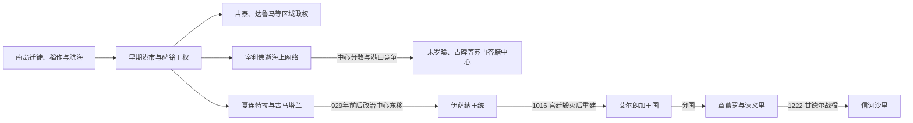

# 早期王国与室利佛逝

## 时间

前1千纪—13世纪

## 概括

南岛语族先民在更早时期进入群岛，发展稻作、航海与岛际交换。公元初期以后，群岛港市通过季风航线参与印度洋贸易，本地统治者吸收梵语、印度教和佛教观念以构建王权。苏门答腊的室利佛逝依托马六甲海峡航道形成海上网络，爪哇则发展稻作王国和大型寺庙。

这些政权不是一条连续王朝：古泰、达鲁马、室利佛逝、夏连特拉、古马塔兰和谏义里在不同岛屿并立或部分重叠。碑铭只留下少数君主，证据空白不能用后世传说补齐。

## 建立背景与崛起机制

- 季风规律使船只可在印度洋与南海间往返，海峡港口通过补给、转口、领航和征税获利。
- 群岛统治者借梵语称号、祭祀、佛教功德和碑铭强化地位，但印度文化是在地选择与重构，并非人口大规模“殖民”。
- 苏门答腊港口控制河流出海口，可连接内陆黄金、树脂和香料产区；室利佛逝以舰队、港口盟约和对航道节点的惩罚性远征维持网络。
- 中、东爪哇拥有火山土壤、灌溉稻作和密集人口，王权可以征发劳役营建寺庙并供养常设宫廷。
- 王国的“疆域”常是核心直辖区、王族领地、贡属港口和短期盟友的组合，不能按现代国界理解。

## 早期碑铭王权

| 政权 | 可确认统治者 | 大致时间 | 证据与说明 |
|---|---|---|---|
| 古泰 | 库东加（Kudungga） | 约4世纪 | 穆拉瓦曼祭柱铭文追述的祖先；是否已采用印度式王号不明 |
| 古泰 | 阿斯瓦瓦曼（Aswawarman） | 约4世纪 | 库东加之子，被称为王族奠基者 |
| 古泰 | **穆拉瓦曼**（Mulawarman） | 约4—5世纪 | 祭柱铭文的捐献者；古泰唯一有较具体同时代事迹的国王 |
| 达鲁马 | **普尔纳瓦曼**（Purnawarman） | 约5世纪 | 西爪哇多块碑铭记其水利、足迹与王权；连续前后世系不明 |
| 达鲁马 | 后世所列诸王 | 4—7世纪 | 主要见于成书很晚且真伪、年代受争议的材料，不宜视为与碑铭同等可靠的完整王表 |

## 室利佛逝可考统治者

室利佛逝没有保存连续宫廷编年。下表是铭文和外来记录中可辨认的统治者，时间空缺代表证据缺失，不表示其间没有君主；爪哇夏连特拉与苏门答腊室利佛逝的婚姻、共主或宗主关系也有不同解释。

| 顺序 | 统治者 | 可考时间 | 继承关系 | 关键事件 / 备注 |
|---|---|---|---|---|
| 1 | **达蓬塔·香·室利·阇耶那舍**（Dapunta Hyang Sri Jayanasa） | 683—684年前后 | 已知奠基者 | 吉度干武吉、塔朗图奥等铭文记远征、建园和整合南苏门答腊 |
| 2 | 室利因陀罗跋摩（Sri Indravarman） | 约702年 | 不详 | 中国记录中的室利佛逝君主，曾遣使唐朝 |
| 3 | 楼陀罗·毗讫罗摩（Rudra Vikrama） | 约728年 | 不详 | 外来记录所见，身份和称号转写不一 |
| 4 | **达摩塞都**（Dharmasetu） | 约775年前后 | 不详 | 与马来半岛利戈尔铭文及夏连特拉婚姻网络相关 |
| 5 | 三摩罗统伽（Samaratungga） | 约8世纪末—9世纪初 | 与达摩塞都家族通婚 | 通常也是中爪哇夏连特拉君主；是否直接统治室利佛逝存在争议 |
| 6 | **巴拉普特拉德瓦**（Balaputradewa） | 约835—860年代 | 三摩罗统伽与达摩塞都之女多罗之子 | 在爪哇争位失败后转至苏门答腊的解释较常见；那烂陀铭文显示其佛教赞助 |
| 7 | 室利乌达耶迭多跋摩（Sri Udayaditya Varman） | 约960年 | 不详 | 中国记录中的三佛齐统治者 |
| 8 | 一位仅以“诃只”称号出现的君主 | 约980年 | 不详 | “诃只”意为王，个人名未保存 |
| 9 | **室利朱罗摩尼跋摩提婆**（Sri Cudamani Warmadewa） | 约988—1008年 | 不详 | 与中国、南印度佛寺及外交往来有关 |
| 10 | 室利摩罗毗阇耶东伽跋摩（Sri Maravijayottungavarman） | 约1008—1025年前 | 前王之子 | 继续赞助南印度那伽钵底南佛寺 |
| 11 | **僧伽罗摩·毗阇耶东伽跋摩**（Sangrama Vijayottungavarman） | 1025年在位 | 不详 | 朱罗远征中被俘；不能简单理解为室利佛逝当天灭亡 |
| 12 | 特赖洛迦罗阇·毛利菩萨那跋摩（Trailokyaraja Maulibhusana Warmadewa） | 约1178年可考 | 不详 | 与占碑—末罗瑜中心相关；是否仍应称“室利佛逝国王”有争议 |

## 古马塔兰／棉兰王世系

中爪哇时期王表主要依据907、908年碑铭。夏连特拉究竟是独立佛教王朝、与所谓“珊阇耶王朝”并立，还是同一王族内部的宗教与称号差异，仍有争论。个别短期君主和年份也有不同释读。

| 顺序 | 国王 | 在位时间 | 关键事件 / 备注 |
|---|---|---|---|
| 1 | **珊阇耶**（Sanjaya） | 约717/732—746年 | 732年仓伽尔铭文可考；建立湿婆教王权核心 |
| 2 | 帕南卡兰（Panangkaran） | 746—784年 | 支持迦拉珊佛寺；与夏连特拉关系解释不一 |
| 3 | 帕纳拉班／帕农加兰（Panaraban / Panunggalan） | 784—803年左右 | 姓名是否指一人、与达拉尼因陀罗关系均有争议 |
| 4 | 瓦拉克（Warak） | 803—827年 | 有观点将其与夏连特拉君主三摩罗格罗毗罗相联系 |
| 5 | 迪亚·古拉（Dyah Gula） | 827—828年 | 在位极短，仅见王表传统 |
| 6 | 加隆（Garung） | 828—847年 | 有观点将其与三摩罗统伽相联系 |
| 7 | **皮卡丹**（Pikatan） | 847—855年 | 与佛教王女普拉莫达瓦尔达尼联姻；普兰巴南营建与宫廷重组 |
| 8 | 卡尤旺伊／洛卡波罗（Kayuwangi / Lokapala） | 855—885年 | 856年碑铭记前期战争结束和湿婆神庙 |
| 9 | 迪亚·塔格瓦斯（Dyah Tagwas） | 885年 | 短期夺位 |
| 10 | 帕努姆旺安·迪亚·德文德拉 | 885—887年 | 短期统治 |
| 11 | 古伦旺伊·迪亚·巴德拉 | 887年 | 短期统治；其后数年王位记录不清 |
| 12 | 瓦图胡马朗（Watuhumalang） | 894—898年 | 恢复较稳定王权 |
| 13 | **巴利东**（Balitung） | 898—910年 | 扩大中、东爪哇联系，以碑铭追列前王 |
| 14 | 达克沙（Daksha） | 910—约919年 | 曾为高级王族官员；即位与前王关系有争议 |
| 15 | 图洛东（Tulodong） | 约919—924年 | 延续东移趋势 |
| 16 | 瓦瓦（Wawa） | 924—929年 | 中爪哇阶段末王 |
| 17 | **姆普·辛多克**（Mpu Sindok） | 929—947年 | 把政治中心迁至东爪哇，建立伊萨纳支系 |
| 18 | 室利伊萨纳·东伽毗阇耶（Sri Isyana Tunggawijaya） | 约947—985年 | 辛多克之女，可能与洛卡波罗共治 |
| 19 | 摩古陀旺萨跋摩（Makutawangsawardhana） | 约985—990年 | 前王之子 |
| 20 | **达摩旺萨·德固**（Dharmawangsa Teguh） | 约990—1016年 | 对海上贸易与苏门答腊用兵；“普拉拉亚”事变中宫廷被毁 |
| — | 王权中断 | 1016—1019年 | 地方敌对势力袭击后，东爪哇分裂 |
| 21 | **艾尔朗加**（Airlangga） | 1019—1049年 | 达摩旺萨外甥或女婿一系；重建东爪哇秩序；晚年把王国分为章葛罗与谏义里 |

## 谏义里可考王世系

1049年分国后的早期世系不完整，章葛罗与谏义里的边界和优势多次变化。下表列出碑铭与文学传统中通常承认的谏义里君主。

| 顺序 | 国王 | 在位时间 | 关键事件 / 备注 |
|---|---|---|---|
| 1 | 三摩罗毗阇耶（Samaravijaya） | 约1042/1049—1051年后 | 艾尔朗加之子，谏义里早期君主；终年不详 |
| — | 早期记录空缺 | 11世纪中后期 | 章葛罗、谏义里关系及君主次序不清 |
| 2 | 阇耶跋沙（Jayawarsa） | 约1104年可考 | 碑铭所见，是否连续承接前王不详 |
| 3 | 跋摩湿婆罗（Bameswara） | 约1117—1130年 | 宫廷和地区秩序发展 |
| 4 | **阇耶跋耶**（Jayabhaya） | 约1135—1159年 | 谏义里文化高峰，宫廷文学繁荣 |
| 5 | 萨尔瓦湿婆罗（Sarvesvara） | 1159—1169年 | 继承关系不详 |
| 6 | 阿利耶湿婆罗（Aryesvara） | 1169—1181年 | 维持东爪哇王权 |
| 7 | 乾陀罗（Gandra） | 1181—1182年 | 在位短暂 |
| 8 | 迦迷湿婆罗（Kamesvara） | 1182—1194年 | 文学与宫廷文化继续发展 |
| 9 | **讫哩多阇耶**（Kertajaya） | 1194—1222年 | 与婆罗门集团冲突；甘德尔战役败于肯·阿罗克，谏义里灭亡 |

## 重要事件

- 4—5世纪古泰和达鲁马碑铭显示群岛统治者已使用梵语、祭祀与水利工程塑造王权。
- 671年唐代僧人义净停留室利佛逝，记录其佛教学习环境和通往印度的航路。
- 683—686年室利佛逝铭文记达蓬塔·香的远征、建园和对港口、官员宣誓体系的组织。
- 8—9世纪婆罗浮屠和普兰巴南建筑群反映中爪哇佛教与湿婆教王权、劳役和稻作财政的结合。
- 9世纪巴拉普特拉德瓦时期，苏门答腊王权与那烂陀等跨国佛教中心建立联系。
- 929年前后古马塔兰中心东移，原因可能包括政治竞争、火山活动、贸易与东爪哇农业机会，不能归为单一灾变。
- 1016年达摩旺萨宫廷遭地方敌对势力袭击，艾尔朗加随后重建国家。
- 1025年南印度朱罗王朝袭击室利佛逝及海峡多处港口，打击其中心和航道网络，却未立即终结所有相关港市。
- 1049年前后艾尔朗加分国，谏义里逐步取得优势，东爪哇宫廷文学与区域贸易繁荣。
- 1222年肯·阿罗克击败讫哩多阇耶，建立信诃沙里；13世纪末其政治传统转入满者伯夷。

## 鼎盛、衰落与转型

室利佛逝的鼎盛来自马六甲与巽他海峡位置、对河口和补给港的控制、海上武力及佛教外交。其弱点是网络依赖港口效忠与航道收益，中心难以长期直接统治各岛。朱罗袭击、爪哇和占碑港口竞争、贸易路线变化共同削弱巨港优势；1025年是重大转折而非简单“灭国日”。

古马塔兰和谏义里的强项是稻作人口、劳役和宫廷—寺庙体系，弱点则是王族领地、短期夺位和地方领主反叛。1016年宫廷毁灭和1222年甘德尔败战分别是两次政权转换的直接触发。

## 演变关系

海峡贸易传统延伸至[马来港市与苏丹国](/%E4%BA%BA%E6%96%87%E7%A7%91%E5%AD%A6/%E5%8E%86%E5%8F%B2/%E4%B8%9C%E5%8D%97%E4%BA%9A/%E9%A9%AC%E6%9D%A5%E8%A5%BF%E4%BA%9A/%E9%A9%AC%E6%9D%A5%E6%B8%AF%E5%B8%82%E4%B8%8E%E8%8B%8F%E4%B8%B9%E5%9B%BD.md)；东爪哇由古马塔兰、艾尔朗加分国、谏义里和信诃沙里逐步进入[满者伯夷与伊斯兰苏丹国](/%E4%BA%BA%E6%96%87%E7%A7%91%E5%AD%A6/%E5%8E%86%E5%8F%B2/%E4%B8%9C%E5%8D%97%E4%BA%9A/%E5%8D%B0%E5%B0%BC/%E6%BB%A1%E8%80%85%E4%BC%AF%E5%A4%B7%E4%B8%8E%E4%BC%8A%E6%96%AF%E5%85%B0%E8%8B%8F%E4%B8%B9%E5%9B%BD.md)。
