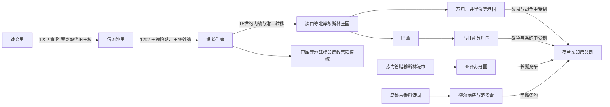

# 满者伯夷与伊斯兰苏丹国

## 时间

13—17世纪

## 概括

1293年满者伯夷在东爪哇建立，其宫廷在14世纪扩展对港口和邻岛政权的宗主权，成为后世印度尼西亚统一叙事的重要象征。与此同时，穆斯林商人、苏菲网络和港市统治者推动伊斯兰化；这一过程因地区而异，并未使旧有文化立即消失。

满者伯夷、淡目、亚齐、马打蓝、德尔纳特、蒂多雷和戈瓦—塔洛是并行政权，不能组成一条统一王统。本页为满者伯夷及三个影响范围最大的后继王权列连续表；其他岛屿苏丹国保留各自王室和继承传统。

## 建立背景与崛起机制

- 1292年信诃沙里末王讫哩多那揭罗被谏义里叛军杀死；其女婿罗登·Wijaya先借元军击败敌人，再驱逐元军，于1293年建立满者伯夷。
- 东爪哇稻作核心提供人口和粮食，北岸港口连接香料贸易；宫廷以王族领地、税赋、军役和对外使节维持宗主网络。
- 14世纪加查·马达主持军事和外交扩张，但群岛多数地区是纳贡、贸易和声望关系，并非满者伯夷直接派官统治。
- 穆斯林商人、婚姻、苏菲教师和港口精英推动伊斯兰化。地方统治者采用苏丹称号以加入印度洋商业与宗教网络。
- 葡萄牙占领马六甲后，亚齐、万丹、柔佛和爪哇港口承接贸易；荷兰东印度公司后来以垄断合同、堡垒和盟约介入各国竞争。

## 信诃沙里王世系

信诃沙里的早期继承主要依据《巴拉拉顿》等后出叙事与碑铭互证，肯·阿罗克、阿努沙巴迪、陀阇耶的具体在位年有不同重建；下表采用常见次序，并把毗湿奴瓦尔达纳与纳拉辛哈穆尔蒂的共治写入备注。

| 顺序 | 国王 | 常见在位时间 | 与前任关系 | 关键事件 / 备注 |
|---|---|---|---|---|
| 1 | **肯·阿罗克／罗阇娑**（Ken Arok / Rajasa） | 1222—约1227年 | 开国者 | 甘德尔战役击败谏义里末王，建立新王权；死于宫廷复仇，早年传说成分较多 |
| 2 | 阿努沙巴迪（Anusapati） | 约1227—1248年 | 前王继子或子嗣 | 宫廷复仇叙事中的继承者；同时代事迹有限 |
| 3 | 陀阇耶（Tohjaya） | 1248年前后 | 肯·阿罗克之子 | 推翻阿努沙巴迪后在位短暂，遭王族联盟推翻 |
| 4 | **毗湿奴瓦尔达纳／朗伽武尼**（Vishnuvardhana / Ranggawuni） | 1248—1268年 | 阿努沙巴迪之子 | 与纳拉辛哈穆尔蒂形成共治或权力伙伴关系，恢复稳定 |
| 5 | **讫哩多那揭罗**（Kertanagara） | 1268—1292年 | 前王之子 | 推动苏门答腊远征和湿婆—佛教王权；拒绝元朝要求，1292年被阇耶迦旺叛军杀死 |

## 满者伯夷王世系

15世纪后期存在东西宫廷、并立君主和铭文空白；“1478年灭亡”只是旧都被攻破的一项传统纪年，达哈政权可能延续至15世纪末或16世纪初。

| 顺序 | 国王 / 女王 | 在位时间 | 与前任关系 | 关键事件 / 备注 |
|---|---|---|---|---|
| 1 | **罗登·Wijaya／讫多罗阇娑**（Raden Wijaya / Kertarajasa） | 1293—1309年 | 开国者 | 借元军击败阇耶迦旺后反击元军；建立新宫廷 |
| 2 | 阇耶那揭罗（Jayanegara） | 1309—1328年 | 前王之子 | 多次平定王族与将领叛乱；遭宫廷医生杀害 |
| 3 | **特里布瓦娜·Wijayatunggadewi** | 1328—1350年 | 前王异母妹 | 以母亲罗阇波提尼名义执政；任用加查·马达并征服巴厘 |
| 4 | **哈亚姆·乌鲁克／罗阇娑那揭罗**（Hayam Wuruk） | 1350—1389年 | 前女王之子 | 与加查·马达时期形成海上贡赋与外交高峰 |
| 5 | 维克拉玛瓦尔达纳（Wikramawardhana） | 1389—1429年 | 哈亚姆·乌鲁克女婿 | 与东宫不烈·维拉布米并立；1404—1406年帕勒格雷格内战 |
| — | 不烈·维拉布米（Bhre Wirabhumi） | 约1389—1406年并立 | 哈亚姆·乌鲁克之子 | 控制东宫，内战失败被杀，不另计连续正统顺序 |
| 6 | 苏希塔女王（Suhita） | 1429—1447年 | 前王之女 | 处理内战余波，恢复部分宫廷秩序 |
| 7 | 讫多罗Wijaya（Kertawijaya） | 1447—1451年 | 王族叔辈 | 继承关系与宫廷派系复杂 |
| 8 | 罗阇娑瓦尔达纳（Rajasawardhana） | 1451—1453年 | 前王姻亲或王族 | 死后出现三年王位空缺 |
| — | 王位空缺 | 1453—1456年 | — | 地方王族分立 |
| 9 | 吉利萨瓦尔达纳／普罗瓦维舍沙（Girishawardhana / Purwawisesa） | 1456—1466年 | 王族 | 在达哈—东爪哇支系中重整王权 |
| 10 | 辛哈维克拉玛瓦尔达纳（Singhawikramawardhana） | 1466—1474年 | 前王之弟或近亲 | 1468年后与不烈·讫多罗菩弥并立 |
| — | 不烈·讫多罗菩弥（Bhre Kertabhumi） | 1468—1478年并立 | 罗阇娑瓦尔达纳之子 | 控制旧都满者伯夷；1478年败于吉邻陀罗瓦尔达纳 |
| 11 | **吉邻陀罗瓦尔达纳·罗那Wijaya**（Girindrawardhana Ranawijaya） | 1474/1478—约1498年 | 达哈王族支系 | 攻破旧都后以达哈为中心；王国终年与淡目关系存在争议 |

## 淡目苏丹世系

| 顺序 | 苏丹 | 在位时间 | 继承关系 | 关键事件 / 备注 |
|---|---|---|---|---|
| 1 | **罗登·帕塔**（Raden Patah） | 约1500—1518年 | 开国者；出身传说不一 | 建立北岸穆斯林王权，吸纳港口和宗教精英 |
| 2 | 帕蒂·乌努斯（Pati Unus） | 1518—1521年 | 前王之子或女婿说法不一 | 两次进攻葡属马六甲，战死 |
| 3 | **特伦加纳**（Trenggana） | 1521—1546年 | 前王之弟 | 向中、东爪哇扩张；远征巴苏鲁安时死亡 |
| 4 | 苏南·普拉沃托（Sunan Prawoto） | 1546—1549年 | 前王之子 | 继承争斗中被杀；淡目分裂，由巴章取代 |

## 巴章统治者世系

巴章延续淡目王族、军功贵族与内陆农业权力的结合，年代主要由爪哇宫廷编年重建。阿里亚·庞吉里与贝纳瓦的统治重叠、是否正式使用苏丹号，资料并不一致。

| 顺序 | 统治者 | 常见在位时间 | 继承关系 | 关键事件 / 备注 |
|---|---|---|---|---|
| 1 | **苏丹哈迪维查亚／查卡·丁基尔**（Hadiwijaya / Jaka Tingkir） | 约1549—1582/1583年 | 淡目军政贵族与王室姻亲 | 淡目内乱后以巴章为中心建立优势，授予马打蓝领地 |
| 2 | 阿里亚·庞吉里（Arya Pangiri） | 约1583—1586年 | 淡目王族女婿 | 夺取巴章；因偏重原淡目追随者而遭反对 |
| 3 | 贝纳瓦王子（Prince Benawa） | 约1586—1587年 | 哈迪维查亚之子 | 借马打蓝塞纳帕蒂之力推翻庞吉里；其后巴章权力并入马打蓝网络 |

## 马打蓝苏丹世系（至17世纪末）

| 顺序 | 君主 | 在位时间 | 继承关系 | 关键事件 / 备注 |
|---|---|---|---|---|
| 1 | **塞纳帕蒂**（Senapati） | 1586—1601年 | 开国者 | 从巴章属臣发展为中爪哇独立王权 |
| 2 | 帕嫩巴汉·塞达·英·克拉皮亚克 | 1601—1613年 | 前王之子 | 延续对东爪哇扩张 |
| 3 | **苏丹阿贡**（Sultan Agung） | 1613—1645年 | 前王之子 | 统一中、东爪哇大部；1628、1629年进攻巴达维亚失败 |
| 4 | 阿芒库拉特一世（Amangkurat I） | 1646—1677年 | 前王之子 | 强化宫廷、压制宗教与地方精英；特鲁纳阇耶叛乱中逃亡身亡 |
| 5 | 阿芒库拉特二世（Amangkurat II） | 1677—1703年 | 前王之子 | 借荷兰公司军力复位，迁都卡尔塔苏拉；以领土、贸易让步换取支持 |

## 亚齐苏丹世系（至17世纪末）

| 顺序 | 苏丹 / 女王 | 在位时间 | 继承关系 | 关键事件 / 备注 |
|---|---|---|---|---|
| 1 | **阿里·穆加亚特沙** | 约1514—1530年 | 开国者 | 统一亚齐北端港口，反击葡萄牙 |
| 2 | 萨拉胡丁 | 1530—1537年 | 前王之子 | 被弟推翻 |
| 3 | 阿拉乌丁·阿尔—卡哈尔 | 1537—1571年 | 前王之弟 | 联络奥斯曼，进攻葡属马六甲 |
| 4 | 胡赛因·阿里·里亚亚特沙 | 1571—1579年 | 前王之子 | 宫廷继承竞争加剧 |
| 5 | 穆达 | 1579年 | 前王之子 | 在位数月 |
| 6 | 斯里·阿南 | 1579年 | 王族 | 短期夺位 |
| 7 | 宰因·阿比丁 | 1579年 | 王族 | 短期统治 |
| 8 | 阿拉乌丁·曼苏尔沙 | 1579—1585年 | 霹雳王族，应邀即位 | 被杀 |
| 9 | 布永（Buyong） | 1585—1589年 | 王族姻亲 | 被宫廷派系推翻 |
| 10 | 阿拉乌丁·里亚亚特沙·穆卡米尔 | 1589—1604年 | 王族 | 恢复秩序，晚年被子夺位 |
| 11 | 阿里·里亚亚特沙 | 1604—1607年 | 前王之子 | 宫廷斗争中失势 |
| 12 | **伊斯干达·穆达**（Iskandar Muda） | 1607—1636年 | 王族旁支 | 扩张至苏门答腊多港口和马来半岛；亚齐鼎盛 |
| 13 | 伊斯干达·塔尼（Iskandar Thani） | 1636—1641年 | 前王女婿、彭亨王子 | 宫廷文化发展，在位短暂 |
| 14 | **萨菲亚图丁·塔朱·阿拉姆女王** | 1641—1675年 | 前王之妻、伊斯干达·穆达之女 | 地方贵族权力增强，维持贸易与学术 |
| 15 | 纳吉亚图丁·努鲁·阿拉姆女王 | 1675—1678年 | 继承关系不详 | 四女王时期第二位 |
| 16 | 伊纳亚特·扎基亚图丁女王 | 1678—1688年 | 王族 | 四女王时期第三位 |
| 17 | 卡玛拉特沙女王 | 1688—1699年 | 王族 | 宗教与贵族压力下退位，女王连续统治结束 |

## 其他并立苏丹国的统治结构

| 政权 | 主要权力结构 | 17世纪关键统治者与转折 |
|---|---|---|
| 德尔纳特 | 苏丹、王族、香料产地首领和海上属岛 | 哈伊伦苏丹遭葡人杀害后，**巴布拉苏丹**（1570—1583年）驱逐葡萄牙；后世苏丹逐渐受荷兰公司约束 |
| 蒂多雷 | 苏丹与马鲁古、巴布亚贡属网络 | **努库苏丹**的抗荷战争属18世纪后期；16—17世纪多在西班牙与荷兰之间结盟，不能与德尔纳特世系合并 |
| 戈瓦—塔洛 | 戈瓦王与塔洛首相 / 共治王，控制望加锡港 | **阿拉乌丁**皈依伊斯兰；**哈桑丁苏丹**（1653—1669年）在望加锡战争后接受邦加亚条约 |
| 万丹 | 苏丹、港务官和胡椒产区地方首领 | 从淡目—井里汶扩张中形成；17世纪阿贡·蒂尔塔亚萨与荷兰公司冲突 |
| 苏木都剌—巴赛 | 苏丹、商人和伊斯兰学者 | 13—16世纪海峡穆斯林港国，统治者年代主要见墓碑和外来记载，后被亚齐吞并 |

这些王统都拥有大量地方化、争议性记录；本页不把少数著名君主伪装成连续完整世系，也不把德尔纳特、蒂多雷、戈瓦和万丹误作满者伯夷的直接继承王朝。

## 重要事件

- 1293年罗登·Wijaya利用元军击败谏义里叛军，随即反击元军并建立满者伯夷。
- 1331年加查·马达在特里布瓦娜时期升任首相，满者伯夷开始持续扩展爪哇与海上宗主网络。
- 1350—1389年哈亚姆·乌鲁克统治时期达到高峰；1357年布巴特事件显示扩张也伴随王室与地方国家冲突。
- 1404—1406年帕勒格雷格内战削弱东西宫廷和对外港口控制。
- 1478年吉邻陀罗瓦尔达纳支系攻破旧都；15世纪末至16世纪初满者伯夷—达哈权力在北岸穆斯林港国压力下消失。
- 15世纪以后，马六甲、巴赛、淡目等穆斯林港市加速马来语和伊斯兰文化传播。
- 1511年葡萄牙占领马六甲后，贸易转向亚齐、柔佛、万丹等港口；淡目和亚齐多次尝试驱逐葡萄牙。
- 1607—1636年伊斯干达·穆达扩张亚齐，以胡椒贸易、军队和俘虏人口建立苏门答腊强权。
- 1613—1645年苏丹阿贡统一爪哇大部，但1628、1629年两次进攻荷兰巴达维亚失败。
- 1666—1669年望加锡战争后，戈瓦被迫接受荷兰公司垄断；1670年代马打蓝内乱又使公司换取更多领土和贸易特权。

## 鼎盛、衰落与转型

满者伯夷的鼎盛依赖东爪哇稻作、北岸贸易、王族领地与加查·马达主持的外交军事网络。结构上，外围多为礼仪性宗主关系，王族领地可发展成竞争宫廷。哈亚姆·乌鲁克死后继承不明、帕勒格雷格内战和港口自主削弱中心；海上贸易重心与伊斯兰港市兴起是外部环境，1478年旧都陷落及达哈政权后续消亡是直接过程。

伊斯兰苏丹国兴起不是单一征服造成，而是商业、婚姻、宗教网络和地方政治选择的长期结果。马打蓝与亚齐的鼎盛都依赖强君主、战争动员和商品收益；继承危机、地方贵族反抗、远征成本及欧洲公司以海军和垄断合同介入，使它们在17世纪后逐步受制。

## 演变关系

前接[早期王国与室利佛逝](/%E4%BA%BA%E6%96%87%E7%A7%91%E5%AD%A6/%E5%8E%86%E5%8F%B2/%E4%B8%9C%E5%8D%97%E4%BA%9A/%E5%8D%B0%E5%B0%BC/%E6%97%A9%E6%9C%9F%E7%8E%8B%E5%9B%BD%E4%B8%8E%E5%AE%A4%E5%88%A9%E4%BD%9B%E9%80%9D.md)。满者伯夷旧有宫廷传统与伊斯兰港国长期重叠，并非瞬间替代；欧洲公司利用各苏丹国竞争，逐步把贸易据点转化为[荷属东印度](/%E4%BA%BA%E6%96%87%E7%A7%91%E5%AD%A6/%E5%8E%86%E5%8F%B2/%E4%B8%9C%E5%8D%97%E4%BA%9A/%E5%8D%B0%E5%B0%BC/%E8%8D%B7%E5%B1%9E%E4%B8%9C%E5%8D%B0%E5%BA%A6.md)的殖民统治。
