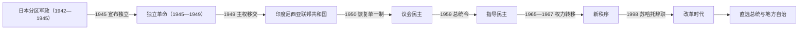

# 独立革命与印度尼西亚共和国

## 时间

1942年至今

## 概括

日本占领摧毁荷兰殖民国家，却没有立即建立独立的印度尼西亚。日本陆海军以战争资源、粮食和劳动力动员为先，分区统治爪哇、苏门答腊与东部群岛；强制劳役、饥荒、拘禁和镇压造成巨大苦难。同时，本地官员、青年和民族领袖进入行政与群众组织，印尼语进一步普及，乡土防卫义勇军等武装训练为1945年后的革命提供干部。

1945年8月17日苏加诺、哈达宣布独立。共和国经过四年武装抵抗、社会革命、谈判和国际调停，于1949年取得荷兰主权移交。此后国家先后经历议会民主、苏加诺“指导民主”、苏哈托“新秩序”和1998年后的改革时代。共和国在庞大群岛内建立共同国家、行政和市场，但也持续面对军政关系、中央—地方分配、族群宗教多样性、政治暴力、贫富与环境压力等问题。

截至2026年7月，印度尼西亚实行总统制共和国，总统为普拉博沃·苏比延多，副总统为吉布兰·拉卡布明·拉卡。完整任次见[印度尼西亚总统、副总统与总理表](/%E4%BA%BA%E6%96%87%E7%A7%91%E5%AD%A6/%E5%8E%86%E5%8F%B2/%E4%B8%9C%E5%8D%97%E4%BA%9A/%E5%8D%B0%E5%B0%BC/%E5%8D%B0%E5%BA%A6%E5%B0%BC%E8%A5%BF%E4%BA%9A%E6%80%BB%E7%BB%9F%E3%80%81%E5%89%AF%E6%80%BB%E7%BB%9F%E4%B8%8E%E6%80%BB%E7%90%86%E8%A1%A8.md)。

## 建立背景与共和国崛起机制

- 荷属东印度的统一行政疆域、港口和印尼语公共空间，为民族主义者想象一个跨岛国家提供制度与地理基础，但殖民政府始终限制自治。
- 日本在1942年拘禁多数荷兰官员，把更多日常行政交给本地人员，并通过政党式群众组织、青年团、邻保组织和乡土防卫义勇军进行总动员。
- 占领经济以军需为中心，粮食征集、运输崩坏、通货膨胀和强制劳工使民众付出沉重代价；反日抵抗与对独立的期待并存。
- 1945年日本投降造成权力真空。青年推动立即宣布独立，苏加诺、哈达则利用既有筹备机构迅速制定宪法、组成政府并争取行政人员效忠。
- 共和国能够生存，不只依靠正规军：地方游击队、青年、村社网络、外交代表和跨岛政治组织共同维持抵抗。荷兰的军事优势未能转化为可接受、可持续的政治秩序。
- 英属印度军队中的反殖民舆论、印度和澳大利亚等国支持、联合国调停及美国对荷兰施压，使独立战争从殖民内战转为国际问题。

## 日本占领与权力结构（1942—1945）

日本把原荷属东印度分为三套军政：第16军控制爪哇和马都拉，第25军控制苏门答腊，海军控制加里曼丹、苏拉威西、马鲁古和小巽他等东部地区。三者行政政策、民族组织空间和独立筹备进度不同，没有一个覆盖全群岛的“日本总督”。完整衔接见[荷属东印度殖民行政首脑表](/%E4%BA%BA%E6%96%87%E7%A7%91%E5%AD%A6/%E5%8E%86%E5%8F%B2/%E4%B8%9C%E5%8D%97%E4%BA%9A/%E5%8D%B0%E5%B0%BC/%E8%8D%B7%E5%B1%9E%E4%B8%9C%E5%8D%B0%E5%BA%A6%E6%AE%96%E6%B0%91%E8%A1%8C%E6%94%BF%E9%A6%96%E8%84%91%E8%A1%A8.md)。

| 权力层级 | 角色与影响 |
| --- | --- |
| 陆海军司令部与宪兵 | 掌握最终行政、军法、治安、资源和交通权；不同军政区彼此分割。 |
| 日本军政官僚 | 接管殖民部门、企业和地方行政，优先保障战争经济。 |
| 本地官员与摄政 | 在日本监督下维持基层行政、粮食征集和劳务动员；战后成为共和国与地方政权争取的关键人群。 |
| 民族领袖及动员组织 | 苏加诺、哈达等在爪哇主持群众组织，既受日本利用，也借公开平台传播民族认同。 |
| 青年与本地武装 | 乡土防卫义勇军、青年团和辅助兵接受训练；1945年后部分转入共和国军队和地方武装。 |

1944年战局逆转后，日本承诺未来独立。1945年爪哇的独立准备调查会和筹备委员会讨论国家原则、宪法与领土。8月日本投降后，青年将苏加诺、哈达带到冷吉布以催促立即行动；两人返回雅加达，于8月17日宣读独立宣言，次日通过1945年宪法并就任总统、副总统。

## 独立革命（1945—1949）

### 建国与地方革命（1945—1946）

共和国起初主要控制爪哇、马都拉和苏门答腊的行政与群众网络，东部许多港口由盟军和荷属东印度文官行政署重新占领。日军奉命维持秩序并等待受降，武器移交常伴冲突。泗水战役、万隆火海以及苏门答腊、苏拉威西等地抵抗显示革命具有全国性，却由不同地方力量以不同方式推进。

“准备时期”的暴力同时针对返回的欧洲人、欧亚人、华人和被视为殖民合作者者；地方社会革命也冲击贵族与旧官僚。共和国政府试图把分散青年武装纳入人民安全军及其后继军队，但正规化、军饷和指挥统一长期困难。

### 谈判、两次荷兰军事行动与国际化（1946—1949）

1946年《林牙椰蒂协定》原则上承认共和国对爪哇、马都拉和苏门答腊的事实权力，并计划建立联邦；双方对主权、时间和联邦组成解释不同。荷兰另行扶植东印度尼西亚国等邦，试图以联邦限制共和国。

1947年荷兰发动第一次“警察行动”，夺取经济要地，却促使联合国介入。《伦维尔协定》使共和国撤出若干孤立防区，内部政治和军队重组危机随之加深。1948年茉莉芬事件中，共产党与共和国政府冲突；同年12月荷兰第二次军事行动占领日惹并拘捕苏加诺、哈达。军队继续游击，沙弗鲁丁在苏门答腊组成紧急政府，证明共和国没有因首都陷落而消失。

联合国、美国和亚洲国家的压力迫使荷兰恢复共和国领导人。1949年海牙圆桌会议同意主权移交给印度尼西亚联邦共和国，西新几内亚问题暂缓。12月27日完成移交；多数荷兰创建的邦缺乏社会基础，1950年8月并入单一共和国。

## 议会民主（1950—1957／1959）

1950年临时宪法确立议会制，总统主要担任国家象征，总理依靠多党联盟执政。政党反映民族主义、伊斯兰、共产主义和地区网络，内阁更迭频繁，却也完成1955年相对自由的议会与制宪议会选举，并以万隆会议提升国际地位。

国家同时面对南马鲁古共和国、伊斯兰之家运动、军队内部冲突和中央—地方财政分配矛盾。外岛出口地区认为爪哇中心占用收入，军方地区司令在走私、企业和行政中扩张。制宪议会无法就伊斯兰与潘查希拉、总统制与议会制形成法定多数，苏加诺和军队遂以“国家停滞”为理由推动制度集中。

## 指导民主（1957／1959—1965）

1957年戒严和“工作内阁”削弱议会政治；1959年7月苏加诺解散制宪议会、恢复1945年宪法。总统以“民族主义、宗教、共产主义”平衡军队、印度尼西亚共产党和各群众集团，任命议会并强调革命动员。

政府通过外交与军事压力在1962年取得西新几内亚控制，并于1963年正式接管；随后对马来西亚发动“对抗”。大型项目、军费、企业国有化和行政失序加剧通货膨胀。1965年9月30日至10月1日，一批军人杀害高级将领，自称阻止政变；苏哈托迅速控制雅加达，指责共产党主导。军队、民兵和地方组织随后屠杀或拘禁大量共产党成员、同情者及被指相关者，受害规模和地方过程存在研究差异，但属于共和国历史上最严重的政治暴力之一。

1966年“3月11日命令”使苏哈托获得恢复秩序的广泛权力。共产党被禁、苏加诺支持网络被清除；1967年苏哈托任代总统，1968年正式就任，指导民主由此终结。

## 新秩序（1966—1998）

苏哈托以反共、经济稳定和发展为合法性，恢复与西方及国际金融机构合作。技术官僚控制宏观经济，石油收入、绿色革命、教育、计划生育、制造业与基础设施推动增长和减贫。军队以“双重职能”进入政府、议会和地方行政，专业集团在受控选举中长期占优势，政党被合并，媒体、工会和反对派受限制。

政权通过总统家族、军官、华人企业家和特许经营网络分配资源，增长与寻租并存。1975年印度尼西亚入侵并占领东帝汶，战争、饥荒与镇压造成大量死亡，国际争议延续。1980年代油价下降后，政府转向出口制造和金融开放，却也积累短期外债与监管风险。

1997年亚洲金融危机导致货币暴跌、银行和企业破产、物价上涨。改革学生运动、城市骚乱、军政精英分裂和议会压力共同削弱总统；1998年5月苏哈托辞职，由副总统哈比比继任。经济危机是直接触发因素，权力个人化、腐败裙带网络、有限接班机制和长期政治压制构成结构性脆弱。

## 改革时代（1998年至今）

### 制度重建与地方分权

1999—2002年宪法修正限制总统任期，建立总统直选、地区代表理事会和宪法法院，并强化议会、司法审查与权利条款。军警分离，军方逐步退出议会保留席位；大规模地方分权把预算和公共服务权下放至县市。政党和媒体迅速开放，也出现联盟交易、地方寡头、金钱政治及新旧精英重组。

1999年东帝汶公投后发生民兵暴力，国际部队进驻；印度尼西亚撤出，东帝汶于2002年独立。2004年开始总统直选；2005年亚齐和平协议使自由亚齐运动解除武装，并获得特殊自治和地方政党安排。

### 民主巩固、发展与新争议

尤多约诺时期选举制度趋于稳定，并处理海啸重建、反恐和亚齐和平。佐科时期扩大交通、港口、社会保障与资源下游产业，启动迁都努山塔拉；执政联盟扩大提高政策执行力，也引发对监督弱化、利益冲突、政治家族与制度制衡的讨论。

2024年普拉博沃与吉布兰当选，10月就职。政府延续部分基础设施和产业政策，并以营养、粮食能源安全、国防和国家能力建设为重点。截至2026年7月，直选、多党竞争、地方自治和定期权力交接仍是制度基本框架；联盟集中、司法与反腐机构独立、军队文职角色、环境代价和社会项目财政可持续性则是持续议题。

## 共和国权力结构

| 时期 | 正式制度 | 实际权力关系 |
| --- | --- | --- |
| 革命共和国 | 总统、总理、中央国民委员会与军队 | 中央政府、地方革命委员会、政党、青年和多支武装共享动员权。 |
| 议会民主 | 总统为国家元首，总理和内阁向议会负责 | 多党联盟、军队和地区司令相互牵制，内阁稳定性较弱。 |
| 指导民主 | 恢复总统制，任命式代表机构 | 苏加诺居中平衡军队、共产党和民族主义集团，制度依赖个人协调。 |
| 新秩序 | 总统、人民协商会议、内阁与受控选举 | 苏哈托、武装部队、专业集团、技术官僚及商业网络构成核心。 |
| 改革时代 | 总统直选、人民代表会议、地区代表理事会、宪法法院与地方自治 | 总统需经营跨党联盟；地方首长、公民社会、媒体和法院空间扩大，资本与政治家族影响仍强。 |

## 重要事件

| 时间 | 事件 | 结果与长期影响 |
| --- | --- | --- |
| 1942年 | 荷属东印度向日本投降 | 殖民国家崩溃，群岛被分为三个军政区。 |
| 1943—1945年 | 群众与武装组织扩张 | 日本战争动员造成压迫，也训练本地行政和军事干部。 |
| 1945-08-17 | 宣布独立 | 苏加诺、哈达以民族名义成立共和国。 |
| 1945-11 | 泗水战役 | 英军与共和国武装激战，成为革命抵抗象征。 |
| 1946年 | 《林牙椰蒂协定》 | 共和国事实权力获有限承认，联邦方案争议延续。 |
| 1947年 | 第一次荷兰军事行动 | 荷军占领经济区，联合国开始直接调停。 |
| 1948年 | 茉莉芬事件 | 共和国军队击败共产党相关武装，国内力量格局改变。 |
| 1948-12 | 第二次荷兰军事行动 | 日惹陷落、领导人被捕；游击与紧急政府维持国家连续。 |
| 1949-12-27 | 主权移交 | 印度尼西亚联邦共和国取得除西新几内亚外的主权。 |
| 1950-08 | 单一共和国恢复 | 荷兰创建的多数邦并入中央国家。 |
| 1955年 | 首次全国选举与万隆会议 | 多党民主达到高峰，印度尼西亚成为亚非合作中心。 |
| 1957—1958年 | 地区反叛与戒严 | 革命政府／全面斗争等反叛被平定，军队和中央权力扩大。 |
| 1959-07-05 | 总统令恢复1945年宪法 | 议会民主终结，指导民主制度化。 |
| 1962—1963年 | 接管西新几内亚 | 联合国过渡后纳入印度尼西亚；后续归属与人权争议延续。 |
| 1963—1966年 | 对马来西亚“对抗” | 对外军事动员加重经济与外交压力。 |
| 1965—1966年 | 九三〇事件、反共清洗与大规模杀戮 | 共产党被摧毁，苏哈托掌权，社会创伤长期存在。 |
| 1967—1968年 | 苏哈托由代总统转任总统 | 新秩序正式建立。 |
| 1971年后 | 受控选举与专业集团优势 | 发展主义威权制度稳定化。 |
| 1975年 | 入侵东帝汶 | 形成长期占领、抵抗和国际争议。 |
| 1997—1998年 | 亚洲金融危机与改革运动 | 苏哈托辞职，政治开放和制度重建开始。 |
| 1999年 | 首次改革时代选举与东帝汶公投 | 多党竞争恢复；东帝汶脱离印度尼西亚控制。 |
| 1999—2002年 | 四轮宪法修正 | 建立总统直选、任期限制、宪法法院和更强制衡。 |
| 2001年 | 瓦希德被罢免 | 宪制交接由梅加瓦蒂接任，检验新时期议会—总统关系。 |
| 2004年 | 首次总统直选 | 尤多约诺当选，国家元首由直接民意授权。 |
| 2005年 | 亚齐和平协议 | 三十年冲突基本终结，建立特殊自治与地方政党机制。 |
| 2014年 | 佐科当选 | 非军方、非传统全国精英出身者成为总统。 |
| 2019—2024年 | 基础设施、下游产业与迁都规划 | 国家投资能力增强，环境、财政和制度制衡争议并存。 |
| 2024-10-20 | 普拉博沃、吉布兰就职 | 完成又一次选举交接，延续与重组前一时期执政联盟。 |

## 崛起、稳定、危机与转型原因

### 共和国在革命中存续的条件

- 日本投降留下行政、通信和武装真空，共和国抢先建立宪法与政府。
- “印度尼西亚”民族认同已通过学校、印刷、宗教和青年组织跨越岛屿传播。
- 游击战使荷兰难以用占领城市和种植园消灭共和国；外交又把军事失败转化为国际压力。
- 联邦方案因常被视为荷兰分治工具而缺乏广泛合法性，多个邦主动并入共和国。

### 议会民主转向指导民主

- 政党碎片和联盟更替削弱政策连续，但并非议会制度崩溃的唯一原因。
- 中央—地方收入分配、军队重组与外岛反叛使军方成为不可忽视的政治力量。
- 制宪议会无法达到修宪法定多数，给总统以“恢复1945年宪法”解决僵局的机会。
- 苏加诺的个人声望和动员政治、军队的组织资源共同压缩议会空间。

### 新秩序稳定与衰落

- 初期通胀稳定、外援、石油收入、技术官僚和农业增产提供绩效合法性。
- 军队遍布行政体系、反对派受控、专业集团与官僚网络确保选举和地方执行。
- 权力长期个人化、腐败与家族商业缺少透明监督；金融开放和企业外债增加危机暴露。
- 1997年金融崩溃、食品燃料价格上涨、学生抗议、暴力和精英倒戈共同触发1998年权力转移。

### 改革时代的韧性与限制

- 宪法任期限制、直选、分权和竞争性政党使领导更替不再依赖军方或宫廷式继承。
- 广大中产、公民社会、宗教组织和地方政治形成多中心制衡。
- 多党总统制也促使总统组建宽泛联盟，可能弱化议会反对和责任边界。
- 地方分权改善代表性，却伴随地方腐败、资源竞争和政策能力不均；民主制度的质量取决于法院、媒体、反腐和选举机关能否保持独立。

## 演变关系

本阶段前接[荷属东印度](/%E4%BA%BA%E6%96%87%E7%A7%91%E5%AD%A6/%E5%8E%86%E5%8F%B2/%E4%B8%9C%E5%8D%97%E4%BA%9A/%E5%8D%B0%E5%B0%BC/%E8%8D%B7%E5%B1%9E%E4%B8%9C%E5%8D%B0%E5%BA%A6.md)。东帝汶在1975—1999年间的占领、抵抗和公投另见[印度尼西亚占领与抵抗](/%E4%BA%BA%E6%96%87%E7%A7%91%E5%AD%A6/%E5%8E%86%E5%8F%B2/%E4%B8%9C%E5%8D%97%E4%BA%9A/%E4%B8%9C%E5%B8%9D%E6%B1%B6/%E5%8D%B0%E5%BA%A6%E5%B0%BC%E8%A5%BF%E4%BA%9A%E5%8D%A0%E9%A2%86%E4%B8%8E%E6%8A%B5%E6%8A%97.md)。共和国在1949—1950年短暂采用联邦制，随后转为单一制；1998年后则在单一国家内实行广泛地方自治，而非恢复荷兰设计的邦联。
