# 独立与现代文莱

## 时间

1959年至今；本文核验至2026年7月。

## 概括

1959年宪法使文莱取得内部自治，苏丹掌行政权，英国继续负责外交与防务。1962年文莱人民党赢得全部民选席位后，围绕北加里曼丹方案、加入马来西亚和权力分配的冲突演变为武装起事；英军镇压后紧急状态延续，政党和选举政治被中止。文莱最终没有加入马来西亚，1979年条约确定独立安排，1984年成为完全主权国家。石油、天然气收入与君主集中决策支撑高福利和对外资产，同时造成能源依赖、产业多元化与政治参与受限等长期问题。

## 分阶段发展

### 1959年宪法与有限代议政治（1959—1962）

苏丹奥马尔·阿里·赛义夫汀三世颁布成文宪法，设首席大臣、部长会议、枢密院和立法会。英国驻扎官改为高级专员，不再直接处理一般内政，但外交、防务和部分安全安排仍由英国掌握。立法会部分议席经地区选举产生。

文莱人民党主张更广泛民主，并倡议把文莱、砂拉越和北婆罗洲组成“北加里曼丹”国家。1962年立法会选举中，该党赢得全部16个民选席位，但政府没有立即按其主张组阁或提交加入马来西亚问题。

### 文莱起事、紧急状态与不加入马来西亚（1962—1971）

1962年12月，北加里曼丹国民军发动武装起事，袭击警署、油田和政府设施，试图迫使苏丹接受其方案。苏丹请求英国援助，驻新加坡廓尔喀部队和英军迅速镇压，文莱人民党被取缔，大量成员被捕或流亡。政府宣布紧急状态，此后持续定期延长；立法会选举中止。

不加入马来西亚并非只由起事决定。苏丹与马来亚领导层还在石油收入、税收、苏丹在统治者会议中的地位、联邦权力和加入时间上存在分歧。1963年马来西亚成立时文莱留在英国保护关系内。1967年奥马尔·阿里·赛义夫汀三世退位，哈桑纳尔·博尔基亚继承王位；退位苏丹仍长期担任高级顾问并影响建国安排。

### 走向完全独立（1971—1984）

1971年英莱协定扩大文莱对内政和外交事务的控制，英国主要保留防务与对外责任。石油和液化天然气出口增长，为行政、本地教育、医疗、住房和基础设施提供财政。1979年双方签署友好合作条约，规定1984年1月1日结束保护关系。文莱在此期间建设外交和国防机构，却没有恢复竞争性全国选举。

### 独立君主国与能源福利国家（1984—2004）

1984年独立后，苏丹兼任首相，并控制国防、财政等核心领域；同年加入东盟和联合国。国家以“马来伊斯兰君主制”为官方政治—文化理念，把马来传统、伊斯兰和王室忠诚结合。政府免征个人所得税或维持低税负，提供高补贴教育、医疗、住房和公共部门就业；文莱投资局管理大量海外资产。

油气财富和小人口提高人均资源，却使私人部门和财政随能源价格波动。1997—1998年亚洲金融危机及王室成员阿迈迪亚亲王管理的机构财务争议，暴露公共资产治理、透明度和商业集中风险。1998年穆赫塔迪·比拉被立为王储，为王位继承提供清晰安排。

### 咨询机构恢复与伊斯兰法扩展（2004—2019）

2004年苏丹重新召集立法会，成员全部由任命或依职位进入，主要讨论预算和政策，不构成向选举政府过渡。政府提出“2035宏愿”，目标包括受教育人口、高生活质量和可持续经济。

2014年起分阶段实施《伊斯兰刑法令》，与既有普通刑法和伊斯兰家庭、宗教法并行。2019年更严厉条款生效，引发国际人权批评；政府宣布死刑事实上继续暂停执行。法律适用会依宗教身份和罪名变化，不能简单说所有居民只受单一宗教法体系管辖。

### 疫情、经济转型与2026年内阁调整（2020年至今）

新冠疫情中，政府使用边境、公共卫生、财政和数字服务措施维持社会运行；能源价格变化仍直接影响收入。下游石化、清真产业、旅游、数字化和外资项目被用于减少对原油天然气的依赖，但国家就业仍高度集中公共部门和油气相关产业。

2026年6月苏丹再次调整内阁并设置协调部长等职务，王储和王室成员在首相署与国家长期规划中的角色增强。截至2026年7月，哈桑纳尔·博尔基亚仍同时是苏丹、国家元首、首相、国防部长和财政部长；王储穆赫塔迪·比拉任首相署高级部长。

## 统治结构

| 层级 | 人物 / 机构 | 实际权力 |
| --- | --- | --- |
| 国家元首、最高行政权威 | **苏丹哈桑纳尔·博尔基亚** | 1967年至今在位；任命和撤换部长、发布法律与紧急命令，掌握最高行政和军事权。 |
| 政府首脑 | **首相哈桑纳尔·博尔基亚** | 1984年独立后由苏丹兼任，领导部长会议；截至2026年7月同时兼国防、财政职务。 |
| 王位继承与高级协调 | 王储穆赫塔迪·比拉 | 1998年册立王储，2005年起任首相署高级部长，并参与2035宏愿等协调。 |
| 部长会议 | 苏丹任命的部长 | 执行各部门政策，对苏丹负责而非由议会多数产生。 |
| 立法会 | 委任、当然成员和代表性成员 | 讨论预算和法律、提出意见；1962年以来没有举行全国立法会竞争性选举。 |
| 枢密院、王位继承委员会、宗教理事会 | 王室、宗教和高级官员 | 分别就王室、继承、伊斯兰事务提供制度化咨询。 |
| 英国廓尔喀驻军与文莱军队 | 双边防务与本国武装 | 独立后文莱自负防务，英国廓尔喀营依双边安排驻扎，为油田和国家安全提供外部保障。 |

现任苏丹及历代完整世系见[文莱苏丹国与英国保护](/%E4%BA%BA%E6%96%87%E7%A7%91%E5%AD%A6/%E5%8E%86%E5%8F%B2/%E4%B8%9C%E5%8D%97%E4%BA%9A/%E6%96%87%E8%8E%B1/%E6%96%87%E8%8E%B1%E8%8B%8F%E4%B8%B9%E5%9B%BD%E4%B8%8E%E8%8B%B1%E5%9B%BD%E4%BF%9D%E6%8A%A4.md)。

## 重要事件

| 时间 | 事件 | 过程与影响 |
| --- | --- | --- |
| 1959 | 成文宪法颁布 | 建立内部自治、首席大臣和立法会框架。 |
| 1962 | 立法会选举 | 文莱人民党赢得全部民选席，宪制权力交接争议加深。 |
| 1962-12 | 文莱起事 | 北加里曼丹国民军行动被英军镇压，紧急状态开始。 |
| 1963 | 不加入马来西亚 | 文莱保留独立苏丹国和油气收入控制。 |
| 1967 | 哈桑纳尔·博尔基亚继位 | 现任苏丹开始统治。 |
| 1971 | 修订英莱协定 | 文莱取得更广泛内部和对外自主，英国主要保留防务责任。 |
| 1979 | 英莱友好合作条约 | 确定1984年完全独立时间表。 |
| 1984-01-01 | 完全独立 | 结束英国保护，同年加入东盟和联合国。 |
| 1991前后 | 马来伊斯兰君主制理念制度化 | 成为国家认同、教育和政治合法性的核心框架。 |
| 1997—1998 | 亚洲金融危机与资产治理争议 | 暴露资源、金融和王室商业管理风险。 |
| 1998 | 册立王储 | 穆赫塔迪·比拉成为明确继承人。 |
| 2004 | 立法会恢复开会 | 恢复任命制咨询立法机构，未恢复全国选举。 |
| 2007 | “文莱2035宏愿”提出 | 把教育、生活质量和经济多元化设为长期目标。 |
| 2014—2019 | 伊斯兰刑法分阶段实施 | 法律双轨与人权争议扩大。 |
| 2020—2022 | 新冠疫情 | 公共卫生、边境和能源收入受到考验。 |
| 2026 | 内阁调整 | 协调部长和王室成员行政角色变化，君主集中权力延续。 |

## 稳定条件与持续挑战

### 稳定条件

- 王室拥有延续数百年的合法性，1959年宪法和独立过程没有打断苏丹世系。
- 石油、天然气与海外资产使国家能以福利、公共就业和低税收维持社会契约。
- 小人口、行政集中和英国防务合作降低部分治理与安全成本。
- 不加入马来西亚保留资源与王室主权，避免联邦内收入和地位谈判长期化。

### 结构性限制

- 能源价格和储量直接影响财政，产业多元化项目仍依赖国家资本、外国技术和外来劳工。
- 公共部门高薪与福利可能削弱私人部门吸引力，青年技能、创业和生产率成为2035宏愿难点。
- 紧急状态、委任立法会和政党限制使政策连续，却压缩公开竞争、监督和制度化问责。
- 苏丹兼任多项核心职位提高决策集中度，也把继承、健康和高级官员协调风险集中于王室。

本阶段仍在延续，不适用“灭亡原因”。现任信息以2026年7月为截止点，对2026年内阁重组只记录已发生的职位变化，不预判长期结果。

## 演变关系

```mermaid
flowchart LR
    Constitution["1959 宪法与内部自治"] --> Election["1962 选举"]
    Election --> Revolt["1962 起事与紧急状态"]
    Revolt --> Outside["不加入马来西亚"]
    Outside --> Treaty["1979 独立条约"]
    Treaty --> Independence["1984 完全独立"]
    Independence --> Welfare["能源福利国家"]
    Welfare --> Diversify["2035宏愿与经济多元化"]
    Diversify --> Current["2026 君主政府"]
```

- 前一节点：[文莱苏丹国与英国保护](/%E4%BA%BA%E6%96%87%E7%A7%91%E5%AD%A6/%E5%8E%86%E5%8F%B2/%E4%B8%9C%E5%8D%97%E4%BA%9A/%E6%96%87%E8%8E%B1/%E6%96%87%E8%8E%B1%E8%8B%8F%E4%B8%B9%E5%9B%BD%E4%B8%8E%E8%8B%B1%E5%9B%BD%E4%BF%9D%E6%8A%A4.md)。
- 联邦对照：[独立、联邦与现代马来西亚](/%E4%BA%BA%E6%96%87%E7%A7%91%E5%AD%A6/%E5%8E%86%E5%8F%B2/%E4%B8%9C%E5%8D%97%E4%BA%9A/%E9%A9%AC%E6%9D%A5%E8%A5%BF%E4%BA%9A/%E7%8B%AC%E7%AB%8B%E3%80%81%E8%81%94%E9%82%A6%E4%B8%8E%E7%8E%B0%E4%BB%A3%E9%A9%AC%E6%9D%A5%E8%A5%BF%E4%BA%9A.md)。
