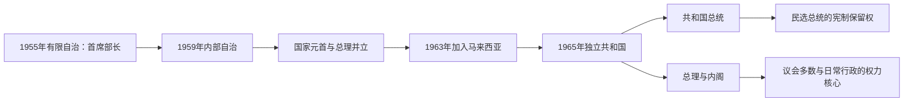

# 新加坡国家元首与政府首脑表

## 范围与制度

1959年新加坡取得内部自治后，以“元首”（Yang di-Pertuan Negara）取代殖民总督；1965年独立后改设共和国总统。总统是国家元首，1991年起由公民直选，并在既有储备和关键公共职位任命上拥有有限的宪制酌情权。总理领导掌握行政实权的内阁，通常由国会多数党领袖担任。

截至2026年7月，国家元首为第9任总统尚达曼，总理为黄循财。

## 国家职位演变图

1959—1965年的国家元首职位先后处于自治领和马来西亚州框架内；1965年后总统成为共和国国家元首，总理则始终领导内阁并掌握日常政治与行政权力。

## 自治与马来西亚时期元首（1959—1965）

| 顺序 | 元首 | 任期 | 产生与说明 |
| ---: | --- | --- | --- |
| 1 | 威廉·古德（William Goode） | 1959-06-03—1959-12-01 | 末任殖民总督转任首任元首，负责自治制度过渡。 |
| 2 | **尤索夫·伊萨（Yusof Ishak）** | 1959-12-03—1965-08-09 | 本地出身元首；1963—1965年新加坡为马来西亚一州，独立后转任总统。 |

## 共和国总统与代总统（1965年至今）

| 顺序 | 总统 / 代总统 | 任期 | 产生方式与关键说明 |
| ---: | --- | --- | --- |
| 1 | **尤索夫·伊萨（Yusof Ishak）** | 1965-08-09—1970-11-23 | 首任总统；任内去世。 |
| 代理 | 杨锦成（Yeoh Ghim Seng） | 1970-11-23—1971-01-02 | 国会议长代理总统。 |
| 2 | 本杰明·亨利·薛尔思（Benjamin Sheares） | 1971-01-02—1981-05-12 | 由国会选出；任内去世。 |
| 代理 | 杨锦成（Yeoh Ghim Seng） | 1981-05-12—1981-10-23 | 第二次代理。 |
| 3 | **蒂凡那（Devan Nair）** | 1981-10-23—1985-03-28 | 由国会选出；辞职。 |
| 临时代理 | 黄宗仁（Wee Chong Jin） | 1985-03-28—1985-03-29 | 首席大法官短暂代理。 |
| 代理 | 杨锦成（Yeoh Ghim Seng） | 1985-03-29—1985-09-02 | 第三次代理。 |
| 4 | 黄金辉（Wee Kim Wee） | 1985-09-02—1993-09-01 | 由国会选出；任内通过民选总统制度。 |
| 5 | **王鼎昌（Ong Teng Cheong）** | 1993-09-01—1999-09-01 | 首位通过竞争性全民直选产生的总统。 |
| 6 | 塞拉潘·纳丹（S. R. Nathan） | 1999-09-01—2011-09-01 | 连任两届。 |
| 7 | 陈庆炎（Tony Tan Keng Yam） | 2011-09-01—2017-08-31 | 全民直选。 |
| 代理 | 比莱（J. Y. Pillay） | 2017-09-01—2017-09-13 | 总统顾问理事会主席短期代理。 |
| 8 | **哈莉玛·雅各布（Halimah Yacob）** | 2017-09-14—2023-09-13 | 首位女性总统；保留选举中因唯一合资格候选人而当选。 |
| 9 | **尚达曼（Tharman Shanmugaratnam）** | 2023-09-14—至今 | 全民直选；截至2026年7月在任。 |

## 首席部长（有限自治，1955—1959）

| 顺序 | 首席部长 | 任期 | 政治基础与交接 |
| ---: | --- | --- | --- |
| 1 | **大卫·马绍尔（David Marshall）** | 1955-04-06—1956-06-08 | 劳工阵线领导；自治谈判未获英国同意后辞职。 |
| 2 | 林有福（Lim Yew Hock） | 1956-06-08—1959-06-05 | 劳工阵线；镇压部分左翼工运和学生运动，并取得英国对内部自治的同意。 |

## 总理（1959年至今）

| 顺序 | 总理 | 任期 | 政治基础与关键阶段 |
| ---: | --- | --- | --- |
| 1 | **李光耀** | 1959-06-05—1990-11-28 | 人民行动党；内部自治、加入与退出马来西亚、独立建国、工业化和住房国家形成。 |
| 2 | **吴作栋** | 1990-11-28—2004-08-12 | 人民行动党；领导风格调整，经历亚洲金融危机、九一一后安全议题与SARS。 |
| 3 | **李显龙** | 2004-08-12—2024-05-15 | 人民行动党；经济再定位、社会政策调整、全球金融危机、新冠疫情与第四代领导交接。 |
| 4 | **黄循财（Lawrence Wong）** | 2024-05-15—至今 | 人民行动党；截至2026年7月任总理兼财政部长。 |

## 实际权力结构

| 机构 | 角色 |
| --- | --- |
| 总统 | 国家元首；按内阁建议履行大多数职权，在动用既有储备、关键公共职位等特定事项上可依宪法行使酌情权。 |
| 总理与内阁 | 行政权中心，制定预算、公共政策、外交与国防；向一院制国会负责。 |
| 国会 | 立法、预算和问责机构；人民行动党自1959年以来一直执政，在野党席位与非选区议员制度随时期变化。 |
| 公务员体系与法定机构 | 负责长期规划和专业执行；经济发展局、建屋发展局、中央公积金局等是发展型国家的重要机构。 |
| 司法 | 解释法律并审理行政、刑民事争议；政治权利、公共秩序与国家安全法律的边界长期存在公共讨论。 |

## 相关笔记

- [自治、独立与城市国家](/%E4%BA%BA%E6%96%87%E7%A7%91%E5%AD%A6/%E5%8E%86%E5%8F%B2/%E4%B8%9C%E5%8D%97%E4%BA%9A/%E6%96%B0%E5%8A%A0%E5%9D%A1/%E8%87%AA%E6%B2%BB%E3%80%81%E7%8B%AC%E7%AB%8B%E4%B8%8E%E5%9F%8E%E5%B8%82%E5%9B%BD%E5%AE%B6.md)
- [殖民行政长官表](/%E4%BA%BA%E6%96%87%E7%A7%91%E5%AD%A6/%E5%8E%86%E5%8F%B2/%E4%B8%9C%E5%8D%97%E4%BA%9A/%E6%96%B0%E5%8A%A0%E5%9D%A1/%E6%AE%96%E6%B0%91%E8%A1%8C%E6%94%BF%E9%95%BF%E5%AE%98%E8%A1%A8.md)
- [新加坡历史总览](/%E4%BA%BA%E6%96%87%E7%A7%91%E5%AD%A6/%E5%8E%86%E5%8F%B2/%E4%B8%9C%E5%8D%97%E4%BA%9A/%E6%96%B0%E5%8A%A0%E5%9D%A1/README.md)
