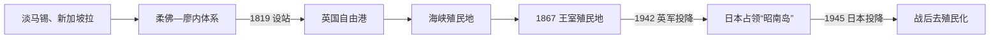

# 殖民港口与日本占领

## 时间

约14世纪—1945年。其中1819年英国设站以前属于淡马锡、新加坡拉和柔佛—廖内海洋史，1819—1942年为英国殖民港口阶段，1942—1945年为日本占领。

## 概括

新加坡的现代港市不是在“无人荒岛”上突然诞生。14世纪淡马锡已参与南海、爪哇海和马六甲海峡贸易，后来处于马六甲、柔佛—廖内及周边强权竞争中。1819年英国利用柔佛王位继承分裂建立贸易站，以自由港、帝国航线和移民劳动力推动转口经济；殖民秩序也依赖族群分类、鸦片税、契约与苦力劳动、有限公共卫生和政治排除。1942年英国要塞迅速陷落，日本军政实施肃清、强征和物资统制。三年半占领在暴力和匮乏中摧毁英国“不可战胜”的声望，为战后去殖民化提供直接背景。

## 前殖民港市

### 淡马锡与新加坡拉

考古出土的中国陶瓷、钱币、玻璃和金属器表明，14世纪福康宁与新加坡河一带有分层聚落和远距离贸易。中国旅行记录中的“淡马锡”、爪哇文献中的“单马锡”可与此港市联系，但文字记述的龙牙门、班卒等地名与具体遗址的对应仍有讨论。

《马来纪年》把新加坡拉王统、山陵王子和剑鱼传说纳入马来王权起源，这些材料反映后世政治记忆，不能直接当作逐年可信的君主史。港市在14—15世纪因暹罗、满者伯夷和马六甲海峡权力变动而衰落或转移；17世纪初葡萄牙记载摧毁柔佛河口附近据点，此后岛上仍有海人、马来聚落和航道活动。

### 柔佛—廖内体系与1819年继承争议

新加坡属于柔佛—廖内苏丹国的海洋政治空间。苏丹马末三世去世后，长子东姑隆在廖内之外，幼子阿都拉曼获荷兰支持即位。莱佛士、天猛公阿都拉曼和英国官员迎立东姑隆为苏丹侯赛因，以其名义签署1819年设站条约。这既是英国战略操作，也利用了真实的柔佛继承分裂；苏丹和天猛公得到津贴，但对贸易站扩张的控制不断缩小。

## 分阶段发展

### 东印度公司自由港（1819—1826）

驻扎官法夸尔以低管制吸引商船和移民，人口迅速增长。莱佛士1822年城市规划按族群和功能划分居住、商业与政府区，实际城市生活远比图纸混杂。1824年克劳福同苏丹侯赛因、天猛公签署条约，英国取得新加坡及附近岛屿的完整主权主张；同年英荷条约把马来半岛与荷属群岛划入不同势力范围，跨海的柔佛—廖内政治空间被殖民边界切开。

### 海峡殖民地与印度管辖（1826—1867）

1826年新加坡、槟城、马六甲组成海峡殖民地，1832年首府迁新加坡。自由港连接中国、印度、东南亚与欧洲，华人商人、印度商贩和劳工、马来与海人社群、阿拉伯和欧洲资本共同塑造港市。殖民政府人员有限，曾依赖社群领袖和秘密会社维持劳工、信贷与治安；1854年福建—潮州社群冲突造成大规模伤亡，显示“族群自治”的暴力风险。印度囚犯参与道路、公共建筑和沼泽整治，契约苦力与女性迁移不平衡则造成剥削、人口流动和社会问题。

### 王室殖民地与区域枢纽（1867—1914）

欧洲商人要求摆脱加尔各答对地方需求的忽视，1867年海峡殖民地转由伦敦殖民部直接统治。1869年苏伊士运河、蒸汽航运、电报和马来亚锡矿、橡胶产业扩大转口贸易；港口、船坞、银行和保险成长。殖民收入长期依赖鸦片专卖等税源，对工人住房、卫生和教育投入相对有限。1877年华民护卫司试图管理劳工中介、秘密会社和华人事务，1890年秘密会社被取缔，但社群组织转入会馆、学校、报刊和合法社团。

### 大众政治与帝国防务（1914—1941）

第一次世界大战期间发生1915年印度兵变。中国革命、五四运动、马来民族主义、印度独立运动与共产主义经学校、报刊和劳工网络进入新加坡。1920年代英国把新加坡建设为远东海军基地，设想舰队从欧洲增援；基地1938年启用，却缺乏足以阻止日军从马来半岛陆路南下的空军、陆军和战役准备。大萧条冲击贸易和就业，殖民政府实施移民限制与劳工遣返。

### 日本进攻与“昭南岛”（1941—1945）

1941年12月日军在马来亚北部登陆，依靠制空权、轻装机动和英军防线失序向南推进。1942年2月8日越过柔佛海峡，水源、弹药和指挥危机加剧；2月15日白思华向山下奉文投降。占领当局把新加坡改称“昭南岛”。

- “肃清”检证针对华人男性，处决人数没有统一数字，但属大规模有组织杀戮。
- 居民承受军票通胀、粮食短缺、配给、黑市、强制献金和劳动征发；战俘与亚洲劳工被送往泰缅铁路等工程，死亡惨重。
- 日本扶植印度国民军并宣传“亚洲人的亚洲”，同时保留种族化等级和军事暴力；马来人、印度人、华人及欧亚群体的处境不同，个人行为也横跨抵抗、求生、合作与被迫服从，不能简单二分。
- 马来亚人民抗日军等组织开展情报、游击和地下活动，盟军也逐渐恢复区域攻势。

1945年8月日本宣布投降，9月12日在新加坡正式受降。英国军事行政恢复，却面对住房、粮食、失业与政治动员，也无法恢复战前的威望。

## 统治结构

| 阶段 | 最高与地方权力 | 实际运作 |
| --- | --- | --- |
| 淡马锡、柔佛—廖内 | 港市首领、苏丹、天猛公与海人网络 | 王权依赖航道、商人、海上武力和周边大国关系。 |
| 1819—1826 | 东印度公司驻扎官 | 在条约框架下管理贸易站；苏丹与天猛公逐步失去实权。 |
| 1826—1867 | 海峡殖民地总督、新加坡驻扎参议员 | 总督掌最高权力，地方官管理城市；最终向英属印度政府负责。 |
| 1867—1942 | 王室殖民地总督、殖民司和立法局 | 总督由伦敦任命，立法局长期以官守和委任成员为主，本地居民缺乏普遍参政权。 |
| 1942—1945 | 日本第25军、南方军 / 第7方面军与昭南特别市 | 军事机关掌治安和动员，市长处理市政，宪兵队实施高压警察统治。 |

历任驻扎官、驻扎参议员、总督、代理总督及日本军政长官见[新加坡殖民行政长官表](/%E4%BA%BA%E6%96%87%E7%A7%91%E5%AD%A6/%E5%8E%86%E5%8F%B2/%E4%B8%9C%E5%8D%97%E4%BA%9A/%E6%96%B0%E5%8A%A0%E5%9D%A1/%E6%AE%96%E6%B0%91%E8%A1%8C%E6%94%BF%E9%95%BF%E5%AE%98%E8%A1%A8.md)。

## 重要事件

| 时间 | 事件 | 过程与影响 |
| --- | --- | --- |
| 14世纪 | 淡马锡港市繁荣 | 考古和跨区域文献显示新加坡已进入亚洲贸易网络。 |
| 1819 | 英国设立贸易站 | 莱佛士利用柔佛继承争议，与苏丹侯赛因、天猛公订约。 |
| 1824 | 割让条约与英荷条约 | 英国巩固岛屿控制，殖民边界切分马来海洋世界。 |
| 1826、1832 | 海峡殖民地成立、首府迁新加坡 | 新加坡成为三据点的行政和贸易中心。 |
| 1854 | 福建—潮州冲突 | 暴露秘密会社、劳工组织与有限殖民警力的矛盾。 |
| 1867 | 转为王室殖民地 | 脱离英属印度，直接由伦敦殖民部管理。 |
| 1869以后 | 苏伊士运河与蒸汽航运 | 欧洲航程缩短，锡、橡胶和转口贸易扩张。 |
| 1915 | 新加坡印度兵变 | 战时军纪、族群和反殖民情绪交织，最终被镇压。 |
| 1923—1938 | 海军基地计划与建成 | 形成“新加坡战略”，但未能提供完整陆空防御。 |
| 1942-02-15 | 英军投降 | 日本占领开始，英国帝国声望遭重创。 |
| 1942 | 肃清检证 | 日军针对华人实施大规模筛查和处决。 |
| 1942—1945 | 战时统制 | 饥饿、通胀、强征和强迫劳动改变社会生活。 |
| 1945-09-12 | 日本正式投降 | 英国恢复军政管理，去殖民化政治迅速扩大。 |

## 港市崛起、殖民矛盾与占领终结

### 港市崛起条件

- 马六甲海峡东端的深水锚地和季风航线位置，使新加坡适合作为转口与补给点。
- 自由港减少关税壁垒，英帝国海军、法权、金融和航运降低部分商业风险。
- 中国、印度和群岛移民提供资本、技能和劳动；马来亚锡、橡胶等腹地产品扩大吞吐量。
- 港口成功不是殖民官员单方面创造，也依赖亚洲商人、劳工、女性家庭网络和区域生产者。

### 殖民结构矛盾

- 政治权由非民选总督和少数官员掌握，社群领袖参与不能替代普遍公民权。
- 自由贸易与严厉劳动、治安、移民和鸦片制度并存；公共服务增长通常落后于人口。
- “族群分区”把复杂社会固化为行政类别，并可能把阶级、方言和政治冲突解释为单纯种族问题。

### 日本占领终结

日本统治的结构弱点是岛屿缺乏粮食和能源、航运受盟军封锁、军票无可靠信用；外部上美国推进、英国重返和苏联参战使日本总体战争失败。1945年日本接受投降是直接终点。占领结束并不自动带来独立，但暴露英国防务失败、训练大批政治与工运参与者，使战前殖民秩序无法原样恢复。

## 演变关系

- 前一、并行网络：[马来港市与苏丹国](/%E4%BA%BA%E6%96%87%E7%A7%91%E5%AD%A6/%E5%8E%86%E5%8F%B2/%E4%B8%9C%E5%8D%97%E4%BA%9A/%E9%A9%AC%E6%9D%A5%E8%A5%BF%E4%BA%9A/%E9%A9%AC%E6%9D%A5%E6%B8%AF%E5%B8%82%E4%B8%8E%E8%8B%8F%E4%B8%B9%E5%9B%BD.md)。
- 后一节点：[自治、独立与城市国家](/%E4%BA%BA%E6%96%87%E7%A7%91%E5%AD%A6/%E5%8E%86%E5%8F%B2/%E4%B8%9C%E5%8D%97%E4%BA%9A/%E6%96%B0%E5%8A%A0%E5%9D%A1/%E8%87%AA%E6%B2%BB%E3%80%81%E7%8B%AC%E7%AB%8B%E4%B8%8E%E5%9F%8E%E5%B8%82%E5%9B%BD%E5%AE%B6.md)。
