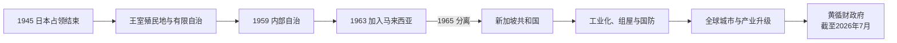

# 自治、独立与城市国家

## 时间

1945年至今；本文核验至2026年7月。

## 概括

战后新加坡从英国王室殖民地，经有限自治、内部自治、加入马来西亚，再于1965年成为独立共和国。人民行动党以强政府、公共住房、义务国防、开放贸易和外资工业化回应小国脆弱性，使新加坡转为制造、航运、金融与专业服务中心。发展也伴随一党长期优势、国家安全法、媒体和集会限制、土地征用、移民与不平等争议。理解其历史应同时解释经济治理能力、社会整合和政治权力集中。

## 分阶段发展

### 战后危机与有限自治（1945—1959）

英国军事行政先处理饥荒、黑市、失业和基础设施破坏，1946年把新加坡从海峡殖民地分出为单独王室殖民地。1948年首次立法局选举的民选席位有限；同年马来亚紧急状态使反共与治安成为宪制改革的边界。工会、华校学生、英语教育精英、马来和印度社团形成多党政治。

1955年伦德尔宪制扩大民选议席，大卫·马绍尔任首席部长；英国以内部安全控制为由拒绝其完全自治方案，他于1956年辞职。林有福政府镇压部分左翼工会和学生组织，取得英国对内部自治的同意。1959年新宪法实施，人民行动党赢得43个直选席中的绝大多数，李光耀任总理，英国仅保留外交、防务和部分内部安全权。

### 内部自治、合并与分离（1959—1965）

自治政府推行反腐、建屋、工业、教育和语言政策，同时人民行动党内部围绕合并方式、反殖民与共产主义问题分裂，左翼组成社会主义阵线。领导层认为加入马来西亚可以获得共同市场、结束英国殖民身份并降低安全风险。1962年公投的三个选项都以某种合并为前提，投票规则和空白票处理受到反对派批评。1963年“冷藏行动”拘捕大批左翼人士，其必要性和政治目的至今存在争论。

1963年9月新加坡加入马来西亚，同时面对印度尼西亚“对抗”行动。人民行动党与联盟党围绕共同市场、税收、中央权力和“马来西亚人的马来西亚”政治主张冲突。1964年族群骚乱造成死伤，联邦与州关系进一步恶化。东姑阿都拉曼判断分离可避免更大冲突，马来西亚国会于1965年8月9日通过新加坡退出；新加坡并非按原计划逐步独立，而是在紧急协商中成为主权国家。

### 生存型建国与工业化（1965—1979）

独立时，新加坡缺乏天然资源和战略腹地，仍依赖马来西亚供水、英国军事支出和转口贸易。政府迅速加入联合国与英联邦，1967年参与创立东盟，并建立国民服役和新加坡武装部队。英国宣布撤军后，政府把基地转为港口、工业和商业资产。

经济发展局、裕廊工业区、港务机构和税收优惠吸引跨国制造业；建屋发展局大规模建造组屋，中央公积金被用于住房和退休储蓄。土地征用、清拆甘榜和居民重置提高规划效率，也改变社区和产权。双语教育、共同课程和族群配额逐步塑造国家身份。社会主义阵线抵制1968年大选后，人民行动党一度取得国会全部民选席；《内部安全法》拘留和对工运、媒体的管制使反对政治空间收缩。

### 产业升级与政治接班（1979—1990）

劳动力密集工业面临工资和土地约束，政府推动技能教育、电子、石化、金融和区域总部。1981年惹兰加由补选让反对党重返国会，1984年大选后国会竞争扩大；政府设置非选区议员等制度，在保持治理连续性的同时纳入有限反对声音。1985年独立后首次严重衰退促成减税、工资和公积金调整。1990年李光耀交棒吴作栋，完成首轮总理接班。

### 全球城市与社会再平衡（1990—2004）

吴作栋时期扩大金融、航空、港口和高技术服务。1991年民选总统制度生效，赋予总统守护既有储备与关键任命的特定权力。1997—1998年亚洲金融危机冲击区域需求，新加坡以储备、汇率和结构政策应对；2001年全球科技衰退与九一一事件、2003年SARS再度考验开放型经济和公共卫生。外来人口、住房价格、教育竞争和收入差距逐渐成为核心社会议题。

### 李显龙时期（2004—2024）

政府发展生物医药、财富管理、数字服务和综合度假区，在2008年全球金融危机中以财政储备和就业补助稳定经济。2011年大选反映住房、交通、移民和政治多元诉求，执政党调整社会与基础设施政策。2015年李光耀去世、建国50周年强化历史记忆。2020年新冠疫情造成边境关闭、外籍劳工宿舍大规模感染和经济衰退；政府动用储备实施工资、企业和家庭支持，疫苗接种与边境重开随后推进。领导交接因疫情和接班人变化延后，黄循财作为抗疫工作组共同负责人崛起。

### 黄循财时期（2024年至今）

黄循财于2024年5月15日接任总理，代表“第四代领导团队”完成交接；2025年大选后继续执政。截至2026年7月，他兼任财政部长。政策重点包括实际工资和生活成本、住房供应、老龄化、外来劳动力、产业竞争、能源与气候风险。尚达曼自2023年9月起任总统。现任阶段尚在发展中，不预设其长期结果。

## 统治结构

| 阶段 | 国家元首 | 政府首脑与实际权力 |
| --- | --- | --- |
| 1945—1955 | 英国总督 | 总督与殖民官僚掌行政；立法局仅部分民选。 |
| 1955—1959 | 英国总督 | 首席部长领导民选政府，但英国控制防务、外交和关键安全权。 |
| 1959—1963 | 新加坡元首 | 总理与内阁掌内部自治，英国保留外交、防务；内部安全由多方委员会处理。 |
| 1963—1965 | 新加坡元首；马来西亚最高元首为联邦元首 | 新加坡州政府处理州政，吉隆坡联邦政府掌国防、外交及联邦权限。 |
| 1965—1991 | 共和国总统 | 总统主要为礼仪元首；总理和内阁是行政核心，向国会负责。 |
| 1991年至今 | 民选总统 | 总统在既有储备和关键任命等特定事项有酌情权；日常行政仍由总理、内阁和公务员体系主导。 |

完整元首、代总统、总统、首席部长和总理连续表见[国家元首与政府首脑表](/%E4%BA%BA%E6%96%87%E7%A7%91%E5%AD%A6/%E5%8E%86%E5%8F%B2/%E4%B8%9C%E5%8D%97%E4%BA%9A/%E6%96%B0%E5%8A%A0%E5%9D%A1/%E5%9B%BD%E5%AE%B6%E5%85%83%E9%A6%96%E4%B8%8E%E6%94%BF%E5%BA%9C%E9%A6%96%E8%84%91%E8%A1%A8.md)；殖民总督见[殖民行政长官表](/%E4%BA%BA%E6%96%87%E7%A7%91%E5%AD%A6/%E5%8E%86%E5%8F%B2/%E4%B8%9C%E5%8D%97%E4%BA%9A/%E6%96%B0%E5%8A%A0%E5%9D%A1/%E6%AE%96%E6%B0%91%E8%A1%8C%E6%94%BF%E9%95%BF%E5%AE%98%E8%A1%A8.md)。

## 重要事件

| 时间 | 事件 | 过程与影响 |
| --- | --- | --- |
| 1946 | 单独王室殖民地成立 | 海峡殖民地解散，新加坡不并入马来亚联盟。 |
| 1948 | 首次立法局选举、紧急状态 | 有限选举与反共安全体制同步展开。 |
| 1955 | 伦德尔宪制、马绍尔组阁 | 多数议席民选，首席部长成为本地政府核心。 |
| 1956—1957 | 自治谈判 | 马绍尔谈判失败辞职，林有福政府最终取得内部自治协议。 |
| 1959 | 内部自治、人民行动党执政 | 李光耀任总理，组屋、工业和行政改革加速。 |
| 1962 | 合并公投 | 选择加入马来西亚的具体安排，公投设计存在争议。 |
| 1963 | 冷藏行动、加入马来西亚 | 左翼力量遭大规模拘捕，新加坡成为联邦一州。 |
| 1964 | 族群骚乱 | 多重政治、宗教和族群紧张造成死伤。 |
| 1965-08-09 | 退出马来西亚并独立 | 城市国家建立，必须自建国防、外交和经济体系。 |
| 1967 | 国民服役、东盟成立 | 加强安全能力并嵌入区域合作。 |
| 1968—1971 | 英军撤出与基地转换 | 军事依赖下降，原基地转为经济资产。 |
| 1981 | 安顺补选 | 反对党议员重返国会。 |
| 1985 | 首次独立后衰退 | 推动工资、税收和产业政策调整。 |
| 1991、1993 | 民选总统制度、首次竞争性总统选举 | 国家元首获得有限“第二把钥匙”职能。 |
| 1997—1998 | 亚洲金融危机 | 开放经济受冲击，但银行与财政体系保持稳定。 |
| 2003 | SARS | 强化传染病监测、隔离和跨部门危机管理。 |
| 2008—2009 | 全球金融危机 | 政府动用财政能力保就业和企业现金流。 |
| 2011 | 大选与政策转向 | 在野党首次赢得集选区，住房、交通和移民政策调整。 |
| 2015 | 李光耀去世、建国50周年 | 领导世代和国家叙事的重要节点。 |
| 2020—2022 | 新冠疫情 | 边境和经济受阻，宿舍疫情暴露外籍劳工居住差距。 |
| 2024 | 黄循财接任总理 | 第三次总理交接，第四代领导团队执政。 |
| 2025 | 大选 | 人民行动党继续执政，黄循财获得首次以总理身份领导大选的授权。 |

## 独立国家的崛起机制与持续矛盾

### 发展条件

- 地处关键航道，港口、机场和通信连接东南亚制造腹地与全球市场。
- 国家以廉洁公务员、法定机构和长期预算协调土地、住房、教育、工业和基础设施，降低投资不确定性。
- 外资、英语工作环境、职业教育和劳资政三方协商支持出口工业化；随后以金融、研发和专业服务升级。
- 公共住房和公积金把多数家庭纳入资产与储蓄体系，族群混居政策降低空间隔离。

### 结构脆弱性

- 国土、能源、粮食和水资源有限，对国际贸易、外资和全球人才高度依赖，外部衰退与供应链冲击会迅速传导。
- 低生育和人口老龄化提高医疗、照护和财政压力；依赖移民又引发工资、身份和基础设施争论。
- 资产型住房改善居住条件，也可能加剧代际、收入和地段差异；外籍低薪劳工不完全分享公民福利。

### 政治治理争议

- 人民行动党长期执政带来政策连续性和强执行力；选区制度、国家资源、媒体环境、诽谤诉讼、集会和内部安全法律则被批评限制公平竞争。
- 政府以多族群主义、宗教和谐与公共秩序维护社会稳定，但族群配额和身份分类也会固化差异。
- 因此新加坡不是单因“威权换增长”或“自由市场奇迹”，而是国家规划、全球资本、社会纪律、区域位置和历史危机共同作用的结果。

## 演变关系

- 前一节点：[殖民港口与日本占领](/%E4%BA%BA%E6%96%87%E7%A7%91%E5%AD%A6/%E5%8E%86%E5%8F%B2/%E4%B8%9C%E5%8D%97%E4%BA%9A/%E6%96%B0%E5%8A%A0%E5%9D%A1/%E6%AE%96%E6%B0%91%E6%B8%AF%E5%8F%A3%E4%B8%8E%E6%97%A5%E6%9C%AC%E5%8D%A0%E9%A2%86.md)。
- 联邦共同史：[独立、联邦与现代马来西亚](/%E4%BA%BA%E6%96%87%E7%A7%91%E5%AD%A6/%E5%8E%86%E5%8F%B2/%E4%B8%9C%E5%8D%97%E4%BA%9A/%E9%A9%AC%E6%9D%A5%E8%A5%BF%E4%BA%9A/%E7%8B%AC%E7%AB%8B%E3%80%81%E8%81%94%E9%82%A6%E4%B8%8E%E7%8E%B0%E4%BB%A3%E9%A9%AC%E6%9D%A5%E8%A5%BF%E4%BA%9A.md)。
