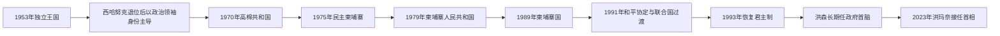

# 1953年以来柬埔寨国家领导人表

## 范围与读法

本表从1953年完全独立列至2026年7月。柬埔寨在君主国、共和国、革命政权、越南支持的人民共和国、联合国过渡和恢复君主制之间多次转换，同一时期的“国家元首”“政府首脑”和“实际最高权力”并不总是同一人。1970—1993年的政权名称与国际承认也曾分离，不能只凭联合国席位判断境内实际统治。

## 政权与实际权力演变图

本表把法定国家元首、过渡机构负责人和政府首脑分开。1975—1993年间政权更替、外国军事介入与国际承认相互错位，实际最高权力不能只由职位名称判断。

## 国家元首与过渡权力

| 顺序 | 国家元首 / 过渡机构 | 任期 | 政体与权力说明 |
|---:|---|---|---|
| 1 | **诺罗敦·西哈努克** | 1953—1955年 | 独立时的国王；1955年退位以直接参与政治。 |
| 2 | 诺罗敦·苏拉玛里特 | 1955—1960年 | 西哈努克之父；君主立宪国王。 |
| — | 摄政委员会 | 1960年4—6月 | 苏拉玛里特去世后的集体过渡。 |
| 3 | **诺罗敦·西哈努克** | 1960—1970年 | 以“国家元首”而非国王身份执政；人民社会同盟的实际核心。 |
| 4 | 郑兴（Cheng Heng） | 1970—1972年 | 政变后的国家元首，朗诺集团掌握军政实权。 |
| 5 | **朗诺** | 1972—1975年4月1日 | 高棉共和国总统；内战后期权力高度军事化。 |
| — | 苏金奎（Saukam Khoy） | 1975年4月1—12日 | 朗诺离境后的代总统。 |
| — | 沙索沙康最高委员会 | 1975年4月12—17日 | 金边陷落前最后军事过渡机构。 |
| 6 | 诺罗敦·西哈努克 | 1975年4月—1976年4月 | 民族统一阵线名义国家元首，实际受柬埔寨共产党限制。 |
| 7 | **乔森潘** | 1976—1979年 | 民主柬埔寨国家主席团主席；波尔布特与党内常务机构掌实权。 |
| 8 | **韩桑林** | 1979—1992年 | 先任人民革命委员会主席，后任国务委员会主席；政权依赖人民革命党与越南军事支持。 |
| 9 | 谢辛 | 1992—1993年6月 | 柬埔寨国国家元首；与联合国过渡权力并存。 |
| — | 联合国柬埔寨过渡时期权力机构（明石康任特别代表） | 1992—1993年 | 掌管选举、难民返乡及部分行政监督，但未取代全部本国机构。 |
| 10 | 诺罗敦·西哈努克 | 1993年6—9月 | 制宪期间恢复为国家元首。 |
| 11 | **诺罗敦·西哈努克** | 1993—2004年 | 恢复君主制后的国王；王位不实行自动长子继承。 |
| — | 王位委员会主持的摄政过渡 | 2004年10月 | 西哈努克退位至新王即位之间的短期过渡。 |
| 12 | **诺罗敦·西哈莫尼** | 2004年至今 | 由王位委员会选举；截至2026年7月仍为国王，主要承担宪法与礼仪职能。 |

## 政府首脑

1950—1960年代西哈努克多次亲任首相，并在不同内阁之间轮换亲信。下表按实际任期顺序列出；“代理”与两首相制另行注明。

| 顺序 | 政府首脑 | 任期 | 政体与关键说明 |
|---:|---|---|---|
| 1 | 宾努 | 1953年11月9—22日 | 独立时首相，民主党政治家。 |
| 2 | 陈纳（Chan Nak） | 1953—1954年 | 独立后首届短期内阁。 |
| 3 | 诺罗敦·西哈努克 | 1954年4月 | 国王兼任首相的短期内阁。 |
| 4 | 宾努 | 1954—1955年 | 第三次组阁。 |
| 5 | 兰涅特（Leng Ngeth） | 1955年1—9月 | 西哈努克退位前后主持政府。 |
| 6 | 诺罗敦·西哈努克 | 1955—1956年1月 | 退位后以人民社会同盟领袖身份组阁。 |
| 7 | 翁章孙（Oum Chheang Sun） | 1956年1—2月 | 短期内阁。 |
| 8 | 诺罗敦·西哈努克 | 1956年3月 | 短期复任。 |
| 9 | 钦迪（Khim Tit） | 1956年4—7月 | 短期内阁。 |
| 10 | 诺罗敦·西哈努克 | 1956年9—10月 | 再次亲自组阁。 |
| 11 | 桑云（San Yun） | 1956—1957年 | 人民社会同盟内阁。 |
| 12 | 诺罗敦·西哈努克 | 1957年4—7月 | 再次复任。 |
| 13 | 沈法（Sim Var） | 1957—1958年1月 | 首次任期。 |
| 14 | 伊玉安（Ek Yi Oun） | 1958年1月 | 在位五日。 |
| 15 | 宾努 | 1958年1—4月 | 再次组阁。 |
| 16 | 沈法 | 1958年4—7月 | 第二次任期。 |
| 17 | 诺罗敦·西哈努克 | 1958—1960年 | 此阶段最长的一次亲任首相。 |
| 18 | 福波伦（Pho Proeung） | 1960—1961年 | 西哈努克转任国家元首后的政府。 |
| 19 | 宾努 | 1961年1—11月 | 再次组阁。 |
| 20 | 诺罗敦·西哈努克 | 1961—1962年 | 最后一次正式担任首相。 |
| — | 涅刁隆（Nhiek Tioulong） | 1962年2—8月 | 代理首相。 |
| — | 周成（Chau Sen Cocsal Chhum） | 1962年8—10月 | 代理首相。 |
| 21 | 诺罗敦·康托尔 | 1962—1966年 | 人民社会同盟后期较稳定内阁。 |
| 22 | 朗诺 | 1966—1967年 | 保守派与军方影响上升。 |
| 23 | 宋双 | 1967—1968年 | 技术官僚与财政专家。 |
| 24 | 宾努 | 1968—1969年 | 西哈努克时期最后一届宾努内阁。 |
| 25 | **朗诺** | 1969—1972年 | 1970年政变后继续任政府首脑；1971年病中由施里玛达代理并掌日常政务。 |
| — | 西索瓦·施里玛达 | 1971—1972年 | 先代理、后任首相，处理行政与外交。 |
| 26 | 山玉成 | 1972年3—10月 | 高棉共和国首相。 |
| 27 | 韩通哈（Hang Thun Hak） | 1972—1973年 | 内战时期文官内阁。 |
| 28 | 英丹（In Tam） | 1973年5—12月 | 试图扩大文官政治基础。 |
| 29 | **龙波烈** | 1973年12月—1975年4月 | 高棉共和国末任首相，金边陷落时被杀。 |
| 30 | 宾努 | 1975—1976年 | 民主柬埔寨初期名义首相。 |
| — | 乔森潘 | 1976年4月4—14日 | 代行政府首脑。 |
| 31 | **波尔布特** | 1976年4—9月 | 柬埔寨共产党书记，实际最高领导。 |
| — | 农谢 | 1976年9—10月 | 代理总理。 |
| 31 | **波尔布特**（复任） | 1976年10月—1979年1月 | 红色高棉统治至越南军队攻入金边。 |
| — | 政府首脑职位空缺 | 1979—1981年 | 韩桑林领导人民革命委员会，兼具集体国家与政府功能。 |
| 32 | 宾索万 | 1981年6—12月 | 人民共和国首任正式总理，后被撤职。 |
| — | 陈西 | 1981年12月—1982年2月 | 代理总理。 |
| 33 | 陈西 | 1982—1984年 | 正式任总理，任内去世。 |
| — | 洪森 | 1984年12月—1985年1月 | 代理总理。 |
| 34 | **洪森** | 1985—1993年 | 人民共和国及柬埔寨国政府首脑。 |
| 35 | 诺罗敦·拉那烈 | 1993—1997年 | 第一首相；与第二首相洪森分享行政权。 |
| 34 | 洪森 | 1993—1998年 | 第二首相；1997年武装冲突后成为主导者。 |
| 36 | 翁霍 | 1997—1998年 | 拉那烈被罢免后的第一首相。 |
| 34 | **洪森** | 1998—2023年 | 两首相制结束后的唯一首相；人民党长期执政。 |
| 37 | **洪玛奈** | 2023年至今 | 2023年8月22日就任；截至2026年7月仍任首相。 |

## 实际权力结构的关键变化

| 时段 | 法定结构 | 实际权力中心 |
|---|---|---|
| 1955—1970年 | 国王 / 国家元首、内阁、议会 | 西哈努克及人民社会同盟网络；军方与左右派在后期极化。 |
| 1970—1975年 | 总统共和国 | 朗诺、施里玛达和军方；高度依赖美国援助。 |
| 1975—1979年 | 国家主席团与内阁 | 柬埔寨共产党常务委员会，波尔布特为核心。 |
| 1979—1989年 | 人民共和国党政体制 | 柬埔寨人民革命党、韩桑林—洪森领导层及越南驻军。 |
| 1989—1993年 | 柬埔寨国与联合国过渡 | 本国政府、反对派联盟和联合国三方权力重叠。 |
| 1993—1998年 | 君主立宪、两首相联合政府 | 奉辛比克党与人民党分享机构，人民党控制的安全力量更强。 |
| 1998年至今 | 君主立宪与议会内阁 | 柬埔寨人民党长期主导；2023年首相代际交接，洪森继续任人民党主席并自2024年任参议院主席。 |

## 相关笔记

- 主阶段：[独立、红色高棉与重建](/%E4%BA%BA%E6%96%87%E7%A7%91%E5%AD%A6/%E5%8E%86%E5%8F%B2/%E4%B8%9C%E5%8D%97%E4%BA%9A/%E6%9F%AC%E5%9F%94%E5%AF%A8/%E7%8B%AC%E7%AB%8B%E3%80%81%E7%BA%A2%E8%89%B2%E9%AB%98%E6%A3%89%E4%B8%8E%E9%87%8D%E5%BB%BA.md)
- 前期王统：[后吴哥时代与法属保护国](/%E4%BA%BA%E6%96%87%E7%A7%91%E5%AD%A6/%E5%8E%86%E5%8F%B2/%E4%B8%9C%E5%8D%97%E4%BA%9A/%E6%9F%AC%E5%9F%94%E5%AF%A8/%E5%90%8E%E5%90%B4%E5%93%A5%E6%97%B6%E4%BB%A3%E4%B8%8E%E6%B3%95%E5%B1%9E%E4%BF%9D%E6%8A%A4%E5%9B%BD.md)
