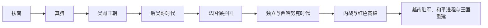

# 柬埔寨历史

柬埔寨历史以湄公河下游和洞里萨湖平原为核心。扶南、真腊连接印度洋与南海贸易，吴哥王朝把水利农业、寺庙网络和神王政治推向高峰；后吴哥时代在暹罗、越南夹击中重组，19世纪进入法国保护体制，20世纪又经历独立、内战、红色高棉统治与战后重建。

## 阶段导航

| 顺序 | 阶段 | 时间 | 核心变化 |
|---|---|---|---|
| 1 | [扶南与真腊](/%E4%BA%BA%E6%96%87%E7%A7%91%E5%AD%A6/%E5%8E%86%E5%8F%B2/%E4%B8%9C%E5%8D%97%E4%BA%9A/%E6%9F%AC%E5%9F%94%E5%AF%A8/%E6%89%B6%E5%8D%97%E4%B8%8E%E7%9C%9F%E8%85%8A.md) | 1—8世纪 | 港市贸易、印度文化传播与内陆权力上升 |
| 2 | [吴哥王朝](/%E4%BA%BA%E6%96%87%E7%A7%91%E5%AD%A6/%E5%8E%86%E5%8F%B2/%E4%B8%9C%E5%8D%97%E4%BA%9A/%E6%9F%AC%E5%9F%94%E5%AF%A8/%E5%90%B4%E5%93%A5%E7%8E%8B%E6%9C%9D.md) | 802—1431年 | 高棉帝国、寺庙城市与区域霸权 |
| 3 | [后吴哥时代与法属保护国](/%E4%BA%BA%E6%96%87%E7%A7%91%E5%AD%A6/%E5%8E%86%E5%8F%B2/%E4%B8%9C%E5%8D%97%E4%BA%9A/%E6%9F%AC%E5%9F%94%E5%AF%A8/%E5%90%8E%E5%90%B4%E5%93%A5%E6%97%B6%E4%BB%A3%E4%B8%8E%E6%B3%95%E5%B1%9E%E4%BF%9D%E6%8A%A4%E5%9B%BD.md) | 15世纪—1953年 | 都城南移、暹越竞争和殖民保护 |
| 4 | [独立、红色高棉与重建](/%E4%BA%BA%E6%96%87%E7%A7%91%E5%AD%A6/%E5%8E%86%E5%8F%B2/%E4%B8%9C%E5%8D%97%E4%BA%9A/%E6%9F%AC%E5%9F%94%E5%AF%A8/%E7%8B%AC%E7%AB%8B%E3%80%81%E7%BA%A2%E8%89%B2%E9%AB%98%E6%A3%89%E4%B8%8E%E9%87%8D%E5%BB%BA.md) | 1953年至今 | 独立、内战、极端统治与和平重建 |

## 统治者与领导人专表

- [法国统治时期行政首脑表](/%E4%BA%BA%E6%96%87%E7%A7%91%E5%AD%A6/%E5%8E%86%E5%8F%B2/%E4%B8%9C%E5%8D%97%E4%BA%9A/%E6%9F%AC%E5%9F%94%E5%AF%A8/%E6%B3%95%E5%9B%BD%E7%BB%9F%E6%B2%BB%E6%97%B6%E6%9C%9F%E8%A1%8C%E6%94%BF%E9%A6%96%E8%84%91%E8%A1%A8.md)：列法国代表、高级驻扎官、日本占领与战后专员。
- [1953年以来国家领导人表](/%E4%BA%BA%E6%96%87%E7%A7%91%E5%AD%A6/%E5%8E%86%E5%8F%B2/%E4%B8%9C%E5%8D%97%E4%BA%9A/%E6%9F%AC%E5%9F%94%E5%AF%A8/1953%E5%B9%B4%E4%BB%A5%E6%9D%A5%E5%9B%BD%E5%AE%B6%E9%A2%86%E5%AF%BC%E4%BA%BA%E8%A1%A8.md)：分列国家元首、政府首脑与实际权力结构，更新至2026年7月。

## 重要转折

| 时间 | 事件 | 意义 |
|---|---|---|
| 802年 | 阇耶跋摩二世举行王权仪式 | 通常视为吴哥时代开端 |
| 12世纪初 | 吴哥窟兴建 | 帝国资源整合与宗教艺术的代表 |
| 1431年前后 | 阿瑜陀耶攻破吴哥 | 政治重心逐步南移 |
| 1863年 | 成为法国保护国 | 在暹越压力下进入殖民体系 |
| 1953年 | 柬埔寨独立 | 西哈努克主导的建国阶段开始 |
| 1975—1979年 | 民主柬埔寨 | 红色高棉造成大规模死亡与社会破坏 |
| 1991—1993年 | 和平协定与联合国过渡 | 重建选举与君主立宪框架 |

## 区域联系

- 上级：[中南半岛历史](/%E4%BA%BA%E6%96%87%E7%A7%91%E5%AD%A6/%E5%8E%86%E5%8F%B2/%E4%B8%9C%E5%8D%97%E4%BA%9A/%E4%B8%AD%E5%8D%97%E5%8D%8A%E5%B2%9B/README.md)
- 邻近主线：[泰国历史](/%E4%BA%BA%E6%96%87%E7%A7%91%E5%AD%A6/%E5%8E%86%E5%8F%B2/%E4%B8%9C%E5%8D%97%E4%BA%9A/%E6%B3%B0%E5%9B%BD/README.md)、[越南历史](/%E4%BA%BA%E6%96%87%E7%A7%91%E5%AD%A6/%E5%8E%86%E5%8F%B2/%E4%B8%9C%E5%8D%97%E4%BA%9A/%E8%B6%8A%E5%8D%97/README.md)、[老挝历史](/%E4%BA%BA%E6%96%87%E7%A7%91%E5%AD%A6/%E5%8E%86%E5%8F%B2/%E4%B8%9C%E5%8D%97%E4%BA%9A/%E8%80%81%E6%8C%9D/README.md)

## 直接上级

- [东南亚历史](/%E4%BA%BA%E6%96%87%E7%A7%91%E5%AD%A6/%E5%8E%86%E5%8F%B2/%E4%B8%9C%E5%8D%97%E4%BA%9A/README.md)
