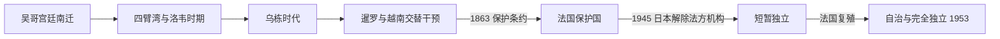

# 后吴哥时代与法属保护国

## 时间

15世纪—1953年

## 概括

后吴哥时代的柬埔寨政治中心转向湄公河与洞里萨湖交汇区，更依赖河海贸易。王室继承斗争常引入暹罗和越南干预，领土与人口承受双重压力。1863年诺罗敦王接受法国保护，以保存王室与有限国家空间，但实际主权逐步转入殖民官僚之手。

15—16世纪本地碑铭几乎中断，王表主要来自18—19世纪整理的王家编年，并须与暹罗、越南及欧洲记录比对。不同编年对早期即位年、别名和并立关系有明显差异，表中的准确年份不应理解为全部已获同时代证实。

## 转型背景与权力结构

- 吴哥政治中心南移并非一场战争后突然“弃城”，而是水利维护、贸易重心、人口迁移、王位竞争和阿瑜陀耶压力长期叠加。
- 四臂湾、洛韦与乌栋靠近湄公河水系和海贸通道，宫廷更依赖港口税、华人及马来商人和地方军役。
- 高棉国王通过王族、寺院和地方官统治，实际控制随外援、战争和贡属关系变化。
- 暹罗与越南常册封、扣留或扶植不同王位候选人；同一国王有时向两方纳贡，不等同于稳定的现代主权从属。
- 法国保护国初期保留王室和高棉官僚；1884年后法国驻扎官逐步控制财政、司法、警察、公共工程和官员任免。

## 1431—1618年王世系

| 顺序 | 国王 / 并立者 | 在位时间 | 继承关系 | 关键事件 / 备注 |
|---|---|---|---|---|
| 1 | **博涅亚·亚特／博隆·拉贾一世**（Ponhea Yat） | 1431—1463年 | 后吴哥开国君主 | 把宫廷重心移至四臂湾一带；其出身与更早王统关系在编年中有不同说法 |
| 2 | 诺雷·拉玛提菩提（Noreay Reameathiptei） | 1463—1469年 | 前王之子 | 维持南部宫廷 |
| 3 | 拉贾·拉玛提菩提（Reachea Reameathiptei） | 1469—1475年 | 前王之子或王族 | 与并立者争位 |
| — | 斯雷·苏里约泰（Srei Soriyotei） | 1472—1475年并立 | 王族竞争者 | 获暹罗支持的说法见于编年，最终失败 |
| 4 | **托摩·拉贾一世**（Thommo Reachea I） | 1476—1504年 | 王族，争位胜出 | 恢复较长统治；早年具体过程存在编年分歧 |
| 5 | 斯雷·苏恭托（Srei Sukonthor） | 1504—1512年 | 前王之子 | 被斯雷·切塔夺位 |
| 6 | 斯雷·切塔／斯达·科恩（Srei Chettha / Sdach Korn） | 1512—1521年 | 非主支王族或权臣，夺位 | 与安赞长期内战，合法性叙事高度政治化 |
| 7 | **占·拉贾／安赞一世**（Chan Reachea） | 1516—1566年 | 王族，内战中并立 | 击败斯达·科恩；以洛韦为中心恢复王权并整修吴哥寺庙 |
| 8 | 巴罗明拉贾（Baraminreachea） | 1566—1576年 | 前王之子 | 延续洛韦王国 |
| 9 | 萨塔一世（Satha I） | 1576—1584年 | 前王之子 | 对暹罗战争加剧 |
| 10 | 切塔一世（Chey Chettha I） | 1584—1594年 | 前王之子 | 1594年洛韦陷落，王室流亡 |
| 11 | 帕拉·拉姆一世（Preah Ram I） | 1594—1596年 | 地方强人 / 王位竞争者 | 暹罗入侵后掌权，史料又称“丛林拉玛” |
| 12 | 帕拉·拉姆二世（Preah Ram II） | 1596—1597年 | 前王集团 | 在位短暂 |
| 13 | 博隆·拉贾二世（Barom Reachea II） | 1597—1599年 | 王族 | 在西班牙、葡萄牙冒险者和本地派系冲突中即位 |
| 14 | 博隆·拉贾三世（Barom Reachea III） | 1599—1600年 | 前王之子或近亲 | 在位短暂 |
| 15 | 盖华一世（Kaev Hua I） | 1600—1603年 | 王族 | 宫廷派系继续竞争 |
| 16 | **博隆·拉贾四世／斯雷·索里约波** | 1603—1618年 | 王族 | 结束部分内乱，恢复对外关系；为切塔二世之父 |

## 乌栋时代王世系

复位、多次退位和外军扶植是这一阶段常态。同名王号的序数在不同王表中也可能相差一位。

| 顺序 | 国王 / 女王 | 在位时间 | 与前任关系 | 关键事件 / 备注 |
|---|---|---|---|---|
| 1 | **切塔二世**（Chey Chettha II） | 1618—1628年 | 前王之子 | 迁都乌栋；与阮主联姻，允许越南人在湄公河下游设贸易据点 |
| 2 | 托摩·拉贾二世（Thommo Reachea II） | 1628—1631年 | 前王之子 | 在位短暂 |
| 3 | 安通·拉贾（Ang Tong Reachea） | 1631—1640年 | 前王之弟 | 王族支系转换 |
| 4 | 巴托姆·拉贾（Batom Reachea） | 1640—1642年 | 切塔二世兄弟之子 | 被堂亲夺位 |
| 5 | **拉玛提菩提一世／苏丹易卜拉欣** | 1642—1658年 | 王族堂亲 | 皈依伊斯兰，依靠马来—穆斯林力量；越南干预后被推翻 |
| 6 | 博隆·拉贾五世（Barom Reachea V） | 1658—1672年 | 王族堂亲 | 获越南支持复位佛教王统 |
| 7 | 切塔三世（Chey Chettha III） | 1672—1673年 | 前王之侄 | 在位短暂 |
| 8 | 盖华二世（Kaev Hua II） | 1673—1674年 | 前王堂亲 | 在位短暂 |
| 9 | 巴托姆·拉贾三世（Batom Reachea III） | 1674年 | 王族 | 在位数月 |
| 10 | **切塔四世**（Chey Chettha IV） | 1675—1695、1696—1699、1700—1702、1703—1706年 | 博隆·拉贾五世之子 | 四次在位，多次让位或被赶下台，反映王室派系和暹越干预 |
| — | 泰伊女王（Queen Tey） | 1687年数月 | 切塔四世之母 | 受子让位短暂亲政后归还王位 |
| 11 | 乌泰一世（Outey I） | 1695—1696年 | 王族旁支 | 短期取代切塔四世 |
| 12 | 博隆·拉玛提菩提／安恩（Barom Reameathiptei / Ang Em） | 1699—1700、1710—1722年 | 巴托姆·拉贾三世之子 | 获越南支持的阶段明显 |
| 13 | 托摩·拉贾三世／安坦（Thommo Reachea III） | 1702—1703、1706—1709、1736—1747年 | 切塔四世之子 | 多次复位，在暹罗支持下与安恩支系竞争 |
| 14 | 萨塔二世（Satha II） | 1722—1736年；1749年短暂复位 | 安恩之子 | 在暹越之间周旋，后被逐 |
| 15 | 托摩·拉贾四世（Thommo Reachea IV） | 1747年 | 托摩·拉贾三世之子 | 在位极短 |
| 16 | 拉玛提菩提三世／安通（Reameathiptei III） | 1748—1749、1755—1758年 | 王族、前王姻亲 | 两次在位 |
| 17 | 切塔五世（Chey Chettha V） | 1749—1755年 | 萨塔支系姻亲 | 由宫廷派系拥立 |
| 18 | 乌泰·拉贾二世（Outey Reachea II） | 1758—1775年 | 安通之外孙 | 在暹罗与越南竞争间维持统治 |
| 19 | 拉姆·拉贾／安农二世（Ream Reachea / Ang Non II） | 1775—1779年 | 王族旁支 | 获暹罗支持，与越南支持派冲突，后被杀 |
| 20 | 纳雷·拉贾三世／安英（Neareay Reachea III / Ang Eng） | 1779—1782、1794—1796年 | 乌泰二世之子 | 年幼时受越南派支持，后由暹罗控制并复位 |
| — | 摄政与外部监护 | 1796—1806年 | 安赞二世未成年 | 暹罗与越南均阻止独立加冕，王族受曼谷控制 |
| 21 | **乌泰·拉贾三世／安赞二世**（Ang Chan II） | 1806—1834年 | 安英之子 | 越来越依靠越南，暹越战争使柬埔寨成为战场 |
| 22 | **安眉女王**（Ang Mey） | 1835—1840、1844—1846年 | 前王之女 | 越南扶立；行政越南化引发反抗，暹罗另扶安东 |
| 23 | **安东王**（Ang Duong） | 1848—1860年 | 安赞二世之叔 | 暹越妥协后即位，整顿法律、佛教和宫廷，为近代王室共同祖先 |
| 24 | **诺罗敦**（Norodom） | 1860—1863年为独立王国国王 | 前王之子 | 在暹罗掌握王冠与法国扩张之间即位；1863年接受法国保护 |

## 法国保护国君主世系

| 顺序 | 国王 | 在位时间 | 王室与继承 | 实际权力与重要事件 |
|---|---|---|---|---|
| 1 | **诺罗敦**（Norodom） | 1863—1904年 | 诺罗敦王室，安东长子 | 1863年签保护条约；1884年在军事压力下接受法国行政改革，王权大幅收缩 |
| 2 | 西索瓦（Sisowath） | 1904—1927年 | 西索瓦王室，诺罗敦异母弟 | 由法国支持继位；1907年暹粒、马德望等地归还柬埔寨 |
| 3 | 西索瓦·莫尼旺（Sisowath Monivong） | 1927—1941年 | 前王之子 | 大萧条、殖民税负与民族主义发展；1940年法国战败后日泰压力上升 |
| 4 | **诺罗敦·西哈努克**（Norodom Sihanouk） | 1941—1955年，本文写至1953年 | 诺罗敦王室，莫尼旺外孙 | 法国原期望年轻国王易控制；1945年短暂宣布独立，1952—1953年发动“王家独立运动”并取得主权 |

## 保护国实际权力结构

| 角色 | 权力范围 | 说明 |
|---|---|---|
| 法属印度支那总督 | 对外、军事、联邦预算和殖民政策 | 驻河内，对柬高级驻扎官拥有上级权力 |
| 柬埔寨高级驻扎官及省驻扎官 | 财政、司法、警察、公共工程和官员监督 | 1884年后成为实际行政核心 |
| 柬埔寨国王 | 宗教礼仪、王室任命和有限法令权 | 权力随时期变化，不能独立处理外交和军队 |
| 王家大臣与地方官 | 征税、司法和地方执行 | 在法国监督下保留，是殖民统治深入乡村的中介 |
| 1945—1953年政府 | 国王、法方官员、民主党与民族主义力量 | 日本政变、法国复殖、议会政治和独立谈判使权力多次重组 |

法国驻地代表、高级驻扎官、日本控制者与战后专员的连续序列见[法国统治时期行政首脑表](/%E4%BA%BA%E6%96%87%E7%A7%91%E5%AD%A6/%E5%8E%86%E5%8F%B2/%E4%B8%9C%E5%8D%97%E4%BA%9A/%E6%9F%AC%E5%9F%94%E5%AF%A8/%E6%B3%95%E5%9B%BD%E7%BB%9F%E6%B2%BB%E6%97%B6%E6%9C%9F%E8%A1%8C%E6%94%BF%E9%A6%96%E8%84%91%E8%A1%A8.md)。

## 重要事件

- 15世纪宫廷从吴哥转向四臂湾，政治与经济重心逐渐靠近湄公河贸易。
- 1512—1525年斯达·科恩与安赞内战，王权重建后以洛韦为中心。
- 1591—1594年阿瑜陀耶攻陷洛韦，大量人口被迁走；此后王位斗争引入暹罗及伊比利亚冒险者。
- 1618—1628年切塔二世迁都乌栋并与阮主联姻，越南移民和贸易据点逐步进入湄公河三角洲。
- 1642—1658年苏丹易卜拉欣依靠马来穆斯林力量统治，越南军事干预帮助佛教王族复位。
- 18世纪暹罗与越南通过册封、驻军和扶植候选人扩大影响，王位复立频繁。
- 1779—1806年安英长期处于越南、暹罗监护之下；19世纪初柬埔寨成为暹越战争的缓冲区。
- 1835—1846年越南扶立安眉并推行更直接行政，暹罗支持安东，战争与人口损失加剧。
- 1863年诺罗敦签署保护条约；1884年法国以炮舰和军事压力迫使其接受内政改革。
- 1907年法暹条约使暹粒、马德望等地归入法属柬埔寨，吴哥重新纳入其疆域。
- 1930—1940年代现代教育、印刷、佛教改革和反殖民民族主义发展。
- 1945年日本解除法国殖民机构，西哈努克短暂宣布独立；日本投降后法国恢复统治。
- 1952—1953年西哈努克以外交、国内动员和拒绝合作施压，1953年11月柬埔寨取得完全独立。

## 鼎盛、衰落、殖民化与独立原因

后吴哥国家的适应力来自湄公河贸易、上座部佛教、地方官与王室合法性；16世纪安赞时期和17世纪港贸阶段均曾恢复活力。其结构弱点是人口与财政不及暹罗、越南，王位候选人众多且地方控制松散。外部两强能以册封、军队和人口迁徙影响继承；1830—1840年代暹越直接战争使主权危机达到顶点。

法国介入既阻止暹罗或越南完全吞并，也把柬埔寨主权转为殖民控制。1884年改革是实际权力转移的直接节点。殖民统治固定边界、建设有限行政与教育，却以税收、劳役和政治限制引发不满。二战摧毁法国不可挑战的形象，战后民族主义与法国殖民成本上升；西哈努克把王权合法性、国际压力和群众动员结合，促成1953年独立。

## 演变关系

前接[吴哥王朝](/%E4%BA%BA%E6%96%87%E7%A7%91%E5%AD%A6/%E5%8E%86%E5%8F%B2/%E4%B8%9C%E5%8D%97%E4%BA%9A/%E6%9F%AC%E5%9F%94%E5%AF%A8/%E5%90%B4%E5%93%A5%E7%8E%8B%E6%9C%9D.md)。政治中心南移后，高棉王统在频繁分支、复位和外部扶植中延续，并在法国保护下保留为象征国家机构；1953年独立后进入[独立、红色高棉与重建](/%E4%BA%BA%E6%96%87%E7%A7%91%E5%AD%A6/%E5%8E%86%E5%8F%B2/%E4%B8%9C%E5%8D%97%E4%BA%9A/%E6%9F%AC%E5%9F%94%E5%AF%A8/%E7%8B%AC%E7%AB%8B%E3%80%81%E7%BA%A2%E8%89%B2%E9%AB%98%E6%A3%89%E4%B8%8E%E9%87%8D%E5%BB%BA.md)。
