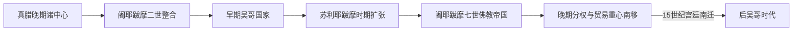

# 吴哥王朝

## 时间

802—1431年

## 概括

吴哥王朝以洞里萨湖以北平原为核心，凭借稻作、水利、劳役和贡赋体系建立高棉帝国。国王以印度教或佛教仪式建构神圣王权，通过寺庙山、城市和道路把地方精英纳入政治秩序。帝国疆域和影响随时代变化，并非持续控制固定边界。

## 王朝阶段

| 阶段 | 代表统治者 | 关键特征 |
|---|---|---|
| 早期整合 | 阇耶跋摩二世、因陀罗跋摩一世、耶输跋摩一世 | 建立王权仪式、寺庙和大型水利设施 |
| 帝国扩张 | 苏利耶跋摩一世、苏利耶跋摩二世 | 行政扩展，兴建吴哥窟 |
| 佛教帝国 | 阇耶跋摩七世 | 对占城战争后扩张，建吴哥城、巴戎寺及道路医院 |
| 晚期转型 | 13—15世纪诸王 | 上座部佛教普及，外战、贸易重心和生态压力改变国家结构 |

## 建立背景与崛起

8世纪末，真腊时期的多个地方中心、洞里萨湖稻作区和湄公河交通网络重新整合。阇耶跋摩二世通过迁移宫廷、结盟和仪式建立超越地方领主的王权；后继者以寺庙山、灌溉设施、土地捐献和官职网络维持中心。吴哥的崛起不是一次“独立宣言”完成的，而是约一个世纪的政治与景观建设。

## 国王世系

802—1327年的序列主要可由铭文与建筑年代重建；14—15世纪本地铭文急剧减少，后世王统纪年与泰、越材料互有冲突。下表列公认或必须纳入继承争议的统治者，斜线年份表示学界常见差异。

| 顺序 | 国王 | 在位 | 继承与关键说明 |
|---:|---|---|---|
| 1 | **阇耶跋摩二世** | 802—约835 / 850年 | 吴哥王权奠基者；802年仪式由11世纪铭文追述。 |
| 2 | 阇耶跋摩三世 | 约835 / 850—877年 | 前王子，史迹较少。 |
| 3 | **因陀罗跋摩一世** | 877—889年 | 非直接父子继承；建神牛寺、巴孔与人工湖。 |
| 4 | 耶输跋摩一世 | 889—约910年 | 前王子；迁建耶输陀罗补罗。 |
| 5 | 诃利沙跋摩一世 | 约910—923年 | 前王子。 |
| 6 | 伊奢那跋摩二世 | 923—928年 | 前王弟。 |
| 7 | 阇耶跋摩四世 | 928—941年 | 姻亲宗王；早先已在贡开形成竞争中心。 |
| 8 | 诃利沙跋摩二世 | 941—944年 | 前王子，短期在位。 |
| 9 | 罗贞陀罗跋摩二世 | 944—968年 | 王族旁支，宫廷重返吴哥。 |
| 10 | 阇耶跋摩五世 | 968—1001年 | 前王子。 |
| 11 | 优陀耶迭多跋摩一世 | 1001—1002年 | 外甥 / 王族亲属，旋即失位。 |
| 12 | 阇耶毗罗跋摩 | 1002—约1006 / 1011年 | 与苏利耶跋摩一世并立争位。 |
| 13 | **苏利耶跋摩一世** | 约1006—1050年 | 以战争完成统一，扩大官僚效忠誓约。 |
| 14 | 优陀耶迭多跋摩二世 | 1050—1066年 | 前王指定继承者，经历地方叛乱。 |
| 15 | 诃利沙跋摩三世 | 1066—约1080年 | 前王兄弟。 |
| 并立 | 奈波帝因陀罗跋摩 | 约1080—1113年 | 部分地区的竞争统治者，权力范围有争议。 |
| 16 | 阇耶跋摩六世 | 1080—1107年 | 摩醯陀罗补罗王族，建立新支系。 |
| 17 | 陀罗尼因陀罗跋摩一世 | 1107—1113年 | 前王兄，后被苏利耶跋摩二世取代。 |
| 18 | **苏利耶跋摩二世** | 1113—约1150年 | 以武力夺位；扩张并兴建吴哥窟。 |
| 19 | 陀罗尼因陀罗跋摩二世 | 约1150—1156 / 1160年 | 与前王亲属关系不明，为阇耶跋摩七世之父。 |
| 20 | 耶输跋摩二世 | 约1156 / 1160—1165 / 1166年 | 遭宫廷政变。 |
| 21 | 特里布婆那迭多跋摩 | 1165 / 1166—1177年 | 夺位者；1177年占城军攻入吴哥时败亡。 |
| — | 占城占领与战争 | 1177—1181年 | 不是高棉王统；阇耶跋摩七世组织反攻。 |
| 22 | **阇耶跋摩七世** | 1181—约1218年 | 佛教君主；建吴哥城、巴戎寺、道路、驿站与医院。 |
| 23 | 因陀罗跋摩二世 | 约1218—1243年 | 前王子；铭文材料减少。 |
| 24 | 阇耶跋摩八世 | 1243—1295年 | 恢复湿婆教宫廷，末年让位。 |
| 25 | 因陀罗跋摩三世 | 1295—1308年 | 前王女婿；周达观访问吴哥时在位。 |
| 26 | 因陀罗阇耶跋摩 | 1308—1327年 | 前王亲属；继续佛教化转型。 |
| 27 | 阇耶跋摩九世 | 1327—约1336年 | 常被视为最后有梵文铭文可确认的吴哥国王。 |
| 28 | 特拉萨帕埃姆（奔牙谢） | 约1336—1340年 | 主要见于后世王统，历史性与出身叙事有争议。 |
| 29 | 尼比安巴特 | 约1340—1346年 | 后世王统人物。 |
| 30 | 西提安·列谢 | 约1346—1347年 | 短期统治，纪年不稳。 |
| 31 | 隆蓬·列谢 | 约1347—1352年 | 后世王统人物。 |
| — | 阿瑜陀耶占领 | 约1352—1357年 | 占领范围与持续时间主要依后世编年史重建。 |
| 32 | 索里亚翁 | 约1357—1363年 | 复国君主，材料有限。 |
| 33 | 巴隆·列密提巴代 | 约1363—1373年 | 后世王统人物。 |
| 34 | 托摩索 | 约1373—1393年 | 后世王统人物。 |
| — | 阿瑜陀耶短期占领 | 约1393—1394年 | 具体过程和人选有争议。 |
| 35 | **奔牙亚（博隆列谢一世）** | 约1394 / 1405—1431年在吴哥；后续至1463年 | 收复并最终把政治中心南迁；其前半段纪年在不同王统中不一。 |

## 统治结构与鼎盛条件

- 国王通过神王或佛教转轮王仪式、王室神庙和祖先崇拜表达合法性，但地方官、寺院和贵族仍掌握土地与劳力。
- 洞里萨湖洪泛稻作、人工水利、劳役调动和对区域贡赋的控制支撑大型都城；水利不仅为灌溉，也承担蓄洪、宗教与城市供水功能。
- 苏利耶跋摩二世和阇耶跋摩七世的扩张都依赖持续战争与人口调动，建筑高峰同时增加财政和劳役压力。

## 重要事件

- 802年，阇耶跋摩二世的仪式被后世视为统一王权开端。
- 12世纪初，苏利耶跋摩二世兴建吴哥窟，最初奉献给毗湿奴。
- 1177年占城水军攻入吴哥；阇耶跋摩七世随后复国并建立大规模佛教建筑体系。
- 13世纪以后，上座部佛教逐渐成为社会主流，王权和寺庙经济发生变化。
- 1431年前后阿瑜陀耶攻占吴哥，政治中心向金边附近南移；吴哥并未立即被完全遗弃。

## 衰落与政治中心转移

- **结构因素**：王位非严格长子继承，姻亲、地方王族和军事强人都可争位；寺院免税土地扩张也会减少王廷可直接动员资源。
- **外部压力**：占城战争、泰人政权兴起及区域贸易竞争不断改变边界。1177年和14—15世纪的攻城是重要冲击，但不是唯一原因。
- **环境与城市压力**：水网维护困难、极端旱涝和城市规模扩大相互作用；不能以一次“水利崩溃”解释全部衰落。
- **经济转向**：湄公河—海港贸易重要性上升，南部政治中心比内陆吴哥更便于连接国际航路。
- **直接转折**：1431年前后阿瑜陀耶军事压力促使宫廷南移，但吴哥寺庙、居民和宗教活动并未突然消失。

## 演变关系

前接[扶南与真腊](/%E4%BA%BA%E6%96%87%E7%A7%91%E5%AD%A6/%E5%8E%86%E5%8F%B2/%E4%B8%9C%E5%8D%97%E4%BA%9A/%E6%9F%AC%E5%9F%94%E5%AF%A8/%E6%89%B6%E5%8D%97%E4%B8%8E%E7%9C%9F%E8%85%8A.md)，随后进入[后吴哥时代与法属保护国](/%E4%BA%BA%E6%96%87%E7%A7%91%E5%AD%A6/%E5%8E%86%E5%8F%B2/%E4%B8%9C%E5%8D%97%E4%BA%9A/%E6%9F%AC%E5%9F%94%E5%AF%A8/%E5%90%8E%E5%90%B4%E5%93%A5%E6%97%B6%E4%BB%A3%E4%B8%8E%E6%B3%95%E5%B1%9E%E4%BF%9D%E6%8A%A4%E5%9B%BD.md)。
