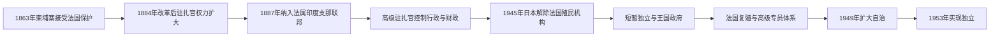

# 柬埔寨法国统治时期行政首脑表

## 范围与制度变化

本表列1863年保护条约至1953年完全独立之间，法国在柬埔寨的主要驻地行政首脑，并另列1945年的日本军事控制与战后盟军过渡。职称先后为代表、总驻扎官、高级驻扎官、专员和高级专员。代理者也列入，以说明行政权连续性；个别代理任期与名义正职重叠，是代为履职而非两个平行政权。

法国官员受法属印度支那总督领导。国王始终保留王位，但1884年以后，财政、警察、司法、公共工程和地方官监督主要由法国驻地体系掌握。

## 保护国行政演变图

保护国时期柬埔寨国王并未被正式废除，但法国驻扎官逐步控制预算、官僚和对外关系；1945—1946年间日本、王廷、民族主义者和法国复殖机构先后或并行掌权。

## 代表与总驻扎官

| 顺序 | 行政首脑 | 任期 | 职称与备注 |
|---:|---|---|---|
| 1 | Ernest Doudart de Lagrée | 1863—1866年 | 法国代表；保护条约初期。 |
| 2 | Armand Pottier | 1866—1868年 | 代表，首次任期。 |
| 3 | Jean Moura | 1868—1870年 | 代表，首次任期。 |
| — | Armand Pottier | 1870年3—11月 | 代理代表，第二次任期。 |
| — | Jules Brossard de Corbigny | 1870年11月—1871年1月 | 代理代表。 |
| 3 | Jean Moura | 1871—1876年5月 | 代表，第二次任期。 |
| — | Paul-Louis-Félix Philastre | 1876年5—11月 | 代理代表。 |
| 3 | Jean Moura | 1876—1879年 | 代表，第三次任期。 |
| — | Étienne Aymonier | 1879—1881年 | 代理代表。 |
| 4 | Paul Fourès | 1881—1884年 | 代表；1884年改革前后转任代理总驻扎官。 |
| — | Paul Fourès | 1884—1885年8月 | 代理总驻扎官。 |
| — | Jules Renauld | 1885年8—10月 | 代理总驻扎官。 |
| — | Pierre de Badens | 1885—1886年 | 临时总驻扎官。 |
| 5 | Georges Piquet | 1886—1887年 | 总驻扎官。 |
| — | Louis Palasne de Champeaux | 1887—1889年5月 | 代理总驻扎官。 |
| — | Pascal Orsini | 1889年5—7月 | 代理总驻扎官。 |

## 高级驻扎官

| 顺序 | 行政首脑 | 任期 | 备注 |
|---:|---|---|---|
| 1 | Albert Huyn de Vernéville | 1889—1894年1月 | 首任高级驻扎官。 |
| — | Flore Léonce Marquant | 1894年1—8月 | 代理。 |
| 1 | Albert Huyn de Vernéville | 1894—1897年 | 第二次任期。 |
| 2 | Antoine Ducos | 1897—1900年 | 正任。 |
| — | Louis Paul Luce | 1900—1901年 | 代理，首次。 |
| 3 | Léon Boulloche | 1901—1902年 | 正任。 |
| — | Charles Pallier | 1902年7—10月 | 代理。 |
| 4 | Henri de Lamothe | 1902—1904年 | 正任。 |
| 5 | Louis Morel | 1904—1905年 | 正任。 |
| — | Olivier de Lalande de Calan | 1905年10—12月 | 代理。 |
| 6 | Louis Paul Luce | 1905—1911年 | 正任，第二次掌管驻地机构。 |
| 7 | Ernest Outrey | 1911—1914年 | 名义正任；后期由代理者处理部分事务。 |
| — | François Tessarech | 1914年3—7月 | 代理。 |
| — | Joseph Le Gallen | 1914年7—10月 | 代理。 |
| 8 | François Baudoin | 1914—1927年 | 长期正任。 |
| — | Georges Maspero | 1920年4—12月 | 代鲍杜安履职。 |
| — | Hector Létang | 1920年12月—1921年2月 | 代鲍杜安履职。 |
| — | Victor L'Helgoualc'h | 1922—1924年 | 代鲍杜安履职。 |
| 9 | Aristide Le Fol | 1927—1929年 | 正任。 |
| — | Achille Silvestre | 1929年1月 | 代理，首次。 |
| 10 | Fernand Lavit | 1929—1932年 | 正任。 |
| 11 | Achille Silvestre | 1932—1935年 | 第二次掌职；起初为代理，后转正。 |
| — | Henri Richomme | 1935—1936年 | 代理。 |
| 12 | Léon Thibaudeau | 1936—1941年 | 正任；部分时期由下属代行。 |
| — | Jean Delens | 1941—1943年 | 代理。 |
| 13 | Georges Gautier | 1943—1944年 | 正任。 |
| — | André Berjoan | 1944年11月—1945年3月 | 代理；日本政变后被拘押。 |

## 日本控制、盟军过渡与法国复殖

| 顺序 | 行政首脑 | 任期 | 权力性质 |
|---:|---|---|---|
| 1 | Takanobu Manaki | 1945年3月起 | 日本军司令；掌握军事控制。 |
| 2 | Kanichiro Kubota | 1945年3—8月 | 日本最高顾问；在西哈努克宣布独立后监督政府。 |
| 3 | Edward Dymoke Murray | 1945年10月—1946年 | 英军指挥官；作为盟军受降与过渡力量进入柬埔寨。 |
| — | André Berjoan | 1945年8—10月 | 法国代理高级驻扎官复职。 |
| 4 | Paul Huard | 1945年10月—1946年4月 | 法国专员。 |
| 5 | Romain Pénavaire | 1946—1947年 | 法国专员。 |
| 6 | Léon Pignon | 1947—1948年 | 法国专员。 |
| — | Lucien Loubet | 1948年10月—1949年2月 | 代理专员。 |
| 7 | Jean de Raymond | 1949—1951年 | 专员；法国联盟自治阶段。 |
| 8 | Yves Digo | 1951—1952年 | 专员。 |
| 9 | Jean Risterucci | 1952—1953年4月 | 专员。 |
| 9 | Jean Risterucci | 1953年4—11月 | 高级专员；完全独立前最后一任法国行政首脑。 |

## 实际权力边界

| 时段 | 法国驻地机构 | 柬埔寨王室与政府 |
|---|---|---|
| 1863—1884年 | 掌外交并逐步介入税收和安全 | 国王与传统大臣仍管理大部分内政。 |
| 1884—1941年 | 控制财政、司法、警察、工程和官员监督 | 国王承担合法性与宗教礼仪，地方官受双重体系约束。 |
| 1941—1945年3月 | 维希法国机构在日本军事优势下继续行政 | 西哈努克国王与本地内阁空间有限。 |
| 1945年3—8月 | 日本军和最高顾问掌实权 | 西哈努克宣布独立，山玉成政府短暂扩大自主。 |
| 1945—1949年 | 法国恢复军事和行政控制 | 王室、民主党和民族主义者争取自治。 |
| 1949—1953年 | 高级专员仍控制部分防务外交 | 柬埔寨政府自治扩大，西哈努克最终以王家独立运动取得完全主权。 |

## 相关笔记

- [后吴哥时代与法属保护国](/%E4%BA%BA%E6%96%87%E7%A7%91%E5%AD%A6/%E5%8E%86%E5%8F%B2/%E4%B8%9C%E5%8D%97%E4%BA%9A/%E6%9F%AC%E5%9F%94%E5%AF%A8/%E5%90%8E%E5%90%B4%E5%93%A5%E6%97%B6%E4%BB%A3%E4%B8%8E%E6%B3%95%E5%B1%9E%E4%BF%9D%E6%8A%A4%E5%9B%BD.md)
- [1953年以来国家领导人表](/%E4%BA%BA%E6%96%87%E7%A7%91%E5%AD%A6/%E5%8E%86%E5%8F%B2/%E4%B8%9C%E5%8D%97%E4%BA%9A/%E6%9F%AC%E5%9F%94%E5%AF%A8/1953%E5%B9%B4%E4%BB%A5%E6%9D%A5%E5%9B%BD%E5%AE%B6%E9%A2%86%E5%AF%BC%E4%BA%BA%E8%A1%A8.md)
