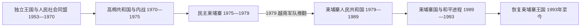

# 独立、红色高棉与重建

## 时间

1953年至今（现任信息核验至2026年7月）

## 概括

柬埔寨独立后的历史不是由“中立—政变—红色高棉—恢复和平”几次政权更替简单串联，而是殖民国家建设不足、王权政治、城乡差距、越南战争外溢、国内派系竞争和大国干预共同作用的结果。西哈努克在1953年取得完全独立，随后以人民社会同盟建立个人化中立体制；1970年朗诺政变把国家更深地卷入印度支那战争。红色高棉1975年夺取金边后实施强制迁徙、集体化、政治清洗和族群迫害，至1979年造成巨大人口损失。越南军队推翻民主柬埔寨后，境内政府、边境反对武装与国际承认长期分离，直到1991年和平协定和1993年联合国主持选举才恢复君主立宪。此后国家重建和经济增长显著，但政治权力逐渐集中于柬埔寨人民党。

## 建国背景与主要阶段

| 阶段 | 时间 | 核心过程 | 权力结构 |
|---|---|---|---|
| 独立王国与西哈努克体制 | 1953—1970年 | 争取独立、日内瓦中立、人民社会同盟统治、越南战争外溢 | 国王 / 国家元首、西哈努克个人网络、军方与议会 |
| 高棉共和国 | 1970—1975年 | 政变、共和国化、美国与南越介入、全国内战 | 朗诺总统、军队和依赖外援的政府 |
| 民主柬埔寨 | 1975—1979年 | 城市强制疏散、农业集体化、清洗与对越战争 | 柬埔寨共产党常务委员会；波尔布特集团掌握实权 |
| 人民共和国与持续战争 | 1979—1989年 | 越南支持建政、恢复城市生活、边境战争与国际孤立 | 人民革命党政府、越南驻军与反对武装并立 |
| 柬埔寨国与联合国过渡 | 1989—1993年 | 越军撤出、巴黎协定、难民返乡、制宪选举 | 本国政府、反对派联盟和联合国权力重叠 |
| 恢复君主制与人民党长期执政 | 1993年至今 | 联合政府、1997年武装冲突、经济重建、权力集中与代际交接 | 国王承担宪法礼仪职能，首相和人民党控制政府体系 |

完整国家元首、政府首脑和实际权力结构见[1953年以来国家领导人表](/%E4%BA%BA%E6%96%87%E7%A7%91%E5%AD%A6/%E5%8E%86%E5%8F%B2/%E4%B8%9C%E5%8D%97%E4%BA%9A/%E6%9F%AC%E5%9F%94%E5%AF%A8/1953%E5%B9%B4%E4%BB%A5%E6%9D%A5%E5%9B%BD%E5%AE%B6%E9%A2%86%E5%AF%BC%E4%BA%BA%E8%A1%A8.md)。

## 独立王国与中立政策

1953年11月，法国承认柬埔寨完全独立。1954年日内瓦会议结束第一次印度支那战争，确认柬埔寨主权及外国军队撤离。西哈努克1955年把王位让给父亲苏拉玛里特，自己组织人民社会同盟并赢得选举，从而绕过君主应保持超党派的限制。人民社会同盟把王室声望、行政官僚、佛教组织、地方精英和群众动员结合起来，反对派则受压制或被吸收。

外交上，西哈努克试图在美国、中国、法国、北越和南越之间保持中立，以避免柬埔寨成为战场。中立在1950年代一度换来援助和相对稳定，但也依赖西哈努克个人平衡。1960年代越南共产党部队使用柬东边境地区，南越和美国进行越境行动；国内保守军官、城市共和派与左翼地下组织同时扩大。稻米走私、财政困难和1967年三洛起义使国家暴力升级。西哈努克对左右两端交替镇压，最终失去稳定联盟。

## 高棉共和国与内战

1970年3月，西哈努克出访期间，国民议会在朗诺和施里玛达推动下罢免其国家元首职务。政变者要求越南共产党军队离境，并于10月宣布高棉共和国。西哈努克在北京与柬埔寨共产党结盟，王室号召力帮助原本规模有限的红色高棉扩大农村支持。

美国与南越军队1970年进入柬埔寨东部，随后美国持续空袭共产党据点和补给区。轰炸、征兵、腐败、通货膨胀和人口逃入城市破坏农村社会；但红色高棉的扩张不能只归因于轰炸，还包括西哈努克联盟、北越军事援助、共和国军队薄弱和共产党严密组织。1973年美国停止轰炸后，金边政府被逐步压缩在城市和交通线。1975年4月17日红色高棉进入金边，高棉共和国灭亡。

## 民主柬埔寨的统治过程

红色高棉把战争胜利解释为立即进入完全农业共产主义的机会。政权在数日内疏散金边和其他城市，废除货币、市场、私人财产和大部分学校宗教机构，把人口编入合作社与劳动队。居民按革命履历区分为“基本人民”和“新人”，前政权人员、知识分子、宗教人士及被怀疑不忠者遭到清洗。

1976年民主柬埔寨宪法建立国家主席团和政府，但实际决定由柬埔寨共产党常务委员会作出，波尔布特居核心地位。各地区干部拥有很大执行权，中央又通过肃反不断重组地方。超额征粮、缺乏医疗、强迫劳动和封锁人口流动造成饥荒与疾病；S-21等监狱负责审讯和处决被认定的“内奸”。占族穆斯林、越南裔、华人、佛教僧侣及其他群体受到程度不同的迫害。死亡来自处决、饥饿、疾病和过劳的叠加，不能仅用单一数字或单一政策解释。

1977—1978年，政权在东部边境多次攻击越南，内部又清洗被怀疑“亲越”的东区干部。逃往越南的柬埔寨干部组成反对力量。1978年12月越南发动全面进攻，1979年1月7日进入金边，民主柬埔寨中央政权崩溃；红色高棉退入泰国边境，战争并未随之结束。

## 人民共和国、边境战争与和平进程

越南支持韩桑林、宾索万等建立柬埔寨人民共和国。新政府恢复货币、市场、学校、寺院和家庭农业，招募原有干部重建行政，但人力损失、饥荒、地雷和基础设施破坏使复原极为困难。越南驻军与顾问对安全和高层政策有决定影响，洪森自1985年起任总理并逐渐成为政权核心。

冷战使“境内控制”与“国际承认”分裂。中国、美国、东盟成员及其他国家反对越南驻军，民主柬埔寨席位一度继续得到承认；1982年，红色高棉、西哈努克派和宋双派组成民主柬埔寨联合政府，在泰柬边境活动。越南与人民共和国军队反复进攻边境营地，大量难民在泰国一侧生活。

1989年越南完成撤军，人民共和国改名柬埔寨国并放松经济控制。1991年《巴黎和平协定》规定停火、难民返乡、解除武装和联合国监督选举。联合国柬埔寨过渡时期权力机构虽管理选举和部分行政，却未能使红色高棉完全缴械，也未解除人民党在地方行政和安全机构中的优势。1993年选举中奉辛比克党得票领先，人民党拒绝完全交权，最终形成拉那烈任第一首相、洪森任第二首相的联合政府，并恢复西哈努克国王。

## 恢复君主制后的重建与权力集中

1993年宪法确立君主立宪、多党议会和基本权利。国际援助、难民返乡、道路建设、制衣业、旅游业和区域投资推动经济恢复。1997年奉辛比克党与人民党部队发生武装冲突，拉那烈被撤换；1998年后洪森成为唯一首相，人民党依靠地方组织、行政、军警和商业网络长期执政。红色高棉在1990年代因投降、分裂和波尔布特死亡而瓦解，最后主要据点于1998—1999年纳入政府控制。

2004年西哈努克退位，王位委员会选举其子诺罗敦·西哈莫尼为国王。特别法庭自2006年起审理部分红色高棉高级领导人，形成司法记录，但因被告年老、案件范围和政治限制，无法覆盖全部责任。土地征收、贫富差距、劳工权利、环境开发与媒体和反对党空间成为新时期争议。2017年主要反对党被解散后，2018年人民党取得国民议会全部席位；2023年选举前另一主要反对力量又被取消参选资格。

2023年8月，洪森把首相职位交给长子洪玛奈，许多内阁职位同步发生代际交接。洪森继续担任人民党主席，并于2024年出任参议院主席，说明交接是执政集团内部的代际更新而非权力结构断裂。截至2026年7月，诺罗敦·西哈莫尼仍为国王，洪玛奈仍为首相。

## 重要事件

| 时间 | 事件 | 结果与长期影响 |
|---|---|---|
| 1953年11月 | 法国承认完全独立 | 王室成为建国合法性的核心。 |
| 1955年 | 西哈努克退位并建立人民社会同盟 | 形成个人化群众政治与一党优势。 |
| 1967年 | 三洛起义及镇压 | 农村左翼武装扩大，政治极化加深。 |
| 1970年3月 | 朗诺政变 | 君主主导体制崩溃，内战全国化。 |
| 1975年4月17日 | 红色高棉占领金边 | 高棉共和国灭亡，强制社会改造开始。 |
| 1976—1978年 | 集体化、清洗与对越冲突 | 大规模死亡，国家与社会组织遭毁灭性破坏。 |
| 1979年1月7日 | 越南军队攻入金边 | 民主柬埔寨境内政权结束，边境战争延续。 |
| 1985年 | 洪森出任总理 | 形成延续数十年的政治核心。 |
| 1989年 | 越南撤军、改称柬埔寨国 | 为国际谈判和经济转轨创造条件。 |
| 1991年 | 《巴黎和平协定》 | 建立联合国过渡与选举框架。 |
| 1993年 | 联合国主持选举、恢复王国 | 君主立宪和联合政府重新建立。 |
| 1997年 | 两派武装冲突 | 人民党取得决定性安全优势。 |
| 1998—1999年 | 红色高棉最后集团瓦解 | 长期内战基本结束。 |
| 2004年 | 西哈莫尼继位 | 王位委员会选王机制实际运作。 |
| 2006年起 | 红色高棉特别法庭审判 | 对部分最高层责任作出司法认定。 |
| 2023年 | 洪玛奈接任首相 | 执政集团完成首相职位的代际交接。 |

## 崛起、衰落与政权更替原因

### 西哈努克体制为何形成又崩溃

- **形成条件**：独立运动赋予王室巨大声望；政党和官僚基础薄弱；西哈努克能在大国间争取援助。
- **结构弱点**：决策依赖个人平衡，反对派缺乏制度化表达；地方腐败与城乡差距积累。
- **外部压力**：越南战争越境、美国和南越行动以及中美苏竞争压缩中立空间。
- **直接触发**：1970年西哈努克出访时，保守议员、朗诺和施里玛达利用政治危机完成罢免。

### 红色高棉为何崛起又灭亡

- **崛起条件**：政变使西哈努克与共产党结盟；战争、轰炸、国家崩溃和北越援助扩大红色高棉兵源。
- **统治灾难的结构因素**：秘密党组织、绝对化意识形态、战争化动员和对专业知识的敌视，使政策缺乏纠错机制。
- **内部衰败**：超额征收、清洗和地区互疑破坏生产与军队；社会不满无法公开表达。
- **外部压力与直接灭亡**：持续攻击越南导致全面战争；1978年12月越南入侵、1979年1月攻占金边，中央政权迅速崩溃。

### 1993年后体制为何趋于稳定又集中

- **稳定条件**：战争疲劳、国际援助、市场化、红色高棉瓦解以及人民党地方行政网络共同降低全面战争风险。
- **集中机制**：执政党长期控制地方政府、安全机构和资源分配；反对派组织空间逐步收缩。
- **延续性**：2023年首相交接保留了人民党、王室礼仪和既有国家机构，因而没有造成政权断裂。

## 演变关系

前接[后吴哥时代与法属保护国](/%E4%BA%BA%E6%96%87%E7%A7%91%E5%AD%A6/%E5%8E%86%E5%8F%B2/%E4%B8%9C%E5%8D%97%E4%BA%9A/%E6%9F%AC%E5%9F%94%E5%AF%A8/%E5%90%8E%E5%90%B4%E5%93%A5%E6%97%B6%E4%BB%A3%E4%B8%8E%E6%B3%95%E5%B1%9E%E4%BF%9D%E6%8A%A4%E5%9B%BD.md)。冷战与越南战争的跨境关系可对照[越南历史](/%E4%BA%BA%E6%96%87%E7%A7%91%E5%AD%A6/%E5%8E%86%E5%8F%B2/%E4%B8%9C%E5%8D%97%E4%BA%9A/%E8%B6%8A%E5%8D%97/README.md)和[老挝历史](/%E4%BA%BA%E6%96%87%E7%A7%91%E5%AD%A6/%E5%8E%86%E5%8F%B2/%E4%B8%9C%E5%8D%97%E4%BA%9A/%E8%80%81%E6%8C%9D/README.md)。
