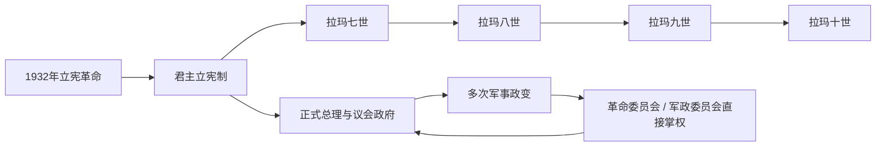

# 1932年以来国王与政府首脑表

## 范围与使用说明

本表承接[吞武里与曼谷王朝改革](/%E4%BA%BA%E6%96%87%E7%A7%91%E5%AD%A6/%E5%8E%86%E5%8F%B2/%E4%B8%9C%E5%8D%97%E4%BA%9A/%E6%B3%B0%E5%9B%BD/%E5%90%9E%E6%AD%A6%E9%87%8C%E4%B8%8E%E6%9B%BC%E8%B0%B7%E7%8E%8B%E6%9C%9D%E6%94%B9%E9%9D%A9.md)，集中列出1932年立宪革命以来的却克里王朝国王、正式编号总理、重要代理总理与军政权。它与[立宪革命、军政与当代泰国](/%E4%BA%BA%E6%96%87%E7%A7%91%E5%AD%A6/%E5%8E%86%E5%8F%B2/%E4%B8%9C%E5%8D%97%E4%BA%9A/%E6%B3%B0%E5%9B%BD/%E7%AB%8B%E5%AE%AA%E9%9D%A9%E5%91%BD%E3%80%81%E5%86%9B%E6%94%BF%E4%B8%8E%E5%BD%93%E4%BB%A3%E6%B3%B0%E5%9B%BD.md)配合使用：本页维护连续名录，主笔记解释政治过程与因果。

总理顺序采用泰国政府的正式编号。同一人多次组阁仍只占一个编号，多个任期在同一行列出；军政府、革命委员会和代理总理不冒充正式编号总理。部分旧内阁的法定终止日、继任任命日与看守交接日相差数日，表中优先采用正式任免口径，并在备注中说明关键空档。

## 立宪王权与军政循环图

1932年以后国王序列连续，但政府首脑任期屡被政变、军政委员会和临时代理打断。表中分别列正式编号总理、重要代理和不设总理时的实际军政最高机关。

## 却克里王朝国王（立宪时期）

| 王朝内顺序 | 国王 | 全部在位时间 | 立宪时期的统治结构与关键说明 |
|---:|---|---|---|
| 7 | **拉玛七世巴差提朴** | 1925年11月26日—1935年3月2日 | 1932年6月接受临时宪法，绝对君主制终结；1935年因与政府在王权、赦免和政治责任等问题上分歧而退位。 |
| 8 | 拉玛八世阿南塔玛希敦 | 1935年3月2日—1946年6月9日 | 即位时年幼且长期在瑞士，由摄政机构代行职权；1946年在王宫中死于枪伤，案件经过与责任长期存在争议。 |
| 9 | **拉玛九世普密蓬·阿杜德** | 1946年6月9日—2016年10月13日 | 1950年加冕；长期统治跨越军政府、冷战发展和大众政治时期。正式权力受宪法约束，王室声望、枢密院与军政精英网络在不同阶段产生重要非正式影响。 |
| 10 | **拉玛十世玛哈·哇集拉隆功** | 2016年10月13日至今 | 2016年12月接受即位，继承效力追溯至拉玛九世逝世之日，2019年加冕；截至2026年7月为在位国王。 |

## 正式编号总理完整表

| 顺序 | 总理 | 正式在任时间 | 产生方式、继承与关键事件 |
|---:|---|---|---|
| 1 | 披耶玛奴巴功·尼蒂塔达（Phraya Manopakorn Nititada） | 1932年6月28日—1933年6月20日 | 首任总理，由立宪后的议会体系推举；1933年4月关闭议会、暂停部分宪法条文，6月被披耶帕凤集团推翻。 |
| 2 | **披耶帕凤·丰派育哈社那**（Phraya Phahon Phonphayuhasena） | 1933年6月21日—1938年12月16日 | 1933年军方政变领袖；击败保王派鲍沃拉德叛乱，人民党军人派地位上升。 |
| 3 | **贝·披汶颂堪**（銮披汶颂堪） | 1938年12月16日—1944年8月1日；1948年4月8日—1957年9月16日 | 两度执政的军人强人；推动国家主义、改国名并在二战中与日本结盟；战后借军方支持复出，1957年被沙立政变推翻。 |
| 4 | 宽·阿派旺 | 1944年8月1日—1945年8月31日；1946年1月31日—3月24日；1947年11月10日—1948年4月8日 | 三度组阁；第一次负责战争末期转向，第三次由1947年政变集团扶持，后被军方迫使让位于披汶。 |
| 5 | 他威·汶耶革 | 1945年8月31日—9月17日 | 过渡总理，为社尼·巴莫回国组阁衔接。 |
| 6 | 社尼·巴莫 | 1945年9月17日—1946年1月31日；1975年2月15日—3月14日；1976年4月20日—10月6日 | 自由泰运动人物；后两次在高度分裂的议会政治中短暂执政，1976年法政大学惨案与政变终结其末次政府。 |
| 7 | **比里·帕侬荣**（Pridi Banomyong） | 1946年3月24日—8月23日 | 人民党文官领袖、1932年革命重要设计者；拉玛八世死亡后的政治危机迫使其辞职，随后失势流亡。 |
| 8 | 他旺·探隆那瓦沙瓦 | 1946年8月23日—1947年11月8日 | 比里派文官政府；因经济、军方不满和王室死亡案政治化而被1947年政变推翻。 |
| 9 | 朴·沙拉信（Pote Sarasin） | 1957年9月21日—1958年1月1日 | 沙立政变后的文官过渡总理，组织1957年末选举。 |
| 10 | 他侬·吉滴卡宗 | 1958年1月1日—10月20日；1963年12月9日—1973年10月14日 | 军方强人；1958年让位于沙立，1963年继任。1971年自我政变解散议会，以革命委员会统治，1972年再任总理，1973年群众抗议后下台流亡。 |
| 11 | **沙立·他那叻** | 1959年2月9日—1963年12月8日 | 1957、1958年两次政变的核心领袖；以革命委员会先行统治，正式任总理后实行威权发展主义并强化王室公共地位。 |
| 12 | 讪耶·探玛塞 | 1973年10月14日—1975年2月15日 | 1973年学生与市民起义后受命组阁，主持新宪法和恢复选举的过渡。 |
| 13 | 克立·巴莫 | 1975年3月14日—1976年4月20日 | 多党联合政府总理；与中华人民共和国建交，并面对国内左右翼冲突和冷战地区巨变。 |
| 14 | 他宁·盖威迁 | 1976年10月8日—1977年10月20日 | 1976年政变后由军方与保守力量支持的文官总理；强硬反共政策引发反弹，被另一场军事政变罢黜。 |
| 15 | 江萨·差玛南 | 1977年11月11日—1980年3月3日 | 军方推举的总理；缓和反共镇压、改善邻国关系，因经济与政治压力辞职。 |
| 16 | **炳·廷素拉暖** | 1980年3月3日—1988年8月4日 | 陆军将领、无党籍总理；依托军方、官僚、王室和议会政党形成“半民主”秩序，抵御1981、1985年未遂政变。 |
| 17 | 差猜·春哈旺 | 1988年8月4日—1991年2月23日 | 民选政党政府推动对印度支那经贸开放；被国家维持和平委员会政变推翻。 |
| 18 | 阿南·班雅拉春 | 1991年3月2日—1992年4月7日；1992年6月10日—9月23日 | 两度担任无党籍过渡总理；第一次由政变委员会支持，第二次在“黑色五月”后主持恢复选举。 |
| 19 | 素金达·甲巴允 | 1992年4月7日—5月24日 | 1991年政变核心将领之一；未参选而任总理引发“黑色五月”，镇压后辞职。其内阁法定交接至6月10日。 |
| 20 | **川·立派** | 1992年9月23日—1995年7月13日；1997年11月9日—2001年2月9日 | 两度领导民主党联合政府；第二任期接手亚洲金融危机后的国际援助与金融重组。 |
| 21 | 班汉·西巴阿差 | 1995年7月13日—1996年11月24日 | 多党联合政府总理；在不信任压力下解散国会并举行选举。 |
| 22 | 差瓦立·永猜裕 | 1996年11月25日—1997年11月8日 | 前陆军司令；亚洲金融危机爆发、泰铢浮动和求助国际货币基金组织后辞职。 |
| 23 | **他信·西那瓦** | 2001年2月9日—2006年9月19日 | 依靠泰爱泰党、农村福利和行政集中获得强大选举授权；毒品战争、南部冲突、利益冲突争议与反政府动员累积，出访期间被政变推翻。 |
| 24 | 素拉育·朱拉暖 | 2006年10月1日—2008年1月29日 | 退役将领、枢密院成员；由政变后的国家安全委员会支持，主持2007年宪法与恢复选举。 |
| 25 | 沙马·顺达卫 | 2008年1月29日—9月9日 | 人民力量党联合政府总理；宪法法院以主持电视烹饪节目构成受雇关系为由终止其职务。 |
| 26 | 颂猜·旺沙瓦 | 2008年9月18日—12月2日 | 他信姻亲、人民力量党总理；黄衫军抗议占领机场期间，宪法法院解散执政党并使其下台。 |
| 27 | 阿披实·威差奇瓦 | 2008年12月17日—2011年8月5日 | 民主党在议会重新组合多数后组阁；2010年红衫军示威与军队清场造成严重伤亡。 |
| 28 | 英拉·西那瓦 | 2011年8月8日—2014年5月7日 | 为泰党赢得大选后组阁；大赦法案危机、街头抗议与政府机关瘫痪后，被宪法法院裁定调职违宪而解除职务。 |
| 29 | **巴育·占奥差** | 2014年8月24日—2023年9月4日 | 2014年5月22日先以陆军司令、全国维持和平秩序委员会首脑夺权，后任总理；2019年依据2017年宪法和军方任命参议院参与的程序续任，2022年曾被法院短暂停职。 |
| 30 | 赛塔·他威信（Srettha Thavisin） | 2023年8月22日—2024年8月14日 | 为泰党与保守派政党联合组阁；宪法法院以任命曾服刑者入阁违反伦理规范为由解除其职务。 |
| 31 | 佩通坦·西那瓦 | 2024年8月16日—2025年8月29日 | 他信之女、为泰党领袖；2025年7月因与柬埔寨参议院主席洪森通话引发的伦理案被停职，8月被宪法法院解除职务。 |
| 32 | **阿努廷·参威拉军**（Anutin Charnvirakul） | 2025年9月7日—2026年3月19日；2026年3月19日至今 | 自豪泰党领袖；2025年在跨党支持下组建少数政府，12月解散国会。自豪泰党在2026年2月大选成为第一大党；众议院3月19日表决支持其连任，同日颁布王命，20日举行接令仪式。截至2026年7月在任。 |

## 重要代理总理与职务空档

本表只列因总理辞职、停职、法院裁决或政变而持续承担国家行政的代理者，不收录总理短期出访时的例行代理。

| 代理者 | 代理时间 | 背景与权限说明 |
|---|---|---|
| 米猜·雷初攀（Meechai Ruchuphan） | 1992年5月24日—6月10日 | 素金达在“黑色五月”后辞职，米猜在阿南第二次组阁前主持看守行政。 |
| 奇猜·万那沙提（Chitchai Wannasathit） | 2006年4月5日—5月23日 | 他信在争议选举后暂时停止履职期间代理，之后他信恢复职务。 |
| 差瓦拉·参威拉军（Chavarat Charnvirakul） | 2008年12月2日—17日 | 执政党被解散、颂猜失职后主持看守政府，直至阿披实组阁。 |
| 尼瓦探隆·汶颂派讪 | 2014年5月7日—22日 | 英拉被法院解除职务后看守，5月22日军方政变终止其政府。 |
| 巴威·翁素万 | 2022年8月24日—9月30日 | 宪法法院审理巴育任期计算案期间代理；法院裁定巴育可继续任职后结束代理。 |
| 普坦·威差耶猜 | 2024年8月14日—16日 | 赛塔被解除职务至佩通坦获任命之间代理。 |
| 素里亚·庄隆里吉 | 2025年7月1日—3日 | 佩通坦遭停职、改组内阁完成宣誓前短暂代理。 |
| 普坦·威差耶猜 | 2025年7月3日—9月7日 | 改组后成为排名第一的副总理，在佩通坦停职及被解除职务期间代理至阿努廷就任。 |

## 成功政变、革命委员会与军政权

| 时间 | 权力集团 / 主要人物 | 对政府与制度的影响 |
|---|---|---|
| 1933年4月、6月 | 玛奴巴功政府；披耶帕凤军人集团 | 4月政府关闭议会并暂停部分宪法，6月军方反政变恢复议会并更换总理，确立军人派在新制度中的重要地位。 |
| 1947年11月 | 屏·春哈旺等军官组成的政变集团 | 推翻探隆政府，先扶持宽·阿派旺，1948年再迫使其让位于披汶。 |
| 1951年11月 | 披汶与军方“静默政变”集团 | 废止1949年宪法、恢复更有利于军方的制度安排，巩固警军竞争下的威权统治。 |
| 1957、1958年 | **沙立·他那叻**及革命委员会 | 1957年推翻披汶，1958年再推翻选举政府、废宪解散议会；以军事命令和发展计划重建威权秩序。 |
| 1971年11月 | 他侬—巴博军政集团 | 他侬自我政变，解散议会、废宪并以革命委员会统治，直至1973年群众起义。 |
| 1976年10月 | 国家行政改革委员会，主要军方人物沙鄂·差罗如 | 法政大学惨案后夺权，任命他宁政府，扩大反共清洗。 |
| 1977年10月 | 沙鄂等革命委员会军官 | 推翻他宁，转向较缓和的军人主导政治，并扶持江萨组阁。 |
| 1991年2月 | 国家维持和平委员会，顺通·空颂蓬、素金达等 | 推翻差猜政府；任命阿南过渡，后由素金达任总理，因1992年群众抗议终结。 |
| 2006年9月 | 民主改革委员会，颂提·汶雅叻格林 | 推翻他信看守政府，后改称国家安全委员会，制定临时宪制并任命素拉育政府。 |
| 2014年5月 | **全国维持和平秩序委员会**，巴育·占奥差 | 推翻英拉之后的看守政府，废止大部分宪法、压制政治活动并重构参议院和独立机构；军政府形式持续至2019年组阁。 |

## 连续性辨析

- 国王、总理和实际最高权力中心不能混成一张“统治者表”。立宪文本规定国王为国家元首、内阁对行政负责，但政变时期革命委员会或军政府可凌驾于普通宪制之上。
- 泰国正式编号按“人”而不是按每届内阁计算，所以披汶、宽、社尼、阿南、川与阿努廷多次任职仍各占一个编号。
- 1946年拉玛八世死亡、1976年暴力事件、2006与2014年政变、2023年后政党与法院冲突均有强烈政治争议；本表只记录可确认的任免、制度结果和主要参与者。
- 截至2026年7月，国家元首为拉玛十世玛哈·哇集拉隆功，政府首脑为第32任总理阿努廷·参威拉军。
