# 立宪革命、军政与当代泰国

## 时间

1932年至今

## 概括

1932年人民党以军官和文官联合行动结束绝对君主制，泰国由此进入君主立宪时代。不过，宪法的存在并未自动形成稳定的议会主权：军队、王室与枢密院网络、官僚体系、法院和独立机构、政党资本、地方选民与街头运动持续争夺“谁有权界定合法政府”。因此，现代泰国既有竞争性选举、快速社会经济转型和活跃公民社会，也有成功政变、宪法重写、政党解散与司法罢免反复发生。

截至2026年7月，国家元首为拉玛十世玛哈·哇集拉隆功，政府首脑为第32任总理阿努廷·参威拉军。2026年大选后阿努廷获得众议院多数支持，开始第二任期；但宪法改革、军方政治角色、司法化政治、经济增长与城乡分配仍是长期议题。

## 立宪建立的背景与政治动员

- 19世纪末以来的中央集权改革培养了军官、留学生和职业官僚，却仍由王族占据高层职位，新精英缺少制度化参政渠道。
- 拉玛六世时期财政开支扩张，拉玛七世又遭遇世界经济大萧条；裁员、减薪与预算紧缩使官僚和军人不满。
- 1932年6月24日，人民党控制曼谷关键设施并扣留部分王族，以“六项原则”要求宪法、国民代表、经济改善与权利平等。
- 拉玛七世接受临时宪法，12月颁布常设宪法。立宪并非一次完成：1933年行政—议会冲突、军方反政变和鲍沃拉德叛乱随即决定了新制度的权力分布。
- 人民党内部文官派、军人派和官僚派并非一体。1930年代后期披汶颂堪凭军队、行政宣传和国家主义取得主导。

## 主要政治阶段

| 阶段 | 时间 | 制度与实际权力结构 |
|---|---|---|
| 立宪初建与人民党竞争 | 1932—1938年 | 国王成为宪制元首；人民党军官、文官和旧官僚争夺议会与内阁，军人派在1933年后占优。 |
| 披汶国家主义、二战与战后重组 | 1938—1957年 | 披汶军人政权推动国家主义；战争末期自由泰与文官派接管，1947年政变后军方重新控制政府。 |
| 沙立—他侬冷战军人政权 | 1957—1973年 | 革命委员会、军队和官僚主导，美国援助与反共安全体系支撑发展；王室公共作用和社会声望显著上升。 |
| 群众政治、暴力反扑与“半民主” | 1973—1988年 | 学生运动打开竞争政治，1976年暴力镇压后军方复权；炳政府以军方、王室、官僚和议会政党合作维持稳定。 |
| 议会化、金融危机与大众政党 | 1988—2001年 | 商业政党扩张；1991年政变与1992年“黑色五月”后军人直接任总理失去正当性，1997年宪法强化民选政府。 |
| 他信政治与“黄—红”对立 | 2001—2014年 | 大众福利和党组织形成强选举多数；反他信运动、法院、军队与支持他信的地方选民和红衫军持续冲突。 |
| 2014年军政府及其宪制遗产 | 2014—2023年 | 全国维持和平秩序委员会直接统治，2017年宪法赋予军方任命参议院和独立机构重要制衡权；2019年后转为军方主导的选举政府。 |
| 代际改革诉求与联盟重组 | 2020年至今 | 青年运动、改革派政党与旧权力网络冲突；法院裁决、联盟变换和边境危机推动2023—2026年政府连续更替。 |

## 宪制统治与实际权力结构

### 正式国家机关

| 角色 | 正式职能 | 现代政治中的关键变化 |
|---|---|---|
| 国王 | 国家元首，依法任命总理、公布法律并履行礼仪与宪制职能 | 正式权力依各版宪法而定；拉玛九世时期形成很高社会声望，枢密院及王室网络在危机调停和精英协调中具有非正式影响。 |
| 总理与内阁 | 领导行政、提出预算与政策，原则上对议会负责 | 政变时期可由军政委员会任命；民选时期又可能因法院裁决、政党解散或联盟重组提前终止。 |
| 众议院 | 由选举产生，立法、预算并决定总理人选 | 选举制度多次改变；2001年后大型政党更能整合全国选票，亦引发针对“议会多数支配”的反制。 |
| 参议院 | 审议立法并参与若干任命和监督 | 组成方式反复变化；2017年宪法下首届参议院由军方体系主导任命，并曾与众议院共同选择总理。 |
| 宪法法院与独立机构 | 审查法律、选举、政党和公职伦理 | 21世纪多次解散政党、罢免总理或限制候选人，成为政治竞争的核心场域，也引发“司法化政治”争议。 |
| 军队 | 国防与安全 | 以维护秩序、王室和国家安全为理由多次夺权；军区、军队企业和退役将领网络使其影响不限于政变时刻。 |

### 社会与非正式力量

- **政党与政治家族**：地方派系、商业资本与全国性福利政策结合，形成民主党、他信系政党、自豪泰党及改革派政党等不同联盟。
- **城乡和区域选民**：北部、东北部农村选民并非被动“票仓”，他们通过选举要求医疗、信贷、基础设施与地方代表；曼谷中产、南部选民和不同代际也有各自政治诉求。
- **街头运动**：人民民主联盟“黄衫军”、反独裁民主联盟“红衫军”、人民民主改革委员会及2020年青年运动，都曾以占领、集会和舆论改变政府命运。
- **王室—官僚—商业网络**：枢密院、高级官员、法院、军方、财团及媒体之间并非固定统一集团，但在反共、反他信或维护既有秩序时常形成阶段性合作。
- **国际环境**：二战、日本占领、冷战美援、越南战争、全球资本流动、1997年金融危机以及与柬埔寨的边境紧张，都曾改变国内权力平衡。

## 国王、总理与军政权名录

立宪后的4位国王、32位正式编号总理、重要代理总理及成功政变集团，统一维护在[1932年以来国王与政府首脑表](/%E4%BA%BA%E6%96%87%E7%A7%91%E5%AD%A6/%E5%8E%86%E5%8F%B2/%E4%B8%9C%E5%8D%97%E4%BA%9A/%E6%B3%B0%E5%9B%BD/1932%E5%B9%B4%E4%BB%A5%E6%9D%A5%E5%9B%BD%E7%8E%8B%E4%B8%8E%E6%94%BF%E5%BA%9C%E9%A6%96%E8%84%91%E8%A1%A8.md)。这样可避免把国家元首、政府首脑、军政府首脑和代理者混成一条“君主世系”。

## 分期过程

### 1932—1947年：立宪、国家主义与战争

1932年革命后，人民党先与旧王室官僚合作，旋即因比里经济计划、议会权力和王室地位发生冲突。1933年披耶帕凤政变恢复议会并击败保王派叛乱，军人派从此成为制度内外的关键力量。1935年拉玛七世退位，年幼且居海外的拉玛八世即位，摄政机构代行职务。

披汶1938年任总理后，以“文化训令”、改国名、服饰和语言规范塑造泰民族国家，并扩大军警权力。1941年日军进入泰国，政府与日本结盟并对英美宣战；驻美大使拒绝递交宣战书，自由泰运动则在国内外建立抵抗网络。1944年披汶失势，战后文官政府借自由泰网络避免泰国被作为战败国长期占领，但拉玛八世1946年死亡与经济困难加剧政治危机，1947年政变使军方复权。

### 1947—1973年：军人统治、冷战发展与王室复兴

披汶在1948年重返总理职位，依靠陆军与警察竞争维持统治，并在冷战中转向美国阵营。沙立1957年推翻披汶、1958年再次夺权后，废宪、解散政党并用革命命令统治。其政权以美援、基础设施、进口替代工业和反共安全体系推动增长，同时加强地方官僚控制。

沙立及继任者他侬重塑国王出巡、典礼和发展项目的公共形象，军方则以捍卫“民族、宗教、国王”取得正当性。泰国为美国在越南战争中的重要盟友，军事基地、援助和投资促进城市化，也扩大地区与阶层差距。1971年他侬自我政变后，学生、专业人士和城市中产的不满汇合，1973年10月大规模示威迫使军政集团下台。

### 1973—1992年：开放、反扑与有限议会化

1973年后政党、工会、农民组织和学生运动迅速发展，但越南、老挝与柬埔寨革命胜利强化右翼反共恐惧。1976年10月6日，安全力量与右翼团体在法政大学镇压示威者，随后军方政变。强硬的他宁政府又因政策过激被1977年政变取代。

江萨与炳逐步以政治赦免、经济发展和议会参与削弱泰共叛乱。炳1980—1988年无党籍执政，军方、王室、官僚与政党共同维持“半民主”。1988年差猜领导的民选政府上台，商业政治扩张，却因腐败指控和军政矛盾在1991年被推翻。政变领袖素金达1992年任总理引发抗议；军队在“黑色五月”开枪后，国王召见冲突双方的电视画面成为危机转折，素金达辞职，阿南过渡政府恢复选举。

### 1992—2006年：宪政改革、金融危机与他信崛起

1992年后形成“总理应出自民选议员”的政治惯例。1997年“人民宪法”设置独立机构、强化政党与总理，同时亚洲金融危机迫使泰铢浮动、企业破产和国际援助。危机削弱旧联合政府，为他信及泰爱泰党以全民医疗、乡村基金、债务缓解和行政效率主张赢得2001年大选创造条件。

他信成为首位完成四年任期并连任的总理，其政策让地方选民更明确地把选票与公共资源相连。但行政集权、媒体和商业利益、南部冲突处理及“禁毒战争”中的法外死亡引发批评。2006年出售家族企业、街头反对运动和争议选举导致制度僵局，军方在他信出访时夺权。

### 2006—2014年：黄红对立、司法介入与再度政变

2007年宪法后，支持他信的政党仍在选举中获胜。黄衫军抗议、法院解散执政党和议会联盟重组，使阿披实2008年组阁；红衫军则把选举平等与反“双重标准”作为核心诉求。2010年曼谷示威遭军队清场，军民均有大量伤亡。

英拉领导为泰党在2011年胜选。2013年政府推动大赦法案，引发反政府运动占领机关并抵制选举；2014年宪法法院解除英拉职务，军方随后以结束冲突为由夺权。危机并非单纯个人或地区仇恨，而是“多数选举授权”与“军方、法院及街头否决权”长期冲突的结果。

### 2014—2023年：军政府、2017年宪法与改革派兴起

全国维持和平秩序委员会禁止政治活动、拘押异议者、以军法和命令治理，并起草2017年宪法。新制度以任命参议院、复杂选制和独立机构限制单一民选多数。2019年大选后巴育在参众两院共同投票中续任总理，军政体制转为带选举外观的联合政府。

2020年青年主导抗议要求巴育辞职、修宪，并公开讨论王室改革；疫情限制、司法案件和运动内部分化使街头动员减弱，但代际议题进入政党政治。2023年前进党以151席成为众议院第一大党，皮塔因参议院不支持等因素未能出任总理；为泰党转而与保守派政党联盟，由赛塔组阁。

### 2024—2026年：法院裁决、边境危机与联盟重组

2024年宪法法院解散前进党，议员另组人民党；同年又解除赛塔总理职务，佩通坦接任。2025年泰柬边境紧张升级，佩通坦与洪森通话外泄后遭停职并被法院解除职务。普坦代理期间，阿努廷凭自豪泰党与跨党支持在9月出任总理，年底解散国会。

2026年2月大选中，自豪泰党成为第一大党。阿努廷在3月获得众议院多数支持并受王命开始第二任期，组成范围更广的联合政府。选举恢复了政府的议会授权，但没有消除宪法制定、法院与政党边界、军方政治影响及边境安全等争议。

## 重要事件

| 时间 | 事件 | 过程、结果与长期影响 |
|---|---|---|
| 1932年6月24日 | 人民党立宪革命 | 控制曼谷关键节点，迫使王室接受宪法；绝对君主制终结。 |
| 1933年 | 议会危机、披耶帕凤政变与鲍沃拉德叛乱 | 新制度内部的文武冲突迅速军事化，军人派取得长期优势。 |
| 1939年 | 暹罗改称泰国 | 披汶国家主义把语言、文化和边界诉求纳入国家塑造；1945—1949年一度恢复“暹罗”。 |
| 1941—1945年 | 与日本结盟及自由泰运动 | 政府允许日军通行并结盟，自由泰在盟国支持下抵抗；战后避免长期军事占领。 |
| 1947年11月 | 战后军事政变 | 推翻文官政府，开启披汶复出与军方长期主导。 |
| 1957—1958年 | 沙立两次政变 | 革命委员会废宪并建立冷战威权发展模式。 |
| 1973年10月 | 学生与市民起义 | 他侬集团下台，开启短暂民主开放。 |
| 1976年10月6日 | 法政大学惨案与政变 | 左翼、学生和社会组织遭镇压，大量活动者转入乡村或流亡。 |
| 1980—1988年 | 炳的“半民主”时期 | 通过赦免、发展与精英协调削弱共产主义叛乱，议会政治逐步恢复。 |
| 1992年5月 | “黑色五月” | 反对军人出任总理的示威遭镇压，素金达辞职，军人直接执政正当性受重创。 |
| 1997年 | 亚洲金融危机与新宪法 | 泰铢危机引发区域金融震荡；宪法试图同时加强民选政府和独立监督。 |
| 2001年 | 他信赢得大选 | 全国性大众政党与福利政治改变城乡选举关系。 |
| 2006年9月 | 推翻他信的政变 | 军方重返直接政治，黄红阵营对立制度化。 |
| 2010年 | 红衫军示威与清场 | 曼谷冲突造成严重伤亡，加深阶层、地区与国家机构之间的不信任。 |
| 2014年5月 | 全国维持和平秩序委员会政变 | 巴育夺权，军政府统治至2019年，并通过2017年宪法延伸影响。 |
| 2016年 | 拉玛九世逝世、拉玛十世即位 | 七十年统治结束，王室进入新阶段。 |
| 2020年 | 青年主导改革运动 | 修宪、代际公平与王室改革进入公开政治议程。 |
| 2023年 | 前进党赢得最多席位但未能组阁 | 显示众议院选举授权仍受参议院和其他制度门槛制约。 |
| 2024—2025年 | 政党解散与两任总理被法院解除职务 | 前进党、赛塔与佩通坦案件凸显司法机关对政府更替的决定性影响。 |
| 2025—2026年 | 阿努廷组阁、解散国会并赢得新授权 | 先以少数政府执政，后在2026年大选成为第一大党并开始第二任期。 |

## 发展条件、结构性冲突与危机触发因素

### 经济社会转型的条件

- 冷战美援、公路与电力建设、制造业外资和旅游业推动泰国由农业社会转向城市工业与服务经济。
- 曼谷的行政、金融和教育集中提高国家整合能力，也造成首都与东北、北部及边境地区之间的发展差异。
- 普及教育、数字媒体和跨国就业扩大中产与青年群体，使政治参与不再只由官僚和地方显贵控制。
- 大众福利政策把偏远地区纳入国家资源分配，巩固选举政治的社会基础。

### 长期结构因素

- 军队拥有独立组织、武器、预算与“危机仲裁者”传统，文官政府难以完成稳定的军政关系制度化。
- 宪法频繁重写，选举规则、参议院组成和独立机构权限随政变周期变化，使各方更愿寻求体制外否决而非接受轮替。
- 王室神圣性、严格的冒犯君主法律与改革诉求之间存在紧张，公开讨论空间本身即成为政治争点。
- 强大选举多数可提高政策执行力，也会引发行政集权、利益冲突和少数派缺少制衡的担忧；反对力量又常借非选举机制推翻多数政府。
- 区域、阶层与代际差异会影响党派选择，但“曼谷对农村”“保王对共和”等单一二分法无法解释不断变化的联盟。

### 外部压力

- 二战日本军事进入直接改变政权路线；冷战美援与印度支那战争强化军方和反共国家。
- 1997年全球资本流动和固定汇率脆弱性触发金融危机，重组商业与政党力量。
- 全球产业竞争、人口老龄化、疫情冲击与旅游依赖增加政府治理压力。
- 泰柬边界争端在2025年同时成为安全危机和国内政治触发器，显示边境问题可被纳入精英竞争。

### 直接危机触发机制

成功政变通常发生在大规模示威、议会僵局或法院裁决制造权力空档之后，但“恢复秩序”只是触发条件，背后仍是军队自主性与宪制否决渠道不足。21世纪以来，政党解散、总理伦理案和参议院规则逐渐取代部分直接政变功能；政治干预由坦克夺权扩展为法律、联盟和街头多重路径。

## 演进图

```mermaid
flowchart LR
    A["1932年立宪革命"] --> B["人民党与披汶时期"]
    B --> C["二战与自由泰"]
    C --> D["1947年后军方复权"]
    D --> E["沙立—他侬冷战军政"]
    E --> F["1973年民主开放"]
    F --> G["1976年镇压与军方复权"]
    G --> H["炳的半民主与议会恢复"]
    H --> I["1992年后文官政治"]
    I --> J["1997年宪法与他信政治"]
    J --> K["2006年政变与黄红对立"]
    K --> L["2014年军政府"]
    L --> M["2017年宪制与2019年选举政府"]
    M --> N["2020年青年运动与2023年改革派胜选"]
    N --> O["2024—2025年法院裁决与联盟重组"]
    O --> P["2026年大选后阿努廷第二任期"]
```

## 演变关系

本阶段前接[吞武里与曼谷王朝改革](/%E4%BA%BA%E6%96%87%E7%A7%91%E5%AD%A6/%E5%8E%86%E5%8F%B2/%E4%B8%9C%E5%8D%97%E4%BA%9A/%E6%B3%B0%E5%9B%BD/%E5%90%9E%E6%AD%A6%E9%87%8C%E4%B8%8E%E6%9B%BC%E8%B0%B7%E7%8E%8B%E6%9C%9D%E6%94%B9%E9%9D%A9.md)。却克里王朝没有在1932年灭亡，而是由绝对君主制转为立宪王室；政府首脑、议会和军政委员会则成为另一条必须分开维护的序列。泰国冷战、金融危机与东盟角色还可结合[殖民、战争、独立与东盟](/%E4%BA%BA%E6%96%87%E7%A7%91%E5%AD%A6/%E5%8E%86%E5%8F%B2/%E4%B8%9C%E5%8D%97%E4%BA%9A/_%E9%80%9A%E5%8F%B2/%E6%AE%96%E6%B0%91%E3%80%81%E6%88%98%E4%BA%89%E3%80%81%E7%8B%AC%E7%AB%8B%E4%B8%8E%E4%B8%9C%E7%9B%9F.md)理解。
