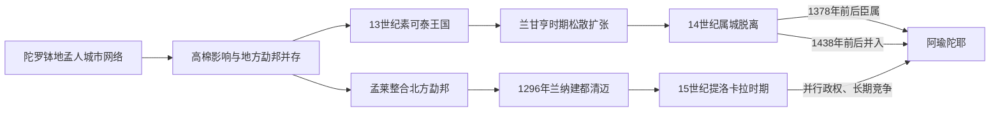

# 陀罗钵地与素可泰

## 时间

6—15世纪

## 概括

今泰国中部早期分布着以孟人为主的陀罗钵地城市网络，上座部佛教、梵巴文化和区域贸易在此传播。吴哥帝国也曾影响东北与湄南河流域。约11世纪后，泰语族群从北方逐步南移，素可泰、兰纳等政权相继形成。

陀罗钵地不是一座首都统辖全部城邦的王朝，素可泰也不是现代泰国唯一的“起点”。这一时期更适合看作孟人城市、高棉势力、泰人勐邦和佛教网络相互重组的过程。

## 建立背景与崛起机制

- 湄南河平原适合稻作，河道又连接泰国湾、东北高原和马来半岛，促成佛统、乌通、华富里等城市成长。
- 陀罗钵地城邦通过梵文、巴利文铭文、法轮与佛像传播佛教文化，但各城的政治关系并不清楚，不能据后世传说拼接出一套连续王统。
- 11—13世纪，高棉帝国通过寺庙、道路、地方首领和贡赋关系影响今泰国东北及中部部分地区。
- 泰语族群沿山间盆地和河谷南移，以“勐”为地方政治单位；地方首领通过控制水利、稻田、人口和贸易路线扩张。
- 13世纪中叶，邦克朗豪与帕芒结盟驱逐素可泰一带的高棉代表，前者即位为室利因陀罗迭多，建立帕銮王统。

## 分期过程

### 6—11世纪：陀罗钵地城市网络

湄南河中下游出现有壕沟、城墙和水利设施的城市群，佛统、乌通、华富里等地出土孟语铭文、法轮、佛像与贸易品。“陀罗钵地”来自钱币与外部记载，可能指文化—政治共同体或若干相互联系的城邦，而不是一套拥有连续首都和统一王表的帝国。各城通过稻作、河运、佛教布施与跨海贸易积累资源，地方统治者身份大多不可考，因此不应虚构国王世系。

### 10—13世纪：高棉扩张与泰人勐邦形成

吴哥国家沿交通线和寺庙中心影响今泰国东北、华富里与部分中部平原，披迈等遗址反映高棉王权、印度教和佛教传统。与此同时，泰语族群在北方和上游盆地形成以“勐”为核心的政治共同体。迁徙不是一次“民族南下”，而是军役、婚姻、农业开垦和地方首领扩张持续数世纪的结果。

### 13世纪中叶—1298年：素可泰建立与兰甘亨扩张

邦克朗豪与帕芒结盟夺取素可泰，前者以室利因陀罗迭多名义建立帕銮王统。兰甘亨时期，素可泰借王族婚姻、军事盟约、陶瓷贸易和上座部佛教网络扩大影响。著名第一号碑铭把国王描绘为可直接听取臣民申诉的“父亲式”统治者，但碑铭年代、制作过程及其反映现实的程度存在学术争论。外围更像承认威望的属城，而不是由常设官员直接管理的省份。

### 1298—15世纪：素可泰收缩、兰纳并行与阿瑜陀耶吸收

兰甘亨去世后，孟人、老挝和北方属城相继脱离。立泰以佛教功德、历法和文学重建正统，却无法改变湄南河下游阿瑜陀耶掌握人口、港口和稻米资源的优势。1378年前后素可泰承认阿瑜陀耶宗主权，1438年前后末王去世后核心区并入其行政体系。

北方的孟莱王征服孟人哈利奔猜，1296年建清迈，形成兰纳。兰纳与素可泰有宗教、婚姻与贸易联系，但不是素可泰的附庸或直系继承者；15世纪提洛卡拉时期，兰纳还与阿瑜陀耶争夺难府等城邦。

## 统治结构

| 政治体 | 时间 | 权力结构与特征 |
|---|---|---|
| 陀罗钵地 | 约6—11世纪 | 多中心城市网络，各城拥有地方统治者；以佛教、贸易和共同艺术风格联系，而非边界固定的统一帝国 |
| 高棉影响区 | 10—13世纪 | 吴哥通过寺庙、交通、地方精英和军事据点扩展影响，控制强度因地区而异 |
| 素可泰 | 13世纪中叶—1438年前后 | 国王依赖王族、属城首领与个人效忠；核心区直接统治较强，外围多为贡属关系 |
| 兰纳 | 13世纪末起 | 以清迈为中心的北方勐邦联盟，国王与王族分掌清莱、清盛等盆地，寺院网络参与整合 |

## 素可泰王世系

早期年代主要依据铭文和后世编年，个别即位年存在一至数年差异。表中列出通常承认的帕銮王统，不把阿瑜陀耶派驻的总督列为素可泰国王。

| 顺序 | 国王 | 在位时间 | 与前任关系 | 关键事件 / 备注 |
|---|---|---|---|---|
| 1 | **室利因陀罗迭多**（Si Inthrathit） | 约1238—1270年 | 开国者 | 与帕芒结盟摆脱高棉势力；建立帕銮王统 |
| 2 | 班孟（Ban Mueang） | 约1270—1279年 | 长子 | 延续对核心属城的控制 |
| 3 | **兰甘亨**（Ram Khamhaeng） | 约1279—1298年 | 班孟之弟 | 借军事联盟、婚姻和贡属关系扩大影响；后世把泰文字创制与其宫廷相联系 |
| 4 | 勒泰（Loe Thai） | 1298—1323年 | 兰甘亨之子 | 兰甘亨死后外围属城脱离，王权收缩 |
| 5 | 伍南通（Ngua Nam Thum） | 1323—1347年 | 王族，继承关系记载不一 | 在王族竞争中即位 |
| 6 | **摩诃昙摩罗阇一世／立泰**（Li Thai） | 1347—1368年 | 勒泰之子 | 强化佛教王权与历法、宇宙观传统；曾短暂恢复部分影响 |
| 7 | 摩诃昙摩罗阇二世 | 1368—1399年 | 立泰之子 | 1378年前后承认阿瑜陀耶宗主权 |
| 8 | 摩诃昙摩罗阇三世／赛卢泰 | 1399—1419年 | 前王之子 | 在阿瑜陀耶压力下维持地方王统 |
| 9 | 摩诃昙摩罗阇四世／博隆玛班 | 1419—1438年 | 前王之子 | 死后无有力继承人，素可泰被并入阿瑜陀耶行政体系 |

## 兰纳王世系（至15世纪末）

| 顺序 | 国王 | 在位时间 | 与前任关系 | 关键事件 / 备注 |
|---|---|---|---|---|
| 1 | **孟莱王**（Mangrai） | 1261—1311年；1296年建清迈 | 开国者 | 统一清莱一带勐邦，征服哈利奔猜，建立清迈 |
| 2 | 猜颂堪（Chai Songkhram） | 1311—1325年 | 孟莱之子 | 宫廷一度以清莱为重心 |
| 3 | 盛富（Saen Phu） | 1325—1334年 | 前王之子 | 加强清盛等北方中心 |
| 4 | 坎富（Kham Fu） | 1334—1336年 | 前王之子 | 在位短暂 |
| 5 | 帕育（Pha Yu） | 1336—1355年 | 前王之子 | 重建清迈的王权中心 |
| 6 | 格那（Kue Na） | 1355—1385年 | 前王之子 | 扶持来自素可泰传统的上座部佛教宗派 |
| 7 | 盛孟玛（Saen Mueang Ma） | 1385—1401年 | 前王之子 | 抵御阿瑜陀耶进攻，处理王族叛乱 |
| 8 | 三芳根（Sam Fang Kaen） | 1401—1441年 | 前王之子 | 长期维持兰纳诸勐整合，晚年被子夺位 |
| 9 | **提洛卡拉王**（Tilokaraj） | 1441—1487年 | 前王之子 | 兰纳扩张与佛教文化高峰；与阿瑜陀耶争夺北方城邦 |
| 10 | 约清莱（Yot Chiang Rai） | 1487—1495年 | 提洛卡拉之孙 | 宫廷派系冲突后被废 |
| 11 | 芒胶（Mueang Kaeo） | 1495年起 | 前王之子 | 15世纪末即位，后续统治属于16世纪 |

## 重要事件

| 时间 | 事件 | 过程与意义 |
|---|---|---|
| 6—9世纪 | 陀罗钵地城市兴盛 | 河运和陆路把印度洋、南海与内陆相连，孟语铭文、法轮和佛教造像显示共同文化，但没有可证的统一王统。 |
| 8—11世纪 | 高棉与室利佛逝等区域网络影响增强 | 宗教艺术、贸易品与政治称号跨地区传播，地方城市在多重网络间调整。 |
| 11—13世纪 | 吴哥势力进入华富里和东北高原 | 道路、寺庙与地方精英维系影响，直接控制程度随地区和时期变化。 |
| 约1238年 | 室利因陀罗迭多建立素可泰王权 | 本地联盟驱逐高棉代表，帕銮王统形成。具体年份主要依据后世推算。 |
| 约1279—1298年 | 兰甘亨统治 | 通过联盟、贡属和贸易扩大威望；第一号碑铭成为理解政治理想与文字史的核心而有争议的材料。 |
| 1280年代—1296年 | 孟莱征服哈利奔猜并建清迈 | 北方泰人勐邦吸收孟人佛教城市传统，兰纳形成。 |
| 1347—1368年 | 立泰强化佛教王权 | 王室赞助上座部佛教、书写与宇宙论，以宗教正统弥补政治收缩。 |
| 1378年前后 | 素可泰承认阿瑜陀耶宗主权 | 下游强国控制人口、稻米和贸易，素可泰转为受约束的北方王族领地。 |
| 1438年前后 | 素可泰核心区并入阿瑜陀耶 | 末王波隆玛班去世后没有独立继承，王族与行政体系被吸收。 |
| 1441—1487年 | 提洛卡拉时期兰纳高峰 | 与阿瑜陀耶争夺北方城邦，清迈成为寺院、文书与手工业中心。 |

## 鼎盛条件、衰落与并入

素可泰的扩张依赖兰甘亨个人威望、王族婚姻、贸易路线和松散贡属，而非一套能稳定接管外围的常设官僚。其鼎盛因此既迅速又脆弱：兰甘亨去世后，孟、老挝与北方属城相继脱离。结构上，核心人口和财政规模有限；外部则面对控制湄南河下游贸易与稻作区的阿瑜陀耶。1378年前后臣属是权力转移的关键，1438年末王去世成为直接并入的契机。

兰纳因盆地农业、山地贸易、王族分封和寺院网络而长期独立。它不是素可泰的继承王朝，而是并行发展的北方政权。

## 演进图

## 演变关系

早期城市、高棉影响区和泰人勐邦共同构成[阿瑜陀耶王朝](/%E4%BA%BA%E6%96%87%E7%A7%91%E5%AD%A6/%E5%8E%86%E5%8F%B2/%E4%B8%9C%E5%8D%97%E4%BA%9A/%E6%B3%B0%E5%9B%BD/%E9%98%BF%E7%91%9C%E9%99%80%E8%80%B6%E7%8E%8B%E6%9C%9D.md)的区域基础。素可泰被阿瑜陀耶吸收，兰纳则继续作为并行政权发展；两者都影响了后世泰语国家的政治与宗教传统。
