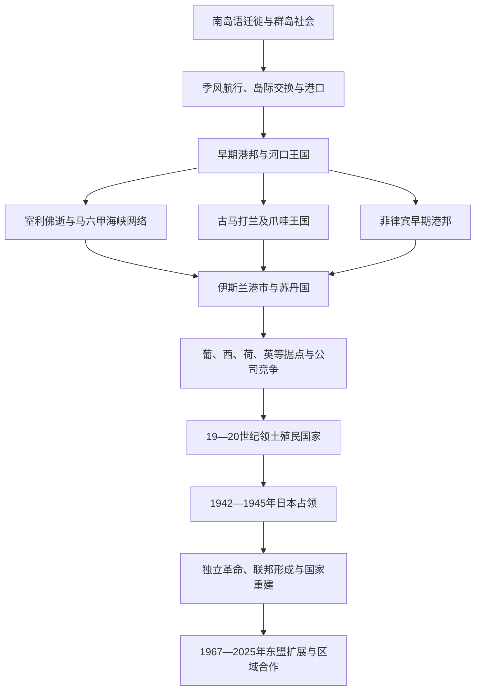

# 海岛东南亚历史

## 范围

海岛东南亚以马六甲海峡、南海、爪哇海、望加锡海峡、苏禄海、班达海和菲律宾群岛为相互连接的历史空间，包括马来半岛南部、苏门答腊、爪哇、婆罗洲、苏拉威西、马鲁古、菲律宾及小巽他群岛。海洋不是岛屿之间的阻隔，而是季风航行、渔业、贸易、迁徙与政治联盟的通道；港口力量又始终依赖内陆稻米、森林、矿产和香料产区。

## 历史主线

南岛语族群在更早时期完成广泛迁徙，并发展适应群岛环境的航海与农业体系。公元前后，印度洋—南海贸易催生港市、河口聚落和早期王国；室利佛逝、古马打兰等政治中心通过海峡、寺院和稻作腹地积累力量。13世纪以后，伊斯兰教沿商贸、婚姻、苏菲和宫廷网络逐步地方化，马六甲、亚齐、爪哇、文莱、苏禄及香料群岛诸苏丹国构成多中心海洋秩序。16世纪起欧洲据点和贸易公司加入竞争，19世纪殖民国家才在多数地区深入内陆并划定边界。日本占领、革命、联邦重组与独立战争形成今日六个主要海岛国家；2025年东帝汶成为东盟第十一个成员国，现代区域制度首次覆盖东南亚全部主权国家。

## 演进图

## 阶段导航

| 顺序 | 阶段 | 时间 | 入口 | 主线 |
|---|---|---|---|---|
| 1 | 海上贸易与早期王国 | 公元前后—13世纪 | [进入笔记](/%E4%BA%BA%E6%96%87%E7%A7%91%E5%AD%A6/%E5%8E%86%E5%8F%B2/%E4%B8%9C%E5%8D%97%E4%BA%9A/%E6%B5%B7%E5%B2%9B%E4%B8%9C%E5%8D%97%E4%BA%9A/%E6%B5%B7%E4%B8%8A%E8%B4%B8%E6%98%93%E4%B8%8E%E6%97%A9%E6%9C%9F%E7%8E%8B%E5%9B%BD.md) | 南岛航海、海峡港口、室利佛逝、爪哇王国与菲律宾早期港邦。 |
| 2 | 伊斯兰化与港口苏丹国 | 约13—18世纪 | [进入笔记](/%E4%BA%BA%E6%96%87%E7%A7%91%E5%AD%A6/%E5%8E%86%E5%8F%B2/%E4%B8%9C%E5%8D%97%E4%BA%9A/%E6%B5%B7%E5%B2%9B%E4%B8%9C%E5%8D%97%E4%BA%9A/%E4%BC%8A%E6%96%AF%E5%85%B0%E5%8C%96%E4%B8%8E%E6%B8%AF%E5%8F%A3%E8%8B%8F%E4%B8%B9%E5%9B%BD.md) | 商贸改宗、苏菲与学术网络、苏丹国竞争及与欧洲势力的互动。 |
| 3 | 殖民群岛与现代海岛东南亚 | 16世纪—至今 | [进入笔记](/%E4%BA%BA%E6%96%87%E7%A7%91%E5%AD%A6/%E5%8E%86%E5%8F%B2/%E4%B8%9C%E5%8D%97%E4%BA%9A/%E6%B5%B7%E5%B2%9B%E4%B8%9C%E5%8D%97%E4%BA%9A/%E6%AE%96%E6%B0%91%E7%BE%A4%E5%B2%9B%E4%B8%8E%E7%8E%B0%E4%BB%A3%E6%B5%B7%E5%B2%9B%E4%B8%9C%E5%8D%97%E4%BA%9A.md) | 公司垄断、领土殖民、日本占领、独立革命、联邦与区域合作。 |

## 海域与腹地比较

| 历史空间 | 关键交通与产品 | 常见政治形态 | 宗教与文化特征 | 近代边界遗产 |
|---|---|---|---|---|
| 马六甲海峡 | 印度洋—南海主航道，锡、胡椒、稻米与转口贸易 | 港市联盟、海峡苏丹国和殖民据点 | 马来语通用网络、佛教与伊斯兰学术中心、多族群商人社群 | 1824年英荷划分势力范围，后来影响马来西亚—印度尼西亚边界。 |
| 爪哇海 | 稠密稻作、柚木、糖与岛际航运 | 内陆农业王国与北岸港市相互依存 | 印度教—佛教遗产、爪哇伊斯兰、宫廷与乡村仪式复合 | 荷属东印度以巴达维亚和爪哇为行政财政核心。 |
| 望加锡海峡与苏拉威西 | 海参、稻米、奴隶贸易和跨群岛航运 | 武装港邦、商人网络与布吉—望加锡迁徙社群 | 伊斯兰化较晚且地区差异明显，海上亲属和侨居网络发达 | 荷兰通过条约和战争限制“自由港”，殖民后边界分割传统航线。 |
| 马鲁古—班达海 | 丁香、肉豆蔻及跨岛补给链 | 小型产地共同体、特尔纳特—蒂多雷竞争和外来堡垒 | 伊斯兰、基督教及地方传统并存 | 葡荷垄断和强制迁徙重塑产区，现代属印度尼西亚东部。 |
| 婆罗洲与南海 | 樟脑、黄金、森林物产、煤与河流贸易 | 河口苏丹国、内陆共同体、布鲁克政权和特许公司 | 文莱—马来伊斯兰、达雅克等多样地方传统及华人矿业社群 | 荷、英、文莱殖民安排形成印尼—马来西亚—文莱的岛内边界。 |
| 苏禄海与菲律宾群岛 | 中国海贸、蜡、珍珠、海产和跨岛奴隶贸易 | 巴朗盖、港邦、苏禄和马京达瑙苏丹国，后有马尼拉殖民中心 | 北中部天主教化，南部伊斯兰苏丹国延续，多种南岛语社会并存 | 西班牙和美国将分散群岛纳入菲律宾殖民国家，南部整合长期存在冲突。 |
| 帝汶与小巽他群岛 | 檀香、畜牧、岛际贸易 | 地方王权、亲属联盟和葡荷边界 | 天主教、伊斯兰和地方祖先信仰并存 | 葡荷分区最终形成印度尼西亚西帝汶与东帝汶的国界。 |

## 国家入口

| 国家 | 入口 | 在海岛区域史中的主线 |
|---|---|---|
| 印度尼西亚 | [印度尼西亚历史](/%E4%BA%BA%E6%96%87%E7%A7%91%E5%AD%A6/%E5%8E%86%E5%8F%B2/%E4%B8%9C%E5%8D%97%E4%BA%9A/%E5%8D%B0%E5%B0%BC/README.md) | 多岛王国、荷属东印度、独立革命和群岛共和国。 |
| 马来西亚 | [马来西亚历史](/%E4%BA%BA%E6%96%87%E7%A7%91%E5%AD%A6/%E5%8E%86%E5%8F%B2/%E4%B8%9C%E5%8D%97%E4%BA%9A/%E9%A9%AC%E6%9D%A5%E8%A5%BF%E4%BA%9A/README.md) | 马来苏丹国、英国多重殖民安排、马来亚独立与联邦形成。 |
| 新加坡 | [新加坡历史](/%E4%BA%BA%E6%96%87%E7%A7%91%E5%AD%A6/%E5%8E%86%E5%8F%B2/%E4%B8%9C%E5%8D%97%E4%BA%9A/%E6%96%B0%E5%8A%A0%E5%9D%A1/README.md) | 古代海峡节点、英国自由港、日本占领、自治与城市国家。 |
| 文莱 | [文莱历史](/%E4%BA%BA%E6%96%87%E7%A7%91%E5%AD%A6/%E5%8E%86%E5%8F%B2/%E4%B8%9C%E5%8D%97%E4%BA%9A/%E6%96%87%E8%8E%B1/README.md) | 婆罗洲苏丹国、英国保护、石油经济与现代君主制。 |
| 菲律宾 | [菲律宾历史](/%E4%BA%BA%E6%96%87%E7%A7%91%E5%AD%A6/%E5%8E%86%E5%8F%B2/%E4%B8%9C%E5%8D%97%E4%BA%9A/%E8%8F%B2%E5%BE%8B%E5%AE%BE/README.md) | 早期港邦、西班牙—美国殖民、日本占领和共和国。 |
| 东帝汶 | [东帝汶历史](/%E4%BA%BA%E6%96%87%E7%A7%91%E5%AD%A6/%E5%8E%86%E5%8F%B2/%E4%B8%9C%E5%8D%97%E4%BA%9A/%E4%B8%9C%E5%B8%9D%E6%B1%B6/README.md) | 帝汶地方社会、葡萄牙殖民、印度尼西亚占领、独立与重建。 |

## 关键辨析

- “海上帝国”通常控制航道、港口、商人和贡赐关系，而非均匀占领整片海域；室利佛逝或满者伯夷的势力图不能直接画成现代领土。
- “马来世界”是语言、文化和海洋交往概念，范围随时期与论者不同，不等于现代马来西亚。
- 伊斯兰化并非一次征服，也没有统一起源；不同港口同古吉拉特、孟加拉、阿拉伯半岛、波斯、中国和爪哇等地的联系程度不同。
- 殖民者在16—18世纪多只能控制堡垒、航道或特定商品，全面领土化主要发生于19世纪及20世纪初。
- 华人、印度人、阿拉伯人及区域内部迁徙者既保留跨海联系，也形成当地社群；不能简单分为“本地人与外来者”。
- 菲律宾和东帝汶的基督教多数传统、巴厘岛印度教传统及群岛各地地方宗教说明“海岛东南亚等于伊斯兰世界”并不成立。

## 相关专题与上级

- 区域共同过程：[东南亚贸易、宗教与移民网络](/%E4%BA%BA%E6%96%87%E7%A7%91%E5%AD%A6/%E5%8E%86%E5%8F%B2/%E4%B8%9C%E5%8D%97%E4%BA%9A/_%E9%80%9A%E5%8F%B2/%E8%B4%B8%E6%98%93%E3%80%81%E5%AE%97%E6%95%99%E4%B8%8E%E7%A7%BB%E6%B0%91%E7%BD%91%E7%BB%9C.md)。
- 区域近现代专题：[殖民、战争、独立与东盟](/%E4%BA%BA%E6%96%87%E7%A7%91%E5%AD%A6/%E5%8E%86%E5%8F%B2/%E4%B8%9C%E5%8D%97%E4%BA%9A/_%E9%80%9A%E5%8F%B2/%E6%AE%96%E6%B0%91%E3%80%81%E6%88%98%E4%BA%89%E3%80%81%E7%8B%AC%E7%AB%8B%E4%B8%8E%E4%B8%9C%E7%9B%9F.md)。
- 直接上级：[东南亚历史](/%E4%BA%BA%E6%96%87%E7%A7%91%E5%AD%A6/%E5%8E%86%E5%8F%B2/%E4%B8%9C%E5%8D%97%E4%BA%9A/README.md)。
