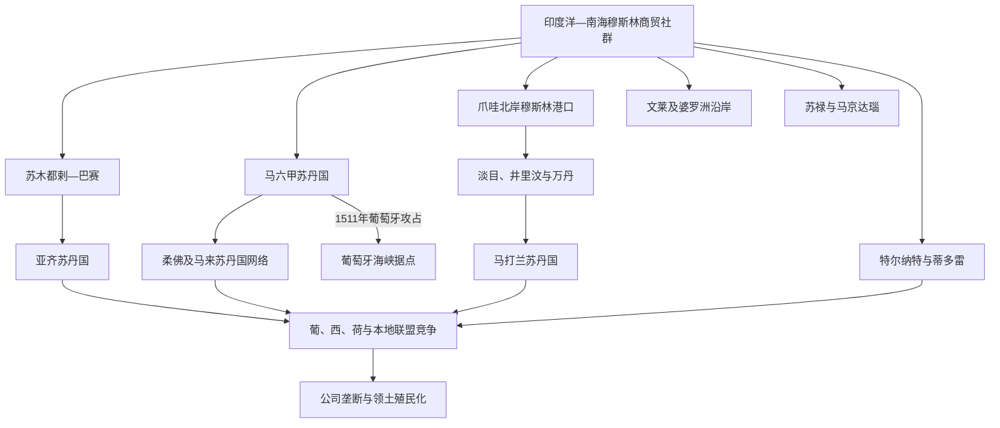

# 海岛东南亚伊斯兰化与港口苏丹国

## 时间

约13—18世纪；穆斯林商人更早已到达群岛，部分地区的广泛改宗则延续到19—20世纪。

## 概括

海岛东南亚伊斯兰化没有单一出发地、统一时间表或征服者。印度洋和南海的穆斯林商人先在港口建立社群，统治者通过改宗、婚姻和采用“苏丹”称号进入更广的贸易与外交网络；苏菲教师、经学院、抄本、朝圣和马来语—爪夷文书写又把宗教知识带入内陆。马六甲、苏木都剌—巴赛、亚齐、淡目、万丹、马打兰、望加锡、特尔纳特、蒂多雷、文莱、苏禄与马京达瑙等政权各有路径。伊斯兰法、习惯法、王权礼仪和地方神灵传统长期并存，欧洲到来后苏丹国也在抵抗、结盟、贸易与战争之间选择，并非被动等待殖民。

## 伊斯兰化的传播机制

| 机制 | 具体过程 | 地区差异 |
|---|---|---|
| 商人聚落 | 港口给予外来商人居住、礼拜和自治空间，穆斯林经纪人可连接红海、印度、马六甲与中国市场 | 早期证据多集中在苏门答腊北部、马来半岛和爪哇北岸，存在商人不等于当地人口已普遍改宗。 |
| 王室改宗 | 统治者采用穆斯林名字、苏丹称号和伊斯兰仪式，以获得商贸伙伴、婚姻和新的正统性 | 宫廷改宗往往先于乡村；旧王族谱系、婆罗门仪式和本地礼制仍可能保留。 |
| 苏菲与教师网络 | 游方学者以讲经、灵修、圣迹和师承适应地方社会，建立清真寺与学习圈 | 苏菲传统重要，但不能把所有地方化都归因于单一教团或传奇圣人。 |
| 婚姻与亲属关系 | 商人与本地精英通婚，后代兼具港口、语言和宗教资源 | 王族婚姻可把改宗传播到属邦，也可能只是外交联盟。 |
| 文字与教育 | 阿拉伯字母改写为爪夷文、贝贡文等，用于马来语和爪哇语宗教、法律及外交文本 | 本地文字并未消失；爪哇、巴厘、布吉等地形成多文字并用。 |
| 朝觐与跨海学术 | 麦加、亚齐、巴赛及后来爪哇学塾连接经学、法学和政治改革 | 远程联系增强共同身份，但各地法学和习惯法实践仍不同。 |
| 军事与港口竞争 | 穆斯林王国有时以圣战语言动员，也以火器、商船和盟约争夺港口 | 多数改宗不能简化为武力强迫；战争通常同时涉及税收、王位和贸易。 |

## 主要苏丹国与海域网络

| 政权 / 网络 | 核心时期 | 结构与区域作用 | 世系维护 |
|---|---|---|---|
| 苏木都剌—巴赛 | 13—16世纪初 | 苏门答腊北部港口，以胡椒、金币和伊斯兰学术连接印度洋与马六甲海峡；后受亚齐扩张。 | 早期君主年代与名单仍有缺口，本页不把传说谱系列作完整世系。 |
| 马六甲苏丹国 | 约1400—1511年 | 借海峡位置、港口法、外商分区和马来语网络迅速兴盛；1511年被葡萄牙攻占后，王族支系在柔佛、霹雳等地延续。 | 见[马来西亚历史](/%E4%BA%BA%E6%96%87%E7%A7%91%E5%AD%A6/%E5%8E%86%E5%8F%B2/%E4%B8%9C%E5%8D%97%E4%BA%9A/%E9%A9%AC%E6%9D%A5%E8%A5%BF%E4%BA%9A/README.md)及其王朝阶段。 |
| 亚齐苏丹国 | 16世纪初—20世纪初 | 控制苏门答腊北端胡椒和红海航线，16—17世纪与葡萄牙马六甲及柔佛竞争，也是经学和马来文写作中心。 | 具体苏丹名单由[印度尼西亚历史](/%E4%BA%BA%E6%96%87%E7%A7%91%E5%AD%A6/%E5%8E%86%E5%8F%B2/%E4%B8%9C%E5%8D%97%E4%BA%9A/%E5%8D%B0%E5%B0%BC/README.md)相关笔记维护。 |
| 爪哇北岸苏丹国 | 15—16世纪 | 淡目、井里汶、万丹等依托港口和穆斯林商人发展，与满者伯夷后期政治重组相互交织。 | 各国并非一个连续王朝，不能合并为“爪哇苏丹世系”。 |
| 马打兰苏丹国 | 16世纪末—18世纪 | 以内陆稻作和宫廷为核心，试图控制爪哇北岸；伊斯兰王权与更早爪哇礼制结合，后因内争和荷兰干预分裂。 | 见印度尼西亚国家目录的相应政权说明。 |
| 特尔纳特与蒂多雷 | 15世纪伊斯兰化后长期延续 | 以丁香产区、岛屿属邦和海上联盟竞争，先后同葡萄牙、西班牙、荷兰结盟或战争。 | 两国并立且称号、共治复杂，不宜在跨国页复制完整名单。 |
| 戈瓦—塔洛与望加锡 | 17世纪初伊斯兰化—1669年受荷兰制约 | 望加锡一度作为开放港口吸引多族群商人，控制南苏拉威西稻米与海运；战败后布吉人广泛迁徙。 | 由印尼相关地方政权页维护。 |
| 文莱苏丹国 | 15—16世纪强盛，延续至今 | 河口王权连接婆罗洲沿岸、南海和菲律宾西部，影响范围以贡赐与港口关系为主。 | 完整世系见[文莱历史](/%E4%BA%BA%E6%96%87%E7%A7%91%E5%AD%A6/%E5%8E%86%E5%8F%B2/%E4%B8%9C%E5%8D%97%E4%BA%9A/%E6%96%87%E8%8E%B1/README.md)下的苏丹国笔记。 |
| 苏禄苏丹国 | 15世纪—20世纪政治主权被殖民国家取代 | 联结苏禄群岛、婆罗洲东北部与棉兰老，依靠海产、珍珠、奴隶贸易和海上属邦。 | 早期谱系和近现代继承主张存在争议，见[菲律宾历史](/%E4%BA%BA%E6%96%87%E7%A7%91%E5%AD%A6/%E5%8E%86%E5%8F%B2/%E4%B8%9C%E5%8D%97%E4%BA%9A/%E8%8F%B2%E5%BE%8B%E5%AE%BE/README.md)相关阶段。 |
| 马京达瑙苏丹国 | 16世纪初以后 | 控制棉兰老河谷和伊拉农—苏禄海网络，长期抵抗西班牙扩张并参与跨海贸易。 | 多支王族并存，由菲律宾目录维护地方世系与争议。 |

## 分阶段发展

### 港口穆斯林社群与早期王室改宗（约12—14世纪）

群岛与穆斯林世界的接触早于13世纪，但能确认地方王室改宗的材料主要来自苏门答腊北部墓碑、游记和钱币。1297年马立克·萨利赫墓碑是巴赛苏丹国的重要确切纪年证据。统治者改宗有利于加入印度洋信用与婚姻网络，却不会立刻改变全部乡村社会。

### 马六甲体系与马来语网络（15世纪）

马六甲以避风港、仓储、市场管理、海上保护和按商人来源设置管理人员吸引船只。统治者改宗后，马来语及爪夷文成为外交、法律和贸易的重要媒介。马六甲的成功推动周边王室改宗，但“伊斯兰化”仍与本地习惯法和王室仪式共存。1511年葡萄牙夺城后，商业和王族网络转移到柔佛、亚齐、北爪哇及其他港口，没有随城市陷落而消失。

### 爪哇、婆罗洲和菲律宾南部的多中心扩展（15—17世纪）

爪哇北岸港口的穆斯林精英在满者伯夷后期王位与贸易竞争中上升；淡目、井里汶、万丹和内陆马打兰并非一条简单直系继承链。文莱王权向婆罗洲沿岸和菲律宾西部扩展影响，苏禄和马京达瑙则通过王族、商人和宗教教师形成自己的苏丹国。西班牙控制马尼拉及北中部群岛后，菲律宾南部伊斯兰政权继续保持独立政治传统。

### 香料群岛与欧洲公司竞争（16—18世纪）

特尔纳特、蒂多雷和周边产地以丁香贸易维持海上属邦，葡萄牙、西班牙和荷兰争相结盟。欧洲火器和堡垒改变力量平衡，却不能绕过本地粮食、航海者和王族竞争。荷兰东印度公司通过排他条约、毁树政策和军事远征压缩开放贸易，望加锡、万丹、马打兰等国则在抵抗、合作及内争中被逐步限制。

### 宫廷伊斯兰与社会深化（17—18世纪）

伊斯兰教育、朝觐和马来文、爪哇文著述继续扩张。亚齐1641—1699年连续由四位女苏丹统治，说明王室性别秩序并非固定不变；其权力变化同时受贵族、地方首领和贸易转移影响。爪哇乡村伊斯兰化与宫廷礼制、圣地崇拜和祖先传统相互融合，不能只用“正统”和“混合”二分。

## 重要事件与转折

| 时间 | 事件 | 过程与影响 |
|---|---|---|
| 1297年 | 马立克·萨利赫墓碑 | 确认苏门答腊北部已有采用苏丹称号的穆斯林王权，是早期伊斯兰化的关键实物证据。 |
| 14世纪末—15世纪初 | 马六甲港市兴起 | 王室、海上族群和多国商人把海峡节点发展为区域转口中心。 |
| 15世纪 | 马六甲王室改宗并形成港口法律传统 | 伊斯兰身份、马来语文书与商业管理相结合，影响海峡及周边王国。 |
| 15—16世纪 | 文莱、苏禄、马京达瑙等苏丹国形成 | 伊斯兰王权沿南海和苏禄海传播，菲律宾南部与婆罗洲被纳入共同而多中心的网络。 |
| 1511年 | 葡萄牙攻占马六甲 | 旧王室出走并在柔佛等地延续，亚齐与柔佛成为新的竞争者，海峡贸易转向多个港口。 |
| 1520年代前后 | 淡目在爪哇北岸扩张 | 穆斯林港口精英进入爪哇王位竞争，但与满者伯夷的关系并非简单“伊斯兰灭印度教”。 |
| 1529年 | 《萨拉戈萨条约》及伊比利亚势力划分 | 西班牙与葡萄牙围绕马鲁古竞争，欧洲条约必须依靠本地苏丹联盟才能落实。 |
| 16世纪中叶—17世纪初 | 亚齐扩张 | 借胡椒贸易和火器多次进攻葡萄牙马六甲，并同奥斯曼等穆斯林力量建立外交联系。 |
| 1571年 | 西班牙建立马尼拉殖民中心 | 北中部菲律宾天主教殖民体系扩展，苏禄与马京达瑙继续抵抗，群岛宗教格局分化。 |
| 1602年 | 荷兰东印度公司成立 | 公司以特许武力、堡垒和排他合同进入群岛政治，逐步争夺葡萄牙贸易据点。 |
| 1605年前后 | 戈瓦—塔洛王室改宗 | 望加锡成为重要穆斯林自由港，随后以战争推动南苏拉威西其他王国改宗。 |
| 1628—1629年 | 马打兰两次围攻巴达维亚失败 | 内陆王国未能驱逐荷兰公司，港口封锁和粮食动员暴露王权能力边界。 |
| 1641年 | 荷兰与柔佛攻占葡萄牙马六甲 | 海峡殖民控制者更替，荷兰仍需借柔佛等本地盟友维持区域秩序。 |
| 1641—1699年 | 亚齐四位女苏丹时期 | 宫廷、贵族和地方港口重新分配权力，女性统治与伊斯兰政治并不矛盾。 |
| 1666—1669年 | 望加锡战争与《邦加亚条约》 | 荷兰公司联合布吉对手击败戈瓦，限制望加锡开放贸易，引发广泛人口迁徙。 |
| 1682年 | 荷兰介入万丹王位战争 | 公司利用父子争位取得贸易特权，显示内部分裂常比正面征服更能扩大殖民影响。 |
| 1755年 | 《吉扬蒂条约》 | 马打兰在王位战争和荷兰干预下分为日惹与梭罗两宫，爪哇王权进入受殖民制约的新格局。 |

## 政治、法律与社会结构

### 苏丹、贵族与港口官员

苏丹通常兼具宗教护持者、战争领袖和分配贸易权的角色，但实际权力受王族、港长、商人首领、地方贵族和海上盟友制约。马六甲等港口为不同商人群体设置沙班达尔一类官员；内陆马打兰则更依赖土地、稻米和等级劳役。

### 伊斯兰法与习惯法

婚姻、继承、商业和刑罚可参考伊斯兰法学，实际裁判仍与地方习惯、王令及亲属制度结合。马来“阿达特”、爪哇宫廷礼法、布吉海商规范及菲律宾南部达图权力各不相同。不能仅凭苏丹称号推断已经建立统一教法国家。

### 性别、奴隶与流动人口

女性可作为市场商人、财产持有者乃至统治者，具体权利随地区与阶层变化。战争俘虏、债务奴役和跨海奴隶贸易是许多苏丹国经济与军政体系的一部分，苏禄海、望加锡与巴厘等网络尤为突出；不能把港市繁荣只描述为自由贸易。

## 兴盛与衰落因素

### 港口兴盛条件

- 位于海峡或香料转运节点，能提供稳定治安、低交易成本和多语中介。
- 王室与本地生产者、海上族群及外来商人保持可预期的分配关系。
- 改宗和学术资助提升跨区域信誉，但不要求抹去全部地方礼制。
- 火器、舰船与稻米供应相结合，才能把贸易收入转化为军事能力。

### 结构性压力

- 商品价格和航线变化会使商船转港，单一胡椒或丁香依赖提高风险。
- 王位继承、王族分支和地方贵族自治常使港口联盟分裂。
- 内陆稻作国家与沿岸商人利益不同，封锁海岸会损害自身税源。
- 排他合同和公司债务逐渐把苏丹国卷入欧洲法律与军事网络。

### 外部压力与直接触发

葡萄牙攻占马六甲、荷兰封锁望加锡或介入万丹内战是直接转折，但殖民扩张往往依靠本地盟友和王位争夺。苏丹国“衰落”也不等于社会伊斯兰化停止：政治中心可能被征服，清真寺、学校、商人和王族身份仍可延续并重塑现代民族政治。

## 争议与辨析

- 伊斯兰最早传入时间、商人来源和改宗路线难以由单一墓碑或传说确定，应区分“接触”“王室改宗”和“社会多数化”。
- “九圣”传播爪哇伊斯兰的故事具有重要宗教记忆价值，具体生平与年代不能全部当作同时代史实。
- 满者伯夷衰落、爪哇穆斯林政权兴起涉及王位内战、贸易转移与地方联盟，不是单纯宗教战争。
- 特尔纳特、蒂多雷、苏禄等影响范围是层级不一的属邦和贸易关系，不等同现代国界。
- 各苏丹国世系应以本国专页维护；跨国总览只说明关系，避免把争议谱系拼成一张虚假的完整表。

## 演变关系

- 前一节点：[海上贸易与早期王国](/%E4%BA%BA%E6%96%87%E7%A7%91%E5%AD%A6/%E5%8E%86%E5%8F%B2/%E4%B8%9C%E5%8D%97%E4%BA%9A/%E6%B5%B7%E5%B2%9B%E4%B8%9C%E5%8D%97%E4%BA%9A/%E6%B5%B7%E4%B8%8A%E8%B4%B8%E6%98%93%E4%B8%8E%E6%97%A9%E6%9C%9F%E7%8E%8B%E5%9B%BD.md)。
- 后一节点：[殖民群岛与现代海岛东南亚](/%E4%BA%BA%E6%96%87%E7%A7%91%E5%AD%A6/%E5%8E%86%E5%8F%B2/%E4%B8%9C%E5%8D%97%E4%BA%9A/%E6%B5%B7%E5%B2%9B%E4%B8%9C%E5%8D%97%E4%BA%9A/%E6%AE%96%E6%B0%91%E7%BE%A4%E5%B2%9B%E4%B8%8E%E7%8E%B0%E4%BB%A3%E6%B5%B7%E5%B2%9B%E4%B8%9C%E5%8D%97%E4%BA%9A.md)。
- 所属总览：[海岛东南亚历史](/%E4%BA%BA%E6%96%87%E7%A7%91%E5%AD%A6/%E5%8E%86%E5%8F%B2/%E4%B8%9C%E5%8D%97%E4%BA%9A/%E6%B5%B7%E5%B2%9B%E4%B8%9C%E5%8D%97%E4%BA%9A/README.md)。
