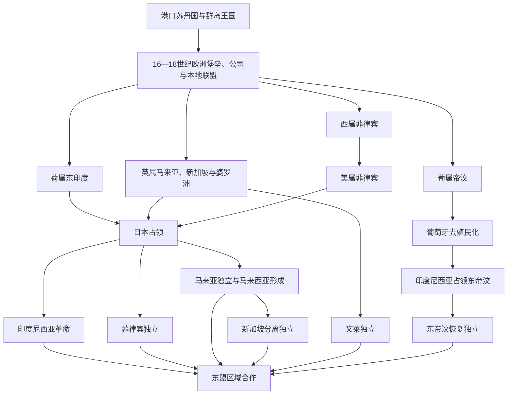

# 殖民群岛与现代海岛东南亚

## 时间

16世纪至今；领土殖民化主要完成于19世纪至20世纪初，现代部分核验截至2026年7月。

## 概括

欧洲势力进入海岛东南亚后，最初争夺的是港口、堡垒、航道和特定商品，并未立即统治全部群岛。葡萄牙、西班牙、荷兰东印度公司、英国东印度公司及地方王国通过战争、条约、贸易垄断和结盟形成多层权力。19世纪以后，荷兰、英国、美国和葡萄牙才借测绘、常设官僚、种植园、传教与军队把海域网络改造成领土殖民国家。1942—1945年日本占领打破欧洲威望，并动员或压迫当地人口；战后印度尼西亚通过革命战争取得主权，菲律宾、马来亚、新加坡、文莱和东帝汶各循不同路径建国。现代国界继承大量殖民分区，却又由革命、联邦谈判、分离和公投重新确定。

## 殖民体系比较

| 殖民体系 | 主要地区 | 统治结构 | 经济与社会机制 | 现代国家遗产 |
|---|---|---|---|---|
| 葡萄牙据点与葡属帝汶 | 1511年后马六甲、马鲁古短期据点，帝汶东部长期殖民 | 堡垒、传教网络、地方王族联盟和有限沿海行政 | 香料、檀香贸易及天主教传播；对内陆控制长期有限 | 葡属帝汶经历1975年权力真空、印度尼西亚占领与2002年独立。 |
| 西属菲律宾 | 1565—1898年 | 总督、修会、地方首领和马尼拉—阿卡普尔科航线；南部苏丹国未被完全征服 | 贡赋、庄园、强制劳役、天主教教区和跨太平洋白银贸易 | 形成以马尼拉为中心的群岛殖民框架和天主教多数传统。 |
| 荷兰东印度公司与荷属东印度 | 公司1602—1799年，殖民国家约1800—1942年 | 公司特许武力、排他合同与地方盟友，后转为总督、常设军队和分层官僚 | 香料垄断、强迫交售、1830年后种植制度、矿产和种植园；按法律种族划分人口 | 荷属疆域成为印度尼西亚共和国的主要领土框架，行政中心集中于爪哇。 |
| 英属马来亚、新加坡与婆罗洲 | 18世纪末—20世纪中叶 | 海峡殖民地、马来保护邦、非保护邦、布鲁克砂拉越、北婆罗洲特许公司和文莱保护国并存 | 自由港、锡矿、橡胶、华印劳工迁徙及间接统治 | 不同殖民单位经谈判组成马来亚和马来西亚；新加坡1965年分离，文莱1984年独立。 |
| 美属菲律宾 | 1898—1946年 | 军事占领后建立文官政府、民选议会与1935年自治邦 | 英语公共教育、土地与卫生改革、出口依赖和军事基地；镇压独立抵抗 | 总统制、行政区划和美菲安全关系影响独立后的共和国。 |
| 日本战时占领 | 1942—1945年 | 军政、傀儡政府与本地合作组织并用 | 征粮、军票、强制劳动、慰安制度和军事训练；贸易体系崩溃 | 加速殖民权威瓦解和民族主义军事化，也留下饥荒、屠杀与社会创伤。 |

## 从商站到领土殖民

### 葡萄牙、西班牙与早期海上竞争（1511—1602年）

葡萄牙1511年夺取马六甲，希望控制海峡和香料航线，却促使商人转往亚齐、柔佛、万丹等港口。西班牙自1565年在宿务建立殖民基地，1571年占领马尼拉，并以墨西哥白银购买中国商品。两国依赖本地领航员、粮食、皈依社群和王族盟友；其堡垒体系远非完整领土统治。

### 荷兰公司垄断与多国竞争（1602—1799年）

荷兰东印度公司获战争、缔约和铸币等权力，以巴达维亚为中心，联合本地对手驱逐或限制葡萄牙、西班牙和开放港口。公司在班达群岛以屠杀、驱逐和奴役重建肉豆蔻生产，在马鲁古推行排他合同与毁树措施；在爪哇则更多借王位战争取得领土、税权和债权。英国在槟城、新加坡等地建立自由港后，海峡竞争进入新阶段。

### 19世纪领土化与殖民经济

1824年英荷条约把马六甲海峡两侧大致划入英国和荷兰势力范围。荷兰在爪哇战争后推行种植制度，强迫村社交付咖啡、糖、靛蓝等出口作物；19世纪末又通过亚齐战争和群岛远征扩大直接控制。英国以保护条约、驻扎官、布鲁克家族和北婆罗洲公司管理不同领地，锡矿、橡胶和港口吸引大批华人、印度人及区域内部劳工。西班牙末期的菲律宾民族主义与革命在1898年美西战争中被美国接管，随后爆发菲美战争。

### 日本占领与战争社会（1942—1945年）

日军迅速击败荷兰、英国和美国殖民军。占领当局在印度尼西亚培养青年、民兵和行政干部，在菲律宾建立受控共和国，在马来亚和新加坡实行严厉军政，在帝汶面对盟军游击战。强制劳动、征粮、通货膨胀、族群迫害和交通中断导致普遍苦难。民族主义者既有合作、抵抗，也有在不同阶段转换立场的复杂选择。

### 独立、联邦与分离（1945—2002年）

印度尼西亚于1945年8月宣布独立，经历共和派内部冲突、荷兰两次大规模军事行动和国际调停，至1949年获得主权移交；西新几内亚问题到1960年代才解决。菲律宾1946年独立但保留紧密美军与经济联系。马来亚1957年独立，1963年同新加坡、砂拉越、北婆罗洲组成马来西亚，文莱未加入；新加坡1965年退出联邦。葡萄牙1974年革命后仓促撤出帝汶，印度尼西亚于1975年入侵并占领，1999年公投后由联合国过渡治理，东帝汶2002年恢复独立。

### 区域国家与东盟（1967年至今）

印度尼西亚、马来西亚、菲律宾、新加坡和泰国于1967年建立东盟，初期目标包括缓和成员冲突、遏制共产主义影响并推进合作。文莱独立后于1984年加入，东帝汶在2011年申请、2022年获原则同意和观察员地位，2025年10月成为第十一个正式成员。区域生产链、劳工迁移和航运持续恢复殖民边界切断的联系，但南海争端、跨境烟霾、海洋资源、劳工权利和国内政治差异仍制约共同治理。

## 重要事件与时间节点

| 时间 | 事件 | 结果与长期影响 |
|---|---|---|
| 1511年 | 葡萄牙攻占马六甲 | 海峡贸易分散到亚齐、柔佛、万丹等港口，欧洲堡垒正式进入区域权力竞争。 |
| 1565年 | 西班牙在宿务建立殖民基地 | 西班牙开始长期征服菲律宾北中部，并推动传教与贡赋制度。 |
| 1571年 | 西班牙占领马尼拉 | 马尼拉—阿卡普尔科大帆船贸易把中国商品、美洲白银和菲律宾劳力连接起来。 |
| 1602年 | 荷兰东印度公司成立 | 国家授予公司战争与缔约权，商业组织成为殖民征服主体。 |
| 1609—1621年 | 荷兰控制班达并实施暴力重组 | 为垄断肉豆蔻而屠杀、驱逐和奴役居民，建立种植园式生产秩序。 |
| 1619年 | 荷兰在雅加达建立巴达维亚 | 新总部成为公司航运、金融和军事中心，也形成多族群强制迁徙城市。 |
| 1641年 | 荷兰—柔佛联军夺取马六甲 | 葡萄牙在海峡的主要据点丧失，荷兰仍需与本地王国合作。 |
| 1667年 | 《邦加亚条约》 | 荷兰限制望加锡自由贸易，布吉—望加锡人口迁往群岛多地。 |
| 1786—1819年 | 英国取得槟城并建立新加坡港 | 自由港与英属印度网络挑战荷兰垄断，重塑海峡商路。 |
| 1824年 | 《英荷条约》 | 英荷交换据点并划分势力范围，为马来西亚—印度尼西亚边界奠定殖民基础。 |
| 1825—1830年 | 爪哇战争 | 迪波内戈罗抵抗重创荷兰财政，战后殖民国家加强控制并推行种植制度。 |
| 1830年 | 爪哇种植制度实施 | 村社被迫投入出口作物，殖民财政大增，同时导致劳役、土地和粮食压力。 |
| 1873—约1912年 | 亚齐战争 | 荷兰长期远征、封锁和“平定”最终扩大领土控制，亚齐抵抗并未随王都陷落结束。 |
| 1874年 | 《邦咯条约》 | 英国驻扎官制度进入马来邦，锡矿和苏丹王位争议成为扩大干预的契机。 |
| 1896—1898年 | 菲律宾革命、美西战争与主权转移 | 革命者推翻西班牙统治，却未获美国承认，殖民权力由西班牙转给美国。 |
| 1899—1902年 | 菲美战争主要阶段 | 美国击败菲律宾第一共和国的正规抵抗，游击战和地方暴力继续，死亡和迁徙严重。 |
| 1935年 | 菲律宾自治邦成立 | 建立本地总统与宪政过渡，计划十年后独立，后被日本占领打断。 |
| 1942—1945年 | 日本占领群岛 | 欧洲殖民政权崩溃，强制劳动、饥荒和军事暴力扩大，本地组织获得军政经验。 |
| 1945年8月 | 印度尼西亚宣布独立 | 日本投降造成权力真空，共和国与殖民复归力量随即进入四年战争。 |
| 1946年 | 菲律宾共和国独立 | 美国正式承认主权，但军事基地、贸易安排和精英土地结构延续。 |
| 1949年 | 荷兰向印度尼西亚移交主权 | 荷兰承认印度尼西亚联邦，后改为单一共和国；西新几内亚暂未移交。 |
| 1957年 | 马来亚联合邦独立 | 在紧急状态与族群联盟政治背景下，经谈判取得主权。 |
| 1963年 | 马来西亚成立 | 马来亚、砂拉越、沙巴和新加坡组成联邦，引发印度尼西亚“对抗”及菲律宾对沙巴主张。 |
| 1965年 | 新加坡退出马来西亚 | 联邦政治、族群和财政矛盾导致分离，新加坡成为独立国家。 |
| 1967年 | 东盟成立 | 海岛区域的印度尼西亚、马来西亚、菲律宾和新加坡与泰国共同成为创始成员，区域国家关系逐步制度化。 |
| 1975年 | 印度尼西亚入侵东帝汶 | 葡萄牙去殖民化和东帝汶内战后发生吞并，随后长期抵抗、镇压与人道灾难。 |
| 1984年 | 文莱独立并加入东盟 | 英国保护关系结束，石油君主国成为东盟第六个成员。 |
| 1998年 | 印度尼西亚苏哈托辞职 | 亚洲金融危机、抗议和精英分裂结束新秩序时期，开启民主化与地方分权。 |
| 1999年 | 东帝汶公投 | 多数选择脱离印度尼西亚，亲印尼武装暴力后由国际部队和联合国接管过渡。 |
| 2002年 | 东帝汶恢复独立 | 新国家建立宪政制度，并开始重建被破坏的行政和基础设施。 |
| 2025年 | 东帝汶正式加入东盟 | 东盟成员增至十一国，组织在主权国家层面覆盖整个东南亚。 |

## 殖民社会与制度遗产

### 商品、土地与劳工

殖民经济把香料垄断扩展为糖、咖啡、橡胶、烟草、锡、石油等大宗商品体系。土地登记和特许权往往把习惯使用地转为国家或公司资产；税收迫使家庭进入现金劳动。华南、印度、爪哇及群岛其他地区的劳工被招募或强制迁移，形成新加坡、马来亚、苏门答腊和婆罗洲等多族群社会。

### 种族化法律与中间群体

荷属东印度把欧洲人、“外来东方人”和“土著”置于不同法律类别；英国也通过族群化职业、教育和居住制度治理人口。华人、阿拉伯人、欧亚人及地方贵族有时担任税收承包者、翻译和基层官员，也会遭受限制与暴力。现代公民身份、族群配额和同化政策部分继承并改造这些殖民分类。

### 宗教、教育与民族主义

天主教修会深刻改变菲律宾和帝汶，伊斯兰学校、改革派报刊和朝觐网络则推动印尼、马来世界的反殖民思想。殖民学校培养本地官员和专业人士，却覆盖有限；报刊、协会、工会和青年组织把地方不满转译为民族、阶级与宗教政治。不同运动对“国家”的边界并无天然共识，现代领土是在斗争和谈判中形成的。

## 独立路径比较

| 国家 | 独立 / 建国路径 | 关键结构 | 不宜简化之处 |
|---|---|---|---|
| 印度尼西亚 | 1945年宣布独立，1945—1949年革命战争，荷兰移交主权 | 共和国军、青年团体、伊斯兰与左翼力量、地方王公和外部调停并存 | 不能把革命只写成荷兰与统一民族阵营的二元战争。 |
| 菲律宾 | 1898年革命建国未获美国承认，1946年按过渡安排独立 | 美式总统制、地方家族政治、土地问题和美军关系延续 | 法律独立不等于殖民经济与安全关系立即中断。 |
| 马来西亚 | 1957年马来亚独立，1963年联邦扩大 | 苏丹制、族群政党联盟、英国安全框架及婆罗洲自治保障 | 马来亚独立与马来西亚成立是两个节点，沙巴、砂拉越并非简单“加入已有国家”。 |
| 新加坡 | 1959年自治、1963年加入马来西亚、1965年分离独立 | 港口经济、强国家能力、住房与工业化政策 | 城市国家形成既有殖民港口遗产，也有联邦冲突和主动国家建设。 |
| 文莱 | 1959年内部自治、1984年完全独立 | 苏丹—官僚体系、石油收入和英国安全关系 | 未加入马来西亚是王室、财政、代表权和地方政治多因素结果。 |
| 东帝汶 | 1975年短暂宣告独立、印度尼西亚占领、1999年公投、2002年恢复独立 | 抵抗网络、天主教会、国际外交与联合国过渡治理 | 不能把1975—1999年只写成双边领土争端，需说明东帝汶人的抵抗与人道代价。 |

## 兴衰与因果分析

### 殖民扩张的结构条件

- 欧洲公司把远洋资本、国家海军和特许暴力结合，但实际征服依赖本地粮食、士兵、领航员及王位盟友。
- 枪炮优势并非始终决定性；控制税收、债权、堡垒和航运信息更能逐步限制苏丹国选择。
- 19世纪蒸汽船、电报、测绘和常备殖民军降低统治成本，全球商品需求为领土扩张提供财政动力。
- 本地王位争夺、港口竞争与社会分层给殖民者介入机会，却不意味着殖民统治“必然”到来。

### 殖民秩序衰落的结构因素

- 教育、城市劳工、宗教改革和报刊创造跨岛政治组织，殖民种族等级与土地不平等削弱统治正当性。
- 大萧条和战争暴露出口经济脆弱，殖民政府无法兑现长期稳定与福利。
- 日本占领摧毁白人不可战胜形象，并留下武器、民兵和行政经验，但其压迫也激起不同形式抵抗。
- 二战后欧洲财政衰弱、美国与联合国反殖民压力及亚洲民族革命共同改变国际环境。

### 直接触发与不同结果

日本投降是1945年印度尼西亚革命的直接窗口，美西战争则把菲律宾革命导向新的殖民统治；葡萄牙1974年革命造成帝汶去殖民权力真空。相同的“宗主国衰落”可产生谈判独立、革命战争、联邦组合或外来占领，结果取决于本地组织、军事力量、族群联盟和国际干预。

## 持续影响与争议

- 殖民边界是现代国家主权的重要起点，却不是天然民族边界；婆罗洲、帝汶、马六甲海峡和苏禄海尤其明显。
- “合作派”与“抵抗派”在占领过程中可能转换立场，后世民族叙事常简化其处境。
- 死亡、强制劳动和屠杀数字因档案不全与政治记忆存在差异，写作时应使用约数并区分直接杀害、饥荒和疾病。
- 联邦形成应区分法理协议、地方公投或咨询、自治保障和实际权力，不把所有单位写成同等自愿。
- 独立后仍存在殖民土地制度、精英家族、军事组织和出口依赖；但现代国家政策也主动重塑而非机械继承这些遗产。

## 演变关系

- 前一节点：[伊斯兰化与港口苏丹国](/%E4%BA%BA%E6%96%87%E7%A7%91%E5%AD%A6/%E5%8E%86%E5%8F%B2/%E4%B8%9C%E5%8D%97%E4%BA%9A/%E6%B5%B7%E5%B2%9B%E4%B8%9C%E5%8D%97%E4%BA%9A/%E4%BC%8A%E6%96%AF%E5%85%B0%E5%8C%96%E4%B8%8E%E6%B8%AF%E5%8F%A3%E8%8B%8F%E4%B8%B9%E5%9B%BD.md)。
- 所属总览：[海岛东南亚历史](/%E4%BA%BA%E6%96%87%E7%A7%91%E5%AD%A6/%E5%8E%86%E5%8F%B2/%E4%B8%9C%E5%8D%97%E4%BA%9A/%E6%B5%B7%E5%B2%9B%E4%B8%9C%E5%8D%97%E4%BA%9A/README.md)。
- 区域共同专题：[殖民、战争、独立与东盟](/%E4%BA%BA%E6%96%87%E7%A7%91%E5%AD%A6/%E5%8E%86%E5%8F%B2/%E4%B8%9C%E5%8D%97%E4%BA%9A/_%E9%80%9A%E5%8F%B2/%E6%AE%96%E6%B0%91%E3%80%81%E6%88%98%E4%BA%89%E3%80%81%E7%8B%AC%E7%AB%8B%E4%B8%8E%E4%B8%9C%E7%9B%9F.md)。
