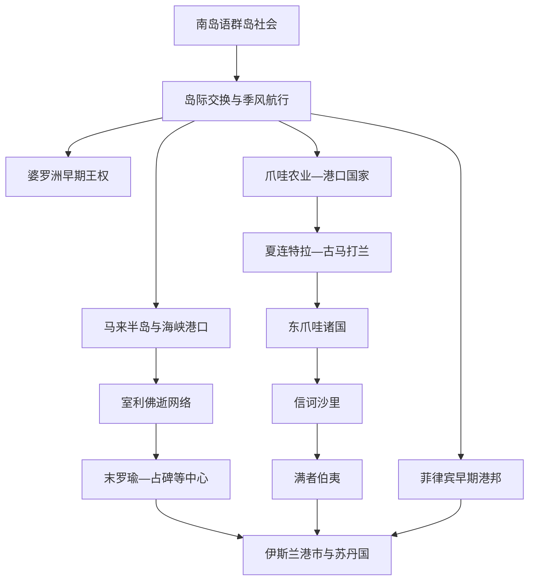

# 海岛东南亚海上贸易与早期王国

## 时间

约公元前后至13世纪；南岛语迁徙和群岛交换的前史可追溯到更早时期。

## 概括

海岛东南亚早期国家建立在南岛语族群长期航海、岛际迁徙和本地农业基础上。季风把马六甲海峡、巽他海峡、爪哇海、南海和菲律宾航线接入印度洋贸易，港口统治者通过保护商人、征税、外交和控制腹地产品获得力量。来自南亚的文字、佛教与印度教制度被地方王室重新解释，汉文记录和中国陶瓷则显示南海联系。室利佛逝、古马打兰、吉打、苏门答腊与爪哇诸国并非孤立“帝国”，而是依赖港口联盟、寺院网络、稻作腹地及海上社群的多中心秩序。

## 生态、技术与交换机制

| 条件 / 机制 | 历史作用 |
|---|---|
| 南岛航海技术 | 船体缝合、支架舟、帆装和星象—季风知识支持远距离迁徙；具体船型随海域和时代不同。 |
| 季风与海峡 | 船只等待风向转换，港口因此发展仓储、修船、翻译、信贷和多族群聚落。 |
| 港口—腹地互补 | 稻米、木材、树脂、樟脑、金属、香料与劳动力由河流和岛际航线进入港口；没有腹地，转口贸易难以维持。 |
| 礼物与贡赐外交 | 使团向中国和南亚宫廷赠送特产以取得回赐、声望与市场准入，不能把所有“朝贡”解释为直接政治隶属。 |
| 宗教与知识网络 | 僧侣、婆罗门、商人和工匠传播文字、仪式和建筑技术；王室用寺庙捐赠与神圣谱系巩固统治。 |
| 海上武力 | 舰队、海上族群和港口盟友保护航道，也可封锁竞争港口；海权常随贸易改道迅速变化。 |

## 主要政治与贸易网络

| 政治体 / 网络 | 大致时期 | 结构与作用 |
|---|---|---|
| 吉打与马来半岛西岸港口 | 公元前后—早期第二千纪 | 利用克拉地峡、锡矿和马六甲海峡北口连接孟加拉湾与南海；“吉打古国”的中心和连续性由多处考古遗址重建。 |
| 古泰 | 约4—5世纪以后 | 东婆罗洲穆拉瓦尔曼铭文显示地方王室已采用梵文和婆罗门捐赠仪式，但后世古泰苏丹国不是无缝延续的同一政体。 |
| 多罗摩与西爪哇中心 | 约5—7世纪 | 铭文记录王权、水利和印度教仪式，反映巽他海峡与爪哇西部的区域国家化。 |
| 室利佛逝 | 约7—13世纪 | 以苏门答腊东南部及马六甲海峡港口为核心，依靠海上盟友、贡赐外交和佛教学习网络；中心与影响范围随时期移动。 |
| 夏连特拉—古马打兰 | 8—10世纪 | 中爪哇稻作王国与王族网络兴建婆罗浮屠、普兰巴南等寺庙，佛教与湿婆信仰并行竞争和融合。 |
| 东爪哇诸国 | 10—13世纪 | 王都东移后，谏义里、信诃沙里等政权把河谷农业、北岸贸易与跨岛军事结合，为满者伯夷兴起提供背景。 |
| 菲律宾早期港邦 | 至少9世纪以后 | 拉古纳铜版铭文、布端遗址和外来陶瓷显示地方首领、债务法律及与中国—马来世界的贸易；群岛不存在单一统一王国。 |
| 占婆—南海航线 | 早期第二千纪持续 | 越南中部港口虽属大陆海岸，却与婆罗洲、吕宋、爪哇及中国航线紧密相连，是海陆分类交叉地带。 |

## 分阶段过程

### 南岛群岛与远距离交换

约公元前1500年以后，南岛语族群继续向菲律宾、印度尼西亚东部及更远海域扩散，并与既有居民融合。青铜鼓、玻璃珠、玉器和铁器显示公元前数世纪已经存在跨海交换，但这些物品不能直接证明统一“贸易帝国”。地方社会同时发展水稻、旱作、渔业、椰子及森林资源利用，形成适应不同岛屿生态的经济。

### 港市国家和文字王权

公元前后印度洋贸易增长，马来半岛、苏门答腊、爪哇和婆罗洲出现更密集的港口与权力中心。4—7世纪的梵文铭文表明统治者使用印度教仪式和王号，但王室成员、工匠和多数居民仍讲本地语言并延续地方亲属制度。所谓“印度化”是港口和宫廷吸收跨区域资源的过程，不等于印度殖民者建立国家。

### 室利佛逝的海峡网络

7世纪后期碑铭和义净旅行记录显示，室利佛逝控制或影响苏门答腊东南部若干港口，是前往南亚的佛教学习与补给中心。其力量来自舰队、海上族群、港口同盟和对海峡交通的干预，而非对整个群岛的均匀行政统治。11世纪朱罗王朝远征重创部分中心，贸易并未停止；苏门答腊的政治重心逐步向末罗瑜—占碑等地转移。

### 爪哇农业王国与跨岛竞争

中爪哇王室依靠肥沃稻田和劳役兴建大型寺庙，9—10世纪政治重心东移可能与王族竞争、火山环境、贸易方向及土地条件等多因素有关。东爪哇国家加强北岸港口和岛际航运，信诃沙里末期向苏门答腊等地用兵。1293年满者伯夷建立，标志早期网络进入新的爪哇海权阶段，但其后发展与伊斯兰港市并非简单前后替代。

## 重要事件与转折

| 时间 | 事件 / 证据 | 过程与意义 |
|---|---|---|
| 约公元前1500年以后 | 南岛语群继续扩散 | 航海移民与本地居民融合，形成菲律宾—马来群岛广泛但多样的语言文化联系。 |
| 公元前数世纪—公元初 | 青铜鼓、珠饰和金属器跨海传播 | 证明群岛已有长距离交换和专业工艺，早于梵文王权与大型寺庙。 |
| 公元1—5世纪 | 马来半岛和苏门答腊港口进入印度洋贸易 | 香料、树脂、黄金和锡等产品吸引外来商人，港口成为地方首领积累权力的节点。 |
| 约4—5世纪 | 古泰铭文 | 东婆罗洲王室以梵文记录祭祀和布施，是群岛早期文字王权的重要证据。 |
| 5—7世纪 | 多罗摩铭文与西爪哇国家 | 王室以治水、军力和宗教捐赠塑造权威，说明农业腹地与海峡贸易相结合。 |
| 671年前后 | 义净停留室利佛逝 | 记录当地佛教学习和前往印度航线，显示室利佛逝已成为海上交通与知识中转站。 |
| 683—686年 | 室利佛逝早期碑铭 | 记载远征、誓约和政治中心，揭示王权依赖军事行动与地方效忠。 |
| 8—9世纪 | 婆罗浮屠兴建 | 夏连特拉时代把佛教宇宙观、本地建筑技术和王室动员结合为大型纪念工程。 |
| 9世纪 | 普兰巴南建筑群发展 | 湿婆教王室工程与佛教寺院并存，说明宗教竞争不等于社会截然分裂。 |
| 900年 | 拉古纳铜版铭文 | 记录债务解除、官职和跨区域地名，是菲律宾已知最早确切纪年文字材料之一。 |
| 10世纪前后 | 爪哇政治重心东移 | 中爪哇王权网络重组，东爪哇河谷和北岸港口的重要性上升；原因仍有争议。 |
| 1025年 | 朱罗舰队袭击室利佛逝相关港口 | 打击多个海峡节点并暴露港口网络的分散性，但未使跨海贸易或苏门答腊政治立即终止。 |
| 11—12世纪 | 布端等菲律宾港口繁荣 | 金器、船只遗存和外来陶瓷显示棉兰老北部深度参与南海贸易。 |
| 1222年 | 信诃沙里取代谏义里 | 东爪哇权力重组，随后加强跨岛政治和军事活动。 |
| 1275年以后 | 信诃沙里的帕马拉瑜远征 | 爪哇王室干预苏门答腊政治，试图重组马六甲海峡与爪哇之间的力量平衡。 |
| 1293年 | 满者伯夷建立 | 元军、信诃沙里继承战争和地方联盟共同促成新政权，开启14世纪爪哇扩张。 |

## 统治结构与社会

### 港口统治者与商人

港口领袖通过市场秩序、仓储、称量、关税和武装保护吸引商船。外来商人常住在按来源或宗教组织的聚落，由首领与宫廷协商税务。商业成功依赖信任和信息，统治者若过度掠夺，船只可转往竞争港口。

### 王室、寺庙与腹地

爪哇等人口稠密地区的王权更依赖土地、灌溉、稻米和劳役。寺庙捐赠地由铭文确认权利与免役，既支持宗教人员，也组织农业与工艺。港口型与农业型政权并非截然分离：室利佛逝需要食物和森林腹地，古马打兰也需要海运与外来奢侈品。

### 海上社群与流动身份

航海者、渔民和海上游动群体可担任商人、向导、战士或海盗；这些角色取决于与港口政权的关系。“海盗”往往是竞争国家对未获授权武力的称呼。族群名称、语言和政治效忠也会随迁徙、婚姻和贸易改变。

## 兴衰与重组原因

### 形成与兴盛

- 位于海峡、河口或季风转换点，可降低船只补给成本并汇集信息。
- 与生产腹地和海上社群建立稳定联盟，才能持续提供商品、粮食和武力。
- 贡赐外交、宗教学习和多语商人社群扩大港口声望，吸引更多船只。
- 王室继承稳定、税率可预期且能保护交易时，港口较易保持中心地位。

### 结构性风险

- 港口贸易可改道，任何中心都难以垄断全部海峡和岛际航线。
- 王位争夺、属港叛离或腹地断粮会迅速削弱海权。
- 寺庙土地、宫廷工程和战争动员之间可能争夺劳力与税源。
- 火山、河道淤积和气候波动会改变农业与港口条件，但不能作为唯一决定因素。

### 外部压力与直接转折

朱罗远征、元军介入和竞争港口的兴起都会加速重组，真正结果仍取决于本地联盟。室利佛逝从巨港中心转向末罗瑜网络、爪哇王都东移及信诃沙里—满者伯夷更替，都不是一次“灭亡”即可概括。

## 争议与辨析

- “室利佛逝帝国”更适合视为层级不一的港口与盟友网络，具体控制范围会随年代改变。
- 夏连特拉是王族、称号还是跨苏门答腊—爪哇的政治关系，学界仍有不同解释。
- 拉古纳铜版铭文中的地名与政治关系不能直接等同现代城市边界。
- 考古物品的外来样式只证明交流，不足以判断人口来源、国家臣属或宗教多数。
- 后世编年史常把王族谱系追溯到神话祖先；缺乏同时代铭文时应明确材料性质。

## 演变关系

- 后续：[伊斯兰化与港口苏丹国](/%E4%BA%BA%E6%96%87%E7%A7%91%E5%AD%A6/%E5%8E%86%E5%8F%B2/%E4%B8%9C%E5%8D%97%E4%BA%9A/%E6%B5%B7%E5%B2%9B%E4%B8%9C%E5%8D%97%E4%BA%9A/%E4%BC%8A%E6%96%AF%E5%85%B0%E5%8C%96%E4%B8%8E%E6%B8%AF%E5%8F%A3%E8%8B%8F%E4%B8%B9%E5%9B%BD.md)。
- 所属总览：[海岛东南亚历史](/%E4%BA%BA%E6%96%87%E7%A7%91%E5%AD%A6/%E5%8E%86%E5%8F%B2/%E4%B8%9C%E5%8D%97%E4%BA%9A/%E6%B5%B7%E5%B2%9B%E4%B8%9C%E5%8D%97%E4%BA%9A/README.md)。
- 跨区域背景：[东南亚贸易、宗教与移民网络](/%E4%BA%BA%E6%96%87%E7%A7%91%E5%AD%A6/%E5%8E%86%E5%8F%B2/%E4%B8%9C%E5%8D%97%E4%BA%9A/_%E9%80%9A%E5%8F%B2/%E8%B4%B8%E6%98%93%E3%80%81%E5%AE%97%E6%95%99%E4%B8%8E%E7%A7%BB%E6%B0%91%E7%BD%91%E7%BB%9C.md)。
