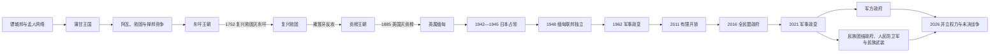

# 缅甸历史

缅甸历史以伊洛瓦底江流域的国家整合、低地—边疆关系与印度洋—东南亚大陆网络为主线。骠、孟等多中心城市网络为蒲甘王国提供宗教和行政资源；蒲甘瓦解后，阿瓦、勃固、掸邦等长期并立，东吁和贡榜王朝再度统一核心流域。英国殖民统治把低地与边疆纳入同一疆界，却采取分区治理。独立后未完成的联邦安排、军队自主权和多条族群战争相互强化，至2026年仍存在并立政权与全国性冲突。

## 历史主线

- 骠与早期孟人政治是相互连接的城市及港口网络，不宜虚构一条统一王统；可连续排列的核心王统从蒲甘逐渐清晰。
- 蒲甘依靠灌溉农业、佛教捐献和多族群宫廷形成第一次低地大整合，13世纪财政、地方化与元朝压力共同促使其瓦解。
- 东吁扩张帝国依赖军役、火器和属国贡赋；重建东吁收缩并行政化。1752年东吁先被复兴勃固所灭，贡榜再以反攻建立新王朝，二者不是直接父子继承。
- 英国分三次战争征服缅甸，低地直接统治与边疆间接统治并存；二战和反法西斯联盟加速1948年独立。
- 议会政府未能解决共产党、族群武装、军队自治和联邦权力争议，1962年政变开启长期军人政治。
- 2011—2021年开放保留了军方宪法特权；2021年政变把既有边疆战争扩展为全国性反军方冲突。2026年军方恢复总统、议会外观，合法性和领土分割仍未解决。

## 阶段导航

| 顺序 | 阶段 | 时间 | 核心变化 |
| --- | --- | --- | --- |
| 1 | [骠、孟与蒲甘王国](/%E4%BA%BA%E6%96%87%E7%A7%91%E5%AD%A6/%E5%8E%86%E5%8F%B2/%E4%B8%9C%E5%8D%97%E4%BA%9A/%E7%BC%85%E7%94%B8/%E9%AA%A0%E3%80%81%E5%AD%9F%E4%B8%8E%E8%92%B2%E7%94%98%E7%8E%8B%E5%9B%BD.md) | 前1千纪—13世纪末 | 城邦网络、佛教传播、蒲甘王统与第一次低地统一 |
| 2 | [东吁与贡榜王朝](/%E4%BA%BA%E6%96%87%E7%A7%91%E5%AD%A6/%E5%8E%86%E5%8F%B2/%E4%B8%9C%E5%8D%97%E4%BA%9A/%E7%BC%85%E7%94%B8/%E4%B8%9C%E5%90%81%E4%B8%8E%E8%B4%A1%E6%A6%9C%E7%8E%8B%E6%9C%9D.md) | 1485/1510—1885年 | 东吁扩张与重建、复兴勃固中断、贡榜统一及三次英缅战争 |
| 3 | [英属缅甸与独立](/%E4%BA%BA%E6%96%87%E7%A7%91%E5%AD%A6/%E5%8E%86%E5%8F%B2/%E4%B8%9C%E5%8D%97%E4%BA%9A/%E7%BC%85%E7%94%B8/%E8%8B%B1%E5%B1%9E%E7%BC%85%E7%94%B8%E4%B8%8E%E7%8B%AC%E7%AB%8B.md) | 1824—1962年 | 分期殖民征服、民族主义、日本占领、联邦建国与议会制度 |
| 4 | [军人统治与国内冲突](/%E4%BA%BA%E6%96%87%E7%A7%91%E5%AD%A6/%E5%8E%86%E5%8F%B2/%E4%B8%9C%E5%8D%97%E4%BA%9A/%E7%BC%85%E7%94%B8/%E5%86%9B%E4%BA%BA%E7%BB%9F%E6%B2%BB%E4%B8%8E%E5%9B%BD%E5%86%85%E5%86%B2%E7%AA%81.md) | 1962年至今 | 军队主导、一党与军政府、有限开放、2021年政变和全国性战争 |

## 专题表

- [国家元首、政府首脑与军政领导表](/%E4%BA%BA%E6%96%87%E7%A7%91%E5%AD%A6/%E5%8E%86%E5%8F%B2/%E4%B8%9C%E5%8D%97%E4%BA%9A/%E7%BC%85%E7%94%B8/%E5%9B%BD%E5%AE%B6%E5%85%83%E9%A6%96%E3%80%81%E6%94%BF%E5%BA%9C%E9%A6%96%E8%84%91%E4%B8%8E%E5%86%9B%E6%94%BF%E9%A2%86%E5%AF%BC%E8%A1%A8.md)：分列1948年以来总统、代理总统、总理、军政实际最高领导及民族团结政府；现任核验至2026年7月。

## 重要转折与时间节点

| 时间 | 事件 | 意义 |
| --- | --- | --- |
| 9世纪前后 | 骠中心受南诏战争冲击、蒲甘成长 | 上缅甸政治和人口结构重组 |
| 1044年 | 阿奴律陀即位 | 蒲甘统一核心流域并建立佛教王权 |
| 1287—1297年 | 蒲甘王权瓦解 | 元朝压力、财政与地方军事集团共同促成多国并立 |
| 1550—1581年 | 莽应龙扩张 | 建立东南亚大陆最大军事帝国之一 |
| 1752年 | 东吁灭亡、贡榜兴起 | 下缅甸复兴勃固与上缅甸反攻重组王权 |
| 1824—1885年 | 三次英缅战争 | 缅甸逐步丧失领土、港口和主权 |
| 1942—1945年 | 日本占领与反法西斯转向 | 殖民威望崩塌，民族军队获得政治地位 |
| 1947—1948年 | 彬龙、昂山遇刺与独立 | 联邦承诺在领导层断裂中进入建国实践 |
| 1962年 | 奈温政变 | 议会宪政终止，长期军人统治开始 |
| 1988年 | 全国起义与军政府重组 | 一党社会主义结束，军事统治换名延续 |
| 2008—2011年 | 新宪法与有限文官化 | 军方特权制度化，开放开始 |
| 2015—2016年 | 全民盟胜选组阁 | 文官政府与军方形成双重权力 |
| 2021年 | 军方再次夺权 | 抗议转向武装抵抗，全国性战争形成 |
| 2023年 | “1027行动” | 民族武装和盟友夺取多个据点，战场平衡变化 |
| 2025—2026年 | 军方主导选举、敏昂莱任总统 | 直接军政府改为宪法机关外观，冲突和合法性问题延续 |

## 区域联系

- 上级：[中南半岛历史](/%E4%BA%BA%E6%96%87%E7%A7%91%E5%AD%A6/%E5%8E%86%E5%8F%B2/%E4%B8%9C%E5%8D%97%E4%BA%9A/%E4%B8%AD%E5%8D%97%E5%8D%8A%E5%B2%9B/README.md)
- 邻近主线：[泰国历史](/%E4%BA%BA%E6%96%87%E7%A7%91%E5%AD%A6/%E5%8E%86%E5%8F%B2/%E4%B8%9C%E5%8D%97%E4%BA%9A/%E6%B3%B0%E5%9B%BD/README.md)

## 直接上级

- [东南亚历史](/%E4%BA%BA%E6%96%87%E7%A7%91%E5%AD%A6/%E5%8E%86%E5%8F%B2/%E4%B8%9C%E5%8D%97%E4%BA%9A/README.md)
